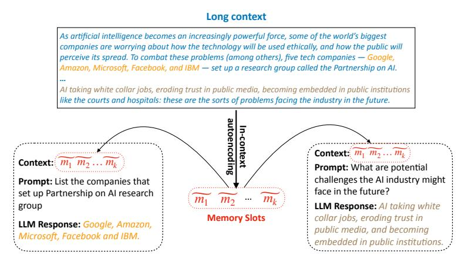

# ABSTRACT

We propose the In-context Autoencoder (ICAE), leveraging the power of a large language model (LLM) to compress a long context into short compact memory slots that can be directly conditioned on by the LLM for various purposes. ICAE is first pretrained using both autoencoding and language modeling objectives on massive text data, enabling it to generate memory slots that accurately and comprehensively represent the original context. Then, it is fine-tuned on instruction data for producing desirable responses to various prompts. Experiments demonstrate that our lightweight ICAE, introducing about 1% additional parameters, effectively achieves 4× context compression based on Llama, offering advantages in both improved latency and GPU memory cost during inference, and showing an interesting insight in memorization as well as potential for scalability. These promising results imply a novel perspective on the connection between working memory in cognitive science and representation learning in LLMs, revealing ICAE's significant implications in addressing the long context problem and suggesting further research in LLM context management. Our data, code and models are available at <https://github.com/getao/icae>.

> **[图片提取文字 (无描述)]:**
> Long context As artificial intelligence becomes an increasingly powerful force, some of the world's biggest companies are worrying about how the technology will be used ethically, and how the public will perceive its spread. To combat these problems (among others), five tech companies — Google, Amazon, Microsoft, Facebook, and IBM — set up a research group called the Partnership on Al. Al taking white collar jobs, eroding trust in public media, becoming embedded in public institutions like the courts and hospitals: these are the sorts of problems facing the industry in the future. utoencoding n-context Context:  $m_1$   $m_2$  ...  $m_k$ Context:  $m_1$   $m_2$  ...  $m_k$ Prompt: What are potential challenges the AI industry might **Prompt:** List the companies that face in the future? set up Partnership on Al research  $m_1$ LLM Response: Al taking white group collar jobs, eroding trust in Memory Slots LLM Response: Google, Amazon, public media, and becoming Microsoft, Facebook and IBM. embedded in public institutions.

Figure 1: Compressing a long context into a short span of memory slots. The memory slots can be conditioned on by the target LLM on behalf of the original context to respond to various prompts.

