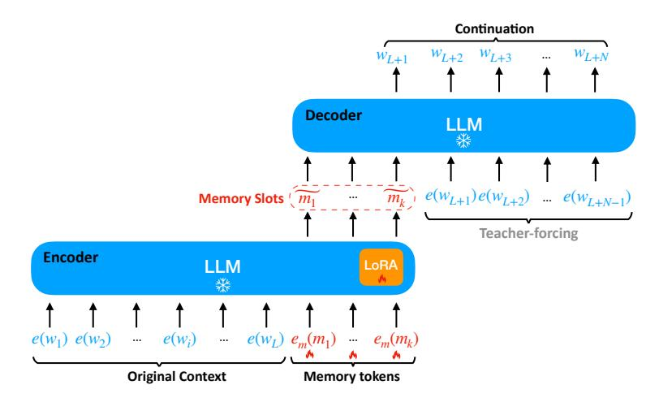
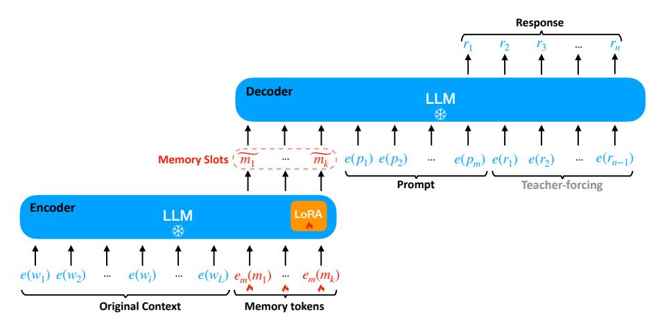

# A MODEL TRAINING CONFIGURATION

We show how to perform pretraining with the text continuation objective and instruction fine-tuning in Figure [7](#page-12-0) and [8.](#page-12-1)

We train the ICAE on 8 Nvidia A100 GPUs (80GB). The hyperparameters for pretraining and fine-tuning ICAE are presented in Table [8.](#page-11-11) We by default train the ICAE with bf16.

| Hyperparameter | Value                               |
|----------------|-------------------------------------|
| Optimizer      | AdamW                               |
| learning rate  | 1e-4 (pretrain); 5e-5 (fine-tuning) |
| batch size     | 256                                 |
| warmup         | 300                                 |
| #updates       | 200k (pretrain); 30k (fine-tuning)  |
| clip norm      | 2.0                                 |

Table 8: Hyperparameters for training

> **[图片提取文字 (无描述)]:**
> Continuation  $w_{L+N}$  $W_{L+1}$   $W_{L+2}$   $W_{L+3}$ Decoder LLM  $m_k$   $e(w_{L+1})e(w_{L+2})$  ...  $e(w_{L+N-1})$ Memory Slots | m1 .... Teacher-forcing Encoder LLM LoRA \*  $e(w_1) \ e(w_2) \ \cdots \ e(w_i) \ \cdots \ e(w_L) \ e_m(m_1) \ \cdots \ e_m(m_k)$ Memory tokens **Original Context**

Figure 7: Pretraining with the text continuation objective to predict next tokens

> **[图片提取文字 (无描述)]:**
> Response Decoder LLM  $m_k$   $e(p_1) \ e(p_2)$  ...  $e(p_m) \ e(r_1) \ e(r_2)$  ...  $e(r_{n-1})$ Memory Slots  $m_1$ ... Teacher-forcing Prompt Encoder LLM LoRA  $e(w_1) \ e(w_2)$  $e(w_L) e_m(m_1) - e_m(m_k)$  $e(w_i)$ **Original Context** Memory tokens

Figure 8: Instruct fine-tuning of the ICAE to make its produced memory slots interact with prompts for accomplishing various purposes in the target LLM. In this figure, (p1, . . . , pm) denotes the prompt tokens and (r1, . . . , rn) denotes the response tokens.

