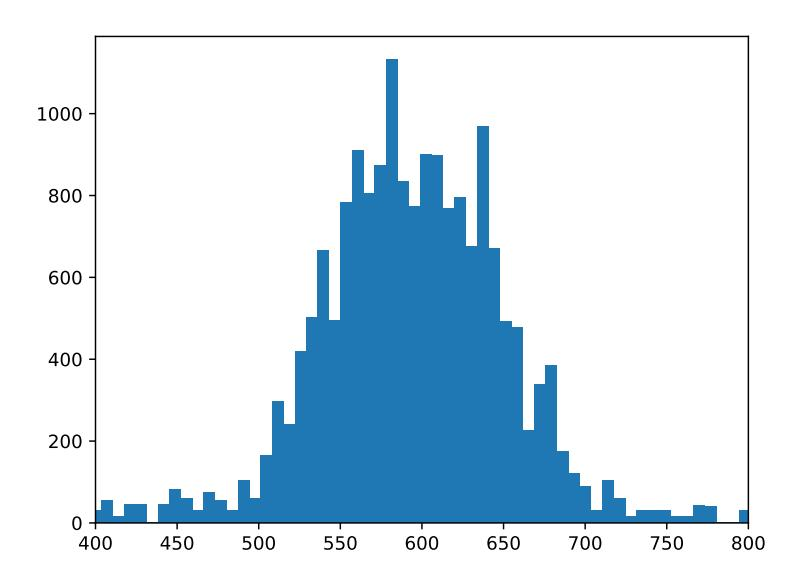

# D GPT-4 EVALUATION

According to [Mu et al.](#page-10-5) [\(2023\)](#page-10-5), we formulate an evaluation prompt to be used with the GPT-4 API. The prompt, as illustrated in Listing [2,](#page-13-2) consists of a task description along with three specific examples. We supply GPT-4 with a text, a prompt, and two distinct model-generated responses. The task for GPT-4 is to determine the superior answer or recognize a tie. The chosen examples encompass scenarios where Assistant A performs better, Assistant B performs better, and when a tie occurs. This methodology enables us to effectively assess[7](#page-13-3) the model's quality. Specially, the orders where the model responses are presented to the GPT-4 are swapped randomly to alleviate bias, as [Touvron et al.](#page-11-5) [\(2023b\)](#page-11-5) did.

Listing 2: Prompt for the GPT-4 evaluation. This prompt consists of a description of the task and three specific examples.

Given a piece of text, an instruction for this text, and two AI assistant answers, your task is to choose the better answer and provide reasons. Evaluate the answers holistically, paying special attention to

7We find the GPT-4 rater tends to prefer longer responses, aligning with observations from recent work such as [Zhao et al.](#page-11-12) [\(2024\)](#page-11-12). Given that ICAE's responses are generally short (due to instruction fine-tuning with the PwC dataset), its actual performance should be better than the numbers reported in the evaluation.

> **[图片提取文字 (无描述)]:**
> 800 -600 -

Figure 10: The context length distribution of test samples: Most samples are longer than 500 tokens.

whether the response (1) follows the given instruction and (2) is correct. If both answers correctly respond to the prompt, you should judge it as a tie.

### Example 1: '''

Text: We report the development of GPT-4, a large-scale, multimodal model which can accept image and text inputs and produce text outputs. While less capable than humans in many real-world scenarios, GPT-4 exhibits human-level performance on various professional and academic benchmarks, including passing a simulated bar exam with a score around the top 10% of test takers. GPT-4 is a Transformerbased model pre-trained to predict the next token in a document. The post-training alignment process results in improved performance on measures of factuality and adherence to desired behavior. A core component of this project was developing infrastructure and optimization methods that behave predictably across a wide range of scales. This allowed us to accurately predict some aspects of GPT-4's performance based on models trained with no more than 1/1,000th the compute of GPT-4. Prompt: What is GPT4?

Assistant A: GPT4 is a large-scale language-trained transformer-based model.

Assistant B: GPT4 can produce outputs. '''

### Your output should be: '''

{"reason": "The instruction asks what GPT4 is, and from the original text, we know that GPT4 is a multimodal, large-scale model that can generate text. Therefore, Assistant A is the closer answer, while Assistant B did not follow the instruction well in providing a response.", "choice": "A"} '''

### Example 2: '''

Text: Making language models bigger does not inherently make them better at following a user's intent. For example, large language models can generate outputs that are untruthful, toxic, or simply not helpful to the user. In other words, these models are not aligned with their users. In this paper, we show an avenue for aligning language models with user intent on a wide range of tasks by fine-tuning with human feedback. Starting with a set of labeler-written prompts and prompts submitted through the OpenAI API, we collect a dataset of labeler demonstrations of the desired model behavior, which we use to fine-tune GPT-3 using supervised learning. We then collect a dataset of rankings of model outputs, which we use to further fine-tune this supervised model using reinforcement learning from human feedback. We call the resulting models InstructGPT. In human evaluations on our prompt distribution, outputs from the 1.3B parameter InstructGPT model are preferred to outputs from the 175B GPT-3, despite having 100x fewer parameters. Moreover, InstructGPT models show improvements in truthfulness and reductions in toxic output generation while having minimal performance regressions on public NLP datasets. Even though InstructGPT still makes simple mistakes, our results show that fine-tuning with human feedback is a promising direction for aligning language models with human intent. Prompt: Write a title for the above text. Assistant A: Improving Fine-Tuning for Language Models: A GPT-3-inspired Approach Assistant B: Training language models to follow instructions with human feedback ''' Your output should be: ''' {"reason": "This text discusses how to make large language models follow user instructions better, and Assistant B's response is more in line with the meaning of the text.", "choice": "B"} ''' Example 3: ''' Text: Though technology companies announced massive layoffs last year, 2023 has been much worse. Layoffs have far outpaced last year's cuts, as tech giants including Amazon, Facebook parent company Meta, Microsoft, Google, IBM, SAP, and Salesforce - as well as many smaller companies announce sweeping job cuts. The problem: Big Tech went on a hiring binge during the pandemic when lockdowns sparked a tech buying spree to support remote work and an uptick in e-commerce, and now they face revenue declines. Although global IT spending is forecast to rise in 2023, with enterprise software and IT services experiencing the greatest growth, the overall increase is expected to be modest, with data center systems and communications services growing by less than 1%, according to market research firm Gartner. Meanwhile hardware sales are forecast to decline. Continuing supply chain issues, inflation, and the war in Ukraine are also having an impact on both business and consumer spending, leading to fears of recession. According to data compiled by Layoffs.fyi, the online tracker keeping tabs on job losses in the technology sector, 784 tech companies have laid off about 208,181 staff so far this year, compared to 164,411 layoffs last year. Prompt: How many job losses have occurred in the technology sector so far in 2023? Assistant A: 208,181 job losses have occurred in the technology sector so far in 2023. Assistant B: 208,181. ''' Your output should be: ''' {"reason": "Both answers are acceptable and correct. They should be a tie.", "choice": "Tie"} '''

Your response should only be in the JSON format above; THERE SHOULD BE NO OTHER CONTENT INCLUDED IN YOUR RESPONSE. Write the "reason" key before writing the "choice" key, so that you think step-by-step before making your decision. KEEP YOUR REASONING BRIEF. Again, don't favor either A or B if they are both acceptable and correct -- judge a tie instead.

### The prompt that the GPT-4 uses to generate 128-token summary is as follows:

"Write a summary for the above text. Your summary should not exceed 100 words but should include as much information of the original text as possible."

We show examples of the GPT-4 evaluation on a pretrained and a non-pretrained ICAE in Table 9.

Table 9: Examples of outputs by the target LLM (i.e., Llama) conditioning on memory slots (k=128) produced by the pretrained and non-pretrained ICAE. The highlighted parts are not faithful to the context.

#### Passage 1 (514 tokens):

French senior civil servant arrested on suspicion of spying for North Korea

November 27, 2018 by Joseph Fitsanakis

A senior civil servant in the upper house of the French parliament has been arrested on suspicion of spying for North Korea, according to prosecutors. The news of the suspected spy's arrest was first reported on Monday by Quotidien, a daily politics and culture show on the Monaco-based television channel TMC. The show cited "a judicial source in Paris" and said that France's domestic security and counterintelligence agency, the General Directorate for Internal Security (DGSI), was in charge of the espionage case.

#### (omitted 233 words)

The senior civil servant faces up to 30 years in prison if found guilty of espionage.

Prompt: What is the maximum prison sentence Quennedey could face if found guilty?

Assistant A (pretrained ICAE): Quennedey could face up to 30 years in prison if found guilty.

Assistant B (non-pretrained ICAE): Quennedey could face up to three years in prison if found guilty.

Answer (by the GPT-4): Up to 30 years.

**GPT-4 evaluation:** Assistant A correctly states the maximum prison sentence from the text, while Assistant B provides an incorrect number.

#### Passage 2 (506 tokens):

With Red Hat, IBM to become the leading hybrid cloud provider Watch Now

After IBM acquired Red Hat, I suggested IBM paid \$34 billion for the Linux power so it could become a hybrid-cloud power. With the news that Red Hat will acquire NooBaa, a hybrid-cloud, data-storage company, it's become clearer than ever that the IBM-Red Hat deal is all about the hybrid cloud.

#### (omitted 208 words)

As Ranga Rangachari, Red Hat's vice president of Storage and Hyperconverged Infrastructure, said in a statement:

"Data portability is a key imperative for organizations building and deploying cloud-native applications across private and multiple clouds. NooBaa's technologies will augment our portfolio and strengthen our ability to meet the needs of developers in today's hybrid and multicloud world. We are thrilled to welcome a technical team of nine to the Red Hat family as we work together to further solidify Red Hat as a leading provider of open hybrid-cloud technologies.

Prompt: Discuss the role of Ranga Rangachari in the context of the text

Assistant A (pretrained ICAE): Ranga Rangachari is the vice president of Storage and Hyperconverged Infrastructure at Red Hat. He is responsible for the company's storage and hyperconverged offerings, and he welcomes the nine-member team of technical experts from NoaBaa to join Red Hat as a part of the IBM acquisition.

Assistant B (non-pretrained ICAE): Ranga Rangachari is the CEO of Red Hat, and he is excited about the acquisition of NooBaa as it will help Red Hat become a leader in hybrid cloud management. He believes that NooBaa's technology will enable Red Hat to provide a single, comprehensive platform for managing data across multiple clouds, and that this will be a significant differentiator for Red Hat in the market.

**Answer (by the GPT-4):** Ranga Rangachari is the vice president of Storage and Hyperconverged Infrastructure at Red Hat. He made a statement regarding the acquisition of NooBaa, highlighting the importance of data portability in today's hybrid and multicloud world and how NooBaa's technologies would strengthen Red Hat's ability to meet the needs of developers.

**GPT-4 evaluation:** Assistant A correctly identifies Ranga Rangachari's role as the vice president of Storage and Hyperconverged Infrastructure at Red Hat and accurately describes his statement about the acquisition of NooBaa. Assistant B incorrectly states that Ranga Rangachari is the CEO of Red Hat.