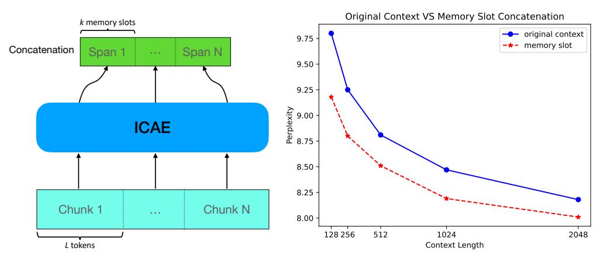

# 3.3.2 LATENCY

We conducted an empirical test to evaluate the impact of ICAE's 4× context compression on inference efficiency. For this efficiency test, we fix the context (i.e., input) length to either 512 or 2048 and the generation length to 128. Table [7](#page-7-1) shows that context compression by ICAE is helpful to improve LLM (i.e., Llama-7b) inference efficiency, achieving over 2× speedup. Its acceleration becomes

3Lpretrain = λLAE + (1 − λ)LLM. We find λ = 0.4 ∼ 0.6 leads to the best result.

4 Produced by the GPT-4. The specific prompt text is presented in Appendix [D.](#page-13-0)

Table 6: The results of pretrained ICAE (512→128) based on different target LLMs

| Taugat I I M |         | Text Continuation |                        |                   |          |
|--------------|---------|-------------------|------------------------|-------------------|----------|
| Target LLM   | BLEU(%) | Loss              | PPL (original context) | PPL (memory slot) | $\Delta$ |
| Llama-7b     | 99.1    | 0.017             | 9.01                   | 9.50              | +0.49    |
| Llama-2-7b   | 99.5    | 0.009             | 8.81                   | 9.18              | +0.37    |
| Llama-2-13b  | 99.8    | 0.004             | 8.15                   | 8.45              | +0.30    |

Table 7: Latency comparison of LLM (generation) and LLM+ICAE (compression then generation)

| Input (Batch×Length) | Method          | Compression Time (Cachable) | Decoding Time | Total Time      |
|-------------------------|-----------------|--------------------------------|------------------|--------------------|
| 8*2048                  | LLM LLM+ICAE | 3.4                            | 24.0 3.9      | 24.0 7.3 (3.3×) |
| 8*512                   | LLM LLM+ICAE | 0.6                            | 9.3 3.7       | 9.3 4.3 (2.2×)  |
| 32*512                  | LLM LLM+ICAE | 2.6                            | 24.3 4.2      | 24.3 6.8 (3.6×) |

even more significant – around  $3.5 \times$  – in compute-intensive scenarios (e.g.,  $8 \times 2048$  and  $32 \times 512$ ). Given that the compressed memory slots can be cached in advance (for frequently used texts like textbooks, government reports or articles of law), ICAE may introduce over  $7 \times$  inference speedup in these cases. Details of the profiling are presented in Appendix B.

#### 3.3.3 MULTIPLE SPANS OF MEMORY SLOTS

Thus far, we have mainly discussed a single span of memory slots. In this section, we shall discuss multiple spans of memory slots. As illustrated in Figure 6(Left), we can segment a long context into N chunks, compress them individually, and then concatenate them to represent the original long context. However, this did not work initially, because the model had never seen multiple span concatenation patterns during training. Fortunately, we can incorporate a small number of multiple span concatenation samples during training, enabling the model to work with concatenated spans of memory slots, as OpenAI's work (Bavarian et al., 2022) on introducing the "fill in the middle" ability for the GPT. The results in Figure 6(Right) indicate that, using an equivalent length context, ICAE's memory achieves better performance – because memory can represent  $4\times$  the original context length.

The ability of ICAE demonstrates great promise to handle long contexts, as it can save a significant amount of GPU memory when addressing long contexts without touching the existing LLM. As illustrated in Figure 6(Right), 2048-length memory slots can perform on par with 4096-token contexts. This means that conditioning on 2048 memory slots instead of the original 4096 context tokens can save about 20GB of GPU memory5 with minimal quality degradation.

### 4 RELATED WORK

Prompt compression and context distillation (Askell et al., 2021; Snell et al., 2022) are closely related areas to this work: Wingate et al. (2022) proposed a method to learn compact soft prompts to simulate the original natural language prompt by optimizing the KL divergence. However, this approach has a very high computational cost, as it requires performing back-propagation for each new incoming prompt to learn and obtain the compressed prompt, which severely limits its application. Qin & Van Durme (2023) propose Neural Agglomerative Embeddings named NUGGET, which encodes language into a compact representation for an encoder-decoder model.

The most closely related studies to our research are GIST (Mu et al., 2023) and AutoCompressors (Chevalier et al., 2023). GIST achieves prompt compression by fine-tuning an LLM in a similar way to ours. The resulting model can produce gist tokens as the compression of a prompt, which are similar to our memory slots. Nonetheless, this approach is limited to compressing short prompts6 and

&lt;sup>5Llama-7b (fp16) requires 24GB GPU memory for 2048 context tokens and 44GB for 4096 during inference (measured without optimization like flash attention).

&lt;sup>6Prompts in Mu et al. (2023) refer to task instructions before input texts, so they are usually short.

> **[图片提取文字 (无描述)]:**
> Original Context VS Memory Slot Concatenation k memory slots original context 9.75 -\*- memory slot Concatenation Span 1 Span N ... 9.50 -9.25 -9.00 -9.75 -ICAE 8.50 -8.25 -Chunk 1 Chunk N ... 8.00 -512 1024 2048 128 256 L tokens Context Length

Figure 6: **Left:** Individually compress then concatenate multiple spans of memory slots; **Right:** Perplexity comparison with original contexts and  $4 \times$  compressed memory slots – for example, 1024-length memory slots are obtained by compressing the original context with a length of 4096 tokens.

thus does not address the real issue of long contexts. Also, this method requires fine-tuning the LLM, and the obtained gist tokens also need to be used within the specially tuned LLM (for gist tokens) and seem not compatible with the untouched LLM. AutoCompressors for recursively compressing long text into summary vectors. Like Mu et al. (2023), the LLM must be tuned to work with generated summary vectors and its training is sophisticated as it involves recursive compression. In contrast, we propose a very simple, straightforward and scalable approach to generating memory slots that can be used in the target LLM with different prompts for various purposes. Moreover, our approach is much more parameter-efficient (i.e., LoRA) for tuning on top of the existing LLM. Additionally, some recent work studies how to compress prompts into more concise natural language (Jiang et al., 2023a), and approaches the context limit with divide-and-conquer methodology (Bertsch et al., 2023; Chen et al., 2023; Song et al., 2024).

Also, there is related work studying compressing indescribable concepts into (vector) tokens for later use in other contexts. Representative work includes Gal et al. (2022) which compresses a vision object into a token and Ge et al. (2023) which compresses a text style into a token.

Considering related work from a boarder perspective of compression, Jiang et al. (2023b) examines kNN-based prediction using general-purpose compressors, such as gzip. Delétang et al. (2023) extensively investigates the compression abilities of LLMs, uncovering their potential as versatile predictors, which also provides insights into recent developments in scaling laws and tokenization.

#### 5 CONCLUSION AND FUTURE WORK

We propose the In-context Autoencoder (ICAE) to leverage the power of an LLM to highly compress contexts. By generating compact and informative memory slots to represent the original context, the ICAE enables an LLM to acquire more information with the same context length or represent the same content with a shorter context, thereby enhancing the model's capability to handle long contexts as well as reducing computation and memory overheads for inference in many practical scenarios like Retrieval Augmented Generation (Lewis et al., 2020) and advanced prompting methods (Wei et al., 2022; Wang et al., 2023; Zhang et al., 2024). Moreover, ICAE provides insight into how an LLM performs memorization, offering a novel perspective on the connection between the memory of LLMs and humans, and suggesting future research in LLM context management.

Due to computational limitations, our experiments were conducted on Llama models up to 13 billion parameters. As discussed in the paper, ICAE is expected to benefit even more from more powerful LLMs, where it should be able to achieve more significant compression ratios. In the future, we hope to have sufficient computational resources to validate the effectiveness of ICAE on larger and stronger LLMs. In addition, we plan to explore the application of ICAE in multimodal LLMs (as the context length for images, videos, and audio is often much longer and has greater compression potential) with discrete memory slots (which can be either continuous or discrete) for helping unify compact representation across modalities in the era of LLM/AGI.

