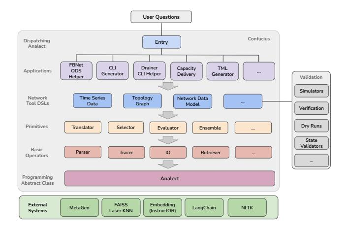

# 3.3 Confucius Programming Framework

Confucius is a programming framework that simplifies application development with primitives and abstractions, shown in Figure [4.](#page-4-0) It offers an interactive chat-like interface for user interaction.

Programming Abstraction: At its core, Confucius is built on Pydantic, a Python schema language for defining custom data structures. The core abstraction class is the Analect, which holds reusable logic and data for inputs, outputs, and runtime. It is similar to a function but provides logging for execution, streamlining reuse throughout the system. Several basic operators are shared among all Analects. These operators implement basic functionalities, including a JSON Parser, a Tracer that automatically collects and logs the execution trace in an internal database, and an I/O function that enables human-in-the-loop interaction.

> **[图片提取文字 (无描述)]:**
> **User Questions** Confucius Dispatching Entry Analect **FBNet** CLI Drainer TMI Capacity Applications ODS CLI Helper Generator Delivery Generator Helper Validation Simulators Network Time Series Topology Network Data Tool DSLs Data Graph Model Verification Dry Runs Primitives Translator Selector Evaluator Ensemble State Validators Basic Parser Tracer 10 Retriever Operators Programming Analect Abstract Class FAISS External Embedding MetaGen LangChain **NLTK** (InstructOR) Systems Laser KNN

Figure 4: Programming Framework.

Confucius Primitives: These are specialized Analects that implement one particular action. They can be applied across various use cases. The Analect is the abstract class of all primitives. One example is the Translator primitive, which converts natural language inputs into structured outputs, such as translating a user's query from English to a command line. Users focus on writing examples without worrying about formatting inputs and parsing results. The Translator also facilitates the translation of commands, queries, and configurations from one language to another.

Tooling DSLs: Confucius supports three DSLs commonly used in network management applications, which will be discussed in more detail later in [§4.2.](#page-5-0) This layer can be extended to accommodate additional DSLs as new use cases are onboarded.

Applications: Analogous to SDN Apps, different teams have developed various LLM-based network management applications to address specific domains. For example, a data center design engineer creates an app to design new AI data center networks.

External Systems: Confucius leverages several external systems to enhance its capabilities, including LangChain [\[13\]](#page-13-16), MetaGen API [\[23\]](#page-13-17) for AI model access, FAISS [\[21\]](#page-13-18) for efficient similarity search, Instructor [\[45\]](#page-14-7) for embedding, and NLTK [\[10\]](#page-13-19) for natural language processing.

