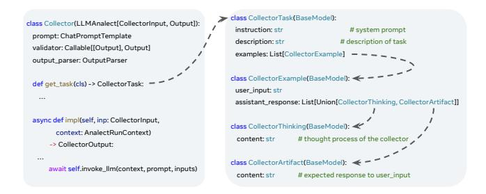

# 4.1 Planning Phase

We now present the planning methodology and primitives.

4.1.1 Network Workflows: Historically, companies like Meta have relied on MOPs (step-by-step procedures in natural languages) [\[14,](#page-13-20) [15\]](#page-13-21) for network management tasks. However, their ambiguity and loose documentation made execution challenging. To address this, Meta developed a workflow system [\[51\]](#page-14-6) that codifies and breaks down MOPs into smaller, modular building blocks (BBs), facilitating better modularity and code reuse. BBs are flexible scripts or configlets (modular "configuration snippets" designed for reuse across

**Human**: "I want to patch several supply scenarios onto a given topology using Topology Modification Language, then scale the demand by 1.5 and 0.8, run NAPT for both scenarios, and finally generate a comparison report."

> **[图片提取文字 (无描述)]:**
> Desired Topology Base Topology Modifications Patched Topology Patched Topology Topology Modifier Scale demand by 0.8x Scale demand by 1.5x Scaled Topology Scaled Topology Topology Optimizer Topology Optimizer Failure Analysis Cost Analysis Report Visualization

Figure 5: Planning DAG Illustration.

devices and workflows) written in various programming languages or as binaries. This approach is widely adopted [\[34\]](#page-13-22).

4.1.2 Leverage Workflows for LLM Planning: We design a prompt engineering method to teach LLMs workflows.

DAG Representation: We represent the planning logic of network tasks as a directed acyclic graph (DAG), implemented using a Python-based DSL. Each node in the DAG represents a subtask, which is the same as a building block. The output of each node is parsed by the LLM and used as input for subsequent nodes. Independent subtasks can be executed in parallel, and the runtime environment automatically determines the optimal execution plan based on input/output dependencies. Figure [5](#page-4-1) illustrates an example DAG for capacity what-if analysis. A user-defined scenario, which involves modifying network topology, scaling demand, and evaluating outcomes under multiple conditions, is broken down into discrete, composable subtasks. Each operation is encapsulated as a node in a DAG to enable modular execution and clear data flow.

Suggesting Existing Workflows: In our production environment, we face challenges with workflow and BB discovery. With hundreds of workflows and thousands of BBs, it is difficult for engineers to identify the right ones for specific tasks. To address this, we have developed a RAG-based approach to efficiently search and recommend workflows and BBs. Figure [16](#page-15-0) shows the design. The system architecture consists of two main components: the Indexer and the Retriever. The Indexer utilizes LLMs to analyze each workflow and BB, extracting key information to compute semantic embeddings, which are then stored in a database. The Retriever operates in two stages: a coarse-grained similarity search to select around 10 candidate workflows/BBs, followed by a fine-grained selection to refine the options to fewer than three.

### 4.1.3 Confucius Primitives for Planning:

Ensemble calls multiple LLMs in parallel on a single task and combines their results into a single output. This maintains the original string-to-string interface, allowing it to replace standard LLM calls seamlessly. Figure [15](#page-15-1) shows an example of its programming construct. To activate Ensemble, users provide a list of LLMParams to supported APIs. Our system supports four composition modes: 1) First-mode selects the fastest agent's result; 2) Merge-mode combines all agents' results for human review; 3) Filter-with-Validation

> **[图片提取文字 (无描述)]:**
> class CollectorTask(BaseModel): class Collector(LLMAnalect[CollectorInput, Output]): instruction: str # system prompt prompt: ChatPromptTemplate description: str # description of task validator: Callable[[Output], Output] examples: List[CollectorExample] output\_parser: OutputParser class CollectorExample(BaseModel): < def get\_task(cls) -> CollectorTask: user\_input: str ... assistant\_response: List[Union[CollectorThinking, CollectorArtifact]] async def impl(self, inp: CollectorInput, class CollectorThinking(BaseModel): < context: AnalectRunContext) # thought process of the collector content: str CollectorOutput: class CollectorArtifact(BaseModel): await self.invoke\_llm(context, prompt, inputs) # expected response to user\_input content: str

Figure 6: Collector implementation.

filters out erroneous results using a validation framework; and 4) Return-all returns all answers as a set. Ensemble also accepts custom composition functions, enabling flexible strategies for ensuring reliable results from potentially unreliable building blocks.

Orchestrator is a novel AI framework that enables LLMs to autonomously create workflows by calling building blocks in a step-by-step manner, similar to [\[42\]](#page-14-8). This approach involves providing detailed examples and instructions within the prompt, which inform the LLM about which building blocks to utilize and when. The Orchestrator strikes a careful balance between autonomous operation and controlled execution; this allows us to fully harness the enhanced reasoning and planning abilities of modern LLMs, while maintaining the reliability demanded by our applications.

