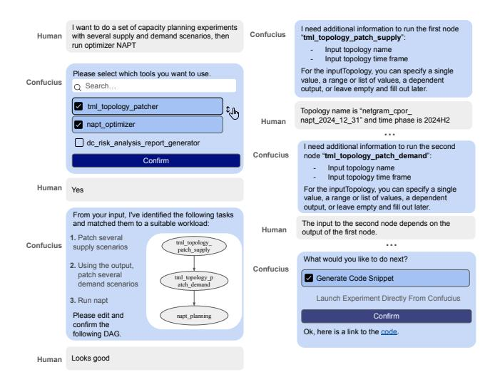

# 4.4 Benchmarking Framework

We created Confucius to enable network engineers to rapidly onboard and prototype different applications across a variety of network use cases. However, optimizing a Confucius application can be a complex task, and users often want to consider performance between different models and prompting techniques on a specific dataset. To streamline this process, we developed a benchmarking framework with three capabilities: 1) testing with data provided by developers for their specific use case, 2) evaluating the impact of different prompting techniques and base models, and 3) optimizing end-to-end performance and tuning trade-offs between accuracy and computational cost. This standardizes the scoring process, eliminates the need for manual ad-hoc testing, and ensures consistency across evaluations.

Workflow. The evaluation pipeline consists of three key components: a user-provided dataset, a Confucius application, and a set of evaluation criteria. The evaluator first reads the dataset of inputoutput pairs and invokes the application on these inputs. Then it collects the actual outputs and scores them against the expected

> **[图片提取文字 (无描述)]:**
> I want to do a set of capacity planning experiments I need additional information to run the first node Confucius with several supply and demand scenarios, then Human "tml topology patch supply": run optimizer NAPT Input topology name Input topology time frame For the inputTopology, you can specify a single Please select which tools you want to use. value, a range or list of values, a dependent Confucius Q Search... output, or leave empty and fill out later. tml topology patcher J Clm Topology name is "netgram cpor napt 2024 12 31" and time phase is 2024H2 Human napt optimizer dc risk analysis report generator I need additional information to run the second Confucius node "tml topology patch demand": Confirm Input topology name Input topology time frame Human For the inputTopology, you can specify a single Voc value, a range or list of values, a dependent output, or leave empty and fill out later. From your input, I've identified the following tasks The input to the second node depends on the and matched them to a suitable workload: Human output of the first node. Patch several tml topology Confucius ... supply scenarios patch supply What would you like to do next? 2. Using the output. Confucius patch several tml topology p Generate Code Snippet demand scenarios atch demand Launch Experiment Directly From Confucius 3. Run napt Please edit and napt planning Confirm confirm the Ok, here is a link to the code. following DAG. Looks good Human

Figure 9: Capacity What-Ifs Session Illustration.

ones using a predefined criteria. Users can visualize the scores to compare performance across different evaluations.

Evaluation Criteria. We provide three built-in evaluation criteria: 1) Exact Match: for deterministic and numerical outputs, such as verifying device counts in a cluster; 2) Regex Match: suitable for set or string outputs to verify specific keywords; 3) LLM-as-a-Judge: for complex outputs, it judges the closeness of the meanings. We implement LLM-as-a-Judge by invoking the LLM with the actual and expected outputs and prompting the LLM to assign a score based on accuracy. This method enables complex reasoning and provides holistic scoring. Our evaluation framework has been successfully implemented in production, significantly reducing time spent on prompt engineering and identifying regressions. It is used to generate the evaluations in §7.

Note that the benchmarking framework is an integral part of a production system, much like how a testing framework is indispensable to the software development process. Our benchmarking framework adopts concepts from software testing while leveraging LLMs extensively to handle fuzzy match cases.

