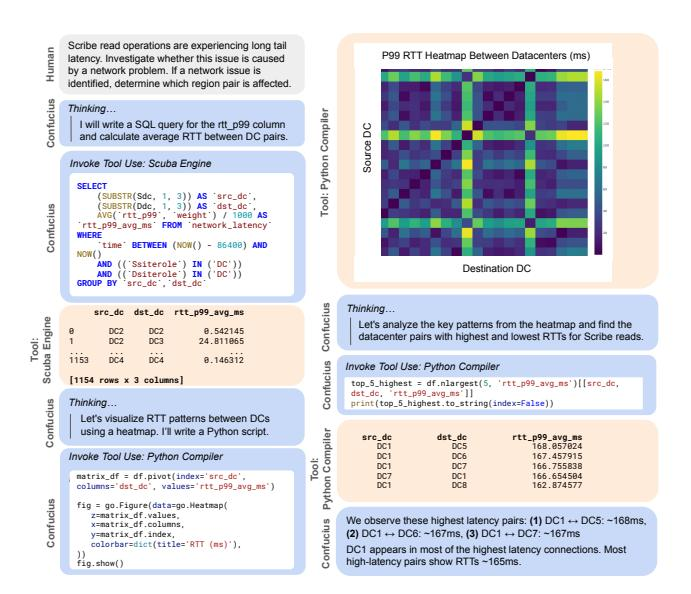

# 5 Application Case Study

In this section, we share two applications for capacity planning and troubleshooting.

#### 5.1 Capacity What-Ifs

Meta has developed various tools to facilitate analysis for different topology planning scenarios. However, running experiments is still challenging. Before Confucius, generating an experiment plan was complex and involved several steps: identifying input workloads, understanding input/output structures, and scripting sequential tool calls. Users faced multiple challenges. First, experiments could quickly become complex, with multiple workloads and scenarios. Some workflows required running the planning software NAPT [8] multiple times, each taking hours. Second, many tasks were repetitive. Capacity planners often had to clone and initiate workflows repeatedly to modify a single input parameter,

> **[图片提取文字 (无描述)]:**
> Scribe read operations are experiencing long tail P99 RTT Heatmap Between Datacenters (ms) latency. Investigate whether this issue is caused by a network problem. If a network issue is identified, determine which region pair is affected. Confucius Thinking... Tool: Python Compiler I will write a SQL query for the rtt p99 column Source DC and calculate average RTT between DC pairs. Invoke Tool Use: Scuba Engine SELECT (SUBSTR(Sdc, 1, 3)) AS 'src\_dc', (SUBSTR(Ddc, 1, 3)) AS 'dst\_dc', AVG('rtt\_p99', 'weight') / 1888 AS Confucius 'rtt\_p99\_avg\_ms' FROM 'network\_latency' WHERE 'time' BETWEEN (NOW() - 86400) AND NOW() AND (('Ssiterole') IN ('DC')) Destination DC AND (('Dsiterole') IN ('DC')) GROUP BY 'src\_dc', 'dst\_dc' Confucius Thinking... src\_dc dst\_dc rtt\_p99\_avg\_ms Scuba Engine Let's analyze the key patterns from the heatmap and find the DC2 DC2 9 542145 datacenter pairs with highest and lowest RTTs for Scribe reads. DC2 DC3 1 24.811065 1153 DC4 DC4 9 146312 Confucius Invoke Tool Use: Python Compiler [1154 rows x 3 columns] top\_5\_highest = df.nlargest(5, 'rtt\_p99\_avg\_ms')[[src\_dc, dst dc. 'rtt p99 avg ms'll Thinking... Confucius print(top\_5\_highest.to\_string(index=False)) Let's visualize RTT patterns between DCs using a heatmap. I'll write a Python script. Python Compiler src dc dst dc rtt p99 avg ms DC1 DC5 168 957924 Invoke Tool Use: Python Compiler DC1 DC6 167 457915 DC1 DC7 166.755838 matrix\_df = df.pivot(index='src\_dc'. DC7 DC1 166.654594 DC1 DCR 162.874577 columns='dst\_dc', values='rtt\_p99\_avg\_ms') Confucius fig = go.Figure(data=go.Heatmap( z=matrix df.values. Confucius We observe these highest latency pairs: (1) DC1 ↔ DC5: ~168ms, x=matrix df.columns. (2) DC1 ↔ DC6: ~167ms, (3) DC1 ↔ DC7: ~167ms v=matrix df.index. colorbar=dict(title='RTT (ms)'). DC1 appears in most of the highest latency connections. Most high-latency pairs show RTTs ~165ms. fig.show()

Figure 10: Fault Diagnosis Session Illustration

leading to inefficiency. Third, tracking and recording experiment results was cumbersome. Lastly, there was low interoperability across workloads. For example, a planner might know how to generate a demand forecast but struggle to integrate it with NAPT, adding friction to the workflow.

To mitigate these difficulties, we build a what-if analysis on Confucius, with a planning agent to create the DAG workflow, a tool agent to translate topology changes into TML, and short-term memory to record the results of each run. This is used by novice planners to describe and execute experiments. Figure 9 shows an example workflow. First, the user describes an intent: generate TML to patch a few supply scenarios, then generate TML to patch a few demand scenarios, and finally run NAPT. This process involves several key steps, beginning with DAG creation, where Confucius assists in workload selection based on user intent. Users select from a list of real-time registered workloads using Selector, after which the planning agent creates a corresponding DAG. For each node, the system provides input preselection, input/output passing using natural language, and visualization of the node information collection process, along with input-specific tips to ensure interoperability between nodes. Finally, Confucius uses Translator to generate a TML code snippet. At every step, Confucius ensures flexibility and accuracy by using Collector to support human intervention.

#### 5.2 Fault Diagnosis

Network troubleshooting has traditionally been challenging, even for experienced engineers. This section presents an example using Code Assist, an AI coding assistant that utilizes the Orchestrator for advanced planning. Figure 10 illustrates a troubleshooting workflow. The user requests a diagnosis of network latency issues related to read operations in the Scribe pub/sub system [26]. Confucius Code Assist then performs a series of interleaved thinking and tooluse steps, such as querying Scuba [5] logs with SQL and writing Python code for data analysis and visualization. It even generates

a heatmap of RTT data to provide insights, demonstrating its advanced multimodal capabilities. Ultimately, Confucius identifies that the highest-latency region pairs involve the "DC1" datacenter and presents these findings to the user.

Many troubleshooting scenarios can be resolved by querying and analyzing common monitoring data and runtime metrics. These data can be filtered and aggregated in various ways, leading to workflows tailored to specific scenarios. Instead of predefined workflows, users provide a list of tool-use functions to the Confucius Orchestrator, such as executing Python or SQL code on specific databases. These tools are represented as customizable agents. Leveraging advanced models like Claude 3.7 Sonnet, the Confucius Orchestrator acts as an intelligent supervisor, performing "thinking" steps to determine which agent tools to call and what arguments to pass. This architecture offers flexibility, allowing the Orchestrator to decide the next step based on conversation history and available tools, rather than following a fixed workflow.

