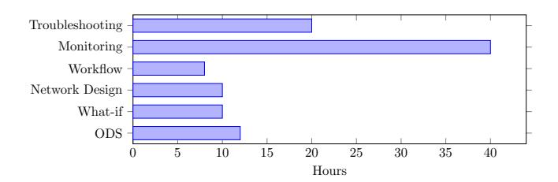

# 8.1 Evolution of LLM-based network assistants at Meta

Initially, we tried to use MetaMate for network management tasks. MetaMate is a general-purpose internal chatbot designed to increase productivity across product verticals and job functions. It aimed to help developers during code creation and knowledge acquisition, synthesis, and understanding from both code and non-code sources. To achieve these goals, we fine-tuned AI models with Meta's internal context, including our code base in addition to technical and non-technical knowledge. We also leveraged publicly available knowledge to enhance the model's capabilities. Although MetaMate showed promise, we encountered several challenges that led us to design Confucius, a more specialized network assistant. Compared

> **[图片提取文字 (无描述)]:**
> Troubleshooting -Monitoring -Workflow -Network Design What-if -ODS 35 10 15 20 25 30 40 Hours

Figure 14: Engineer-hours saved per week.

to MetaMate, Confucius differs in its purposes, capabilities, and target audience:

- Purpose: MetaMate is a general-purpose AI assistant, while Confucius is designed for specific use cases where MetaMate's results might be sub-optimal.
- Capabilities: MetaMate offers features like chat UI, command execution, and code completion, whereas Confucius relies on custom scripts executed in a secure environment.
- Target Audience: MetaMate is suitable for general-purpose internal data retrieval and assisting users across different platforms within Meta, whereas Confucius is tailored for users who need to perform specific tasks that require custom scripts and a higher level of security in execution.

#### 8.2 What Worked Well

Retrieval and Summarization for Networking Problems. We have observed that many network applications share a common pattern: leveraging existing content to suggest similar items and generate new ones with user modifications. Some examples include writing a new model based on existing models in the database, generating device configurations by adapting existing vendor/device configurations, and creating customized workflows by combining steps from multiple existing workflows. Confucius's embedding and retrieval method enables straightforward integration with RAG prompt engineering, often yielding satisfactory results.

Integration with Existing Management Tools for Quick Adoption. An initial challenge was attracting consistent users to the app. Users would try it out as a novelty but struggle to incorporate it into their routine. We found that integration with existing automation systems and tools is key to broader adoption. These systems have inputs and outputs with well-defined structures to assist automation. By understanding and generating these structured data, LLMs can be added to existing automation pipelines, facilitating routine use.

For example, our maintenance event parser, which parses vendor emails and generates structured tickets, has been invoked hundreds of times per day as part of the ticket management system.

