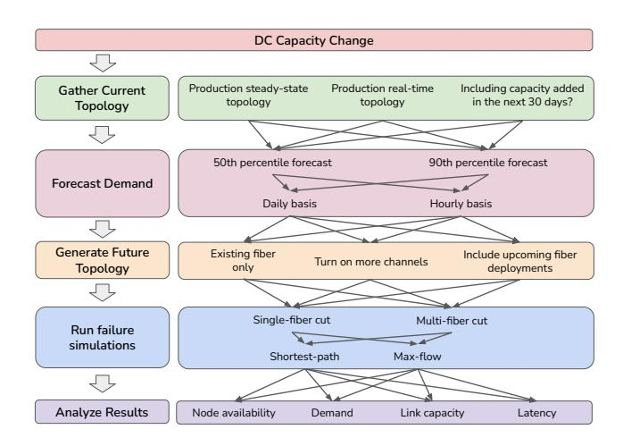

# 2.2 Capacity What-if Analysis

Next, we dive into two concrete apps in the category of network design and network monitoring. In each example, we point out how Confucius, built on top of LLMs, provides the specific help.

Capacity planning at Meta involves determining where and when to increase network capacity to ensure long-term network health. This process relies on what-if analysis and optimizations [6, 7]. For example, to meet AI training demands, Meta has deployed new data centers [4] and augmented existing ones with new technology. A key challenge is determining how the backbone topology should change to interconnect these new regions with the right amount of capacity. Confucius answers this question through various subtasks.

Planning the subtasks. Figure 1 illustrates an example of a what-if analysis aimed at increasing backbone network capacity in response to a new data center deployment. Before conducting the analysis, the user must first gather the current network topology and information about upcoming fiber availability. Next, the user poses what-if questions, such as, "What if I enable more channels on a specific path?" To address these questions, the user creates an execution plan with several steps: updating traffic forecasts, augmenting

> **[图片提取文字 (无描述)]:**
> DC Capacity Change Gather Current Production steady-state Production real-time Including capacity added topology topology in the next 30 days? Topology 50th percentile forecast 90th percentile forecast Forecast Demand Daily basis Hourly basis Generate Future Existing fiber Include upcoming fiber Turn on more channels Topology only deployments Single-fiber cut Multi-fiber cut Run failure simulations Shortest-path Max-flow Analyze Results Node availability Link capacity Demand Latency

Figure 1: Capacity What-if Example.

the topology with upcoming fiber deployments, running failure simulations, and analyzing the results to support A/B testing.

Complexity of Subtasks. Each subtask can have multiple variants, such as different percentiles for demand forecasting or various network resilience policies for failure simulation, as illustrated in Figure 1. Traditionally, network planners manually configured and chained these tools, resulting in time-consuming processes and suboptimal parallelization. Confucius streamlines this workflow by automatically generating a directed acyclic graph (DAG) of operations and orchestrating remote execution according to the what-if scenario defined by the planner. Additionally, Confucius reduces the domain expertise and manual effort needed to query real-time topology data, which can be noisy and may not accurately reflect planned changes. Users interact with capacity-related information through a natural language interface, enabling them to ask questions like, "What's the total capacity added in the past 90 days?" without needing to understand table schemas or query syntax.

Given many subtask variants, manually analyzing dozens of outputs is impractical. Confucius summarizes results based on key metrics such as total dropped flows and SLO misses. It also provides a visual analysis of differences using its multimodal feature, helping users quickly interpret and compare outcomes.

#### 2.3 Network Performance Diagnosis

Fault diagnosis is critical for resolving network issues, but complexity and diverse potential causes present significant challenges. Network engineers must sift through extensive monitoring data and consider numerous potential causes. Confucius assists with fault diagnosis by analyzing thousands of counters and metrics. In the example shown in Figure 2, we need to diagnose a case where Instagram inference requests failed during a specific time period. This involves analyzing network issues, dominant regions, routing paths, affected prefixes, and determining if any network changes are associated with these factors.

Planning the Subtasks. The first step in diagnosing network issues is planning the execution of complex diagnosis tasks. In production, we use workflows or runbooks [51] that consist of sub-workflows or steps, each invoking different tools. With hundreds of workflows, it is challenging to determine which to use for a specific diagnosis

> **[图片提取文字 (无描述)]:**
> Failure incident Failed requests for IG-Training service between 7-8pm on 12/31/2024 detected Isolate the domain Group hosts by Group hosts by region Group hosts by prefix pod/cluster of the issue NO Not a network Check network Is there anomalous spike problem metrics in TCP retransmissions? YES Is there high latency Is there high packet loss NO Application-Active probing in the same time window in the same time window layer error and regions? and regions? YES Topology analysis Identify LSP paths that carry the traffic Examine network change logs Network change Examine controller alerts associated with routers along the logs paths Possible root cause identified

Figure 2: Fault Diagnosis Example.

question. For example, Figure 2 involves four steps: (1) identifying hosts by region and prefix, (2) examining TCP retransmission for anomalies, (3) analyzing NetNORAD [30] data for packet loss, and (4) examining network change logs linked to affected LSP paths.

Complexity of Subtasks. Each subtask requires querying specific datasets, which can be challenging due to the numerous datasets and domain knowledge required. For example, filtering and aggregating raw data such as SNMP logs is necessary to identify patterns, and anomaly detection for performance degradation requires picking the algorithm and setting different parameters [17]. Currently, network engineers must manually create and manage workflows of tens of steps, which is tedious and time-consuming, taking hours to days. Confucius automates this process by auto-generating templates, suggesting reusable building blocks, performing queries, and identifying correlations. It improves diagnostic efficiency by reducing the man-hours required for triage and root-cause analysis.

