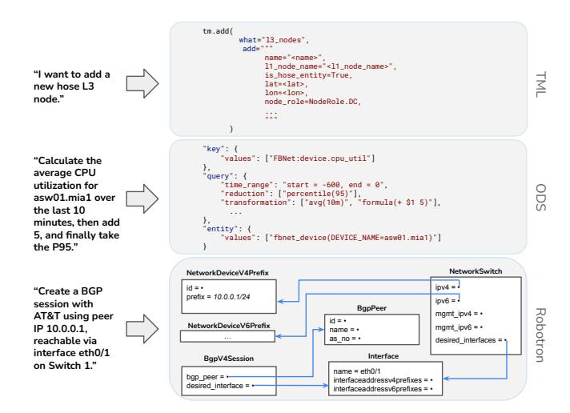
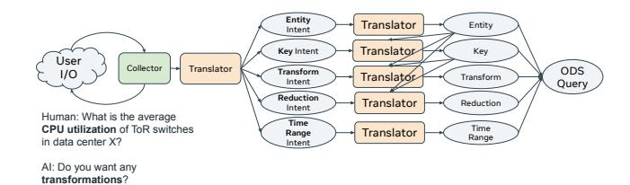

# 4.2 Tools: Network Management Abstraction

To integrate with existing network management tools, we have to translate natural language into structural data (DSLs) that these tools can process.

4.2.1 Confucius Primitives for Tools. To facilitate translation, Confucius introduces three primitives that systematically define the translation logic and collect additional information needed to complete the translation.

Translator converts natural language into structured output (e.g., command lines or configurations), allowing users to focus on writing examples without worrying about formatting and parsing. It can handle multiple languages and translate between different CLI commands, queries, and vendor-specific configurations.

Selector uses customizable logic (e.g., language models or similarity search methods) to select a subset of relevant options based on the user's query. It is widely used to select from a large dataset or database. The rationale behind using a Selector is that while LLMs can often narrow down to a subset of structured data, they require additional information to generate precise outputs.

Collector gathers and processes data from various sources, including the user, to clarify intent and identify relevant entities. This primitive is designed based on the observation that natural language often contains ambiguity. It can also ask follow-up questions to refine the user's instructions. By mitigating ambiguity in natural language, the Collector improves performance on downstream tasks. Due to limited space, we only discuss the details of Collector, which are shown in Figure [6.](#page-5-1) The user instantiates the Collector class by defining a CollectorTask that is specific to their use case. In addition to providing direct instruction, the CollectorTask allows

> **[图片提取文字 (无描述)]:**
> tm.add( what="13 nodes". adds""" name="<name>". 11 node name="<11 node name>". "I want to add a is\_hose\_entity=True, lat=<lat>. new hose 13 lon=<lon>. node." node\_role=NodeRole.DC, "key": { "values": ["FBNet:device.cpu\_util"] "Calculate the average CPU "query": { "time\_range": "start = -600, end = 0", utilization for "reduction": ["percentile(95)"], asw01.mia1 over "transformation": ["avg(10m)", "formula(+ \$1 5)"], the last 10 minutes, then add "entity": { 5, and finally take "values": ["fbnet\_device(DEVICE\_NAME=asw01.mia1)"] the P95." NetworkSwitch NetworkDeviceV4Prefix ipv4 = id = • "Create a BGP prefix = 10.0.0.1/24 ipv6 = session with **BgpPeer** mgmt ipv4 = + Robotron AT&T using peer id = \*Network Device V6 Prefix mgmt ipv6 = + IP 10.0.0.1. name = . as no = . reachable via desired interfaces = interface eth0/1 Interface BapV4Session on Switch 1." name = eth0/1bgp peer = . interfaceaddressv4prefixes = . desired interface = interfaceaddressy6prefixes = .

Figure 7: Examples of Three DSLs.

the user to provide few-shot CollectorExample objects. A CollectorExample contains an example of a user input, paired with the correct response encapsulated in CollectorArtifact, as well a CollectorThinking object that contains the step-by-step logic to arrive at the answer. An example of the concrete objects created based on these classes is provided in Figure [18.](#page-15-2)

4.2.2 Foundational Network Management DSLs. While the Translator primitive is used to convert natural language into structured data, it remains necessary to determine which structured data format to translate into. Existing network tools rely on a variety of structured data formats. Based on our production experience, we have identified three widely used DSL classes in network management. Supporting these three DSLs enables easier onboarding of a large number of tools.

Network Graph. The network topology graph is a fundamental element in various applications, such as capacity planning, risk analysis, routing, and traffic engineering. We represent the topology using a Thrift-defined graph, which includes regions, layer-1 nodes, layer-3 nodes, layer-1 optical edges, layer-3 IP edges, and flows. One insight is that the naming conventions of nodes are crucial for understanding the topology. For example, regions are typically named after airport codes (e.g., ATN), while L1 nodes represent groups of layer-1 devices within regions, often named by combining the region's code with a digit (ATN1). These naming conventions provide valuable information about the topology's properties and roles. It exemplifies the type of specific domain knowledge that we explicitly embed into the LLM prompt, so that the LLMs can recognize and interpret these patterns in the DSL. We use a DSL called TML (Topology Modification Language), a Python-based language, to facilitate modifications to the graph. This DSL enables systematic updates, transformations, and selections of topology objects. Figure [7\(](#page-5-2)a) shows one such example.

Time Series Network Data. Time series network data is a fundamental construct in network management, with applications ranging from traffic analysis and network health monitoring to

anomaly detection. At Meta, time series data is stored in a key-value store known as ODS (Operations Data Store) [41]. The basic unit of data is an *entity*, which can represent any object under measurement, such as interface loss or CPU utilization. The data for each entity consists of a series of <time, value> snapshots, as shown in Figure 7(b). For LLMs to become familiar with time series data, we embed the prompts with specific domain knowledge. In other words, we explicitly instruct the LLMs how to handle this type of data; this includes methods for aggregating time series data, such as calculating the average or 90th percentile, as well as conventions for generating mathematical formulas to manipulate this data.

Network Data Model. It is common practice to store network management data in a structured model [38, 46]. Modern production networks typically maintain their source-of-truth data in a management database and provide an Object-Relational Mapping (ORM) layer on top for easier access. At Meta, the Robotron data model [46] is a fundamental component of nearly all management tools. Figure 7(c) illustrates an example of how to translate the intent of creating a BGP session to a set of network objects modeled. An interface is composed of multiple components, each linking to other objects in a relational database, such as IP addresses, BGP sessions, and neighboring ports.

We find that Robotron is a powerful DSL that connects LLMs with a variety of existing network management tools. It captures high-level network design intent as relational data objects, which are then translated into low-level, vendor-specific device configurations and network operations. LLMs further elevate this abstraction by mapping users' natural language intents into Robotron, which in turn maps to the low-level configurations. The main challenge in this translation lies in the vast volume of models involved. To address this, we have developed a Retrieval-Augmented Generation (RAG) approach, which is described in more detail later.

In summary, we identify three common DSLs frequently used across many management tasks, illustrate them with concrete translations from natural language in Figure 7, and highlight the associated challenges. We next dive into techniques to make these translations both accurate and efficient.

- 4.2.3 Prompt Engineering Techniques. One effective way to improve translation accuracy is to design appropriate prompt engineering techniques. We carefully select the optimal combination of prompts tailored to each DSL translation task. Below, we summarize these techniques and relate them to their respective DSL translation tasks.
- Zero-shot chain of thought asks the model to think before translating. For example, in ODS (time series DSL), we use a "Thought" field in the request to teach the LLM to leverage regex matching when it encounters a string like "rsw1aa.\*prn1". This forces the model to first consider the networking context of the input text, rather than directly generating a literal translation.
- *Few-shot chain of thought* provides the model with relevant examples for translations. For instance, we give an example to teach LLM to understand the "entity" field in the ODS example.
- Contrastive chain of thought involves giving the model wrong examples and telling them that they were incorrect. For example,

> **[图片提取文字 (无描述)]:**
> Entity Translator Entity Intent Key Intent Translator Key User Collector Translator ODS Transform 1/0 Translator Transform Intent Query Reduction Reduction Translator Intent Human: What is the average Time CPU utilization of ToR switches Time Translator Range Range in data center X? Intent Al: Do you want any transformations?

Figure 8: The composition of Analects for an ODS use case.

in ODS translation, we can create a counterexample about not including any switches in a region named "prn2".

- Tool calling: We provide the model with access to APIs, CLIs, libraries, and databases to enable agentic planning. In ODS, we directly invoke the ODS Query API and, if necessary, include the returned messages along with the original query in subsequent iterations to allow LLMs to perform self-correction.
- Reason and act: It uses an orchestrator to let LLMs plan themselves for complex tasks in network investigations. By allowing the model to plan its own actions, we can help it generate more coherent and effective translations. This approach can be particularly effective in cases where the model needs to perform multiple tasks or respond to changing circumstances. As elaborated below, the ODS query is decomposed into 5 subtasks.
- Code as reasoning: We let LLMs write code to answer data retrieval questions. For example, we do not ask LLMs to modify the topology struct directly; instead, we have LLMs write TML code, which goes through the compiler and TML engine to modify the topology. Primarily, this approach allows the generated code to be easily validated by a compiler or a human. Additionally, a human can modify the code or merge multiple code snippets, facilitating more manageable and tractable task breakdowns.

*ODS Prompting Example:* Figure 8 illustrates the use of the Translator to convert user queries into sub-questions.

- Key: narrowing down relevant keys using the Selector
- Entity: identifying specific entities involved in the query
- Reduction: providing built-in prompts for common reduction operators (e.g. groupby, top, avg)
- Time Range: converting time range into start and end values
- Transformation: applying complex functions like smoothing and calculating differences between samples

As shown in Figure 8, the ODS prompting example uses the Translator to convert user queries into sub-questions, including narrowing down relevant keys with the Selector, identifying specific entities in the query, providing built-in prompts for common reduction operators (e.g. groupby, top, avg), converting time range descriptions into start and end values, and applying complex functions like smoothing or computing differences between samples.

4.2.4 Built-in Validation. Network use cases have stringent safety requirements, making it essential for Confucius to incorporate a variety of validations. We emphasize built-in validations, which

reduce the manual effort needed for human verification while enabling error messages to be automatically fed back to LLMs for autocorrection. Specifically, Confucius employs three built-in methods to validate the correctness of generated DSLs.

- Built-in Parser: For some specialized DSLs (e.g., TML), we use a custom parser to check the syntax. If the parser fails, it provides a clear error message that is fed back to the LLM, allowing it to learn from its mistakes and adjust its next attempt. This iterative process continues until the output parses successfully or the maximum number of allowed trials is reached.
- External API: We rely on the API that consumes the DSLs to check their correctness. For example, Robotron Model are validated through both read and write operations. The database's ORM layer detects errors during read operations, while a "dry run" mode simulates write operations without committing changes to the database.
- External Tools: We utilize separate validation systems to guarantee operation safety. For instance, for TML-generated graphs, we use a graph validator to check the topology against predefined invariants, such as full connectivity and minimum path requirements. Detected errors are fed back to the LLMs.

