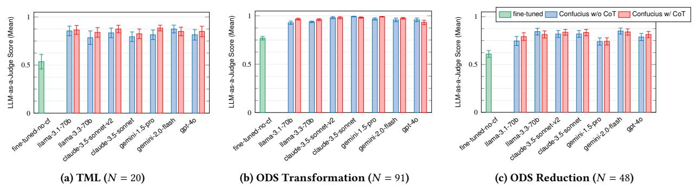

# 7.2 Ensemble for Multi-Agent Reasoning

Ensemble is a key primitive for improving planning accuracy. We evaluate its impact on accuracy for translating ODS reductions and transformations, with the following setups: (1) single-model generation using Llama 3.1, (2) homogeneous ensemble, which combines three Llama 3.1 models with temperature 0.5, and (3) heterogeneous ensemble, which combines a Llama 3.1, Claude 3.5 Sonnet, and Gemini 2.0 Flash model. For the ensemble experiments, we use Llama 3.1 to select the best answer based on Confucius' internal knowledge about the task.

Figure [11](#page-9-2) shows that all ensemble setups perform strictly better than the single-model setup for both datasets. We observe that the best performance is achieved by multi-model ensemble, scoring 0.87 on ODS reductions and 0.98 on transformations. Additionally, ensembling reduces variance in scores by aggregating inconsistencies in the outputs of different agents. Figure [11](#page-9-2) shows that multi-model ensemble reduces the standard error from the baseline by 34% and 57.6% for ODS reductions and transformations, respectively.

> **[图片提取文字 (无描述)]:**
> Confucius w/o CoT Confucius w/ CoT LLM-as-a-Judge Score (Mean) LLM-as-a-Judge Score (Mean) Score (Mean) Judge 0.5 daude 3.5 somes genini-1.5 pro (c) ODS Reduction (N = 48)(a) TML (N = 20)(b) ODS Transformation (N = 91)

Figure 12: Evaluation results for DSL translation.

#### 7.3 DSL Translation

**Experimental Setup.** We evaluate DSL translation for the structured data types presented in §4.2: TML for topology graph, Robotron for data models, and ODS reductions/transformations for time series. We compare Confucius against the fine-tuned baseline to underscore the benefits of careful prompt engineering.

**Results and Analysis.** For the Robotron use case, we evaluate Confucius with Llama 3.1 on its end-to-end performance, which involves the use of Translator to extract and relate entities from the natural language query, as well as the use of retrieval to find the most relevant data models. Figure 13a shows that Confucius surpasses the performance of the fine-tuned baseline by 13%. This underscores the effectiveness of not only its ability to translate natural language into Robotron queries, but also its ability to identify the correct data models via in-context retrieval.

For TML and ODS experiments, we evaluate Confucius across 7 different foundation models, comparing performance with and without chain-of-thought (CoT) prompting. As demonstrated in Figure 12, Confucius outperforms the baseline by up to 35% for TML, 22.4% for ODS transformation, and 23% for ODS reduction. We attribute these outcomes to the effectiveness of Confucius's domain-aware prompting, particularly its use of structured prompts and built-in validation to generate accurate, well-formatted responses. Moreover, Confucius performs consistently across different foundation models. Unlike a fine-tuned model that is constrained by its training data, Confucius provides developers with greater flexibility to leverage new LLM models.

Figure 12 also shows that by incorporating CoT prompting, Confucius further improves its performance across most foundation models, with a notable 7% increase in accuracy using Gemini 2.0 Flash on TML. There are a few cases in which the performance suffers from the use of CoT; for example, when using GPT-40 for ODS transformations, Confucius achieves a mean score of 0.959 without CoT and 0.932 with CoT. In these cases, we find that CoT sometimes encourages the model to overthink and generate overly complex responses. To illustrate this, consider a request to "count data points in the last 10 minutes." Whereas the correct ODS transformation is "count(10m)", CoT prompting causes the model to include unnecessary terms seen in the prompt, resulting in "latest(10m), count(10m)." Nevertheless, CoT prompting still improves the accuracy across 92.4% of all translation datapoints, underscoring the value of intermediate reasoning steps in DSL translation.

| Metric                |         | Metric                | Performance | What-if  |  |
|-----------------------|---------|-----------------------|-------------|----------|--|
| Total users           | 4.16K   |                       | Diagnosis   | Planning |  |
| Monthly active users  | 2.63K   | Total users           | 121         | 605      |  |
| Total sessions        | 241.38K | Total sessions        | 1.86K       | 2.66K    |  |
| Total messages        | 31.62M  | Total time spent (hr) | 835.58K     | 207.33K  |  |
| Use cases onboarded   | 64      | Total messages        | 4.17M       | 2.36M    |  |
| AI to human msg ratio | 20.54   | AI to human msg ratio | 2.46        | 7.65     |  |

**Table 2: Confucius Usage Statistics.** 

#### 7.4 RAG for Knowledge Retrieval

**Experimental Setup.** We evaluate the use of RAG vs. the use of domain knowledge in fine-tuning data, as well as the advantages of Hybrid RAG and Query Transformations, on 3 network use cases at Meta: Robotron, Netgram, and Wiki Q&A.

- Robotron: Confucius retrieves from over 400 desired models via in-context learning. (See §7.3 for a discussion of this experiment.)
- Netgram: Confucius retrieves from an embedding store with 118.6K vectors and ~1.24 GB memory footprint.
- Wiki Q&A: Confucius retrieves from an embedding store of 3.3M vectors with ~33.5 GB memory footprint.

**Results and Analysis.** As shown in Figure 13, Confucius outperforms the fine-tuned baseline on all retrieval tasks. We evaluate RAG for different values of k, where k is the number of neighbors retrieved by similarity search. When k>5, we apply the Hybrid RAG technique to filter the top 5 most relevant responses from the retrieved candidates. Our results show that Hybrid RAG improves performance by 3% when we increase k to 15 and k to 10 for Netgram and Wiki Q&A, respectively. Nevertheless, while RAG benefits from a larger initial pool of candidates, increasing k beyond a certain point results in diminishing returns. For Wiki Q&A, to reduce noise when matching long documents, we apply the Query Transformation technique to extract key terms from the user query with an LLM before retrieval. Figure 13c shows that this technique improves Confucius' performance from 0.73 to 0.77 at k=10.

#### 7.5 Adoption and Usage Statistics

We provide insights into Confucius' usage in real-world production. Confucius has seen substantial growth and adoption over the past year, with 4.16K total distinct users, 241.38K sessions, and 31.62M messages (see Table 2). Since its initial launch, we have onboarded over 60 use cases; notable applications include performance diagnosis and what-ifs for capacity planning, which have generated

> **[图片提取文字 (无描述)]:**
> 0.83 Judge Regex Match Sc 0.11 cf-naive-rag cf-hybrid-rag cf-hybrid-ragfine-tunedcf-retrieval fine-tuned-no-cf (k=5)query-transform cf-naive-rag (k=5) cf-hybrid-rag (k=15) fine-tunedno-cf (k=10)no-cf (c) Wiki Q&A (N = 250)(a) Robotron (N = 12) **(b) Netgram (**N = 226**)**

Figure 13: Evaluation results for RAG.

| Apps            | Primitives Used | Foundational Analects Used | # Usage per week | LoC   | Per Usage Saved Hours |
|-----------------|-----------------|-------------------------------|---------------------|-------|--------------------------|
| ODS             | Time Series     | Collector,                    | 50                  | ~1600 | 0.25                     |
|                 |                 | Translator,                   |                     |       |                          |
|                 |                 | Selector                      |                     |       |                          |
| What-if         | Time Series     | Collector,                    | 20                  | ~3500 | 0.5                      |
|                 | Graph           | Translator,                   |                     |       |                          |
|                 |                 | Selector                      |                     |       |                          |
| Network Design  | Graph           | Collector                     | 50                  | ~1000 | 0.2                      |
| Workflow        | Graph           | Collector,                    | 30                  | ~800  | 0.3                      |
|                 | Data Model      | RAG                           |                     |       |                          |
| Monitoring      | Data Model      | Collector, RAG                | 80                  | ~600  | 0.5                      |
| Troubleshooting | Time Series,    | Collector,                    | 100                 | ~6400 | 0.2                      |
|                 | Graph           | Ensemble,                     |                     |       |                          |
|                 |                 | Orchestrator                  |                     |       |                          |

**Table 3: Applications summary.** 

4.17M and 2.36M messages, respectively. The ease of development design has enabled such rapid growth in both onboarded use cases as well as the developer community. We also observe a high ratio of AI-generated to human messages: 20.54 across all use cases, 2.46 for performance diagnosis, and 7.65 for what-if planning. This suggests that relatively little human intervention is needed in most interactions, while the lower ratio for performance diagnosis reflects the difficulty of troubleshooting tasks. Table 3 summarizes the applications across different categories of network management tasks, detailing the primitives, Analects, and lines of code (LoC) used. Finally, Figure 14 shows the total engineer-hours saved per week for each application, as reported in survey data.

#### 8 Experiences

This section shares our production experiences of developing Confucius and onboarding applications.

