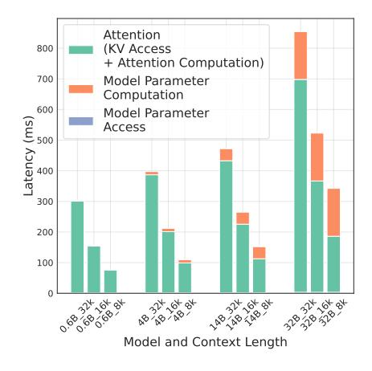

# 2 Related Work and Problem Settings

In this section, we first review several lines of related work relevant to Kinetics. Then we introduce a cost model accounting for computation and memory access, followed by a roofline analysis uncovering a key departure from traditional scaling laws. Finally, we outline the experimental setup used in the subsequent analysis. Notation is summarized in Table [1.](#page-3-0)

Scaling Laws. Prior work [\(Kaplan et al.,](#page-14-3) [2020;](#page-14-3) [Hoffmann et al.,](#page-13-8) [2022;](#page-13-8) [Kumar et al.,](#page-14-0) [2024\)](#page-14-0) has extensively examined the scaling laws of pretraining, exploring the trade-off between model size and the number of training tokens under a fixed FLOPs budget. More recently, studies such as [\(Snell et al.,](#page-15-0) [2024;](#page-15-0) [Wu et al.,](#page-16-0) [2024;](#page-16-0) [Brown](#page-12-0) [et al.,](#page-12-0) [2024;](#page-12-0) [Beeching et al.\)](#page-12-6) have extended this analysis to test time scaling, with a focus on compute-optimality. While these works offer a strong theoretical foundation, they largely overlook the critical bottleneck posed by memory access in current inference systems.

Test-Time Scaling. Recent LLMs such as DeepSeek-R1 [\(Guo et al.,](#page-13-0) [2025\)](#page-13-0), OpenAI-o1/o3 [\(Jaech et al.,](#page-13-1) [2024\)](#page-13-1), and QwQ [\(Qwen-Team,](#page-15-1) [2025\)](#page-15-1) generate extended CoT reasoning [\(Wei et al.,](#page-16-1) [2022\)](#page-16-1) to solve complex problems, including those from AIME [\(MAA,](#page-15-6) [2024,](#page-15-6) [2025\)](#page-15-7). Parallel search through repeated sampling [\(Brown et al.,](#page-12-0) [2024\)](#page-12-0), majority voting (self-consistency) [\(Wang et al.,](#page-16-4) [2022\)](#page-16-4), and reward-model [\(Wu et al.,](#page-16-0) [2024;](#page-16-0) [Feng et al.,](#page-13-9) [2023;](#page-13-9) [Snell et al.,](#page-15-0) [2024\)](#page-15-0) (e.g., Best-of-N, weighted voting, tree search) aims to improve reasoning accuracy. Strategies such as [\(Fu et al.,](#page-13-10) [2024;](#page-13-10) [Arora and Zanette;](#page-12-7) [NovaSky-Team,](#page-15-8) [2025\)](#page-15-8) and hybrid models [\(Lieber et al.,](#page-14-4) [2024;](#page-14-4) [Paliotta et al.,](#page-15-9) [2025;](#page-15-9) [Wang et al.,](#page-16-5) [2025\)](#page-16-5) have been proposed to reduce the cost of test-time scaling.

Advanced test-time strategies shift evaluation from token-centric metrics (e.g., perplexity, latency) to task-level throughput—the number of tasks completed per unit time. This shift is especially relevant for reasoning tasks, where intermediate steps may vary widely depending on the strategy, yet the ultimate utility hinges almost entirely on the correctness of the final output. In contrast, traditional tasks like chat completions focus on token-level quality and throughput.

Sparse Attention. A significant line of prior work has focused on overcoming the quadratic computational bottleneck of attention mechanisms during LLM training by leveraging the natural sparsity of attention matrices [\(Child et al.,](#page-12-8) [2019;](#page-12-8) [Kitaev et al.,](#page-14-5) [2020;](#page-14-5) [Daras et al.,](#page-12-9) [2020;](#page-12-9) [Zaheer et al.,](#page-17-2) [2020;](#page-17-2) [Beltagy et al.,](#page-12-10) [2020;](#page-12-10) [Yuan et al.,](#page-17-3) [2025\)](#page-17-3). More recently, sparse attention has experienced a resurgence in the context of LLM inference, where methods such as [\(Zhang et al.,](#page-17-4) [2023;](#page-17-4) [Xiao et al.,](#page-16-6) [2024;](#page-16-6) [Tang et al.,](#page-16-7) [2024;](#page-16-7) [Liu et al.,](#page-14-6) [2024b;](#page-14-6) [Chen](#page-12-11) [et al.,](#page-12-11) [2024;](#page-12-11) [Hu et al.,](#page-13-11) [2025\)](#page-13-11) restrict the memory access of the key-value (KV) cache during generation while maintaining strong performance. These advances form a strong and steady foundation for our exploration of a new test-time scaling paradigm.

Extended related work is discussed in Appendix [E.](#page-28-0)

### Cost Model

We first calculate the inference cost for the cases where the batch size is 1, and then extend to a more general case in TTS. Finally, we propose our cost model using equivalent FLOPs. We assume the model weight and

Table 1 Notation Used throughout the Paper.

| Symbol                       | Description   | Symbol    | Description      | Symbol   | Description     |
|------------------------------|---------------|-----------|------------------|----------|-----------------|
| $T, \mathcal{T}$             | Task (set)    | $L_{out}$ | # Gen tokens     | $L_{in}$ | Prompt length   |
| M                            | Model         | $N, N_T$  | Reasoning trials | D        | KV size / token |
| $C, C_{\mathrm{TTS}}(\cdot)$ | Cost function | $n, n_T$  | Max # tokens     | P        | Parameters      |
| $\mathcal{A}$                | Algorithm     | $B, B_T$  | KV budget        | r        | GQA ratio       |

KV cache are stored and calculated using the same precision.

**Computation.** As discussed in (Brown et al., 2024), the computation of a transformer architecture layer consists of two parts: linear modules and self-attention, which is given by:

$$C_{\text{comp}} = \underbrace{2PL_{out}}_{\text{model parameters computation (MLP and } W_O, W_K, W_V, W_O)} + \underbrace{r(2L_{in} + L_{out})L_{out}D}_{\text{self-attention}}$$

Memory Access. Memory access also consists of two parts, model parameters and KV cache:

$$C_{\text{mem}} = \underbrace{2PL_{out}}_{\text{model parameter access}} + \underbrace{2L_{in}L_{out}D + L_{out}^2D}_{\text{KV cache (prompt + decoding)}}$$

$$\underbrace{\text{KV cache (prompt + decoding)}}_{\text{Softmax}(qk^T/\sqrt{d})v}$$

In real serving scenarios, a large batch size will be used (DeepSeek-AI, 2025) with growing GPU VRAM (Tirumala and Wong, 2024) and model parallelism (Pope et al., 2023). The access to the model parameters will be amortized across requests in a batch; Figure 3 shows parameter access time is negligible when the batch size is large. Thus, we only consider the second term (i.e., KV cache loading) in our cost function. Furthermore, in the cases that we have N reasoning trials, the prompt cache access (Juravsky et al., 2024; Zheng et al., 2024) is also shared across these N trials. Thus,

$$C_{\text{comp}}(N) = 2PNL_{out} + 2rNL_{in}L_{out}D + rNL_{out}^2D \tag{1}$$

$$C_{\text{mem}}(N) = 2L_{in}L_{out}D + NL_{out}^2D \tag{2}$$

**eFLOPs.** We propose eFLOPs (equivalent FLOPs) to capture both compute and memory access cost,

$$eFLOPs = C_{comp} + C_{mem} \times I^{1}$$
(3)

where I is the arithmetic intensity of hardware, which reflects that modern accelerators usually have a much larger computation capacity over memory bandwidth, and the gap is growing over the years (Sadhukhan et al., 2024).

> **[图片提取文字 (无描述)]:**
> Attention 800 (KV Access + Attention Computation) 700 Model Parameter Computation 600 Model Parameter Latency (ms) Access 300 200 100 Model and Context Length

Figure 3 Latency breakdown for different model sizes (Qwen3 series) and context lengths (batch size 4K).

Combining Equations (1) to (3), we obtain the final cost model:

$$C_{\text{TTS}} = \underbrace{2NPL_{out}}_{\text{linear modules computation}} + \underbrace{2rNL_{in}DL_{out} + rNDL_{out}^2}_{\text{self-attention computation}} + \underbrace{2IL_{in}DL_{out} + INDL_{out}^2}_{\text{KV access}}$$
(4)

 $^{1}$ Max cost model max $(C_{\text{comp}}, C_{\text{mem}} \times I)$  also works here and favor our claims more since most of the time  $C_{\text{mem}} \times I$  dominates the cost. We choose to use an additive cost model because  $C_{\text{comp}}$  mainly comes from linear layers while  $C_{\text{mem}}$  mainly comes from the self-attention layer. The parallelization of these components during decoding remains an active area of research (Zhu et al., 2024). We discuss this max cost model in Appendix A.1.

where P, r, D are hyper-parameters determined by the model M. In MoE models, P stands for the number of active parameters rather than total parameters.

Analysis. Our key insight is attention-related cost dominates in long CoTs. We show this by estimating the ratio of attention-related cost to parameter-related cost  $\Phi$ :

$$\Phi = \frac{2rL_{in}D + (rD + ID)L_{out}}{2P}$$

As shown in Figure 2a, in the regime of long CoTs, where the generation length exceeds 4096 tokens, the cost of attention surpasses that of model parameters by a factor of  $10-1000 \times$ .

While multi-head latent attention (MLA; Liu et al., 2024a) reduces KV memory access by a constant factor (similar to r in GQA), it is insufficient for achieving true scalability due to several limitations: (1) MLA does not reduce attention computation; (2) the gap between FLOPs and memory bandwidth is expected to widen in the future; and (3) emerging fine-grained MoEs (AI@Meta, 2025; Dai et al., 2024; Snowflake-Team, 2024) drastically reduce FLOPs in linear layers by a factor of  $10-20\times$ , further increasing the relative cost of attention.

Under the context of Long-CoTs being widely adopted, we can safely assume generated length  $L_{out} \gg L_{in}$  or at least proportional to  $L_{in}$ . Hence, the bottleneck of inference is shifted from linear term  $L_{out}P$  to the quadratic term  $L_{out}^2D$ , motivating our KINETICS scaling law, akin to kinetic energy:  $E_k = \frac{1}{2}mv^2$ .

Experimental Setup. Tasks: we focus on three challenging reasoning benchmarks: AIME24 (MAA, 2024), AIME25 (MAA, 2025), math datasets spanning algebra, combinatorics, and geometry, and LiveCodeBench (Jain et al., 2024)2, which includes complex programming problems from recent coding competitions. Models: We evaluate performance across various model sizes of the Qwen3 (Yang et al., 2025) and DeepSeek-R1-Distilled-Qwen (Yang et al., 2024b; Guo et al., 2025) series. Test-time Strategies: To eliminate the confounding effects introduced by the specific implementations of test-time strategies, such as the quality of reward models, we adopt two representative yet straightforward approaches: Long-CoTs, a practical and widely used method in state-of-the-art reasoning models, and the *oracle* Best-of-N (repeated sampling (Brown et al., 2024)), which measures the solving rate for verifiable problems and suggests an upper bound via TTS. Hardware: We use the specifications of NVIDIA B200 as hardware reference to study the latest serving scenarios. Experiments details are presented in Appendix D.

