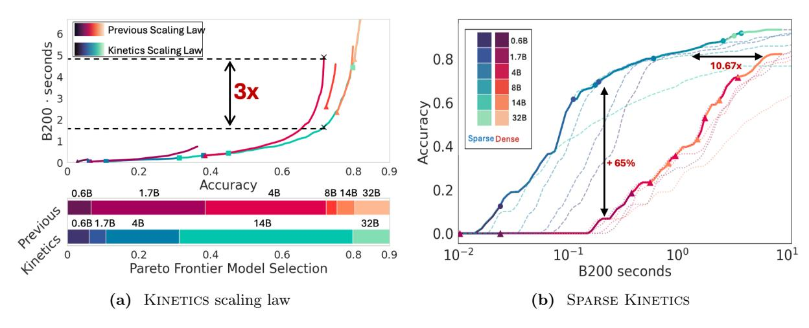
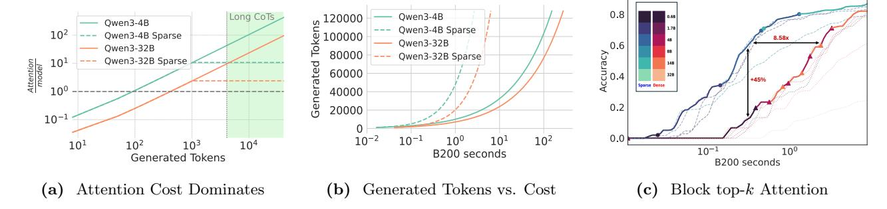

# Kinetics: Rethinking Test-Time Scaling Laws

Ranajoy Sadhukhan∗ , Zhuoming Chen∗ , Haizhong Zheng, Yang Zhou, Emma Strubell, Beidi Chen {rsadhukh,zhuominc,haizhonz,yangzho6,estrubel,beidic}@andrew.cmu.edu Carnegie Mellon University

We rethink test-time scaling laws from a practical efficiency perspective, revealing that the effectiveness of smaller models is significantly overestimated. Prior work, grounded in compute-optimality, overlooks critical memory access bottlenecks introduced by inference-time strategies (e.g., Best-of-N, long CoTs). Our holistic analysis, spanning models from 0.6B to 32B parameters, reveals a new Kinetics scaling law that better guides resource allocation by incorporating both computation and memory access costs. Kinetics suggests that test-time compute is more effective when used on models above a parameter threshold than with smaller ones. A key reason is that in test-time scaling, attention, rather than parameter count, emerges as the dominant cost factor. Motivated by this, we propose a new scaling paradigm centered on sparse attention, which lowers per-token cost and enables longer generations and more parallel samples within the same resource budget. Empirically, we show that sparse attention models consistently outperform dense counterparts, achieving over 60 points gains in low-cost regimes and over 5 points gains in high-cost regimes for problem-solving accuracy on AIME, encompassing evaluations on state-of-the-art MoEs. These results suggest that sparse attention is essential and increasingly important with more computing invested, for realizing the full potential of test-time scaling where, unlike training, accuracy has yet to saturate as a function of computation, and continues to improve through increased generation.

Github: <https://github.com/Infini-AI-Lab/Kinetics> Website: <https://infini-ai-lab.github.io/Kinetics>

> **[图片提取文字 (无描述)]:**
> Previous Scaling Law 0.6B seconds · Kinetics Scaling Law 0.8 1.7B 10.67x **3**x 8B Accuracy 0.0 4.0 14B B200 32B Sparse Dense + 65% 0.8 0.6 0.9 0.2 0.4 Accuracy 0.2 1.7B 4B 8B 14B 32B 0.6B previous Kinetics 0.6B 1.7B 4B 14B 32B 0.0  $10^{-2}$  $10^{-1}$  $10^{0}$  $10^{1}$ 0.9 0.2 0.4 0.6 0.8 Pareto Frontier Model Selection B200 seconds Kinetics scaling law Sparse Kinetics (b)

Figure 1 (a) Pareto Frontier for Qwen3 series on AIME24 (Long-CoTs). Previous test-time scaling laws [\(Brown](#page-12-0) [et al.,](#page-12-0) [2024;](#page-12-0) [Snell et al.,](#page-15-0) [2024;](#page-15-0) [Wu et al.,](#page-16-0) [2024\)](#page-16-0) focus solely on compute optimality, neglecting the significant bottleneck of memory access in long-sequence generation. This leads to suboptimal resource utilization. By incorporating memory access, Kinetics reduces resource demands by up to 3× to achieve the same accuracy. (b) Top-K Sparse attention on AIME24 (Best-of-N). Inspired by Kinetics, we show that sparse attention models scale significantly better than dense models, achieving over 50-point improvements in AIME24 in the low-cost regime and consistently outperforming dense models in the high-cost regime, in addition to substantial efficiency gains. B200 seconds represent the amount of work performed by a single NVIDIA B200 at full utilization per second.

∗ indicates equal contributions.

> **[图片提取文字 (无描述)]:**
> 0.8 Long CoTs > 0 120000 Owen3-4B Qwen3-4B Qwen3-4B Sparse 102 Qwen3-4B Sparse 100000 80000 8.58x Owen3-32B 0.6 Qwen3-32B ccuracy 0.4 80000 Owen3-32B Sparse Owen3-32B Sparse Attention  $10^{1}$ 60000 +45% Sparse Dense 40000 0.2 20000  $10^{-1}$  $10^{1}$ 102 0.0  $10^{-2}$ 10- $10^{1}$  $10^{2}$  $10^{3}$  $10^{4}$  $10^{-1}$ 100 B200 seconds Generated Tokens B200 seconds Block top-k Attention Attention Cost Dominates Generated Tokens vs. Cost  $(\mathbf{a})$

Figure 2 (a) Inference cost is dominated by attention (i.e. Softmax  $(\frac{qk^T}{\sqrt{d}})v$ ), which is 10-1000× more than model parameter computation (linear modules, including those in MLPs and  $W_Q, W_K, W_V, W_O$ ), sparse attention fundamentally mitigates this bottleneck. (b) Under the same resource constraints, sparse attention can generate significantly more tokens than dense models, which has been demonstrated to enhance the effectiveness of test-time scaling. (c) Simple block sparse attention yields substantial gains—improving accuracy by 45 points in the low-cost regime, and achieving equivalent accuracy while using  $8.58\times$  fewer resources.

### 1 Introduction

Test-time scaling (TTS) has recently emerged as a powerful strategy (e.g., Best-of-N, Long-CoT (Wei et al., 2022)) for enhancing the reasoning capabilities of large language models (LLMs) (Guo et al., 2025; Jaech et al., 2024; Qwen-Team, 2025), particularly in scenarios where agents interact with complex environments, e.g., writing code, browsing the web (Nakano et al., 2021; Yao et al., 2023a) or reinforcement learning (RL) with LLMs-in-the-loop (Huang et al., 2022; Driess et al., 2023; Chen et al., 2025a). These capabilities, however, introduce substantial inference-time costs, making it critical to understand performance scaling in this new paradigm. Existing scaling law studies (Brown et al., 2024; Snell et al., 2024; Wu et al., 2024) primarily focus on floating-point operations (FLOPs) while ignoring memory access costs, which are often the dominant factor in determining wall-clock latency in TTS regimes. As shown in Figure 1a, this gap can lead to sub-optimal deployment decisions.

In Section 3, we introduce the KINETICS scaling law for TTS, derived from a cost model that explicitly incorporates memory access costs. This new perspective reveals markedly different conclusions about Pareto-optimal strategies for allocating test-time compute (Figure 1a). Specifically, we find that: (1) prior scaling laws consistently **overestimate** the effectiveness of small models enhanced with inference-time strategies; and (2) computational resources are best spent first on increasing model size up to a critical threshold (empirically, around 14B parameters) before investing in test-time strategies, such as Best-of-N sampling or Long-CoTs. Guided by KINETICS, our approach yields up to a  $3\times$  reduction in resource demands to reach the same accuracy on NVIDIA B200 hardware.

Our roofline analysis (Yuan et al., 2024a) across a suite of state-of-the-art reasoning models reveals that the shift in optimal test-time compute strategies arises because test-time strategies (e.g., Best-of-N, Long-CoTs) disproportionately increase attention costs rather than parameter costs (Figure 2a). Our Iso-cost analysis (Kumar et al., 2024) shows that the quadratic growth of attention with generation length, combined with the disproportionate scaling of KV memory relative to model parameters, drives a preference for scaling up model size over generations. This imbalance is further exacerbated by MoE architectures (Shazeer et al., 2017; Du et al., 2021; Fedus et al., 2022; AI@Meta, 2025; Dai et al., 2024; Jiang et al., 2024), which reduce active parameter count without alleviating attention overhead.

Building on the above analyses, in Section 4 we introduce a new scaling paradigm, centered on **sparse** attention, which fundamentally reshapes the scaling law and significantly enhances the scalability of TTS (Figures 1b and 2b). According to our Sparse Kinetics scaling law, computational resources are best allocated to test-time strategies rather than reducing sparsity. As more computing is invested at test time, high sparsity becomes increasingly critical to fully leverage the benefits of these strategies. Guided by this principle, we find that sparse attention increases problem-solving rates by up to **60 points** in the low-cost regime and over **5 points** in the high-cost regime on AIME (Figure 1b) and LiveCodeBench, encompassing state-of-the-art MoEs.

In Section [5,](#page-9-0) we demonstrate the practicality of Sparse Kinetics using a simple block-sparse attention mechanism (Figure [2c\)](#page-1-0). This approach achieves up to a 11.2 ∼ 26.2× speedup on H200 GPUs. While sparsity has traditionally been employed either for regularization in small models [\(Tibshirani,](#page-16-2) [1996;](#page-16-2) [Molchanov et al.,](#page-15-4) [2017\)](#page-15-4) or to reduce computation in over-parameterized networks [\(Mishra et al.,](#page-15-5) [2021;](#page-15-5) [Chen et al.,](#page-12-4) [2021;](#page-12-4) [Hoefler](#page-13-6) [et al.,](#page-13-6) [2021;](#page-13-6) [Dao et al.,](#page-12-5) [2021;](#page-12-5) [Frantar and Alistarh,](#page-13-7) [2023;](#page-13-7) [Liu et al.,](#page-14-2) [2023\)](#page-14-2), our work introduces a fundamentally different perspective: sparsity as a central enabler of efficient and scalable test-time compute. In contrast to pretraining, where scaling is exhibiting diminishing returns [\(Sutskever,](#page-16-3) [2024\)](#page-16-3), TTS continues to benefit from increased token generation and more optimized inference paths. Our work highlights the importance of considering hardware concerns alongside model architecture in order to develop a practical understanding of scaling laws. We hope this study will guide and encourage future co-design of model architectures, test-time strategies, and hardware systems to fully unlock the next wave of LLM scaling.

