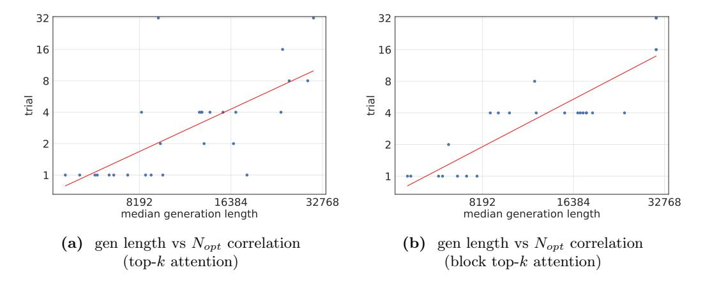

# Limitations, Future Scope, and Broader Impact

Limitations. Our experiments primarily focus on Qwen3 [\(Yang et al.,](#page-16-9) [2025\)](#page-16-9) and DeepSeek-R1-Distilled-Qwen [\(Guo et al.,](#page-13-0) [2025\)](#page-13-0), two state-of-the-art pretrained reasoning model series, evaluated from the inference perspective. However, the effects of training and post-training strategies are not fully explored and may influence the performance gaps and robustness to sparse attention mechanisms. In addition, our cost analysis assumes a cloud-based serving environment, where computational resources are typically sufficient and large batch sizes are feasible. In contrast, local deployment scenarios, such as those using ollama,[5](#page-10-1) often face limited VRAM where access to model parameters can dominate inference costs. Smaller models may be more appropriate in such settings, and our findings may not fully extend to these use cases.

Future Scope. Our sparse scaling law offers valuable insights for enriching the applications of sparse attention algorithms and the design space of test-time scaling strategies. On one hand, except for top-k, currently we only discuss a simple variant, i.e., block top-k, and have already demonstrated strong scalability. There exist more advanced sparse attention algorithms [\(Tang et al.,](#page-16-7) [2024;](#page-16-7) [Chen et al.,](#page-12-11) [2024;](#page-12-11) [Yuan et al.,](#page-17-3) [2025;](#page-17-3) [Lin et al.,](#page-14-11) [2025\)](#page-14-11) which may push test-time scaling to a much higher boundary. On the other hand, test-time scaling

4[https://docs.pytorch.org/tutorials/intermediate/torch](https://docs.pytorch.org/tutorials/intermediate/torch_compile_tutorial_.html) compile tutorial .html

5<https://github.com/ollama/ollama>

> **[图片提取文字 (无描述)]:**
> trial median generation length median generation length (a) gen length vs  $N_{opt}$  correlation (b) gen length vs  $N_{opt}$  correlation (top-k attention)(block top-k attention)

Figure 11 Correlation between Generation Length and Number of Trials. Longer generations correlate strongly with the optimal number of trials (Nopt), serving as a proxy for problem difficulty. (a) shows this trend for top-k and (b) block top-k attention on the AIME24 dataset using the Qwen3-8B model.

algorithms are proposed to adaptively allocate computation to tasks, or even to tokens [\(Arora and Zanette;](#page-12-7) [Mohtashami et al.,](#page-15-13) [2023;](#page-15-13) [Ma et al.,](#page-15-14) [2025b,](#page-15-14)[a\)](#page-14-12). Extending them towards to new resource allocation problems in sparse attention is critical to reach the limit of Sparse Kinetics. For instance, since generation length strongly correlates with the optimal number of trials under sparse attention (as shown in Figure [11\)](#page-11-0), it can be used as a dynamic signal to adjust the number of trials and KV budget. Moreover, sparse attention drastically reduces inference cost, enabling more reasoning trials and longer generations. This unlocks greater flexibility in configuring TTS strategies within a fixed resource budget.

Broader Impact. This work aims to contribute to the understanding of efficiency and scalability challenges in the test-time scaling era, spanning model architecture, system-level implementation, and hardware design. We highlight the central role of sparsity in addressing these challenges. In addition, by shifting the focus from token-level metrics to task-level throughput, we open up broader opportunities for algorithm–system co-design and emphasize the real-world utility of generative AI for society. Our study is algorithmic in nature and does not target specific applications. While large language models can be misused in harmful ways, this work does not introduce new capabilities or risks beyond those already present in existing systems. Test-time scaling can consume a substantial amount of energy, raising concerns about the environmental sustainability of widespread deployment. By promoting sparse attention, our work hopes to help to reduce the carbon footprint and energy consumption of inference systems and support the broader goal of sustainable AI.

