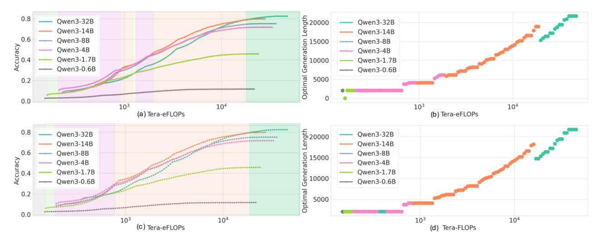
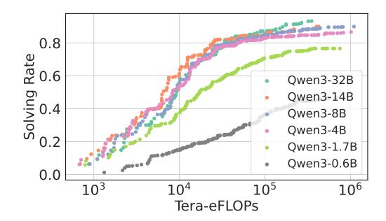
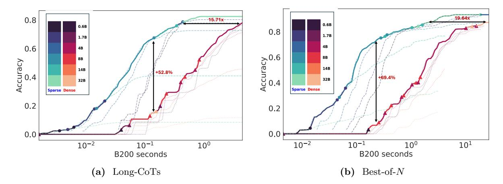

# A Cost Model

In this section, we delve into the cost models used in the Kinetics. We show empirically that adopting a max cost model does not alter the scaling behavior and outline methods for calculating the cost of sparse attention models.

> **[图片提取文字 (无描述)]:**
> Length 20000 0.8 Qwen3-32B Qwen3-32B Qwen3-14B Qwen3-14B 0.6 Qwen3-8B Qwen3-8B Generation 15000 Accuracy 6.0 Owen3-4B Qwen3-4B Qwen3-1.7B 10000 Qwen3-1.7B Qwen3-0.6B Qwen3-0.6B Optimal 5000 0.2 0.0 103 104  $10^{3}$ 104 (a) Tera-eFLOPs (b) Tera-eFLOPs Length 20000 0.8 Owen3-32B Qwen3-32B Qwen3-14B Qwen3-14B 0.6 Qwen3-8B Qwen3-8B Generation 15000 Accuracy 0.0 Qwen3-4B Qwen3-4B Qwen3-1.7B Qwen3-1.7B 10000 Qwen3-0.6B Qwen3-0.6B Optimal 0.2 5000 \_\_\_\_\_ 0.0 104  $10^{4}$  $10^{3}$ (c) Tera-eFLOPs (d) Tera-FLOPs

Figure 12 AIME24 Pareto Frontier (Long-CoTs) with Max Cost Models. (a)(b) is the original plot with the additive cost model. (c)(d) is the corresponding plot using max cost models. Compared to the original plots, the overall trend is similar except that larger models span a slightly broader region on the Pareto frontier. For example, the 14B model now consistently outperforms the 4B model with a noticeable gap around accuracy 0.3 and maintains dominance thereafter. In contrast, under the additive cost model in Figure [4](#page-5-0)(a), the two models alternate in performance until accuracy exceeds 0.4. This suggests that, when evaluated using a max cost model, larger models appear slightly more efficient relative to their performance under additive cost models.

> **[图片提取文字 (无描述)]:**
> 0.8 Rate 9.0 Qwen3-32B Solving 0.4 Qwen3-14B Qwen3-8B Qwen3-4B Qwen3-1.7B Owen3-0.6B 0.0 106  $10^{3}$  $10^{5}$ Tera-eFLOPs

Figure 13 AIME24 Pareto Frontier (Best-of-N) with Max Cost Models. We re-plot Figure 5a using max cost models. The Pareto Frontier is very similar under different cost models.

#### A.1 Max Cost Model v.s. Additive Cost Model

Max cost model is widely used in performance modeling (Yuan et al., 2024b). It assumes that computation and memory operations can be fully overlapped with each other and only considers the bottleneck operation for cost measurement.

$$C_{\text{max-cost}} = \max(C_{\text{comp}}, C_{\text{mem}} \times I)$$

where  $C_{\text{comp}}$  denotes the compute cost,  $C_{\text{mem}}$  the memory cost per access, and I the memory intensity.

In this section, we analyze the KINETICS using the max cost model. For clarity, we refer to the cost model  $C_{\text{comp}} + C_{\text{mem}} \times I$ , which is used in the main paper, as **the additive cost model**.

We draw two conclusions from empirical results under the max cost model:

- Kinetics for dense models still holds. We re-plot Figure 4(a)(b) and Figure 5a under the measurement of max cost models in Figures 12 and 13. We find except that in Long-CoTs scenarios, large models become slightly more effective in low-cost regime (with accuracy~0.3), the overall trends are very close to the plots with additive cost models.
- Sparse attention solves problems more cost-effectively. We re-plot Figures 8a and 8d in Figures 14a and 14b. Under the max cost models, in Long-CoTs, the accuracy and efficiency gaps increase from 47.5 points and 11.21× to 52.8 points and 15.71×, respectively. In Best-of-N, the gaps widen from 65 points and 10.67× to 69.4 points and 19.64×. These results indicate that under the max cost model, our claim that sparse attention can enhance problem-solving performance is strengthen. Compared to dense attention models, sparse attention models tend to have more balanced memory and compute costs. Thus omitting one of them via a max cost model will favor sparse attention models.

#### A.2 Details about Sparse Attention Cost Model

Sparse attention models follow different cost functions due to the sparsification of KV memory access. In this paper, we focus on algorithms that impose a uniform KV budget (denoted as B) per attention head for each decoded token. We consider  $L_{in} \geq B$  for the sake of simplicity. Under this setting, the cost model for sparse attention is given by:

$$C_{\text{sparse}} = \underbrace{2NPL_{\text{out}} + 2rNDBL_{\text{out}}}_{\text{compute}} + \underbrace{2INDBL_{\text{out}}}_{\text{memory}}.$$
 (8)

In practical implementations, we must also account for the overhead associated with retrieving or searching KV memory, denoted as  $C_{\text{search}}$ , which depends on the specific sparse attention algorithm  $\mathcal{A}$ . For example, in block top-k selection, the search cost is:

$$C_{\text{search}} = \underbrace{\frac{2NL_{\text{in}}DL_{\text{out}} + rNDL_{\text{out}}^2}{2\text{Block-Size}}}_{\text{compute}} + \underbrace{\frac{2IL_{\text{in}}DL_{\text{out}} + INDL_{\text{out}}^2}{2\text{Block-Size}}}_{\text{memory}}.$$
(9)

> **[图片提取文字 (无描述)]:**
> 19.64x 0.8 15.71x 0.6B 0.6B 8.0 1.7B 1.7B 4B 0.6 4B Accuracy 0 0 5 0 8B Accuracy 0. 8B 14B 14B +52.8% +69.4% 32B 32B Sparse Dense Sparse Dense 0.2 0.2 0.0 10-2 10-2  $10^{1}$  $10^{-1}$ 10°  $10^{-1}$ 10° B200 seconds B200 seconds Long-CoTs Best-of-N

Figure 14 Sparse attention scales significantly better under max cost models. We re-plot Figures [8a](#page-8-0) and [8d](#page-8-0) using max cost models. Compared to the original plots, the performance and efficiency gaps between sparse attention models and dense models become more pronounced. In Long-CoTs, the accuracy and efficiency gaps increase from 47.5 points and 11.21× to 52.8 points and 15.71×, respectively. In Best-of-N, the gaps widen from 65 points and 10.67× to 69.4 points and 19.64×.

In our work, we choose the Block-Size in such a way that Csparse and Csearch are roughly balanced, so that the sparse attention cost increases sub-linearly with generation length.

For local attention and oracle top-k attention, we assume no search overhead, i.e., Csearch = 0.

Many sparse attention algorithms skip the first layer [\(Tang et al.,](#page-16-7) [2024;](#page-16-7) [Chen et al.,](#page-12-11) [2024;](#page-12-11) [Zhang et al.,](#page-17-4) [2023\)](#page-17-4), resulting in only a minor increase in total cost. For the Qwen3 series, this additional overhead is bounded by 3.57% for the 0.6B model and by 1.56% for the 32B model.

