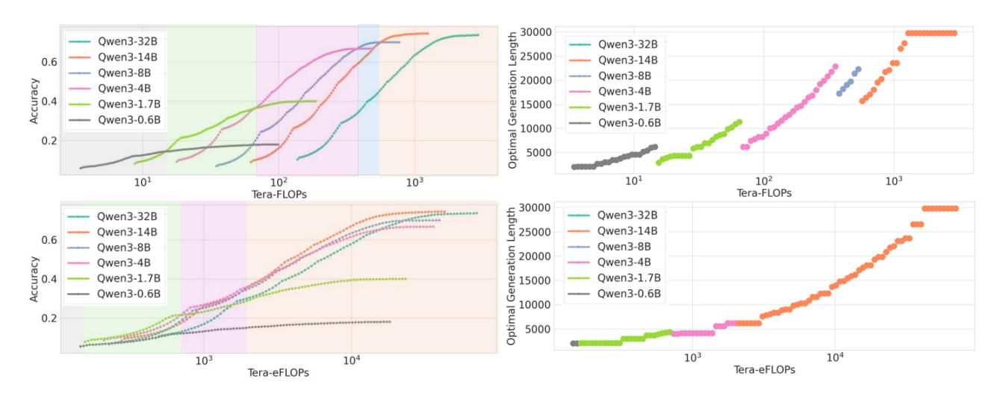
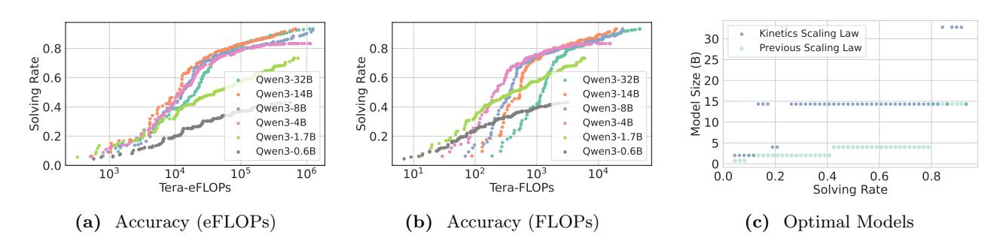
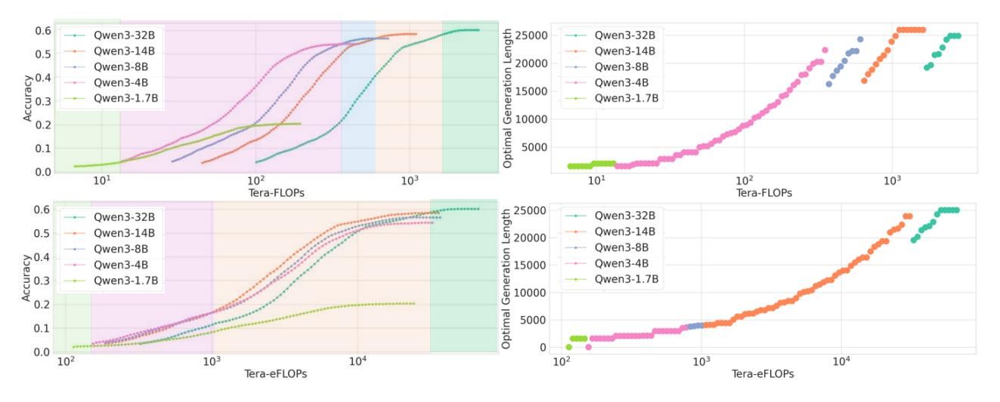
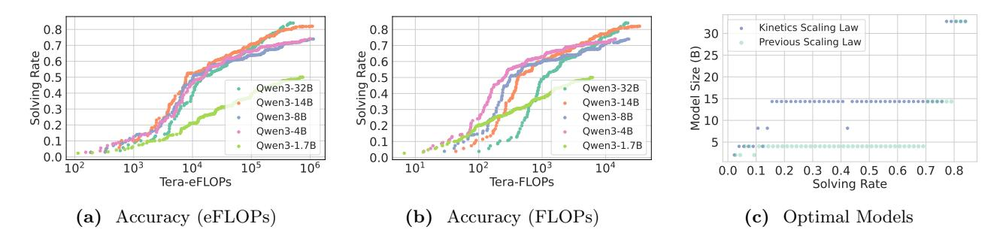
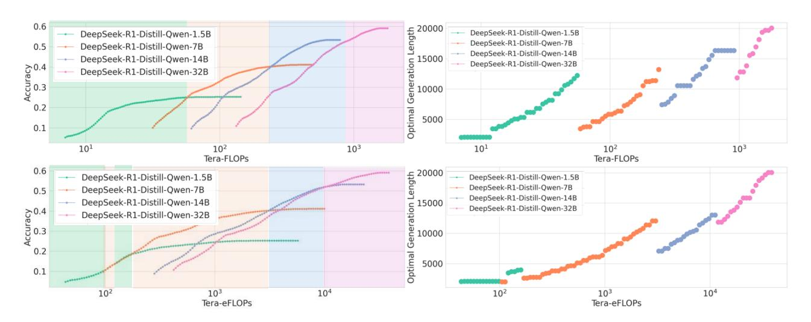
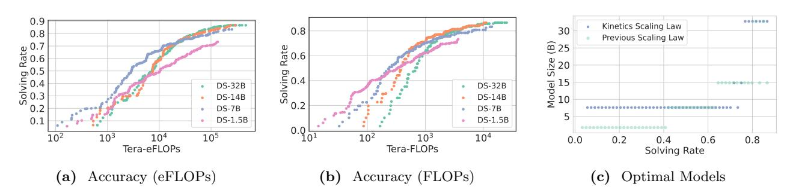

# B Kinetics

In this section, we further verify Kinetics for dense models proposed in Section [3](#page-4-0) with extended experimental results of different benchmarks and model series.

### B.1 Additional Benchmarks

We evaluate on AIME25 in Figures [15](#page-21-0) and [16a](#page-21-1) to [16c](#page-21-1) and LiveCodeBench[6](#page-20-4) in Figures [17](#page-21-2) and [18a](#page-22-0) to [18c](#page-22-0) (excluding the 0.6B model), following the setting described in Section [3.](#page-4-0) The empirical results support the Kinetics: across both benchmarks, the 0.6B and 1.7B models are consistently less effective, and the Pareto frontier is almost always dominated by the 14B models.

### B.2 Additional Reasoning Models

In Figures [19](#page-22-1) and [20a](#page-22-2) to [20c,](#page-22-2) we evaluate DeepSeek-R1 Distilled Qwen models (abbreviated as DS models) [\(Guo](#page-13-0) [et al.,](#page-13-0) [2025\)](#page-13-0) on AIME24. The DeepSeek series models further demonstrate that previous scaling laws—those based on FLOPs—significantly overestimate the effectiveness of the 1.5B model. As predicted by the Kinetics, increasing the number of generated tokens for the 1.5B model is less effective than scaling up the model size, such as using the 7B or larger variants.

Interestingly, we observe a shift in the emerging model size: unlike Qwen3, where the 14B model dominates, the 7B model becomes the dominant choice in the DeepSeek series. In Figures [19,](#page-22-1) [20a](#page-22-2) and [20c,](#page-22-2) the 7B model spans most of the Pareto frontier, and Figure [19](#page-22-1) shows that 7B models with Long-CoTs are more efficient and effective than 14B models with short generations. We attribute this to an architectural outlier in the DeepSeek-R1 (Qwen2.5) model series. As shown in Table [2,](#page-23-5) the DeepSeek-R1 7B model is significantly more

6For LiveCodeBench dataset, we have sampled 50 examples from the v5 subset consisting 167 examples. Our subset comprises 24 hard, 16 medium and 10 easy examples respectively.

> **[图片提取文字 (无描述)]:**
> fb 30000 25000 Qwen3-32B Qwen3-32B Qwen3-14B 0.6 Qwen3-14B Qwen3-8B 20000 15000 Qwen3-8B Accuracy 0. Qwen3-4B Qwen3-4B Qwen3-1.7B Qwen3-1.7B Qwen3-0.6B Qwen3-0.6B 10000 Optimal 0.2 5000 101 102  $10^{3}$ 101 103 102 Tera-FLOPs Tera-FLOPs 30000 25000 Qwen3-32B Qwen3-32B Qwen3-14B Qwen3-14B 0.6 Generation 20000 Qwen3-8B Qwen3-8B Accuracy 0. Qwen3-4B Qwen3-4B Qwen3-1.7B Qwen3-1.7B Qwen3-0.6B Qwen3-0.6B Optimal 5000 0.2 .......................................  $10^{3}$ 104 103 104 Tera-eFLOPs Tera-eFLOPs

Figure 15 AIME25 Pareto Frontier (Long-CoTs). We conduct the same experiments as Figure 4.

> **[图片提取文字 (无描述)]:**
> . ... Kinetics Scaling Law 30 0.8 Previous Scaling Law 8.0 <u>@</u> 25 Solving Rate 5.0 5.0 5.0 Rate 9.0 Size 20 Owen3-32B Owen3-32B Solving 0.4 Owen3-14B Owen3-14B Model 10 Owen3-8B Owen3-8B Qwen3-4B Owen3-4B 0.2 Qwen3-1.7B Qwen3-1.7B 80000008800880000000800 Qwen3-0.6B Qwen3-0.6B \*\*\*\*\*\*\*\*\*\*\*\*\*\*\*\* 0.0  $10^{3}$  $10^{4}$  $10^{6}$ 102  $10^{3}$ 105 101 104 0.8 0.0 0.2 0.6 0.4 Tera-eFLOPs Tera-FLOPs Solving Rate Accuracy (eFLOPs) Accuracy (FLOPs) Optimal Models

Figure 16 AIME25 Pareto Frontier (Best-of-N). We conduct the same experiments as Figures 5a to 5c.

> **[图片提取文字 (无描述)]:**
> Obtimal Generation Length 20000 15000 5000 5000 -- Qwen3-32B Qwen3-32B — Qwen3-14B Qwen3-14B Qwen3-8B Qwen3-8B 0.4 0.3 0.2 Qwen3-4B Qwen3-4B Qwen3-1.7B Qwen3-1.7B 0.1 0.0 101  $10^{3}$ 101  $10^{3}$ 102 102 Tera-FLOPs Tera-FLOPs 25000 20000 15000 10000 5000 0 0.6 - Qwen3-32B Qwen3-32B Qwen3-14B — Qwen3-14B Qwen3-8B — Qwen3-8B 4.0 Accuracy 2.0 2.0 Qwen3-4B Qwen3-4B — Qwen3-1.7B Qwen3-1.7B 0.1 0.0 104 102  $10^{3}$ 104 102 Tera-eFLOPs Tera-eFLOPs

Figure 17 LiveCodeBench Pareto Frontier (Long-CoTs). We conduct the same experiments as Figure 4.

> **[图片提取文字 (无描述)]:**
> .... Kinetics Scaling Law 0.8 0.8 2.0 Solving Rate 2.0 Solving Rate 2.0 Solving Rate 2.0 Solving Rate Previous Scaling Law 0.7 @ 25 9.0 ate Size 02 0.4 0.3 0.2 Qwen3-32B Qwen3-32B Model 10 Owen3-14B Owen3-14B Qwen3-8B Qwen3-8B Qwen3-4B Qwen3-4B 0.1 0.1 Qwen3-1.7B Qwen3-1.7B 0.0 0.0  $10^{2}$  $10^{3}$  $10^{6}$  $10^{2}$  $10^{4}$  $10^{4}$ 105 101  $10^{3}$ 0.1 0.2 0.3 0.4 0.5 0.6 0.7 0.8 Tera-eFLOPs Tera-FLOPs Solving Rate Accuracy (eFLOPs) Accuracy (FLOPs) Optimal Models

Figure 18 LiveCodeBench Pareto Frontier (Best-of-N). We conduct the same experiments as Figures 5a to 5c.

> **[图片提取文字 (无描述)]:**
> 0.6 Length 20000 DeepSeek-R1-Distill-Qwen-1.5B DeepSeek-R1-Distill-Qwen-1.5B DeepSeek-R1-Distill-Qwen-7B 0.5 DeepSeek-R1-Distill-Qwen-7B DeepSeek-R1-Distill-Qwen-14B 15000 10000 DeepSeek-R1-Distill-Qwen-14B DeepSeek-R1-Distill-Qwen-32B Accuracy 6.0 8.0 DeepSeek-R1-Distill-Qwen-32B 0.2 Optimal 5000 0.1 101 102  $10^{3}$ 101 102 103 Tera-FLOPs Tera-FLOPs 0.6 DeepSeek-R1-Distill-Qwen-1.5B DeepSeek-R1-Distill-Qwen-1.5B DeepSeek-R1-Distill-Qwen-7B 0.5 DeepSeek-R1-Distill-Qwen-7B DeepSeek-R1-Distill-Qwen-14B DeepSeek-R1-Distill-Qwen-14B Generation 10000 15000 DeepSeek-R1-Distill-Qwen-32B Accuracy E.0 8.0 DeepSeek-R1-Distill-Qwen-32B 0.2 Optimal 5000 0.1 102 104 102 103 104  $10^{3}$ Tera-eFLOPs Tera-eFLOPs

Figure 19 AIME24 Pareto Frontier (Long-CoTs). We conduct the same experiments as Figure 4 on DeepSeek Distilled Qwen series.

> **[图片提取文字 (无描述)]:**
> 0.9 ...... Kinetics Scaling Law 30 0.8 0.8 Previous Scaling Law Solving Rate 2.0 9.0 8.0 8.0 8.0 8.0 8.0 8.0 8.0 8.0 8.0 8 <u>@</u> 25 8ate Size 02 0.4 o.2 Model 10 0000909000 0 0 DS-32B DS-32B DS-14B DS-14B 0.2 DS-7B DS-7B DS-1.5B DS-1.5B 0.1 0.0 -105 102  $10^{4}$ 102 103  $10^{3}$  $10^{4}$ 0.2 0.8 0.0 0.6 Tera-eFLOPs Tera-FLOPs Solving Rate Accuracy (eFLOPs) Accuracy (FLOPs) Optimal Models

Figure 20 AIME24 Pareto Frontier (Best-of-N). We conduct the same experiments as Figures 5a to 5c on DeepSeek Distilled Qwen series.

KV memory-efficient than the Qwen3-8B model. Unlike most model series illustrated in Figure [6a,](#page-6-2) where KV cache size typically grows sublinearly with respect to model parameters, DeepSeek-R1 shows a deviation from this trend: the 14B model has approximately 3.4× more KV memory than the 7B model, while having only 2× more parameters.

Table 2 KV memory Size for Qwen3 and DeepSeek-R1 Distilled models (per 32K tokens, unit: GB).

| Qwen3    | Qwen3-1.7B | Qwen3-8B | Qwen3-14B | Qwen3-32B |
|----------|------------|----------|-----------|-----------|
|          | 3.5        | 4.5      | 6         | 8         |
| DeepSeek | DS-1.5B    | DS-7B    | DS-14B    | DS-32B    |
|          | 0.875      | 1.75     | 6         | 8         |

This finding highlights the importance of concrete model architecture design, rather than focusing solely on the number of model parameters. Whether KV memory size is directly related to reasoning performance remains an open question, which we leave for future investigation.

