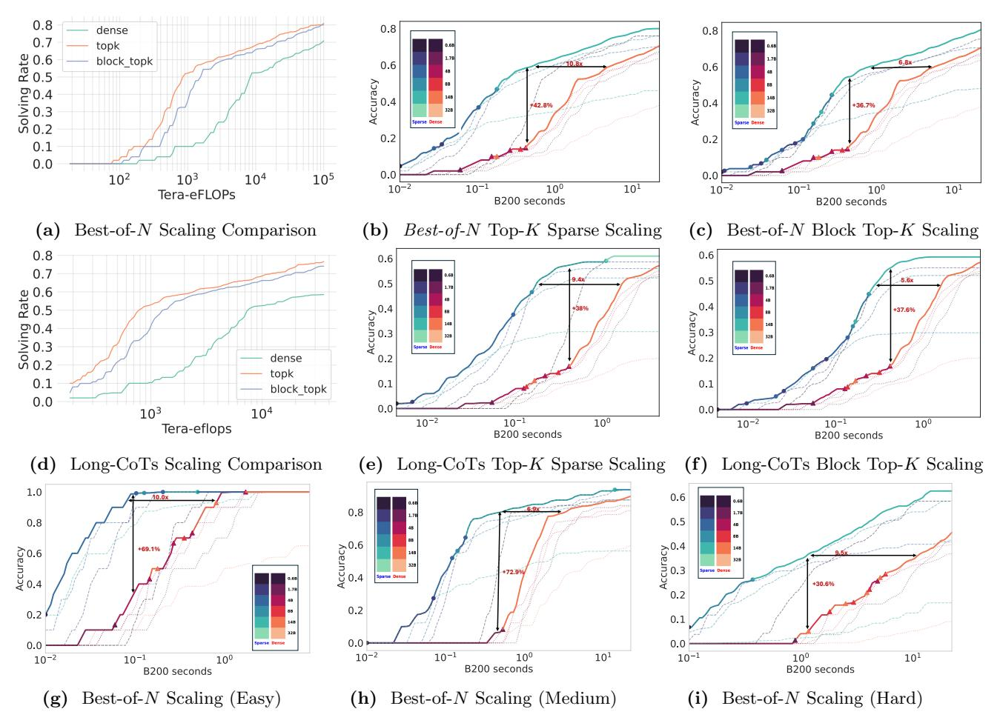
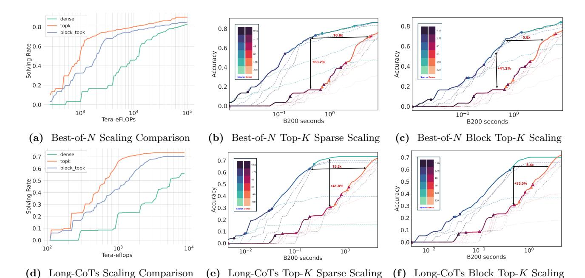
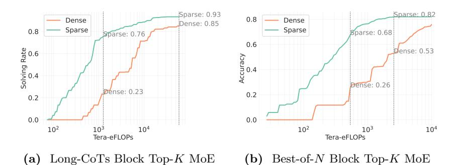
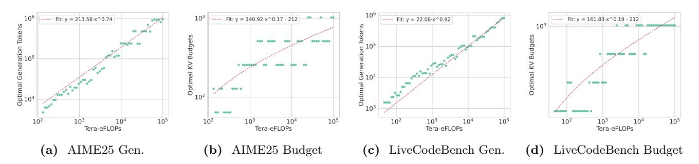

# <span id="page-23-0"></span>D Experimental Details

<span id="page-23-4"></span>In this section, we explain the details about our experiments.

<span id="page-24-0"></span>> **[图片提取文字 (无描述)]:**
> 0.8 0.8 0.8 0.7 topk 9.0 ge 8.0 ge block topk 0.6 0.6 Accuracy 0 Accuracy 0. 0.4 0.3 0.2 42.8% 0.2 0.2 0.1 0.0 0.0  $10^{3}$  $10^{5}$ 10<sup>2</sup> 104 10<sup>1</sup> 10° 10<sup>1</sup> 10-2  $10^{-1}$  $10^{-2}$  $10^{-1}$ 10° Tera-eFLOPs B200 seconds B200 seconds (a) Best-of-N Scaling Comparison Best-of-N Top-K Sparse Scaling Best-of-N Block Top-K Scaling (b) (c) 0.8 0.6 0.6 0.7 5.6x 0.5 0.5 9.0 2.0 Yate 0.4 0.3 0.2 4.0 8.0 8.0 9.0 +37.6% 0.4 0.3 0.2 dense topk 0.1 0.1 0.1 block\_topk 0.0 0.0 0.0  $10^{3}$ 104 10-2 10°  $10^{-1}$ 10-2 10-1 10° Tera-eflops B200 seconds B200 seconds Long-CoTs Scaling Comparison (e) Long-CoTs Top-K Sparse Scaling Long-CoTs Block Top-K Scaling (d) (f) 1.0 0.6 0.8 0.5 0.8 Accuracy 0.0 4.0 Accuracy 8.0 Accuracy 0.0 9.0 +30.6% 0.2 0.2 0.2 0.1 0.0 0.0  $10^{-2}$  $10^{-1}$ 10° 10<sup>1</sup>  $10^{-1}$ 10<sup>0</sup> B200 seconds 10<sup>1</sup> 10-2  $10^{-1}$ 10° B200 seconds B200 seconds Best-of-N Scaling (Easy) Best-of-N Scaling (Medium) Best-of-N Scaling (Hard) (g) (i)


Figure 21 LiveCodeBench Sparse Scaling. We evaluate SPARSE KINETICS for Qwen3-14B model using oracle top-k and block-top-k attention on the LiveCodeBench dataset. (a)(d) compare block-top-k and oracle top-k with dense scaling under Best-of-N and Long-CoTs TTS settings. (b)(e) show cost-accuracy trade-offs for top-k attention. (c)(f) show trade-offs for block-top-k attention. (g)(h)(i) compare the oracle top-k scaling for easy, medium and hard difficulty questions.

#### D.1 Estimate Cost, Optimal Generation Tokens, Accuracy and Solving Rate

When empirically measuring cost, one major challenge is the difficulty of controlling the actual generation length. Although it is possible to set an upper bound on the number of generated tokens, there is no guarantee that the model will utilize the full budget. For instance, in our Best-of-N experiments, we set the maximum number of generated tokens to 32,768, yet the average generation length was only 14K–16K tokens.

Furthermore, it is important to model the relationship between actual inference cost and performance metrics, such as accuracy in Long-CoTs or solving rate in Best-of-N. Relying solely on the maximum allowed generation length to estimate cost can substantially underestimate the efficiency of models that solve problems with much shorter responses—an ability that **may** reflect higher capability.

To address this challenge, we first sample S independent reasoning traces  $r_1, r_2, \ldots, r_S$  from model M on task T, with the maximum allowed number of tokens set to n. We slightly generalize Equation (4) as:

<span id="page-24-1"></span>
$$C_{\text{TTS}} = 2NP\mathbb{E}[L_{\text{out}}] + 2rNL_{\text{in}}D\mathbb{E}[L_{\text{out}}] + rND\mathbb{E}[L_{\text{out}}^{2}]$$

$$+ 2IL_{\text{in}}D\mathbb{E}[L_{\text{out}}] + IND\mathbb{E}[L_{\text{out}}^{2}]$$

$$= a\mathbb{E}[L_{\text{out}}] + b\mathbb{E}[L_{\text{out}}^{2}] + c,$$

$$(10)$$

where a, b, and c are constants determined by the model architecture and test-time strategies (e.g., the value of

<span id="page-25-1"></span>> **[图片提取文字 (无描述)]:**
> dense topk 0.8 0.8 8.0 block topk Solving Rate 7.0 9.0 Accuracy 0 7.0 9.0 0.6 Accuracy 0. 0.2 0.2 0.2 0.0 0.0  $10^{3}$ 104 105 10-1 10° 10-1 100 Tera-eFLOPs B200 seconds B200 seconds Best-of-N Scaling Comparison Best-of-N Top-K Sparse Scaling Best-of-N Block Top-K Scaling 0.7 0.7 0.7 5.4x block\_topk 0.6 0.6 0.6 2.0 Solving Rate 2.0 Solving Rate 2.0 Solving Rate 0.5 4.0 4.0 8.0 8.0 Accuracy 6.0 8.0 0.2 0.2 0.1 0.1 0.1 0.0 0.0 0.0  $10^{4}$ 10<sup>2</sup>  $10^{3}$ 10-2 10-1 10° 10-2 10-1 10<sup>0</sup> Tera-eflops B200 seconds B200 seconds (d) Long-CoTs Scaling Comparison (e) Long-CoTs Top-K Sparse Scaling (f) Long-CoTs Block Top-K Scaling


Figure 22 AIME25 Sparse Scaling. We evaluate SPARSE KINETICS for Qwen3-14B model using oracle top-k and block-top-k attention on the AIME25 dataset. (a)(d) compare block-top-k and oracle top-k with dense scaling under Best-of-N and Long-CoTs settings. (b)(e) show cost-accuracy trade-offs for oracle top-k attention. (c)(f) show

n). The expectations are estimated from the sampled traces, whose distribution is influenced by the model M, the token limit n, and the task T.

For Long-CoTs, we fix N=1 in Equation (10) and vary n. From the sampled traces, we estimate the accuracy (Pass@1), and compute the corresponding cost by substituting the empirical values of  $\mathbb{E}[L_{\text{out}}]$  and  $\mathbb{E}[L_{\text{out}}^2]$  measured under each n.

For Best-of-N, we fix  $n = 32{,}768$ , and estimate the solving rate (Pass@K) following the methodology of Brown et al. (2024). The corresponding cost is then computed by substituting N = K into Equation (10).

Similarly, we can estimate the cost for sparse attention models using Equations (8) and (9).

trade-offs for block-top-k attention.

Advanced control of generation lengths is an active area of research (Yang et al., 2025; Muennighoff et al., 2025; Ma et al., 2025a), but it is beyond the scope of this paper.

**Optimal Generation Tokens.** To address the question: Given a total cost budget C, what proportion should be allocated to generating longer responses, in contrast to enlarging model sizes or reducing attention sparsity?, we project the optimal number of generation tokens from the Pareto frontier (e.g., Figures 4 and 7b). Intuitively, each point on the frontier corresponds to a specific model and cost, but does not directly specify a generation length, since this can vary across tasks. Estimating the optimal generation length requires further analysis.

It is important to note that we do not consider inter-request resource scheduling strategies, such as early stopping or dynamic reallocation across requests (Fu et al., 2024), since we aim to ensure fairness across all inputs. Instead, the cost constraint C is interpreted as the maximum allowable cost per request (not the average), even if some requests achieve saturated accuracy below that threshold.

<span id="page-25-0"></span>Under this assumption, the effective cost at any point on the frontier is determined by the task that incurs the maximum cost. For previous scaling laws and SPARSE KINETICS studies, where the generation costs are linear to generated tokens, the optimal generation tokens is calculated with  $\max_{T \in \mathcal{T}} N_T \mathbb{E}[L_{\text{out}}]$ . For KINETICS, the optimal generation tokens is calculated with  $\max_{T \in \mathcal{T}} \sqrt{\mathbb{E}[L_{\text{out}}^2]}$  (we only analysis Long-CoTs). This adjustment accounts for the quadratic dependence of cost on output length, better measuring the cost allocated to generating longer responses.

<span id="page-26-1"></span>> **[图片提取文字 (无描述)]:**
> Sparse: 0.93 Sparse: 0.82 Dense 0.8 Dense Dense: 0.85 Sparse Sparse 0.8 Sparse: 0.68 parse: 0.76 0.6 Solving Rate 0 0 9 Dense: 0.53 Accuracy 0 70 Dense: 0.26 Dense: 0.23 0.2 0.2 0.0 0.0 10<sup>2</sup>  $10^{2}$  $10^{3}$  $10^{4}$  $10^{3}$  $10^{4}$ Tera-eFLOPs Tera-eFLOPs Long-CoTs Block Top-K MoE Best-of-N Block Top-K MoE (b)  $(\mathbf{a})$


Figure 23 AIME24 MoE Block Top-K scaling. we analyze Qwen3-30B-A3B and observe that Block Top-K yields notable gains. In low-cost regimes, it can enhance problem-solving rates by **42–53 percentage points**. Even in high-cost regimes, sparse models maintain an advantage of around **8 points**, while reaching these performance levels much earlier. These findings are consistent with other  $(0.6\sim32B)$  models.

<span id="page-26-2"></span>> **[图片提取文字 (无描述)]:**
> 106 ---- Fit: y = 213.58·x^0.74 ---- Fit: y = 140.92·x^0.17 - 212 Fit: y = 22.08·x^0.92 ---- Fit: y = 161.83·x^0.19 - 212 Generation 7 104 Optimal Gene 10<sup>2</sup> 10<sup>2</sup> Tera-eFLOPs Tera-eFLOPs Tera-eFLOPs Tera-eFLOPs AIME25 Budget LiveCodeBench Gen. AIME25 Gen. LiveCodeBench Budget


Figure 24 Tradeoff Between Generated Tokens and KV Budget. We characterize the tradeoff between increasing generation length and allocating a larger KV cache budget using Qwen3-8B. For AIME25 ((a)(b)) and LiveCodeBench ((c)(d)), we identify the optimal KV budget and generated tokens (defined as number of reasoning trials times the average generated tokens per trial) to achieve the highest problem-solving rate under every cost constraint C.

#### **D.2** Oracle Resource Allocation

We describe the procedure for identifying oracle resource allocations and establishing the Pareto frontier for sparse attention models in Algorithms 1 and 2, as a supplement to Section 4.1. Given a fixed cost constraint C, we perform a grid search over key parameters: KV budgets and either reasoning trials or maximum generation lengths.

Empirically, we sweep over KV budgets {32, 64, 128, 256, 512, 1024}; reasoning trials {1, 2, 4, 8, 16, 32} (with a reduced upper limit for the 14B and 32B models to save computation time); and generation lengths {2k, 4k, 6k, 8k, 10k, 12k, 14k, 16k, 18k, 20k, 22k, 24k, 26k, 28k, 30k, 32k}.

By varying the cost constraint C in Algorithms 1 and 2, we obtain the performance of sparse attention models under optimal resource allocation, as shown in Figures 8a to 8f and 9a to 9c.

#### <span id="page-26-0"></span>D.3 Top-K Attention and Block Top-K Attention

In this section, we explain the sparse attention algorithms discussed in the main paper, namely *Top-K Attention* and *Block Top-K Attention*.

During the decoding phase of a large language model (LLM), the self-attention mechanism computes a weighted average of past values as follows:

$$o = \operatorname{Softmax}\left(\frac{qK^{\top}}{\sqrt{d}}\right)V = wV, \quad q \in \mathbb{R}^{1 \times d}, \quad K, V \in \mathbb{R}^{n \times d}, \quad w \in \mathbb{R}^{1 \times n}, \tag{11}$$

where d is the head dimension and n is the context length. The key and value matrices are given by  $K = [k_1, k_2, \dots, k_n], V = [v_1, v_2, \dots, v_n],$  where each  $k_i, v_i \in \mathbb{R}^{1 \times d}$  are cached from previous decoding steps.

### Algorithm 1: Best-of-N oracle resource allocation under cost C

```
Data: Tasks \mathcal{T}, KV budgets \{B_1, \ldots, B_j\}, trial counts \{N_1, \ldots, N_i\}, cost limit C
    Result: Average of maximum accuracy per task under cost C
 1 AccumBestAcc \leftarrow 0 Count \leftarrow 0;
 2 for task T in T do
        for KV budget B_b do
 3
             Generate S \ge \max\{N_1, ..., N_i\} responses using B_b for task T;
 4
             for trial count N_a do
 5
                 compute cost c_{b,a}^{(T)};
 6
                 if c_{b,a}^{(T)} \leq C then
                     Compute accuracy Acc_{b,a}^{(T)} = Pass@N_a;\nif Acc_{b,a}^{(T)} > BestAcc then
\begin{vmatrix} BestAcc \leftarrow Acc_{b,a}^{(T)}; \end{vmatrix}
10
11
                 end if
12
            end for
13
        end for
14
        AccumBestAcc += BestAcc; Count += 1;
16 end for
17 AvgBestAcc = AccumBestAcc/Count;
18 return AvgBestAcc;
```

#### <span id="page-27-0"></span>**Algorithm 2:** Long-CoTs oracle resource allocation under cost C

```
Data: Tasks \mathcal{T}, KV budgets \{B_1, \ldots, B_j\}, gen. lengths \{n_1, \ldots, n_i\}, samples S, cost limit C
    Result: Average of maximum accuracy per task under cost C
 1 AccumBestAcc \leftarrow 0 Count \leftarrow 0;
 2 for task T in T do
        BestAcc \leftarrow 0;
 3
        for gen. length n_a do
 4
             for KV budget B_b do
 5
                 Generate S responses using (B_b, n_a); compute cost c_{ba}^{(T)};
 6
                 if c_{b,a}^{(T)} \leq C then
                    Compute accuracy Acc_{b,a}^{(T)} = Pass@1;\nif Acc_{b,a}^{(T)} > BestAcc then
\begin{vmatrix} BestAcc \leftarrow Acc_{b,a}^{(T)}; \end{vmatrix}
 8
 9
10
11
                 end if
12
            end for
13
        end for
14
        AccumBestAcc += BestAcc; Count += 1;
15
16 end for
17 AvgBestAcc = AccumBestAcc/Count;
18 return AvgBestAcc;
```

**Top-**K Attention. Top-K Attention is a sparsification method where only the K most relevant tokens (i.e., those with the highest attention scores) are selected to compute the output. Formally, instead of computing the full softmax, we define a sparse attention weight vector:

$$w_i = \begin{cases} \frac{\exp(s_i)}{\sum_{j \in \mathcal{I}_K} \exp(s_j)} & \text{if } i \in \mathcal{I}_K, \\ 0 & \text{otherwise,} \end{cases} \quad \text{where} \quad s_i = \frac{qk_i^\top}{\sqrt{d}}, \quad \mathcal{I}_K = \text{TopK}_K(s), \tag{12}$$

Here,  $\mathcal{I}_K$  denotes the indices of the top K attention scores  $s_i$ . By masking out the less important positions, this approach reduces the computational and memory cost of attention from  $\mathcal{O}(n)$  to  $\mathcal{O}(K)$ , where  $K \ll n$ .

**Block Top-***K*. Block Top-*K* Attention is a block-level sparse attention mechanism. Instead of selecting individual tokens based on attention scores, this method selects entire blocks of tokens, thereby reducing the number of attention computations.

Specifically, assume the full sequence of n keys is divided into  $m = \frac{n}{\text{BLOCK\_SIZE}}$  consecutive blocks, each of size BLOCK\_SIZE:

$$K = [k_1, \dots, k_n] \to \{K_1, K_2, \dots, K_m\}, \quad K_i \in \mathbb{R}^{\text{BLOCK\_SIZE} \times d}$$

For each block  $K_i$ , we first compute the average key vector:

$$\bar{k}_i = \frac{1}{\text{BLOCK\_SIZE}} \sum_{j=1}^{\text{BLOCK\_SIZE}} k_{i,j}$$

Next, we compute the attention score between the query q and each block's average key:

$$s_i = \frac{q\bar{k}_i^{\top}}{\sqrt{d}}, \quad \text{for } i = 1, 2, \dots, m$$

We then select the top  $K' = \frac{K}{\text{BLOCK\_SIZE}}$  blocks based on the scores  $s_i$ , denoted by the index set  $\mathcal{J}_{K'} = \text{TopK}_{K'}(s)$ . Attention is computed only over the tokens within the selected blocks. The sparse attention weights are defined as:

$$w_i = \begin{cases} \frac{\exp(s_i)}{\sum_{j \in \mathcal{I}_K} \exp(s_j)} & \text{if } i \in \mathcal{I}_K \subseteq \text{tokens in selected blocks,} \\ 0 & \text{otherwise} \end{cases}$$

For both algorithms, K is the KV budget. For GQA, we conduct an average pooling across all the query heads in a group, ensuring that the total number of retrieved key-value vectors does not exceed the allocated KV budget.

#### <span id="page-28-0"></span>**E** Extended Related Work

Efficient Attention. Sparse attention (Kitaev et al., 2020; Zandieh et al., 2023; Chen et al., 2021, 2024; Zhang et al., 2023; Xiao et al., 2024; Yuan et al., 2025; Nawrot et al., 2025; Child et al., 2019; Li et al., 2024; Cai et al., 2024; Mazaré et al., 2025) has been comprehensively studied to reduce the attention cost when processing long sequeces. In parallel, approaches like FlashAttention (Dao et al., 2022; Dao, 2023) accelerate attention by maximizing hardware efficiency. To address the quadratic complexity of standard attention, researchers have also explored linear attention architectures (Gu and Dao, 2023; Gu et al., 2022; Katharopoulos et al., 2020; Choromanski et al., 2020). Additionally, quantization and low-precision methods (Liu et al., 2024c; Hooper et al., 2024; Lin et al., 2024b) have been broadly applied for improving inference efficiency.

Efficient Inference. Orca (Yu et al., 2022), vLLM (Kwon et al., 2023), and SGLang (Zheng et al., 2024) are widely adopted to enhance the efficiency of LLM serving. Our analysis builds on the practical designs and implementations of these systems. In parallel, speculative decoding (Leviathan et al., 2023; Chen et al., 2023; Miao et al., 2023; Sadhukhan et al., 2024) has been proposed to mitigate the memory-bandwidth bottleneck during LLM decoding. Additionally, model compression and offloading (Dettmers et al., 2022; Lin et al.,

[2024a;](#page-14-18) [Svirschevski et al.,](#page-16-15) [2024;](#page-16-15) [Sheng et al.,](#page-15-19) [2023;](#page-15-19) [Frantar et al.,](#page-13-17) [2022\)](#page-13-17) techniques are playing a crucial role in democratizing LLM deployment.

Efficient Test-time Strategies. Optimizing reasoning models to generate fewer tokens has been shown to directly reduce inference-time cost [\(NovaSky-Team,](#page-15-8) [2025;](#page-15-8) [Arora and Zanette;](#page-12-7) [Ma et al.,](#page-15-14) [2025b\)](#page-15-14). Recent work such as CoCoNut [\(Hao et al.,](#page-13-18) [2024\)](#page-13-18) and CoCoMix [\(Tack et al.,](#page-16-16) [2025\)](#page-16-16) explores conducting reasoning in a latent space, thereby reducing decoding time. Methods like ParScale [\(Chen et al.,](#page-12-19) [2025b\)](#page-12-19), Tree-of-Thoughts [\(Yao](#page-17-12) [et al.,](#page-17-12) [2023b\)](#page-17-12), and Skeleton-of-Thoughts [\(Ning et al.,](#page-15-20) [2023\)](#page-15-20) aim to improve efficiency by enabling parallel reasoning. Architectural innovations such as CoTFormer [\(Mohtashami et al.,](#page-15-13) [2023\)](#page-15-13) further enhance efficiency by adaptively allocating computational resources across tokens. Efficient reward-model-based [\(Wu et al.,](#page-16-0) [2024;](#page-16-0) [Snell et al.,](#page-15-0) [2024;](#page-15-0) [Sun et al.,](#page-16-17) [2024c\)](#page-16-17) test-time scaling algorithms are also comprehensively studied.