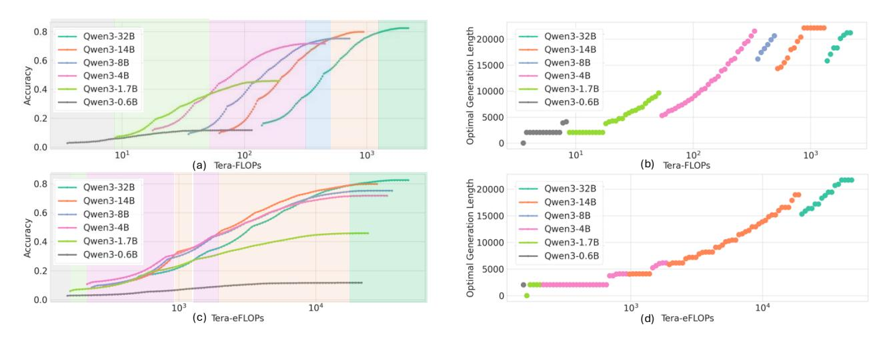
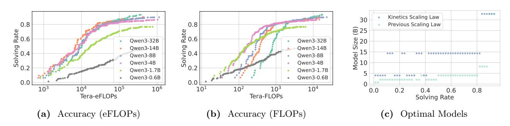
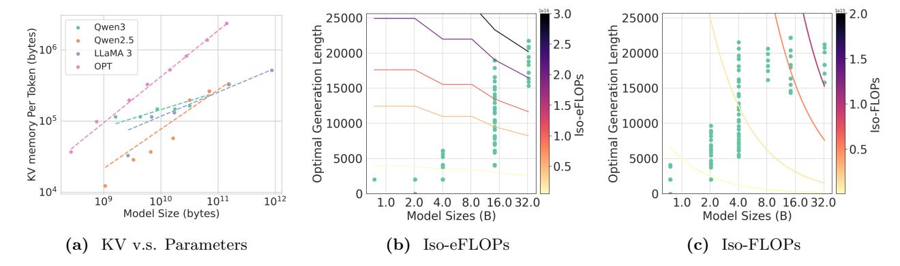
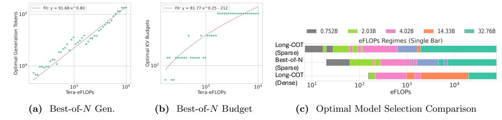
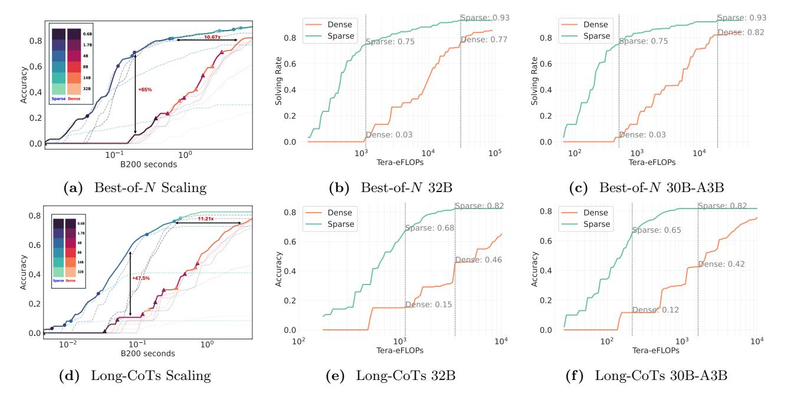
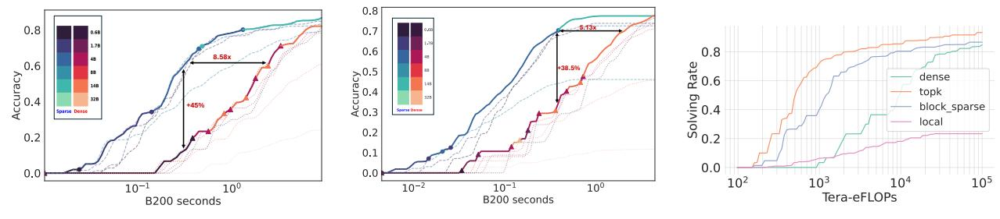
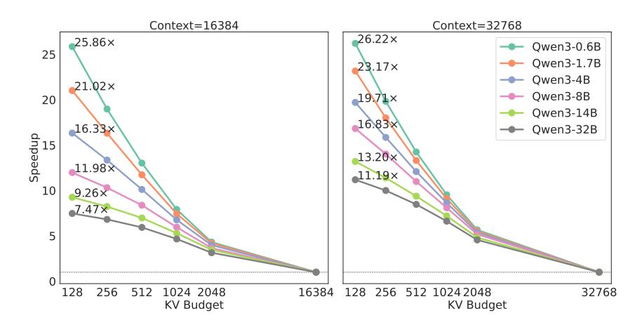

# 3 Rethinking Test-time Scaling Laws

In Section 3.1, we first introduce KINETICS, derived from empirical investigations across the Qwen3 model series. Then, we explore the underlying reasons for the divergence between KINETICS and prior scaling laws through an Iso-Cost analysis in Section 3.2.

#### 3.1 Kinetics

In this section, We study the scaling behavior of the Qwen3 (Yang et al., 2024a,b) considering the following problem:

For each fixed maximum inference budget, eFLOPs per question, what is the Pareto frontier of achievable accuracy across different LLM configurations?

With the refined cost model in Section 2, we first formulate the objective of the test-time scaling law, focusing on the tradeoff between model size and the number of generated tokens.

Kinetics (for dense models). Given a problem instance T and a total inference budget C, our goal is to explore the optimal tradeoff between two key factors: the choice of language model M, and the number of reasoning trials N or the maximum generation length n. More precisely,

$$(N, n)_*, M_* = \arg\max_{(N, n), M} \operatorname{Acc}(N, n, M; T) \quad \text{s.t.} \quad C_{\text{TTS}}(N, n, M; T) \le C$$
 (5)

Let Acc(N, n, M; T) denote the problem-solving rate of model M on task T, using N reasoning trials, each with a maximum reasoning length of n.

 $^2$ For LiveCodeBench, we sample 50 problems from the v5 subset (24 hard, 16 medium, 10 easy).

&lt;sup>3For fairness, we do not schedule resources across tasks, but consider a resource upper bound for all the tasks.

> **[图片提取文字 (无描述)]:**
> Length 20000 0.8 — Owen3-32B Qwen3-32B — Qwen3-14B — Qwen3-14B Optimal Generation | 15000 | 5000 | 0 — Qwen3-8B — Qwen3-8B Accuracy 0 Qwen3-4B — Qwen3-4B Qwen3-1.7B Qwen3-1.7B Qwen3-0.6B — Qwen3-0.6B 0.2 0.0 (a) Tera-FLOPs (b) Tera-FLOPs 101 103 103 101 Length 20000 — Qwen3-32B Qwen3-32B — Qwen3-14B — Qwen3-14B Optimal Generation L 2000 2000 2000 --- Qwen3-8B — Qwen3-8B Accuracy 0. — Qwen3-4B — Qwen3-4B Qwen3-1.7B — Qwen3-1.7B Qwen3-0.6B — Qwen3-0.6B 0.2 0.0 103 104  $10^{3}$  $10^{4}$ (c) Tera-eFLOPs (d) Tera-eFLOPs

Figure 4 AIME24 Pareto Frontier (Long-CoTs). Evaluations of Qwen3 series models. By controlling the maximum allowed generation lengths, we control the incurred inference cost in eFLOPs (ab for our scaling law) or FLOPs (cd for previous scaling law) and measure the accuracy (Pass@1) in AIME24. The optimal model is marked with different colors in (ac). The optimal generation length is presented in (bd).

> **[图片提取文字 (无描述)]:**
> 000000 Kinetics Scaling Law 30 0.8 0.8 Previous Scaling Law <u>@</u> 25 Rate 6.0 Rate 9.0 Size 02 Qwen3-32B Qwen3-32B Solving 0.4 Solving 0.4 Qwen3-14B Qwen3-14B Model 10 0.00 ..................... Owen3-8B Owen3-8B Owen3-4B Owen3-4B 0000 Qwen3-1.7B Owen3-1.7B Owen3-0.6B Owen3-0.6B 0.0  $10^{3}$ 105 106  $10^{2}$  $10^{3}$  $10^{4}$  $10^{4}$  $10^{1}$ 0.2 0.8 0.0 0.4 0.6 Tera-eFLOPs Tera-FLOPs Solving Rate Accuracy (eFLOPs) Accuracy (FLOPs) Optimal Models  $(\mathbf{a})$

Figure 5 AIME24 Pareto Frontier (Best-of-N). We control the incurred inference cost in eFLOPs (a) or FLOPs (b) and measure the solving rate (coverage) in AIME24 for various models by varying the maximum allowed number of reasoning trials. We use the curve envelopes to project the optimal models in (c).

In the Long CoTs scenario, where  $N_T = 1$ , we vary  $n_T$  to evaluate the model performance under different costs. We present our results in Figure 4. KINETICS highlights two important findings compared to the previous scaling law, which focused on merely FLOPs:

- Efficiency of small models is overestimated. As shown in Figures 3 and 4 (ac), smaller models, despite having fewer parameters, are not as efficient as commonly assumed. For example, the 14B model outperforms both the 4B and 8B models even at low accuracy levels (e.g., below 40%), and the 0.6B model only lies on the Pareto frontier in regions where accuracy is negligible. In contrast, under previous scaling laws, models of all sizes span a meaningful portion of the Pareto frontier.
- Extending CoTs is more effective than enlarging parameters only for models beyond a critical scale (empirically, 14B). Kinetics reveals that under constrained compute budgets, allocating resources to model scaling yields greater returns than increasing CoT length. As illustrated in Figure 4 (bd), only the 14B and 32B models benefit from generating CoTs longer than 10K tokens; for smaller models (e.g., 1.7B and 4B), switching to a larger model is more advantageous when  $L_{\rm out} < 5 {\rm K}$ . This suggests that, in practice, most of the available compute should be devoted to increasing model size rather than lengthening generations (Figure 4 (d)). In contrast, previous scaling laws assumed that longer CoTs provided consistent benefits across all model sizes, recommending model scaling only after CoT performance gains had plateaued.

In the Best-of-N setting, we fix the maximum number of generated tokens at  $n_T$ , and vary the number of reasoning trials N to evaluate the problem-solving rate (i.e., the probability that at least one trial produces a correct answer). We have similar observations in Figures 5a to 5c. Under the previous scaling laws (Figure 5b),

> **[图片提取文字 (无描述)]:**
> 3.0 2.0 25000 25000 Qwen3 ength 20000 ength 20000 KV memory Per Token (bytes)
> 0
> 0
> 0 Qwen2.5 LLaMA 3 OPT -2.0 ഗ്ര ig 15000 FLOPs 15000 9 10000 10000 Optimal Optimal 0.5 5000 5000 0.5  $10^{4}$ 109 1010 1011 1012 2.0 4.0 8.0 16.0 32.0 2.0 4.0 8.0 16.0 32.0 Model Size (bytes) Model Sizes (B) Model Sizes (B) KV v.s. Parameters Iso-eFLOPs Iso-FLOPs

Figure 6 Explanation of the New Scaling Law. Left: Analysis across four LLM families reveals a consistent trend of disproportionately slower KV memory growth relative to model size. For the Qwen3 series in particular, doubling model parameters results in only a 1.18× increase in KV cache size. Middle and Right: We compare the Iso-Cost landscapes under the proposed cost model (b) and the traditional model (c).

the most cost-effective strategy to achieve high accuracy is to apply repeated sampling using smaller models. Kinetics (Figure 5a) reveals that deploying a 14B model with fewer reasoning trials is more efficient. We also observe a critical size of 14B. For models smaller than 14B, increasing compute is best allocated toward model scaling rather than additional trials. For models at or above 14B, however, further computation is more effectively spent on increasing the number of reasoning trials, up to diminishing returns.

The above observations are consistent in DeepSeek-R1-Distilled-Qwen series, while the critical model size becomes 7B. Experiments on AIME25 and LiveCodeBench as well as the analysis of DeepSeek-R1-Distilled-Qwen are presented in Appendix B.

### 3.2 Iso-Cost Study

We attribute the above divergence between Kinetics and previous scaling laws to two reasons.

- Disproportionation between KV memory size D and model parameters P. Smaller models tend to require significantly more KV cache relative to their parameter size. For example, Qwen3-0.6B demands 3.5GB of KV cache to store 32K tokens, despite the model itself occupying only 1.2GB. In contrast, Qwen3-32B uses just 8GB of KV cache for the same sequence length. Empirically, doubling model parameters results in only a 1.18× increase in KV cache size. As shown in Figure 6a, this phenomenon is consistently observed across model families such as OPT (Zhang et al., 2022) (1.55×), Qwen2.5 (Yang et al., 2024b) (1.46×), and LLaMA3 (Grattafiori et al., 2024) (1.27×).
- Shift from linear to quadratic cost model. Under this revised model, increasing generation length incurs a substantially higher cost than scaling model size; consequently, the tradeoff between model capacity and token budget shifts meaningfully. For instance, under the linear LP model, the cost of generating 8K tokens with a 14B model (which is usually insufficient to solve complex tasks) is treated as equivalent to generating 24K tokens with a 4B model (sufficient to complete most tasks). However, under the  $L^2D$  model, the same 14B@8K generation is only comparable in cost to a 4B@9K generation. This tighter bound makes it much harder for smaller models to compensate for their limited capacity through extended generation alone. Thus, only if the gap in model capacities is small enough (e.g., 32B only improves the accuracy by 3% on AIME24 compared to 14B), the benefits of extending generation length might be more effective than directly enlarging model parameters.

Figures 6b and 6c show an Iso-Cost analysis comparing two cost models. Under Kinetics, the cost grows quadratically with  $L_{out}$ , while the KV cache scales sub-linearly with model parameters P. As a result, when total budget is low, the Iso-eFLOPs contours tend to stretch horizontally, favoring larger model sizes over longer generation lengths. This implies that increasing model size is a more efficient use of resources than generating longer outputs. In contrast, the traditional FLOPs-based model leads to steeply vertical contours, encouraging longer generation before increasing model size.

> **[图片提取文字 (无描述)]:**
> ---- Fit: y = 91.68·x^0.80 ---- Fit: y = 81.77·x^0.25 - 212 Tokens 105 Optimal Generation 14.33B 32.76B eFLOPs Regimes (Single Bar) Long-COT Optimal Optimal (Sparse) 0.0 ... ..... .. Best-of-N (Sparse) Long-COT . .. (Dense) 102  $10^{3}$ 104  $10^{3}$ 104  $10^{3}$ 104 eFLOPs Tera-eFLOPs Tera-eFLOPs Best-of-N Gen. Best-of-N Budget Optimal Model Selection Comparison

Figure 7 (ab) Tradeoff Between Generated Tokens and KV Budget. We empirically investigate how to balance the tradeoff between generating more tokens and allocating a larger KV cache budget, which may yield more accurate but potentially shorter outputs. Using Qwen3-8B as a representative model, we fit curves to characterize this tradeoff. For Best-of-N, we find that for every doubling of the total compute cost, the optimal KV budget increases by a factor of 1.18×, while the total number of generated tokens increases by 1.74×. When the KV budget is small, the computational cost is dominated by model parameter-related computation rather than KV cache access. We incorporate a model-specific constant (212) into the fitted curve to account for this effect. (c) Optimal Model Selection with Sparse Attention. Compared to the scaling law for the dense models, small models (0.6B, 1.7B, 4B) are more effective with sparse attention. In other words, they occupy more space in the Pareto Frontier (Figure 8a).

## 4 Test-time Scaling with Sparse Attention

Based on our findings in Section 3, we propose a new scaling paradigm centered on sparse attention. We begin by presenting a simple approach for identifying oracle resource allocation in sparse attention models, which we use to plot the Pareto frontier in Section 4.1. We then analyze the resulting changes in the scaling law and show that sparse attention models with massive tokens generated at test time, no matter sequentially via Long-CoTs or in parallel via Best-of-N, can lead to significantly higher problem-solving rates in Section 4.2.

### 4.1 Oracle Resource Allocation with Sparse Attention Models

**Problem statement.** Let  $\mathcal{A}$  denote the corresponding sparsity algorithms (e.g., top-k, block top-k and local. Our goal is to explore the optimal tradeoff among three factors: model M, KV budget B, and number of trials, and the maximum generation length (N, n). Specifically,

$$(N, n)_*, M_*, B_* = \arg\max_{(N, n), M, B} \operatorname{Acc}(N, n, B, A, M; T)$$
 s.t.  $C_{\text{TTS}}(N, n, B, A, M; T) \le C$  (6)

The cost function  $C_{\text{TTS}}$  differs from the one in Equation (4) as it incorporates sparse attention mechanisms (which reduces the quadratic term  $L^2D$  back to a linear term LBD). This modified cost model is discussed in detail in Appendix A.2.

**Oracle resource allocation:** We present a method to obtain the optimal schedule between generation parameters (N, n) and the KV budget B for each task, establishing an upper bound on achievable performance and enabling analysis of the core tradeoff between TTS strategies and sparsity. We begin by solving the subproblem for each individual task T:

$$\max \quad \operatorname{Acc}(N_T, n_T, B_T, \mathcal{A}, M; T) \quad \text{s.t.} \quad C_{\text{TTS}}(N_T, n_T, B_T, \mathcal{A}, M; T) \le C \tag{7}$$

Empirically, we discretize the search space. For instance, in Best-of-N, we discretize the space of N and B by producing a search grid:

$$G = \{N_0, N_1, \dots, N_i\} \otimes \{B_0, B_1, \dots, B_j\}$$

For each pair  $(N_a, B_b) \in G$ , we compute the corresponding cost  $C_{T,(a,b)}$  and accuracy  $Acc_{T,(a,b)}$ . We use  $(N_T, B_T) \in G$  which maximizes the accuracy under the cost constraint C as an approximation for Equation (7). By combining the optimal configurations  $(N_T, B_T)$  for all tasks T, we obtain a solution to the overall problem in Equation (6). Similar discretizations also applies for Long-CoTs. Thus we find the oracle resource allocation. We present how we obtain the oracle resource allocation in detail in Appendix D.2.

> **[图片提取文字 (无描述)]:**
> Sparse: 0.93 Sparse: 0.93 Dense Dense Dense: 0.82 Sparse Sparse 0.8 10.67x 0.8 Dense: 0.77 Sparse: 0.75 0.8 Sparse: 0.75 1.78 48 Solving Rate 0 0 7 0 9 0 Solving Rate 0.0 9.0 Accuracy 0.0 4.0 +65% Sparse Dense 0.2 0.2 0.2 Dense: 0.03 Dense: 0.03 0.0 0.0 105 102 104  $10^{3}$ 104 103  $10^{-1}$ 10° Tera-eFLOPs Tera-eFLOPs B200 seconds Best-of-N Scaling Best-of-N 30B-A3B (b) Best-of-N 32B Sparse: 0.82 Sparse: 0.82 0.8 0.8 Dense Dense 0.8 Sparse Sparse Sparse: 0.68 Sparse: 0.65 0.6 0.6 0.6 Accuracy 0. Accuracy 0 70 Accuracy 0 Dense: 0.46 Dense: 0.42 +47.5% 0.2 0.2 0.2 Dense: 0.15 Dense: 0.12 0.0 0.0  $10^{2}$ 102  $10^{4}$ 104  $10^{3}$ 103 10-2  $10^{-1}$ 100 Tera-eFLOPs Tera-eFLOPs B200 seconds Long-CoTs Scaling Long-CoTs 32B Long-CoTs 30B-A3B

Figure 8 Sparse Attention Boosts Test-Time Scaling (AIME24). In (a)(d), we show that sparse attention models significantly improve the cost-accuracy trade-off under both inference strategies, ultimately achieving higher problem-solving rates at lower computational budgets. In (b)(e), we analyze individual model performance (32B) and observe that sparse attention provides notable gains. In low-cost regimes, it can enhance problem-solving rates by 50-60 percentage points. Even in high-cost regimes, sparse models maintain an advantage of around 5 points, while reaching these performance levels much earlier. In (c)(f), we show consistent conclusions for MoE models (Qwen3-30B-A3B). We use an oracle algorithm  $\mathcal{A} = \text{top-}k$  here to present an upper bound of sparse attention.

### 4.2 Sparse Kinetics

Sparse attention fundamentally reshapes Kinetics and significantly enhances the scalability of TTS. We show Sparse Kinetics with an oracle algorithm  $\mathcal{A} = \text{top-}k$  to demonstrate the extraordinary potential of sparse attention. We present three important findings below.

- Sparse attention significantly enhances problem-solving performance. As shown in Figures 8a, 8b, 8d and 8e, compared to dense baselines, for both of the inference strategies and models of various sizes, sparse attention models improve problem-solving rates by up to 60 points in the low-cost regime and over 5 points in the high-cost regime. From an efficiency perspective, dense models require over 10× more eFLOPs to match the same solving rate. These findings underscore sparse attention as a key enabler for unlocking the full benefits of test-time scaling.
- Sparse attention becomes increasingly valuable in high-cost scenarios. We investigate the tradeoff between KV budget B and generation tokens. For Best-of-N, we analyze how the optimal KV budget and the number of generated tokens scale with cost across N reasoning trials. As shown in Figures 7a and 7b, Our analysis reveals a consistent trend: allocating additional compute toward generating more tokens is generally more effective than expanding the KV cache. In Best-of-N frontier, doubling the cost leads to only a 1.18× increase in KV budget, compared to a 1.74× increase in total generated tokens.
- Sparse attention reshapes Kinetics. As shown in Figure 7c, applying sparse attention significantly improves the efficiency of smaller models (0.6B, 1.7B, 4B), allowing them to re-emerge on the Pareto frontier across a broader range. Sparse attention reduces attention cost from a quadratic cost term  $(L^2D)$  to a linear one (LBD), making it negligible or comparable when compared to the cost of computing with model parameters (LP).

Further results for AIME25 and LiveCodeBench are presented in Appendix C, where we also ablate the performance of sparse attention on tasks with different difficulties.

**Discussion:** MoE models. The emerging MoEs reduce the computation cost by a factor of  $10 \times$  to  $20 \times$  (Dai

> **[图片提取文字 (无描述)]:**
> 0.8 0.8 0.6 0.8 8.58x 0.6 l Bate 8.0 +38.5% dense topk . 1 0.4 +45% block\_sparse Sparse Dense local 0.2 0.2 0.2 0.1 0.0  $10^{5}$  $10^{2}$  $10^{3}$  $10^{4}$  $10^{-1}$ 100 10-2 10-1 10° Tera-eFLOPs B200 seconds B200 seconds

(a) Best-of-N Scaling (block top-k)

**(b)** Long-CoTs Scaling (block top-k)

(c) Sparse Algorithm Comparison

Figure 9 Block top-k attention. In (a) and (b), we illustrate the optimality of block top-k sparse attention in terms of TTS on AIME24 dataset. Although upper bounded by the oracle top-k attention performance, block top-k achieves a good trade-off between effectiveness and tractability. Although easy to implement, the performance of local attention is poor (c).

et al., 2024; Yang et al., 2025; AI@Meta, 2025), further exacerbating the bottleneck in attention. We present the advantages of sparse scaling on Qwen3-30B-A3B in Figures 8c and 8f.

### 5 Experimental Validation

In this section, we demonstrate the practicality of SPARSE KINETICS through block top-k attention. We first show the scaling of block top-k attention, which is even comparable to the oracle top-k attention. Then we report empirical improvements in task throughput (number of tasks performed per unit time) using our block-sparse implementation. In addition, we conduct ablation studies with alternative sparsification strategies, such as local attention, to highlight the importance of the KV selection mechanism.

#### 5.1 Block Top-k Attention

While top-k attention offers attractive theoretical scaling, it is computationally intractable in practice. stead, we adopt block topk attention for two key reasons. First, it exploits temporal locality in attention patterns (Sun et al., 2024b) to retrieve semantically related key-value (KV) blocks, reaching high accuracy. Second, its localized retrieval is hardware-efficient and integrates seamlessly with paged attention (Kwon et al., 2023), enabling high-throughput de-

> **[图片提取文字 (无描述)]:**
> Context=16384 Context=32768 26.22× 25.86× Qwen3-0.6B 25 Qwen3-1.7B 23.17× Qwen3-4B 21.02× Qwen3-8B 19.71× 20 Qwen3-14B 16.83× 16.33× Qwen3-32B Speedup Speedup 13.20× 11.98× 10 9.26× 128 256 512 1024 2048 16384 128 256 512 1024 2048 32768 KV Budget KV Budget

Figure 10 Throughput improvement with block top-k attention.

coding. Block top-k attention is proved efficiently implementable in massive prior work (Tang et al., 2024; Sun et al., 2024a; Xu et al., 2025; Zaheer et al., 2020; Yuan et al., 2025). In practice, we compute a representative vector for each KV block by averaging its key vectors, and use these to score the relevance of blocks to each query. Importance scores are shared across query heads within a group, following the Grouped Query Attention (GQA) scheme. The definition of block top-k attention is introduced in detail in Appendix D.3.

**Performance and Scaling. First,** as shown in Figures 9a and 9b, block top-k attention demonstrates comparable scaling to the oracle top-k attention, improving accuracy by 45 points in the low-cost regime and achieving equivalent accuracy while using  $8.58 \times$  fewer resources compared to dense attention. More accuracy evaluations across various benchmarks (including with MoE models) are presented in Appendix C. **Second**, we compare block top-k with local attention in Figure 9c. Although local attention is more efficient due to its

static sparsity pattern, it performs significantly worse. Its poor test-time scaling prevents it from outperforming dense attention except in very low-accuracy regimes.

### 5.2 Implementation and Empirical Results

Implementation. To demonstrate the practical efficiency gain of sparse attention, we build our attention backend on Flashinfer [\(Ye et al.,](#page-17-8) [2025\)](#page-17-8) and torch compile[4](#page-10-0) . Alongside the paged KV cache, we introduce an auxiliary data structure to store block-level average key vectors. The KV block size is chosen such that the memory load from the block-average vectors and the selected top-k KV blocks remains balanced. This design enables sub-quadratic KV loading cost as the number of reasoning tokens increases. Rather than constructing a full end-to-end serving system, we estimate the overall model execution time using per-layer latency and throughput measurements [\(He and Zhai,](#page-13-13) [2024\)](#page-13-13).

Results. We illustrate the benefit of block top-k attention across different model sizes on H200 nodes (8 GPUs per node) with batch size and context length of (4096, 16384) and (2048, 32768). Here we assume uniform workload of tasks with similar context lengths and generation lengths. As shown in Figure [10,](#page-9-2) block top-k attention substantially improves inference throughput, particularly for smaller models. For instance, the Qwen3-0.6B model achieves a 25.9 ∼ 26.2× increase in throughput. This improvement reflects the growing inefficiency of dense attention at longer contexts, which disproportionately affects smaller models.

The substantial improvement in throughput highlights the potential for corresponding gains in task-level throughput, when appropriately co-designed with inference systems and test-time strategies. We leave this direction for future work.

