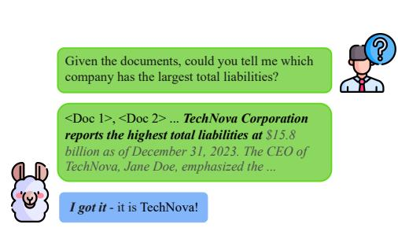

# 1 Introduction

Large language models (LLMs) demonstrate remarkable capabilities across diverse tasks, yet their indiscriminate processing of entire input contexts creates inefficiencies. LLMs process every token with equal computational priority, regardless of its actual relevance to the task [\[25\]](#page-11-0). This brute-force approach leads to fundamental inefficiencies: models waste computation on irrelevant context while simultaneously struggling with the "lost-in-the-middle" phenomenon, where critical information becomes diluted in lengthy inputs [\[16,](#page-10-0) [6\]](#page-9-0). For instance, when answering a simple factual question, models may process an entire document even after gathering sufficient information in the first few sentences.

> **[图片提取文字 (无描述)]:**
> Given the documents, could you tell me which company has the largest total liabilities? <Doc 1>, <Doc 2> ... TechNova Corporation reports the highest total liabilities at \$15.8 billion as of December 31, 2023. The CEO of TechNova, Jane Doe, emphasized the ... I got it - it is TechNova!

Figure 1: Our method enables language models to perform early termination by detecting sufficiency signals in key attention heads, reducing the amount of processed content while preserving performance.

The human cognitive system offers an instructive contrast. When solving problems, people dynamically assess information sufficiency – we stop processing once we gather enough evidence, ignoring redundant details [\[4\]](#page-9-1). On the other hand, LLMs process entire contexts even after acquiring sufficient

∗ ruoyu.xie@duke.edu

information. This raises a question: "Can we enable LLMs to self-assess context sufficiency and terminate early without compromising accuracy?"

In this work, we present dynamic context cutoff, which enables LLMs to identify when they have acquired sufficient information for a task. Our key insight emerges from analysis of model internals: specific attention heads in transformer layers exhibit strong sensitivity to information sufficiency ([§2.2\)](#page-3-0). By monitoring these "context sufficiency heads" with lightweight classifiers, we enable models to make early stopping decisions while improving performance.

Context compression offers a promising avenue for improving inference efficiency in LLMs. However, existing compression methods typically operate by predefining a target compression rate, which introduces the risk of information loss. For instance, the LLMLingua family [\[8,](#page-10-1) [10,](#page-10-2) [18\]](#page-10-3) employs a small language model to filter out unimportant tokens, reducing context based on a fixed compression target. These methods impose predefined compression rates, enforcing a *one-size-fits-all* reduction regardless of content complexity. Similarly, retrieval-augmented generation (RAG) methods predefine a fixed number of top-k retrieved documents. Although RAG operates differently by retrieving external documents rather than compressing existing input, we include it for comprehensive comparison as it has appeared in the baselines of previous work on context compression [\[10,](#page-10-2) [18\]](#page-10-3). We refer to both compression-based approaches and RAG as *static* methods, as they apply uniform compression ratios (e.g., 50% compression results in every input being compressed to exactly half its length). In contrast, our method is *dynamic and context-adaptive* – different inputs receive different amounts of compression based on their information density, with actual compression determined by each input's specific content rather than a predetermined target. This approach enables models to process only the minimal context needed, expanding it only when necessary, creating a new paradigm where *efficiency emerges naturally from the model's own understanding* rather than from external compression heuristics, as demonstrated in Figure [1.](#page-0-0)

We conduct comprehensive experiments to evaluate our approach across six QA datasets (context lengths 0.5K–40K tokens) and three model families (LLaMA, Qwen, Mistral; 1B–70B parameters). We find that LLMs inherently encode context sufficiency signals in specific attention heads. Notably, our method reveals behaviors that align well with the scaling properties of modern LLMs: while smaller models (1B–8B parameters) require explicit sufficiency detection to achieve competitive efficiency, larger models (14B+) exhibit emergent self-assessment capabilities through simple prompting. Our method achieves a 3.4% average accuracy improvement with 1.33× token reduction, outperforming state-of-the-art context compression methods. Our in-depth analysis explores the sensitivity to classification thresholds, the efficiency gains from different chunking strategies, and the model-specific nature of context sufficiency, providing valuable insights into context sufficiency.

