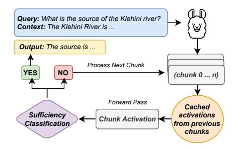
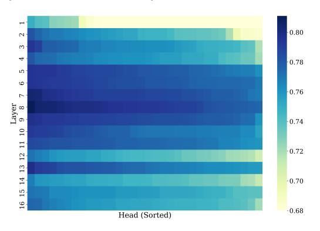

# 2.1 Problem Formulation

Let  $\mathcal{M}$  denote a pre-trained language model. Given an input textual context  $\mathbf{C}$ , we process  $\mathbf{C}$  sequentially from left to right by partitioning it into an ordered sequence of chunks  $\{\mathfrak{s}_j\}_{j=1}^m$ , where each chunk  $\mathfrak{s}_j$  comprises a contiguous subset of  $\mathbf{C}$  (e.g., a sentence or a fixed percentage of the total tokens). These chunks form a non-overlapping covering of  $\mathbf{C}$ , meaning:

$$\left\| \begin{matrix} m \\ j=1 \\ \mathfrak{s}_j = \mathbf{C}, \quad \mathfrak{s}_i \cap \mathfrak{s}_j = \emptyset \text{ for } i \neq j \end{matrix} \right.$$

where  $\parallel$  denotes concatenation. We define a sequence of cumulative contexts  $\{C_i\}_{i=1}^m$ , where each cumulative context  $C_i$  consists of all chunks up to and including the *i*-th chunk:

$$\mathbf{C}_i = \mathfrak{s}_1 \parallel \mathfrak{s}_2 \parallel \ldots \parallel \mathfrak{s}_i, \quad 1 \le i \le m$$

> **[图片提取文字 (无描述)]:**
> Query: What is the source of the Klehini river? Context: The Klehini River is ... Output: The source is ... Process Next Chunk YES NO (chunk 0 ... n) Forward Pass Cached Sufficiency activations Chunk Activation Classification from previous chunks

Figure 2: Our method leverages the model's internal representations to identify when sufficient information has been processed. A lightweight classifier is trained on selected attention heads to detect context sufficiency, leading to token savings while improving task performance.

By construction, these cumulative contexts satisfy the nested proper subset relationship:  $C_1 \subset C_2 \subset \cdots \subset C_m = C$ . Given a query q, the goal is to identify the smallest prefix  $C_k$  (where  $k \leq m$ ) such that

$$\mathcal{M}(q, \mathbf{C}_k) \approx \mathcal{M}(q, \mathbf{C}).$$

Here,  $C_k$  represents the minimal sufficient context required for the model to answer q with comparable performance to using the full context C.

At each step i, a sufficiency classifier S iteratively checks whether the current cumulative context  $C_i$  contains enough information, by comparing its confidence  $S_c(C_i)$  with a threshold  $\tau$ . Formally,

$$\mathcal{S}(\mathbf{C}_i) = \begin{cases} 1 & \text{if } \mathcal{S}_c(\mathbf{C}_i) \ge \tau \\ 0 & \text{otherwise} \end{cases},$$

where  $\mathcal{S}_c: \mathbb{R}^d \to [0,1]$  is the sufficiency confidence score function, and  $\tau$  is a predefined threshold. If  $\mathcal{S}(\mathbf{C}_i) = 1$ , processing terminates, and  $\mathbf{C}_i$  is selected as the minimal sufficient context  $\mathbf{C}_k$ . The remaining chunks  $\{\mathfrak{s}_{i+1},\mathfrak{s}_{i+2},\ldots,\mathfrak{s}_m\} = \mathbf{C} \setminus \mathbf{C}_k$  are ignored.

We formulate our task as a *left-to-right context processing* problem rather than searching or selecting an arbitrary subset of documents. This aligns with how LLMs naturally process text from left to right to maintain semantic coherence and continuity between chunks. Our cumulative, non-overlapping chunking approach is essential for computational efficiency: each new chunk extends the context incrementally (chunk1, chunk1+2, chunk1+2+3, etc.), allowing us to reuse the KV cache and avoid redundant computation of previously processed tokens. Overlapping chunks would require recomputing activations for the same tokens multiple times, negating the computational efficiency gains that make this approach practical. More discussion in Section B.3.

#### 2.2 Probing LLMs for "Context Sufficiency"

We are interested in understanding how context sufficiency is represented within the model and how it can be leveraged to improve efficiency. To do so, we probe its intermediate activations. Following prior work on neural network interpretability [14, 2], we assess whether certain attention heads encode information predictive of sufficiency. The data for probing consists of input cumulative contexts  $\{C_i\}_{i=1}^n$ , each labeled as either sufficient (y=1) or insufficient (y=0).

For each  $C_i$ , the model produces attention head activations  $\{x_l^h\}$ , where  $x_l^h \in \mathbb{R}^D$  is the activation of the h-th head in the l-th layer. We train a lightweight binary classifier  $p_{\theta}(x_{l}^{h})$  on these activations to predict sufficiency:  $p_{\theta}(x_{l}^{h}) =$  $\sigma(\langle \theta, x_I^h \rangle)$ , where  $\theta \in \mathbb{R}^D$  are the parameters of the probe, and  $\sigma$  denotes the sigmoid function. The dataset is split into training and validation sets (4:1 ratio) per task. We discuss more details about the data used for the probe in §A.3. Each classifier's validation F1 score determines the predictive ability of the corresponding head. This selection process is performed only once for all tasks. Figure 3 shows the F1 scores of probes for all attention heads in LLaMA3.2-1B. A subset of heads, primarily in middle layers, exhibit significantly higher predictive performance. However, the performance of the probes may vary depending on model architecture.

> **[图片提取文字 (无描述)]:**
> 0.80  $^{\circ}$ 3 4 0.78 in 9 -0.761 -0.7410 12 11 -0.72 13 15 14 -0.7016 -0.68 Head (Sorted)

Figure 3: Validation F1 scores for linear probes across all attention heads in LLaMA3.2-1B, sorted row-wise by F1. Darker blue represents higher F1 scores. Some heads show significantly higher performance. More visualizations can be found in Figure 8.

These results suggest that the model's internal representations encode latent information about context sufficiency. We leverage this insight to identify the most informative attention heads for further processing. More details about the head selection process can be found in Section B.1.

### 2.3 Dynamic Context Cutoff

Sufficiency Classification. After identifying the top heads from the probing step, we train multiple lightweight base classifiers  $\{S_1, S_2, \dots, S_e\}$  on these heads to form an ensemble. The ensemble is constructed using StratifiedKFold with n=5 folds, with the best performing models selected based on their mean cross-validation AUC scores to form the final weighted ensemble:

$$\mathcal{S}_{\text{ensemble}}(\mathbf{C}_i) = \frac{1}{e} \sum_{j=1}^{e} \mathcal{S}_j(\mathbf{C}_i).$$

More details on this ensemble classifier can be found in Section F.1.

Inference with Iterative Forward Passes. During inference, the full context is processed incrementally as a sequence of nested  $\{C_i\}_{i=1}^n$ , where each  $\{C_i\}$  contains all preceding tokens. These progressively expanding subsets are passed through the model to extract activations at each step. Next, the ensemble classifier  $\mathcal{S}_{\text{ensemble}}$  predicts whether the current context  $\{C_i\}_{i=1}^n$  is sufficient.

The activations of all processed chunks are cached to avoid redundant computation. Let  $\mathbf{A}_{\text{cache}}^i$  denote cached activations for  $\mathbf{C}_i$ , containing the activations of all previous chunks by construction. Activations for the current  $\mathbf{C}_i$  are computed as:

$$\mathbf{A}(\mathbf{C}_i) = f_{\text{model}}(\mathbf{C}_i \setminus \mathbf{C}_{i-1}, \mathbf{A}_{\text{cache}}^{i-1}),$$

where  $f_{\rm model}$  is the model's forward pass function conditioned on the cached activations  ${\bf A}_{\rm cache}$ . The iterative process continues until a sufficient context  ${\bf C}_k$  is identified, as determined by  ${\cal S}_{\rm ensemble}$ . If no  ${\bf C}_i$  is deemed sufficient, the entire input context is processed. In either cases, the cached activations will be reused for generation. We discuss potential KV cache optimization in Section F.4. The final output is computed as:

$$\mathcal{M}(\mathbf{C}_k) = \mathcal{M}(\mathbf{C}_k \setminus C_{k-1}, \mathbf{A}_{\text{cache}}^{k-1}).$$

Alternative Sufficiency Detection. As an alternative to the classifier-based approach, larger LLMs can leverage their own reasoning capabilities through self-prompting. For each cumulative context Ci , we append a meta-prompt asking the model to evaluate whether it has sufficient information to answer query q. The prompt can be found in Section [D.1.](#page-18-0) The model's binary response determines sufficiency, enabling dynamic cutoff without classifiers. In [§3.2,](#page-5-0) we show that self-prompting becomes increasingly reliable with larger model sizes (14B+ parameters), suggesting that sufficiency detection emerges as a capability with scale.

