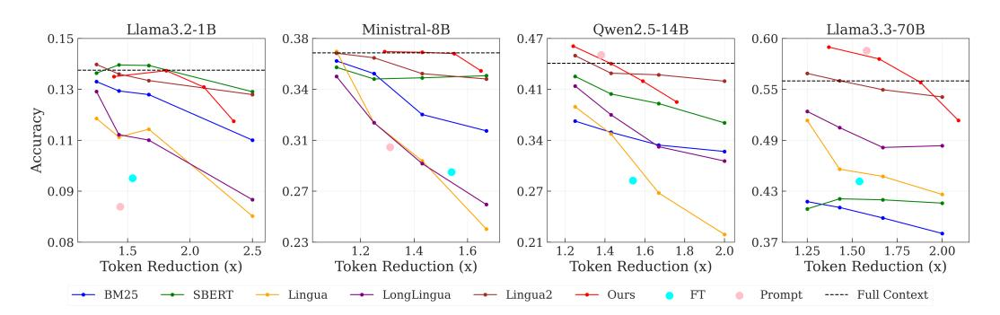

# 3 Experiments

In this section, we describe our experimental setup in [§3.1](#page-4-0) and present comprehensive results demonstrating the effectiveness of our method in [§3.2.](#page-5-1)

### 3.1 Experimental Setup

Datasets. We use two types of datasets, single-hop and multi-hop, to assess models' ability to locate the key information across varying context structures and tasks. For single-hop reasoning, where answers are typically found within a single passage requiring minimal context dependency, we use SQuAD [\[19\]](#page-10-9), a widely used dataset with questions based on Wikipedia passages; Natural Questions [\[11\]](#page-10-10), containing questions derived from real-world search queries with answers located in a single but longer passage; and a Code Understanding dataset, where we use GPT-4o to synthetically generate multiple single-function code snippets as distractors, and use the original PCSD [\[26\]](#page-11-7) data to create a QA task dataset requiring to first locate and then understand the relevant code. For multi-hop reasoning, which requires combining information from multiple parts of the context to arrive at the correct answer, we use HotpotQA [\[31\]](#page-11-8), a popular dataset with multi-hop questions requiring reasoning across multiple paragraphs from Wikipedia; MUSIQUE [\[24\]](#page-11-9), a dataset with compositional and nested questions requiring multi-step reasoning across multiple documents; and Multi-hop Key-Value Retrieval [\[36\]](#page-12-3), a widely adopted synthetic dataset for evaluating long-context LLMs that requires exact retrieval of dependent key-value pairs across multiple documents.

Data Processing. To evaluate LLMs' long-context capabilities, we extend these naturally short datasets to approximately 40K tokens. Following Liu et al. [\[16\]](#page-10-0) and Zhang et al. [\[36\]](#page-12-3), we create longform versions by combining multiple unique documents within each dataset, conducting experiments on both versions ([§3.2\)](#page-6-0). For each data point, we define the ground-truth sufficiency cutoff as the normalized position of the *last* token in the gold information span – the minimal context required for correct answers. Importantly, our evaluation datasets are carefully balanced by design: the gold answer locations follow a uniform distribution (mean ≈ 0.50, standard deviation 0.25-0.28) across all datasets, ensuring approximately 50% of chunks are classified as "insufficient" and 50% as "sufficient." This balanced distribution prevents bias toward early- or late-context answers and provides a fair assessment of context sufficiency detection. Detailed dataset statistics are provided in Section [A.](#page-14-0) We examine the inference time-context length trade-off in our method ([§4.2\)](#page-7-0). This definition treats sufficiency as a dataset property, implying a universal cutoff point across models. However, in practice, different models may need varying amounts of context to generate accurate responses, where sufficiency could be model-dependent. We investigate this phenomenon in [§4.4.](#page-8-0) Additionally, when ground truth cutoff points are not available, we show that synthetically LLM generated sufficiency labels are effective proxies in Section [A.4.](#page-15-1)

Models and Baselines. We evaluate four open-source LLM families ranging from 1B to 70B parameters: LLaMA-3.2-1B [\[3\]](#page-9-5), Mistral-8B [\[17\]](#page-10-11), Qwen-2.5-14B [\[30\]](#page-11-10), and LLaMA-3.3-70B [\[3\]](#page-9-5). Note that our proposed method is model-agnostic and can be applied to any Transformer-based LLM. To ensure fair comparison, we follow previous work [\[10,](#page-10-2) [18\]](#page-10-3) and evaluate our method against several well-established baselines. For retrieval-based methods (RAG), we include BM25 [\[21\]](#page-11-11), which ranks chunks by term frequency, and SBERT [\[20\]](#page-11-12), which uses transformer-based embeddings for semantic relevance. For compression-based methods, we evaluate LLMLingua [\[8\]](#page-10-1), which removes low-entropy tokens; LongLLMLingua [\[10\]](#page-10-2), which applies hierarchical filtering for long contexts; and LLMLingua2 [\[18\]](#page-10-3), which learns task-agnostic compression through knowledge distillation. Additionally, we include a Fine-Tuned Classifier baseline that learns to predict context sufficiency (Section [F.3\)](#page-21-1) and Self-Prompting, where the LLM assesses sufficiency through prompting ([§2.3\)](#page-4-1).

Evaluation Metrics. We evaluate two aspects of our dynamic context cutoff method: sufficiency classification and task performance. For sufficiency classification, we use F1 Score, which balances precision and recall, capturing the trade-off between false positives (overestimating sufficiency) and false negatives (underestimating sufficiency). We also report Recall at 90% Precision (R@90P), which measures the percentage of sufficient contexts correctly identified while maintaining a precision of at least 90%. This ensures that the method reliably avoids excessive false positives while achieving high recall. For task performance, we evaluate Accuracy, which measures the percentage of correct model outputs against the ground truth after and before context cutoff. We also evaluate Token Reduction, which quantifies the proportion of tokens processed relative to the full context. Following previous work [33], we perform model-based evaluation for accuracy calculation by using GPT-40 Mini.2 More details about the evaluation metrics and prompts can be found in Section C and Section D.2, respectively.

Implementation Details. The proposed dynamic context cutoff method involves three hyperparameters: the classification threshold  $\tau$ , the number of attention heads used for training, and the number of classifiers in the ensemble. Among these,  $\tau$  is the key hyperparameter as it directly impacts the trade-off between efficiency and performance, as discussed in §4.1. The remaining two hyperparameters are determined empirically via a standard hyperparameter sweep on the validation set; details can be found in Section F.1. Specifically, we set k=5 for attention heads with the highest F1 scores and train 8 lightweight classifiers for each head, selecting the top 4 with the highest AUC scores to form the ensemble. More details can be found in Section F.1. For all methods, including the proposed dynamic context cutoff method, we evaluate using percentage-based chunking with a 10% incremental threshold, meaning each chunk contains 10% more of the full context than the previous one. We explore different chunking strategies in Section 4.2.

#### 3.2 Results

**Sufficiency Classification.** Table 1 shows that probing internal attention heads achieves superior sufficiency detection (F1 = 91.1) compared to supervised fine-tuning (79.5) and self-prompting (83.1) in 70B models, demonstrating that latent sufficiency signals are more reliable than surface-level outputs. We also observe an interesting phenomenon: while 1B models struggle with self-prompting (F1 = 52.6), 70B versions achieve much higher performance, suggesting larger models intrinsically develop self-

Table 1: Probing (ours) achieves highest F1 scores compared to supervised fine-tuning (FT) and self-prompting across all models.

| Model        | FT   | Prompt | Ours |
|--------------|------|--------|------|
| LLaMA3.2-1B  |      | 52.6   | 88.3 |
| Mistral-8B   | 79.5 | 69.7   | 89.8 |
| Qwen2.5-14B  | 19.5 | 78.3   | 87.2 |
| LLaMA3.3-70B |      | 83.1   | 91.1 |

assessment capabilities. However, our probing approach maintains consistent high performance across all model sizes, confirming that internal activation provides the most reliable sufficiency detection regardless of model scale.

Efficiency vs. Performance. Figure 4 shows the efficiency and performance trade-off between different methods. Unlike static methods (RAG and the Lingua family) that require predefined compression rates or top-k document selection, dynamic methods (FT, self-prompting, and our approach) adaptively determine cutoff points based on content understanding. For our proposed method, we sweep through 4 different  $\tau$  values. For 1B models, our method matches RAG and LLMLingua2 in token reduction and achieves comparable accuracy. At 8B, it processes about  $1.5\times$  fewer tokens with minimal accuracy drop, outperforming all baselines. For 14B+ models, the method not only reduces tokens up to  $1.22\times$  but also improves accuracy. In contrast, RAG degrades sharply with scale. FT underperforms universally, likely due to misaligned sufficiency signals across models. Interestingly, larger models (14B+) exhibit emergent self-awareness via prompting, whereas smaller models (1B-8B) perform poorly in prompting, as instruction-following ability is critical for self-prompting to work effectively. The results suggest that context truncation may also mitigate the "lost-in-the-middle" problem [16, 6], as models focus more on the end of the context, which is likely to contain key information after removal.

&lt;sup>2gpt-4o-mini-2024-07-18

> **[图片提取文字 (无描述)]:**
> Llama3.2-1B Ministral-8B Owen2.5-14B Llama3.3-70B 0.15 0.38 0.47 0.60 0.13 0.34 0.41 0.55 Accuracy 0.34 0.49 0.110.31 0.09 0.43 0.27 0.27 0.08 0.23 0.21 0.37 2.0 2.5 2.0 1.5 1.6 .50 2.00 Token Reduction (x) Token Reduction (x) Token Reduction (x) Token Reduction (x) - SBERT → BM25 - Lingua - LongLingua - Lingua2 FT ---- Full Context - Ours Prompt

Figure 4: Our method achieves superior efficiency-accuracy trade-offs compared to baselines. RAG degrades with scale, while Lingua2 remains competitive but lags on multihop tasks. Larger models (14B+) exhibit emergent self-awareness on context sufficiency through prompting.

Table 2: Performance comparison across different models on Single-hop and Multi-hop tasks on the *short-form* dataset. Our method achieves a token reduction of 1.33×, while outperforming static methods with a targeted compression rate at 1.25×.

| Method        | LLaMA3.2-1B |        |      |       | Ministral-8B |      | Qwen2.5-14B |        | LLaMA3.3-70B |       |        | Avg. |       |              |      |
|---------------|-------------|--------|------|-------|--------------|------|-------------|--------|--------------|-------|--------|------|-------|--------------|------|
|               | Multi       | Single | Avg  | Multi | Single       | Avg  | Multi       | Single | Avg          | Multi | Single | Avg  | Multi | Single Total |      |
| Full Context  | 10.4        | 17.9   | 14.2 | 29.6  | 44.8         | 37.2 | 30.4        | 57.6   | 44.0         | 37.1  | 75.0   | 56.1 | 26.6  | 48.7         | 37.9 |
| BM25          | 11.2        | 16.2   | 13.7 | 20.8  | 27.5         | 35.6 | 25.8        | 40.8   | 36.5         | 21.7  | 37.1   | 41.7 | 19.9  | 30.4         | 31.9 |
| SBERT         | 10.2        | 17.8   | 14.0 | 19.6  | 37.5         | 35.2 | 26.3        | 51.3   | 42.3         | 22.1  | 41.7   | 40.8 | 19.6  | 37.1         | 33.1 |
| LLMlingua     | 6.3         | 18.3   | 12.3 | 22.1  | 41.7         | 31.9 | 24.2        | 52.5   | 38.3         | 35.8  | 74.1   | 55.0 | 22.1  | 46.7         | 34.4 |
| LongLLMlingua | 6.7         | 20.0   | 13.3 | 22.1  | 41.7         | 31.9 | 26.3        | 55.8   | 41.1         | 35.4  | 71.7   | 53.6 | 22.6  | 47.3         | 35.0 |
| LLMlingua2    | 7.9         | 20.8   | 14.4 | 28.3  | 43.3         | 35.8 | 32.1        | 57.9   | 45.0         | 35.8  | 75.0   | 55.4 | 26.1  | 49.3         | 37.7 |
| FT            | 6.2         | 13.8   | 10.0 | 21.5  | 34.7         | 28.1 | 22.3        | 35.1   | 28.7         | 35.6  | 52.4   | 44.0 | 21.4  | 34.0         | 27.7 |
| Self-Prompt   | 6.4         | 11.4   | 8.9  | 23.8  | 36.2         | 30.0 | 38.2        | 52.0   | 45.1         | 48.3  | 69.9   | 59.1 | 28.9  | 42.6         | 35.8 |
| Ours          | 10.3        | 17.5   | 13.9 | 28.8  | 45.8         | 37.3 | 33.3        | 59.2   | 46.3         | 43.8  | 75.3   | 59.5 | 29.0  | 49.4         | 39.2 |

Table 3: Performance comparison across different models on Single-hop and Multi-hop tasks on the *long form* dataset. Our method achieves a token reduction of 1.27×, while outperforming static methods with a targeted compression rate at 1.25×

| Method        |       | LLaMA3.2-1B |     |       | Ministral-8B |      |       | Qwen2.5-14B |      |       | LLaMA3.3-70B |      |       | Avg.         |      |
|---------------|-------|-------------|-----|-------|--------------|------|-------|-------------|------|-------|--------------|------|-------|--------------|------|
|               | Multi | Single      | Avg | Multi | Single       | Avg  | Multi | Single      | Avg  | Multi | Single       | Avg  | Multi | Single Total |      |
| Full Context  | 5.0   | 10.4        | 7.7 | 18.3  | 38.8         | 28.5 | 29.9  | 40.0        | 35.0 | 29.3  | 70.8         | 50.0 | 20.6  | 40.0         | 30.3 |
| BM25          | 5.7   | 12.2        | 8.9 | 20.9  | 38.7         | 29.8 | 30.2  | 39.2        | 34.7 | 28.7  | 68.7         | 48.7 | 21.3  | 40.0         | 30.5 |
| SBERT         | 5.6   | 12.5        | 9.1 | 20.2  | 37.7         | 29.4 | 30.0  | 38.9        | 34.4 | 27.7  | 68.8         | 48.3 | 21.1  | 39.5         | 30.3 |
| LLMlingua     | 3.8   | 12.1        | 7.9 | 17.1  | 35.8         | 26.5 | 27.1  | 41.8        | 34.5 | 23.3  | 65.4         | 44.4 | 17.8  | 38.8         | 28.3 |
| LongLLMlingua | 3.3   | 12.1        | 7.7 | 15.0  | 37.1         | 26.0 | 28.0  | 40.1        | 34.1 | 27.5  | 67.9         | 47.7 | 18.5  | 39.3         | 28.9 |
| LLMlingua2    | 2.7   | 9.6         | 6.2 | 17.1  | 38.3         | 27.7 | 28.8  | 42.9        | 35.8 | 28.2  | 69.2         | 48.7 | 19.2  | 40.0         | 29.6 |
| FT            | 2.6   | 8.4         | 5.5 | 14.9  | 31.5         | 23.3 | 21.4  | 33.2        | 27.3 | 21.4  | 47.1         | 34.3 | 15.1  | 30.0         | 22.6 |
| Self-Prompt   | 4.2   | 7.3         | 5.7 | 17.4  | 32.6         | 25.0 | 30.5  | 45.8        | 37.6 | 29.0  | 65.4         | 47.2 | 20.3  | 37.8         | 29.0 |
| Ours          | 5.0   | 9.9         | 7.5 | 19.1  | 37.7         | 28.4 | 29.8  | 43.2        | 36.5 | 30.8  | 70.9         | 50.9 | 21.2  | 39.9         | 30.8 |

Individual Task Performance. Table [2](#page-6-2) shows that our method maintains consistent performance on both single-hop tasks (49.4% average accuracy) and multi-hop tasks (29%), outperforming the top static baseline, LLMLingua2, by +1.5% in absolute accuracy score. In contrast, RAG methods experience a considerable drop in both settings. For a fair comparison, we report RAG results only for k = 8, which corresponds to a compression rate of 0.8 for the Lingua family or a token reduction factor of 1.25×. Note that dynamic methods stop naturally and do not target a specific token reduction rate. Our method achieves a 1.33× reduction in tokens, while the FT and Prompt methods achieve reductions of 1.54× and 1.42× on average, respectively.

Long Context Scenario. We evaluate our method with longer contexts to assess its scalability. For fair comparison, static methods are evaluated at a fixed 1.25× token reduction. Table [3](#page-6-3) shows that our method consistently outperforms baselines, especially in the multi-hop setting. Dynamic methods adaptively determine cutoff points, with FT achieving 1.61×, Self-Prompt 1.41×, and our method 1.27×, ensuring minimal performance loss. Notably, RAG performs better in long-context settings, particularly for multi-hop reasoning. However, FT remains the weakest method, struggling with generalization. Self-Prompting improves with model size, as larger models better follow instructions for self-assessment. The results confirm that dynamic cutoff outperforms static heuristics. For longer contexts, our method provides an alternative and scalable solution for efficient inference.

