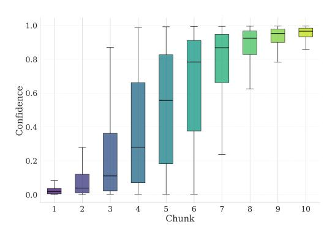
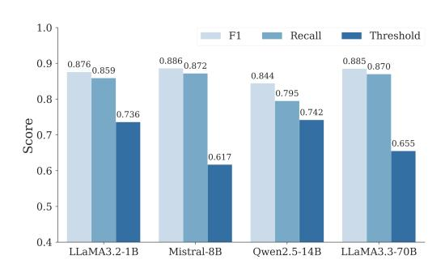

# 4 Analysis and Discussion

#### 4.1 Classification Threshold

The balance between the model's prediction confidence and the classification threshold τ is a key factor in our proposed method. In Figure [5,](#page-7-2) we plot the model's prediction confidence averaged over different numbers of chunks. We observe that the confidence in sufficiency predictions grows steadily as more context is processed, which indicates that useful signals are accumulating over the chunks. Consequently, once the model's confidence exceeds τ , it has likely integrated enough information. Note that stopping too early can cause information loss when critical elements of the context are excluded.

Although the F1 score is a useful measure for detecting context sufficiency, we also report Recall at high Precision to show how well our method identifies truly sufficient contexts while minimizing false positives. In Figure [6,](#page-7-3) we show results at 90% precision and provide further findings at 95% and 98% precision in the appendix. This metric measures the fraction of actually sufficient contexts that are correctly identified when precision is at least 90%. Such a metric is critical for our task, as a mistaken early cutoff (false positive) can exclude relevant content and degrade the final performance.

### 4.2 Chunking and Inference Time

Chunking determines how efficiently the model processes and evaluates context sufficiency. Table [4](#page-7-4) compares different chunking strategies for Qwen-2.5-14B. Percentage-based chunking performs consistently well, with 10% chunking offering the best trade-off between accuracy and efficiency. While sentence-level chunking achieves the highest classification performance, it is impractical due to the increased overhead of frequent sufficiency checks. Since these checks require processing chunks sequentially, smaller chunks lead to higher latency, as each additional step incurs computational overhead before reaching a decision even with caching.

> **[图片提取文字 (无描述)]:**
> 1.0 0.8 Confidence 9.0 0.2 0.0 5 6 Chunk 2 3 4 8 9 10

Figure 5: Confidence progression across context chunks. Model's prediction confidence increases monotonically with more context.

> **[图片提取文字 (无描述)]:**
> 1.0 Recall Threshold F1  $0.885 \\ 0.870$  $0.876 \\ 0.859$  $0.886 \atop 0.872$ 0.9 0.8440.795 0.8 0.7420.736 Score 0.7 0.655 0.617 0.6 0.5 0.4 LLaMA3.2-1B Mistral-8B Owen2.5-14B LLaMA3.3-70B

Figure 6: F1 score and Recall at 90% precision for sufficiency detection. Our approach reliably identifies when enough context is present while minimizing false positives. More results can be found in Appendix [G.](#page-21-2)

Table 4: Sentence-level chunking achieves the highest performance but is computationally expensive. 10% chunking offers the best balance between accuracy and efficiency.

| Metric   | Sent. | 1%   | 5%   | 10%  | 20%  |
|----------|-------|------|------|------|------|
| F1-Score | 96.8  | 87.2 | 87.0 | 88.3 | 88.3 |
| R@90P    | 95.4  | 90.9 | 78.4 | 85.9 | 85.8 |
| Acc.     | 14.5  | 13.7 | 12.8 | 13.9 | 13.7 |

Therefore, 10% chunking is chosen to best balance granularity and efficiency. Figure [7](#page-8-1) shows inference time between our method (10% chunking) and full-context processing. For short contexts (1K tokens), directly processing the full context is faster; however, beyond 2K tokens, our method provides significant inference time savings when fewer than six chunks (60% of the full context) are processed. This demonstrates that our approach scales efficiently, offering increasing benefits for longer inputs.

> **[图片提取文字 (无描述)]:**
> 7.4 8.3 10.1 12.5 1K tokens 2K tokens 8K tokens 4K tokens 7.0 Time (s) 9.2 7.8 11.0 Inference 6.6 8.4 9.5 6.7 7.5 8.0 5.7 6.1 6.7 6.5 10 10 10 10 Number of Chunks Number of Chunks Number of Chunks Number of Chunks ---- Full Context Generation Cutoff Generation

Figure 7: For short contexts (1K tokens), full-context processing is faster. However, beyond 2K tokens, our method becomes more efficient, achieving faster inference when fewer than six chunks (60% of the full context) are processed.

### 4.3 Wall-Clock Time vs. Accuracy

Beyond token reduction, we compare wall-clock time in Table [5,](#page-8-2) using the same configuration from Section [4.2.](#page-7-0) All experiments were run on the same hardware configurations as detailed in Section [F.2.](#page-20-0) Our method achieves faster inference time than full context processing while also improving accuracy from 35.0% to 36.5%. LLMLingua2 is the fastest overall at 6.97s with comparable accuracy of 35.8%. Self-Prompting, while achieving the highest accuracy (37.6%), is the slowest among all methods. RAG methods (BM25 and SBERT) and other Lingua variants offer some speedup over full context but generally at the cost of accuracy. The FT method achieves faster inference than full context.

Table 5: Comparison of average wall-clock inference time (seconds per sample) and average accuracy across various methods.

| Method        | Time (s) | Acc. (%) |
|---------------|----------|----------|
| Full          | 9.02     | 35.0     |
| BM25          | 8.68     | 34.7     |
| SBERT         | 8.93     | 34.4     |
| LLMLingua     | 7.35     | 34.5     |
| LongLLMLingua | 8.47     | 34.1     |
| LLMLingua2    | 6.97     | 35.8     |
| FT            | 8.01     | 27.3     |
| Self-Prompt   | 10.5     | 37.6     |
| Ours          | 8.13     | 36.5     |

However, it results in a significant drop in accuracy. Overall, our method offers a balanced trade-off, reducing latency without external heuristics while preserving answer quality.

### 4.4 Universal vs. Model-Specific Cutoffs

From a human perspective, each task has a "gold" location in the context where the final relevant information resides—once an answer is directly obtained, any further context is redundant. In such cases, a universal stopping point may be plausible. However, from a model perspective, defining a single optimal cutoff is challenging and ambiguous. For example, in in-context learning (ICL), models observe demonstration examples without a clear threshold for sufficiency. Smaller models may require more examples to generalize, while larger models may reach high confidence with fewer. This suggests a model-specific cutoff, where each model determines its own stopping threshold rather than adhering to a universal standard. This is particularly relevant in real-world applications, where different LLMs and tasks have varying context requirements. We provide preliminary exploration of tasks without explicit answer locations in Appendix [E,](#page-19-1) using ICL as a representative case.

### 4.5 Beyond Factoid QA

Our work focuses on tasks where the information needed to answer a query is localized within specific parts of the context. While this represents a substantial portion of real-world applications (e.g., question answering, information retrieval, fact verification), we acknowledge that not all tasks benefit from early stopping. Tasks requiring holistic understanding of the entire context, such as summarization or passage rewriting, may not be suitable candidates for dynamic cutoff. However, a key advantage of our method is its ability to handle both scenarios naturally. Unlike compression methods that reduce context regardless of task requirements, our sufficiency classifier can process the full context when necessary – when all information is crucial, the classifier would not trigger early stopping, effectively using the entire input. We also demonstrate in Appendix [A.4](#page-15-1) that synthetically generated sufficiency labels (via GPT-4o) achieve competitive performance (F1: 84.6-87.0 vs 88.389.8 for original labels), enabling extension beyond factoid QA. Additionally, for larger models (14B+), our self-prompting approach eliminates dependence on labeled data entirely, suggesting potential for broader task coverage.

### 4.6 Limitations and Future Work

While our sufficiency classifier demonstrates promising generalization through synthetic labels and self-prompting, its applicability to all task types (e.g., creative writing, open-ended dialogue) remains an open question. Future work could investigate classifier performance across broader task spectrums and develop adaptive threshold selection mechanisms that automatically adjust τ based on model characteristics and task requirements, rather than relying on validation-based hyperparameter tuning.

