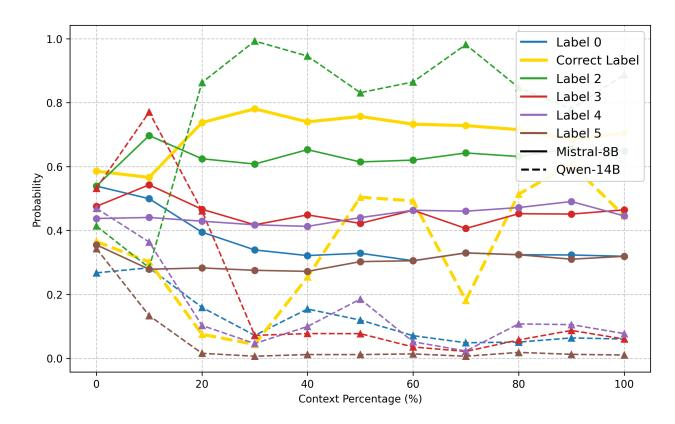

# F.1 Ensemble Classifier

For the ensemble classifier, the folds are constructed from the training split during cross-validation. The validation split is held out for the evaluation after the classifier is built. Tables [9](#page-20-1) shows the perfor-

> **[图片提取文字 (无描述)]:**
> 1.0 Label 0 Correct Label Label 2 Label 3 8.0 Label 4 Label 5 Mistral-8B 0.6 Qwen-14B Probability 0.4 0.2 0.0 20 0 60 80 100 40 Context Percentage (%)

Figure 9: Confidence progression in TREC ICL task: The 8B model requires nearly all examples to achieve its highest confidence, whereas the 14B model attains peak confidence after processing fewer examples. This illustrates the need for model-specific cutoff thresholds.

mance comparison in different number of attention heads and different classifiers used in ensemble. For attention heads, we found that using only the top 5 selected heads yield best performance, and use the top 4 out of 7 classifiers is the best configuration.

Table 9: Performance comparison across head selections and number of classifiers for our method.

|          | Head Numbers |      |      | Classifier Numbers |      |      |  |
|----------|--------------|------|------|--------------------|------|------|--|
| Metrics  | 5            | 10   | 20   | 2                  | 4    | 6    |  |
| F1-Score | 88.3         | 87.3 | 87.9 | 87.4               | 88.3 | 87.3 |  |
| R@90P    | 85.9         | 78.0 | 78.0 | 77.6               | 85.9 | 78.0 |  |
| Acc.     | 13.9         | 13.0 | 12.8 | 12.7               | 13.9 | 12.9 |  |

#### F.2 Memory Requirements and Computational Requirements

Our ensemble classifier consists of small tree-based and linear models with extremely minimal memory footprints, typically in the range of a few megabytes per model. The full ensemble model consists of 8 linear/tree-based classifiers, from which we select the top 4 with the highest validation F1 scores as our final ensemble. The total memory requirement for our complete ensemble is less than 15MB, which is negligible compared to the multi-gigabyte memory requirements of the LLMs themselves (often 6-140GB depending on model size).

During our experiments, we ran these classifiers on GPUs alongside the LLMs for convenience and faster iteration. We were able to run all experiments (including with 70B models) on just 2-4 A5000/A6000 GPUs (as detailed in Table [10\)](#page-20-3), as the classifier's memory requirements are negligible in the overall GPU memory budget. For deployment scenarios where GPU memory efficiency is particularly important, offloading the classifier to CPU while keeping only the LLM on GPU is a viable option. This approach incurs minimal latency overhead since the classifier's computation is lightweight compared to the LLM's forward pass. We leave the detailed analysis of the memory and latency trade-off for future work.

Table 10: GPU configurations used for different models in our experiments.

| Model                      | GPUs Used                            |
|----------------------------|--------------------------------------|
| LLaMA 3.2-1B               | 2 × Nvidia A5000                     |
| Mistral 8B Qwen 2.5-14B | 4 × Nvidia A5000 4 × Nvidia A5000 |
| LLaMA 3.3-70B              | 4 × Nvidia A6000                     |

### F.3 Fine-Tuned Classifier (FT)

We fine-tune meta-llama/Llama-3.2-1B to predict the context cutoff point in long-context inputs, formulating this as a binary classification task. The model is trained on the Short-form dataset specified in Section [A.](#page-14-0) We optimize using the AdamW optimizer with a learning rate of 8.0e-05 and a batch size of 32, employing a cosine learning rate schedule with linear warmup. The fine-tuned model achieves a development set accuracy of 0.8346, demonstrating strong predictive capability. We chose meta-llama/Llama-3.2-1B due to its efficiency in capturing long-range dependencies while maintaining manageable computational costs. Additionally, framing the task as binary classification simplifies optimization and enables robust generalization across diverse long-context scenarios. We include meta-llama/Llama-3.2-3B results and the performance of training on long dataset in Table [11](#page-21-3) for reference. All models are fine-tuned for one epoch.

Table 11: Performance of fine-tuned classifiers tuned on different datasets.

| Base Model  | Trained & Evaluated on | Test Accuracy |
|-------------|------------------------|---------------|
| Llama3.2-1b | Short Dataset          | 0.8346        |
| Llama3.2-1b | Long Dataset           | 0.7515        |
| Llama3.2-3b | Short Dataset          | 0.8413        |
| Llama3.2-3b | Long Dataset           | 0.7456        |

#### F.4 Potential Combination with KV Cache Optimization

Recent work has explored KV cache optimization techniques to improve inference efficiency. As also discussed in [§1,](#page-1-0) while KV cache optimization focuses on reducing or evicting less important KV cache entries to reduce memory usage for decoding speedup, our method reduces initial text processing at the input level (like LLMLingua). This means these approaches are complementary and can be potentially combined - our method reduces input size, and KV cache optimization could further improve decoding speed. While combining both methods could lead to additional efficiency gains, it is beyond the scope of this work. We consider this an interesting direction for future research.

