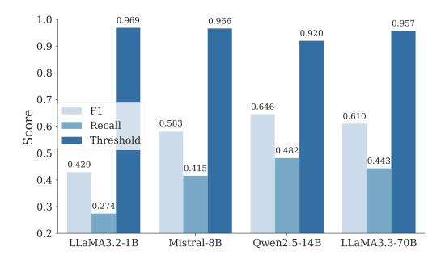

# G Recall at High Precision

> **[图片提取文字 (无描述)]:**
> 1.0 Recall Threshold F1 0.9140.9 0.893 0.885 0.883 0.805 0.791 0.8 0.734 0.6990.685 Score 0.7 0.677 0.598 0.536 0.5 0.4 0.3 LLaMA3.2-1B Mistral-8B Owen2.5-14B LLaMA3.3-70B

Figure 10: F1 score and Recall at 95% precision (R@95P) for sufficiency detection.

> **[图片提取文字 (无描述)]:**
> 0.966 0.969 1.0 0.957 0.920 0.9 0.8 0.7 0.646 F1 Score 0.610 0.583 Recall 0.6 -Threshold 0.482 0.5 0.4430.4290.4150.4 0.3 0.2740.2 LLaMA3.2-1B Mistral-8B Owen2.5-14B LLaMA3.3-70B

Figure 11: F1 score and Recall at 98% precision (R@98P) for sufficiency detection.