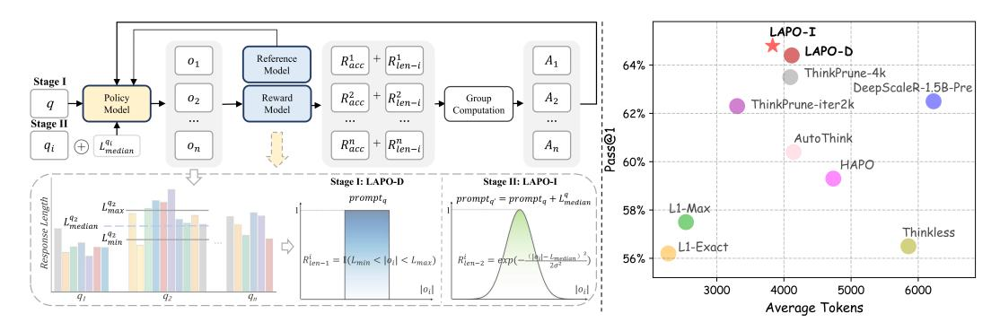

# 1 INTRODUCTION

Recent advances in large reasoning models have demonstrated remarkable capabilities through extended chain-of-thoughts [\(Wei et al.,](#page-12-0) [2022;](#page-12-0) [Jaech et al.,](#page-11-0) [2024;](#page-11-0) [Guo et al.,](#page-11-1) [2025\)](#page-11-1). However, this computational freedom comes with a critical limitation: these models often generate excessively verbose reasoning chains regardless of problem complexity, leading to significant computational overhead, a phenomenon known as "overthinking" [\(Min et al.,](#page-12-1) [2024\)](#page-12-1). While beneficial for complex problems, this verbosity introduces substantial inefficiencies, making practical deployment challenging.

Existing approaches to address this challenge fall into three main categories, each with inherent limitations. Direct length reduction methods either rely on reward design [\(Yang et al.,](#page-13-0) [2025;](#page-13-0) [Huang](#page-11-2) [et al.,](#page-11-2) [2025a\)](#page-11-2) that can cause over-shortening and accuracy degradation, or impose hard length constraints [\(Aggarwal & Welleck,](#page-10-0) [2025;](#page-10-0) [Hou et al.,](#page-11-3) [2025\)](#page-11-3) that lack adaptability across problem types. Dynamic early-stopping approaches [\(Qiao et al.,](#page-12-2) [2025;](#page-12-2) [Muennighoff et al.,](#page-12-3) [2025\)](#page-12-3) make real-time termination decisions but often truncate mid-reasoning, disrupting the thinking process. Adaptive thinking methods [\(Lou et al.,](#page-11-4) [2025;](#page-11-4) [Zhang et al.,](#page-13-1) [2025a;](#page-13-1) [Fang et al.,](#page-11-5) [2025a\)](#page-11-5) enable models to switch between thinking and non-thinking modes but operate at a coarse granularity.

The fundamental limitation of these approaches lies in their treatment of length control as an external constraint imposed upon the reasoning process. This paradigm inherently conflicts with the nature of mathematical reasoning, where each problem possesses its own intrinsic complexity that naturally determines the required reasoning depth. Current methods fail to recognize that when models successfully solve problems, they naturally converge to certain reasoning lengths that reflect this

> **[图片提取文字 (无描述)]:**
> LAPO-I LAPO-D Reference  $R_{acc}^1$  $R^1_{len-i}$  $o_1$  $A_1$ 64% Model ThinkPrune-4k Stage I DeepScaleR-1.5B-Pre  $R^2_{acc}$  $+ |R_{len-i}^2|$  $A_2$ Policy 02 Reward Group ThinkPrune-iter2k Model Model Computation 62% ... ... Stage II ... ... Pass@1 AutoThink  $L_{median}^{q_i}$  $R_{acc}^n$  $R_{len-i}^n$  $A_n$  $o_n$  $q_i$ 60% HAPO Stage I: LAPO-D Stage II: LAPO-I  $prompt_{q'} = prompt_q + L_{median}^q$  $prompt_q$ Response Length  $L_{max}^{q_2}$ L1-Max 58% - $L_{median}^{q_2}$ Thinkless  $L_{min}^{q_2}$ L1-Exact  $R_{len-1}^{i} = |(L_{min} < |\phi_{i}| < L_{max})|$ 56% 3000 5000 6000  $|o_i|$  $|o_i|$ 4000  $q_n$  $q_2$ Average Tokens

Figure 1: Overview of Length-Adaptive Policy Optimization (LAPO) and its superior performance. The LAPO framework (left) trains a model in two stages: first discovering natural reasoning lengths, then internalizing them as self-proposed budgets. This process enables our models (LAPO-I) to achieve a state-of-the-art balance between accuracy and efficiency (right), surpassing existing methods by operating in the desirable top-left region of the performance plot.

intrinsic complexity. The challenge is not to impose arbitrary limits, but to help models discover and internalize these natural reasoning patterns.

We propose a paradigm shift: instead of constraining reasoning through external mechanisms, we enable models to learn from their own successful reasoning patterns and develop an internal sense of appropriate reasoning depth. Our key insight is that the distribution of reasoning lengths in correct solutions contains valuable information about how much thinking each problem genuinely requires. By capturing these patterns during training and teaching models to anticipate the appropriate reasoning budget before they begin solving, we can transform length control from an external limitation into an intrinsic capability.

We introduce Length-Adaptive Policy Optimization (LAPO), a two-stage reinforcement learning framework that progressively builds this adaptive capability. In the first stage, we design lengthaware rewards that encourage efficiency while maintaining accuracy. During this process, we collect statistical patterns from successful solutions, specifically focusing on the reasonable length range where most correct answers naturally fall. This reveals the inherent reasoning requirements of each problem without imposing artificial constraints. In the second stage, we leverage these discovered patterns to provide explicit guidance to the model. By incorporating target length information directly into the problem prompt, we enable models to plan their reasoning trajectory before beginning the solution process. Crucially, to ensure models can reason adaptively without requiring predefined lengths at inference time, we embed the length constraint as a self-declarative statement immediately after the <think> token. This technique reframes the budget not as an external command, but as part of the model's own internal reasoning plan. By learning to generate a solution that aligns with its self-proposed budget, the model is incentivized to internalize the link between problem complexity and resource allocation, allowing it to reason flexibly and efficiently when deployed.

LAPO fundamentally differs from existing approaches by recognizing that efficient reasoning requires understanding problem-specific computational needs rather than following rigid rules. Our two-stage design enables a natural progression: models first learn what constitutes appropriate reasoning depth through experience, then develop the ability to anticipate these requirements proactively. This approach mirrors how human experts develop intuition about problem complexity, allocating mental effort proportionally to task demands.

Extensive experiments validate the effectiveness of our approach. LAPO achieves remarkable efficiency gains, reducing token usage by up to 40.9% while simultaneously improving accuracy by 2.3% on mathematical reasoning benchmarks (see Figure [1\)](#page-1-0). Our analysis reveals that this improvement stems from the model's ability to distinguish between problems requiring elaborate derivations versus those needing only brief calculations. The training dynamics demonstrate smooth convergence in both stages, with models maintaining stable accuracy even as they learn increasingly precise length control. These results confirm that when models learn from their own successful patterns rather than arbitrary constraints, they develop more robust and efficient reasoning strategies.

### Our main contributions are:

- We propose LAPO, a novel two-stage reinforcement learning framework that transforms length control from an external constraint into an intrinsic reasoning capability, enabling models to adaptively allocate computational resources based on problem complexity.
- We introduce a training methodology that combines statistical analysis of successful reasoning patterns with contextual length guidance embedded within the reasoning process, allowing models to internalize length-adaptive behaviors while maintaining inference-time flexibility.
- We demonstrate through extensive experiments that LAPO achieves substantial efficiency gains (up to 40.9% token reduction) while improving accuracy, revealing that models can develop emergent meta-cognitive abilities for reasoning budget allocation.

