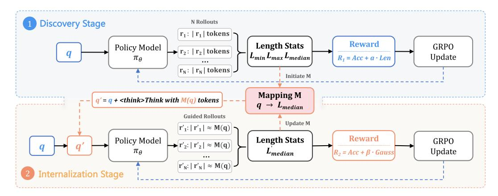

# 2 RELATED WORKS

### 2.1 TEST-TIME SCALING IN LARGE LANGUAGE MODELS

Increasing test-time computation has consistently been shown to improve performance in complex reasoning tasks, mathematical problem-solving, and code generation [\(Wu et al.,](#page-12-4) [2024;](#page-12-4) [Wang et al.,](#page-12-5) [2022;](#page-12-5) [Wei et al.,](#page-12-0) [2022;](#page-12-0) [Guo et al.,](#page-11-1) [2025\)](#page-11-1). Test-time scaling laws indicate predictable performance gains from increasing inference computation, either by generating more reasoning chains or longer ones [\(Wu et al.,](#page-12-4) [2024;](#page-12-4) [Snell et al.,](#page-12-6) [2024;](#page-12-6) [Jaech et al.,](#page-11-0) [2024\)](#page-11-0). Prominent approaches include parallel sampling of multiple reasoning paths [\(Wang et al.,](#page-12-5) [2022\)](#page-12-5), tree-based search [\(Yao et al.,](#page-13-2) [2023;](#page-13-2) [Wu](#page-12-4) [et al.,](#page-12-4) [2024\)](#page-12-4), and iterative refinement techniques [\(Snell et al.,](#page-12-6) [2024;](#page-12-6) [Welleck et al.,](#page-12-7) [2024\)](#page-12-7).

Recent reasoning models such as OpenAI's O1 and DeepSeek's R1-style models [\(Jaech et al.,](#page-11-0) [2024;](#page-11-0) [Guo et al.,](#page-11-1) [2025\)](#page-11-1) simplify test-time scaling by generating extended reasoning traces through reinforcement learning with verifiable rewards (RLVR), encouraging deep thinking behaviors such as broad exploration and feasibility checks [\(Gandhi et al.,](#page-11-6) [2025\)](#page-11-6). However, these extended reasoning behaviors often lead to much longer reasoning traces, sometimes several times longer than those produced by short CoT models [\(Sui et al.,](#page-12-8) [2025;](#page-12-8) [Chen et al.,](#page-11-7) [2024\)](#page-11-7), creating an "overthinking" issue that largely increases inference costs [\(Kumar et al.,](#page-11-8) [2025\)](#page-11-8). Several recent works have shown that this extended reasoning often includes redundant or unnecessary verification and reflection, even on simple problems [\(Wang et al.,](#page-12-9) [2025\)](#page-12-9). Despite their promising results, existing methods lack precise and dynamic control over the length of generated reasoning chains, resulting in often suboptimal performance or unrealized potential efficiency gains.

### 2.2 EFFICIENT LONG CHAIN-OF-THOUGHT LLM

While test-time scaling with long CoT significantly improves accuracy, it comes at the cost of computational inefficiency. In particular, reasoning models often produce verbose and unnecessary reasoning when solving simple problems—a phenomenon commonly referred to as overthinking [\(Sui et al.,](#page-12-8) [2025\)](#page-12-8). To address the overthinking phenomenon in reasoning models, various methods have been proposed following three main strategies. Prompt-based methods attempt to control response length by incorporating instructions directly into prompts [\(Xu et al.,](#page-12-10) [2025a\)](#page-12-10), but cannot achieve precise length control. Training-based methods include supervised fine-tuning approaches that collect datasets with variable lengths [\(Han et al.,](#page-11-9) [2024;](#page-11-9) [Kang et al.,](#page-11-10) [2025;](#page-11-10) [Ma et al.,](#page-12-11) [2025;](#page-12-11) [Xia et al.,](#page-12-12) [2025\)](#page-12-12) and RL-based methods that incorporate length penalties into reward functions [\(Muennighoff et al.,](#page-12-3) [2025;](#page-12-3) [Yeo et al.,](#page-13-3) [2025;](#page-13-3) [Luo et al.,](#page-12-13) [2025a;](#page-12-13) [Xu et al.,](#page-13-4) [2025b\)](#page-13-4). However, these methods fail to control length according to users' requirements or problem complexity. Routerbased methods train separate classifiers to route queries between fast and reasoning models [\(Chuang](#page-11-11) [et al.,](#page-11-11) [2024;](#page-11-11) [Ong et al.,](#page-12-14) [2024\)](#page-12-14), but require additional computational overhead. Recent advances in token budget control have introduced more sophisticated approaches. Works like L1 [\(Aggarwal &](#page-10-0) [Welleck,](#page-10-0) [2025\)](#page-10-0) and Elastic Reasoning [\(Xu et al.,](#page-13-4) [2025b\)](#page-13-4) can more precisely control output length under given token budgets, yet they fail to enable autonomous estimation of appropriate response lengths for different problems.

In contrast to these prior approaches, our LAPO framework uniquely combines autonomous budget estimation and precise length control capabilities through a two-stage reinforcement

<span id="page-3-0"></span>> **[图片提取文字 (无描述)]:**
> **Discovery Stage** N Rollouts r1: | r1 | tokens -Reward **Length Stats** GRPO Policy Model r<sub>2</sub>: | r<sub>2</sub>| tokens  $L_{min} L_{max} L_{median}$ Update  $R_1 = Acc + a \cdot Len$  $\pi_{\theta}$  $|\mathbf{r}_{\mathsf{N}}:|\mathbf{r}_{\mathsf{N}}|$  tokens Initiate M Mapping M  $q' = q + \langle think \rangle$  Think with M(q) tokens  $q \rightarrow L_{median}$ **Guided Rollouts** Update M  $|\mathbf{r'}_1:|\mathbf{r'}_1|\approx \mathbf{M}(\mathbf{q})$ Reward **Length Stats** Policy Model GRPO  $\rightarrow$   $\mathbf{r'}_2$ :  $|\mathbf{r'}_2| \approx \mathbf{M}(\mathbf{q})$ Update  $\pi_{\theta}$  $R_2 = Acc + \beta \cdot Gauss$ Lmedian  $|\mathbf{r'}_{N}:|\mathbf{r'}_{N}|\approx \mathbf{M}(\mathbf{q})|$ **Internalization Stage**


Figure 2: The LAPO framework consists of two stages: (1) Discovery stage learns natural reasoning patterns by rewarding efficient correct solutions and collecting length statistics; (2) Internalization stage embeds these statistics as self-proposed plans within the model's reasoning context, teaching models to internalize efficient reasoning.

learning design. Unlike existing methods that rely on external truncation mechanisms or require manual budget specification, LAPO trains models to intrinsically learn appropriate reasoning lengths while maintaining reasoning completeness and logical coherence. This endogenous length control capability enables problem-adaptive token budget allocation, achieving significant efficiency improvements while maintaining or enhancing reasoning performance.

### 3 METHOD

We present Length-Adaptive Policy Optimization (LAPO), a framework that enables reasoning models to internalize efficient reasoning as an intrinsic capability. Our approach fundamentally differs from existing methods by teaching models to develop an internal understanding of appropriate reasoning depth, rather than imposing external constraints. We achieve this through a carefully designed two-stage training process that first discovers natural reasoning patterns, then transforms these patterns into an internalized capability.

#### 3.1 OVERVIEW

Consider a reasoning model generating response r for problem q. While current models produce high-quality solutions, they lack awareness of computational efficiency, often generating responses far exceeding necessary length. Our goal is to train models that autonomously determine appropriate reasoning lengths while maintaining solution quality.

Our key insight is that successful problem solutions naturally exhibit certain length distributions that reflect intrinsic problem complexity. Rather than viewing these patterns as constraints to enforce, we treat them as signals that teach models about reasoning depth requirements. LAPO employs a two-stage approach illustrated in Figure [2:](#page-3-0) the Discovery stage explores natural reasoning patterns through length-aware rewards, while the Internalization stage transforms these patterns into adaptive reasoning behavior.

#### 3.2 DISCOVERY STAGE: LEARNING NATURAL REASONING PATTERNS

The Discovery stage aims to uncover inherent relationships between problems and their natural reasoning lengths through GRPO training with a carefully designed reward mechanism that encourages efficient exploration while maintaining correctness.

Extracting Statistics from GRPO Rollouts. During GRPO training, we generate N rollout responses for each problem q in the training batch. From these rollouts, we collect the lengths

of responses that produce correct answers:

$$\mathcal{L}_q = \{ |r_i| : \mathbb{I}(y_i = y_{\text{gold}}) = 1, i \in [1, N] \}$$
(1)

where  $y_i$  is the predicted answer from the *i*-th rollout response  $r_i$ . This collection, extracted directly from the GRPO sampling process, represents natural variation in successful reasoning lengths.

We derive two key statistics from these rollouts. First, we establish a reasonable length range using percentiles to filter outliers while preserving central tendencies:

$$[L_{\min}, L_{\max}] = [Percentile_{30}(\mathcal{L}_q), Percentile_{70}(\mathcal{L}_q)]$$
 (2)

Second, we create a problem-to-length mapping that will guide the Internalization stage:

$$\mathcal{M}: q \mapsto L_{\text{median}}(q) = \text{Median}(\mathcal{L}_q) \tag{3}$$

For problems without correct solutions in the current rollouts, we set  $\mathfrak{M}(q)=4096$  (maximum sequence length) to encourage comprehensive exploration in subsequent episodes.

**Length-Aware Reward Design.** We employ a composite reward function balancing accuracy and efficiency:

<span id="page-4-0"></span>
$$R_D(r_i, q) = \mathbb{I}(y_i = y_{\text{gold}}) + \alpha \cdot R_1(r_i, q)$$
(4)

The length component operates on a crucial principle—only correct responses receive length-based rewards. Let  $\mathcal{C}_i = \mathbb{I}(y_i = y_{\mathrm{gold}})$  indicate whether the response is correct, and define the distance to the target length range as  $d_i = \min(||r_i| - L_{\min}|, ||r_i| - L_{\max}|)$ . We introduce a linear decay function  $f(d) = \max(0, 1 - d/100)$  to penalize deviations from the efficient length range. The length reward is then defined as:

$$R_{1}(r_{i},q) = \begin{cases} 1.0 & \text{if } \mathcal{C}_{i} = 1 \land |r_{i}| \in [L_{\min}, L_{\max}] \\ f(d_{i}) & \text{if } \mathcal{C}_{i} = 1 \land |r_{i}| \notin [L_{\min}, L_{\max}] \\ 0 & \text{if } \mathcal{C}_{i} = 0 \end{cases}$$

$$(5)$$

This design creates gradients guiding models toward efficient lengths while allowing flexibility for complex problems. Throughout the Discovery stage, we continuously update  $\mathcal M$  after each GRPO training step to reflect evolving model capabilities.

#### 3.3 Internalization Stage: Length-Aware Efficient Reasoning

The Internalization stage transforms discovered patterns into internalized capabilities through continued GRPO training with modified prompts and rewards.

**Length-Conditioned Rollout.** We augment each problem prompt with explicit length guidance:

$$prompt'_q = prompt_q + " I will answer the question with n tokens."$$

where  $n = \mathcal{M}(q)$  from the Discovery stage. This embeds length awareness within the reasoning context, helping models perceive computational budgets as intrinsic to thinking rather than external constraints.

**Length-Adherence Reward.** To encourage the model to follow its self-declared reasoning budget, the Internalization stage employs a precision-focused reward function. This function is designed to reward the alignment between the model's output length and its self-declared budget n. The total reward is defined as:

<span id="page-4-1"></span>
$$R_I(r_i, q') = \mathbb{I}(y_i = y_{\text{gold}}) + \beta \cdot R_2(r_i, q')$$
(6)

where the adherence component,  $R_2$ , is only granted for correct solutions:

$$R_2(r_i, n) = \begin{cases} \exp\left(-\frac{(|r_i| - n)^2}{2\sigma^2}\right) & \text{if } \mathcal{C}_i = 1, \\ 0 & \text{if } \mathcal{C}_i = 0; \end{cases}$$

$$(7)$$

This Gaussian-inspired reward positively reinforces solutions that are both correct and consistent with the intended reasoning depth. By rewarding adherence to the self-proposed plan, this mechanism guides the model to internalize the relationship between problem complexity and an appropriate computational budget, rather than merely tracking an external signal.

#### <span id="page-5-1"></span>Algorithm 1 Length-Adaptive Policy Optimization(LAPO)

```
1: Input: Base model \pi_{\theta}, training data \mathcal{D}, hyperparameters \alpha, \beta, \sigma, E_1, E_2
 2: Output: Length-adaptive model \pi_{\theta}^*
 4: // Discovery Stage
 5: for episode e = 1 to E_1 do
 6:
          Sample batch \mathcal{B} \subset \mathcal{D}
 7:
          for each problem q \in \mathcal{B} do
               Generate N rollouts: \{r_1, \ldots, r_N\} \sim \pi_{\theta}(q)
 8:
               Collect correct lengths: \mathcal{L}_q = \{|r_i| : y_i = y_{\text{gold}}\}
 9:
               Compute range: [L_{\min}, L_{\max}] = [P_{30}(\mathcal{L}_q), P_{70}(\mathcal{L}_q)]
10:
11:
               Update mapping: \mathcal{M}(q) = \text{Median}(\mathcal{L}_q)
12:
               Compute rewards: R_D(r_i, q) = \mathbb{I}(y_i = y_{\text{gold}}) + \alpha \cdot R_1(r_i, q)
13:
          end for
14:
          Update \pi_{\theta} using GRPO with rewards R_1
15: end for
16:
17: // Internalization Stage
18: for episode e = 1 to E_2 do
19:
          Sample batch \mathcal{B} \subset \mathcal{D}
20:
          for each problem q \in \mathcal{B} do
               Augment prompt: q' \leftarrow q + \text{``<think> I will answer the question with } M(q) tokens."
21:
               Generate N rollouts: \{r_1, \ldots, r_N\} \sim \pi_{\theta}(q')
22:
23:
               Compute rewards: R_I(r_i, q') = \mathbb{I}(y_i = y_{\text{gold}}) + \beta \cdot R_2(r_i, q')
24:
               Update mapping \mathcal{M}(q) using dual-strategy (Eq. 8)
25:
26:
          Update \pi_{\theta} using GRPO with rewards R_2
27: end for
28: return \pi_{\theta}^*
```

**Internalization via In-Context Guidance.** A cornerstone of our framework is how it fosters genuine internalization, enabling inference-time flexibility without explicit length targets. The key lies in the design of the augmented prompt. Placing the self-declarative guidance immediately after the <think> token transforms an external constraint into an intrinsic part of the model's cognitive plan.

During the Internalization stage, we refine  ${\mathfrak M}$  based on new GRPO rollouts with a dual-strategy update:

<span id="page-5-0"></span>
$$\mathcal{M}(q) = \begin{cases} \operatorname{Median}(\mathcal{L}_q^{(t)}) & \text{if previously unsolved} \\ \min(\mathcal{M}(q), \operatorname{Median}(\mathcal{L}_q^{(t)})) & \text{if previously solved} \end{cases} \tag{8}$$

This ensures newly solved problems establish reasonable benchmarks while previously solved problems gravitate toward more efficient solutions.

#### 3.4 Training Pipeline

We present the complete LAPO training procedure in Algorithm 1. LAPO employs GRPO across both stages with the following pipeline:

**Discovery Stage** (Lines 4-15): The model explores natural reasoning patterns through GRPO training with length-aware rewards. For each problem in the training batch, we generate multiple rollouts and extract statistics from successful responses. The mapping  $\mathfrak M$  is continuously updated to capture the evolving understanding of appropriate reasoning lengths. This stage runs for  $E_1$  epochs, allowing the model to discover problem-specific length patterns through self-supervised exploration.

**Internalization Stage** (Lines 17-27): The model learns to internalize efficient reasoning by incorporating discovered length patterns into the training process. Each problem prompt is augmented with target length information derived from the Discovery stage. The placement of

this guidance within the <think> block encourages the model to treat the budget as part of its own reasoning plan, which fosters genuine length awareness rather than rote instruction following. The dual-strategy update mechanism refines the mapping M throughout training, allowing newly solved problems to establish benchmarks while encouraging efficiency improvements for previously solved ones.

This progressive design mirrors cognitive development: first gaining experience about appropriate reasoning depth through practice, then learning to anticipate these requirements proactively. The embedding of guidance as a self-declared plan is the key mechanism that bridges this gap from experience to proactive anticipation. By making efficiency an intrinsic part of reasoning, LAPO creates models that naturally adapt computational investment to match problem demands.

