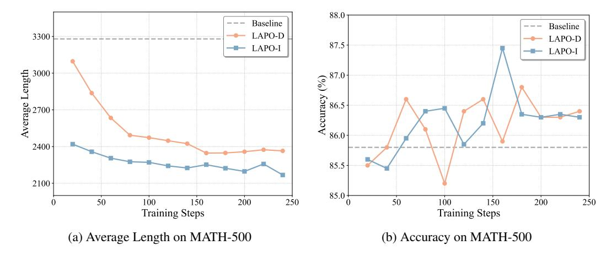

# A TECHNICAL APPENDICES AND SUPPLEMENTARY MATERIAL

#### A.1 IMPLEMENTATION DETAILS

System prompt used for training. The system prompts used for the two-stage training are shown in the boxes below. The prompt titled LAPO-D-prompt was used for DeepSeek-R1-Distill-Qwen-1.5B, and LAPO-I-prompt was used for DeepScaleR. This approach maintains consistency with the original RL training of DeepSeek-R1.

#### LAPO-D-prompt

You are a helpful assistant. A conversation between User and Assistant. The user asks a question, and the Assistant solves it. The Assistant first thinks about the reasoning process in the mind and then provides the user with the answer. The reasoning process is enclosed within <think> and </think> tags, respectively, i.e., <think> reasoning process here </think> answer here. User: {question} Please think step by step and output the final answer within \boxed{}. Assistant: <think>

### LAPO-I-prompt

You are a helpful assistant. A conversation between User and Assistant. The user asks a question, and the Assistant solves it. The Assistant first thinks about the reasoning process in the mind and then provides the user with the answer. The reasoning process is enclosed within <think> and </think> tags, respectively, i.e., <think> reasoning process here </think> answer here. User: {question} Please think step by step and output the final answer within \boxed{}. Assistant: <think> I will answer the question with {length} tokens.

Training and Reproduction Details. We trained the model on the OpenRLHF framework. During training, we sampled 8 responses for each query in the batch with a temperature of 1.0, set the kl parameter to 0.0001, used a learning rate of 1e-6 and a batch size of 128, and set the maximum context length to 4K tokens during training. Both LAPO-D and LAPO-I training were conducted for 3 episodes, approximately 240 steps. The α and β parameters in R1 and R2 were 0.7 and 0.8, respectively. All experiments were conducted using 4 A800 GPUs. We provide training hyperparameters in Table [5.](#page-14-0)

#### A.2 TRAINING DYNAMICS

We analyze the training dynamics by periodically evaluating model checkpoints on the MATH-500 validation set to understand the learning mechanisms of our twostage framework. As illustrated in Figures [5a](#page-15-0) and [5b,](#page-15-0) LAPO achieves a superior balance between efficiency and accuracy across both training stages.

Continuous Efficiency Gains. Figure [5a](#page-15-0) shows a clear, two-step reduction in token generation. In Stage 1, the LAPO-D policy rapidly becomes more concise, with its average length decreasing from a verbose baseline of 3,280 tokens to a stable 2,365 tokens, driven by the length-aware reward (R1). Building on this, the LAPO-I policy achieves further compression, reducing the length to below 2,200 tokens. This demonstrates that the plan-adherence reward (R2), combined with incontext guidance, effectively encourages the model to execute its self-proposed reasoning plans more precisely.

Table 5: Training Hyperparameters

| Hyperparameter        | Value  |
|-----------------------|--------|
| Epochs                | 1      |
| Episodes              | 3      |
| Learning Rate         | 1e-6   |
| Train Batch Size      | 128    |
| Temperature           | 1.0    |
| Rollout per Prompt    | 8      |
| Prompt Max Length     | 1024   |
| Generation Max Length | 4096   |
| KL Coefficient        | 0.0001 |
| Precision             | BF16   |
| α                     | 0.7    |
| β                     | 0.7    |

Accuracy Maintenance and Refinement. Crucially, these efficiency gains do not compromise performance.

As shown in Figure [5b,](#page-15-0) accuracy on MATH-500 is consistently maintained or improved. The

> **[图片提取文字 (无描述)]:**
> 88.0 Baseline Baseline LAPO-D 3300 LAPO-D 87.5 LAPO-I LAPO-I Average Length Accuracy (%) 86.5 86.0 2400 85.5 2100 85.0 1 50 100 150 200 250 50 100 150 200 250 Training Steps Training Steps (a) Average Length on MATH-500 (b) Accuracy on MATH-500

Figure 5: Training dynamics evaluated on the MATH-500 validation set. Checkpoints were saved periodically during training on our mixed dataset. (a) Both LAPO-D and LAPO-I policies learn to significantly reduce the average response length. (b) These efficiency gains are achieved while maintaining or even improving accuracy over the baseline.

Table 6: Ablation study on the training dataset. This table compares performance when trained on different data sources. For each metric column, **bold** indicates the best score and <u>underline</u> indicates the second-best score across all configurations.

| Method            | MATH             | 1500         | AIME                | 2024         | AMC                 | -23          | Olympia             | dBench       | Avera        | ige          |
|-------------------|------------------|--------------|---------------------|--------------|---------------------|--------------|---------------------|--------------|--------------|--------------|
|                   | Pass@1           | #Tok         | Pass@1              | #Tok         | Pass@1              | #Tok         | Pass@1              | #Tok         | Pass@1       | #Tok         |
| Training Data: Co | ombined (        | Ours)        |                     |              |                     |              |                     |              |              |              |
| LAPO-D LAPO-I  | 86.4 86.3     | 2365 2168 | 37.6 <b>38.1</b> | 5945 5371 | 77.6 <b>78.3</b> | 3655 3765 | 56.1 <b>56.3</b> | 4499 4024 | 64.4 64.8 | 4116 3832 |
| Training Data: De | eepScaleR        | R-only       |                     |              |                     |              |                     |              |              |              |
| LAPO-D LAPO-I  | 86.1 86.1     | 2397 2210 | 36.8 36.5        | 6153 6418 | 76.8 77.0        | 3983 3791 | 55.5 55.6        | 4258 3933 | 63.8 63.8 | 4197 4088 |
| Training Data: M  | ATH-only         |              |                     |              |                     |              |                     |              |              |              |
| LAPO-D LAPO-I  | <b>86.5</b> 86.1 | 2398 2340 | 38.0 35.5        | 7034 6452 | 77.3 75.8        | 4060 4021 | 55.8 54.5        | 4494 4194 | 64.4 63.0 | 4496 4251 |

LAPO-D policy's accuracy climbs from 85.8% to over 86.4%, suggesting the reward mechanism prunes redundant or error-prone reasoning steps. The LAPO-I policy sustains this high accuracy level even on a much tighter token budget. Notably, it exhibits a transient performance peak, a key finding that suggests the in-context guidance actively steers the model toward more focused and effective reasoning, rather than merely acting as a constraint.

In summary, the training dynamics validate our two-stage design. LAPO-D establishes a robust foundation for efficient reasoning, which LAPO-I then refines to achieve a superior performance-cost balance. The smooth convergence on a challenging validation set confirms that by learning from its own successful patterns, the model develops transferable and efficient reasoning strategies.

#### A.3 SELECTION OF TRAINING DATASET

As mentioned in section 4 Experiment Setup, we chose a mixed dataset for training in our experiments. In this section, we provide a detailed analysis of the impact of different dataset selections on model performance. Table 6 shows the test results on various benchmarks after two-stage training using different training datasets. Several important findings can be observed from the experimental results. Combined-data achieved the best performance in terms of average accuracy, showing a clear advantage over single-dataset training. This indicates that a dataset with

a balanced difficulty distribution helps enhance the model's generalization ability across different types of questions. In terms of token usage efficiency, the model trained on combined-data also performed the best. This suggests that problems with different difficulty gradients help establish a more accurate complexity-length mapping relationship. By exposing the model to a wider range of problem difficulties, it can better learn the optimal thinking range for different questions. Taking all these factors into consideration, we selected the mixed dataset as the training data to expose the model to a more diverse set of problems and enable it to deeply learn the optimal reasoning patterns for different questions.

### A.4 GENERALIZABILITY TO EXPERT-LEVEL QUESTION ANSWERING.

To test if LAPO's benefits extend beyond structured mathematical reasoning, we evaluated our method on the GPQA benchmark. The results, presented in Table [7,](#page-16-0) demonstrate that LAPO's core principles are highly generalizable.

For both base models, LAPO achieves a compelling dual improvement in accuracy and efficiency. On the DeepSeek-R1-1.5B model, LAPO-D improves Pass@1 accuracy by a significant 2.0 points while reducing token generation by 26.2%. Similarly, on the more advanced DeepScaleR-1.5B-Preview, LAPO-D boosts accuracy by 2.2 points and cuts tokens by 19.4%. The internalization stage consistently pushes efficiency further while maintaining a strong accuracy improvement over the baseline. This robust performance on a knowledge-intensive, non-mathematical task indicates that LAPO is not merely exploiting

Table 7: Performance on the GPQA benchmark. LAPO demonstrates generalizable efficiency and accuracy gains in a non-mathematical, knowledge-intensive domain.

| Method                              | Pass@1 (%) | #Tokens |  |  |  |  |  |  |  |
|-------------------------------------|------------|---------|--|--|--|--|--|--|--|
| Base Model: DeepSeek-R1-1.5B        |            |         |  |  |  |  |  |  |  |
| Base                                | 36.1       | 10297   |  |  |  |  |  |  |  |
| + LAPO-D                            | 38.1       | 7596    |  |  |  |  |  |  |  |
| + LAPO-I                            | 36.9       | 7235    |  |  |  |  |  |  |  |
| Base Model: DeepScaleR-1.5B-Preview |            |         |  |  |  |  |  |  |  |
| Base                                | 36.1       | 7667    |  |  |  |  |  |  |  |
| + LAPO-D                            | 38.3       | 6176    |  |  |  |  |  |  |  |
| + LAPO-I                            | 37.8       | 6154    |  |  |  |  |  |  |  |

domain-specific patterns. Instead, it learns a fundamental and transferable skill: how to allocate cognitive effort efficiently for complex reasoning across different domains.