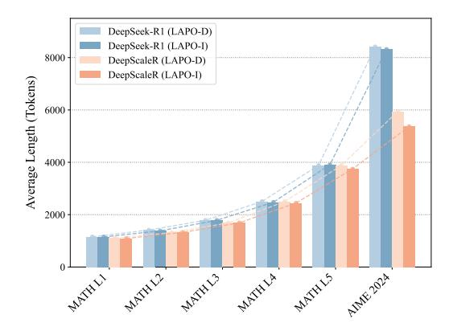
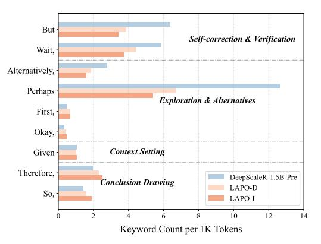

# 6.5 DIFFICULTY-AWARE COMPUTATIONAL ALLOCATION

To understand the mechanisms behind LAPO's efficiency gains, we examine its ability to allocate computational resources in proportion to problem complexity. We evaluate LAPO-trained models on benchmarks with clear difficulty gradients, from MATH Level 1 up to the highly complex AIME 2024. As shown in Figure [3,](#page-10-2) our models demonstrate a remarkable emergent capability for difficultyaware resource allocation. There is a clear, near-linear positive correlation between problem complexity and the average reasoning length. On simpler problems, the models generate concise responses, while for the most challenging AIME questions, they produce extensive reasoning chains that are substantially longer than any solution observed during the training phase. This ability to extrapolate reasoning depth well beyond the bounds of their training experience is a crucial finding. It provides strong evidence that LAPO does not merely teach models to compress their outputs. Instead, it successfully imparts a generalizable principle of complexity-to-length mapping. This allows the models to dynamically and appropriately scale their computational investment when faced with novel problems of varying difficulty. The consistent scaling behavior across different base models further underscores that LAPO develops a robust, fundamental reasoning strategy rather than model-specific optimizations.

> **[图片提取文字 (无描述)]:**
> DeepSeek-R1 (LAPO-D) DeepSeek-R1 (LAPO-I) 8000 DeepScaleR (LAPO-D) DeepScaleR (LAPO-I) Average Length (Tokens) 6000 4000 2000

> **[图片提取文字 (无描述)]:**
> But -Self-correction & Verification Wait, Alternatively, Perhaps · **Exploration & Alternatives** First, Okay, Context Setting Given -Therefore, DeepScaleR-1.5B-Pre Conclusion Drawing LAPO-D So, LAPO-I 2 12 10 Keyword Count per 1K Tokens

Figure 3: Reasoning length allocation across mathematical problem difficulty levels. LAPO learns to scale computation with complexity.

Figure 4: Keyword usage of reasoning behaviors across different stages. LAPO selectively prunes hesitant and exploratory thought patterns.

#### 6.6 QUALITATIVE REFINEMENT OF REASONING BEHAVIORS

Beyond quantitatively adjusting how much computation the model uses, we next investigate how it qualitatively refines the reasoning process to achieve this efficiency. To do this, we analyzed the frequency of keywords indicative of different cognitive behaviors, such as "Self-Correction and Verification", "Exploration and Alternatives", "Context Setting", and "Conclusion Drawing", in the generated responses (Figure 4). The results reveal a significant shift in the model's reasoning style. The most significant change is a dramatic reduction in keywords associated with Self-Correction and Exploration. The base model (DeepScaleR-1.5B-Pre) frequently employs these terms, indicating a verbose and deliberative reasoning style. After LAPO-D training, and further refined in LAPO-I, the model significantly curtails this internal monologue. This suggests that LAPO effectively discourages redundant verification loops and inefficient exploration of the solution space. Crucially, this efficiency gain is not achieved by indiscriminately shortening the response. The frequency of keywords related to Context Setting and Conclusion Drawing remains stable across training stages. This demonstrates that LAPO selectively prunes inefficient and hesitant thought patterns while preserving the essential scaffolding of a coherent logical argument. The model learns to maintain its ability to properly frame a problem and articulate its deductions.

#### 7 Conclusion

In this work, we introduce Length-Adaptive Policy Optimization (LAPO), a two-stage reinforcement learning framework that enables language models to autonomously adjust reasoning length based on problem complexity. Unlike existing approaches that impose uniform constraints, LAPO recognizes that efficient reasoning requires understanding problem-specific computational needs rather than following rigid rules. Our two-stage design enables a natural progression: models first learn what constitutes appropriate reasoning depth through experience, then develop the ability to anticipate these requirements proactively. This approach mirrors how human experts develop intuition about problem complexity, allocating mental effort proportionally to task demands. Extensive experiments validate LAPO's effectiveness, achieving remarkable efficiency gains with up to 40.9% reduction in token usage while simultaneously improving accuracy by 2.3% on mathematical reasoning benchmarks. Our analysis reveals that this improvement stems from the model's ability to distinguish between problems requiring elaborate derivations versus those needing only brief calculations. These results confirm that when models learn from their own successful patterns rather than arbitrary constraints, they develop more robust and efficient reasoning strategies.

#### REFERENCES

Pranjal Aggarwal and Sean Welleck. L1: Controlling how long a reasoning model thinks with reinforcement learning. *arXiv* preprint arXiv:2503.04697, 2025.

- Xingyu Chen, Jiahao Xu, Tian Liang, Zhiwei He, Jianhui Pang, Dian Yu, Linfeng Song, Qiuzhi Liu, Mengfei Zhou, Zhuosheng Zhang, et al. Do not think that much for 2+ 3=? on the overthinking of o1-like llms. *arXiv preprint arXiv:2412.21187*, 2024.
- Yu-Neng Chuang, Helen Zhou, Prathusha Kameswara Sarma, Parikshit Gopalan, John Boccio, Sara Bolouki, and Xia Hu. Learning to route llms with confidence tokens. *arXiv preprint arXiv:2410.13284*, 2024.
- Gongfan Fang, Xinyin Ma, and Xinchao Wang. Thinkless: Llm learns when to think. *arXiv preprint arXiv:2505.13379*, 2025a.
- Gongfan Fang, Xinyin Ma, and Xinchao Wang. Thinkless: LLM learns when to think. *CoRR*, abs/2505.13379, 2025b. doi: 10.48550/ARXIV.2505.13379. URL [https://doi.org/10.](https://doi.org/10.48550/arXiv.2505.13379) [48550/arXiv.2505.13379](https://doi.org/10.48550/arXiv.2505.13379).
- Kanishk Gandhi, Ayush Chakravarthy, Anikait Singh, Nathan Lile, and Noah D Goodman. Cognitive behaviors that enable self-improving reasoners, or, four habits of highly effective stars. *arXiv preprint arXiv:2503.01307*, 2025.
- Daya Guo, Dejian Yang, Haowei Zhang, Junxiao Song, Ruoyu Zhang, Runxin Xu, Qihao Zhu, Shirong Ma, Peiyi Wang, Xiao Bi, et al. Deepseek-r1: Incentivizing reasoning capability in llms via reinforcement learning. *arXiv preprint arXiv:2501.12948*, 2025.
- Tingxu Han, Zhenting Wang, Chunrong Fang, Shiyu Zhao, Shiqing Ma, and Zhenyu Chen. Tokenbudget-aware llm reasoning. *arXiv preprint arXiv:2412.18547*, 2024.
- Chaoqun He, Renjie Luo, Yuzhuo Bai, Shengding Hu, Zhen Leng Thai, Junhao Shen, Jinyi Hu, Xu Han, Yujie Huang, Yuxiang Zhang, et al. Olympiadbench: A challenging benchmark for promoting agi with olympiad-level bilingual multimodal scientific problems. *arXiv preprint arXiv:2402.14008*, 2024.
- Dan Hendrycks, Collin Burns, Steven Basart, Andy Zou, Mantas Mazeika, Dawn Song, and Jacob Steinhardt. Measuring massive multitask language understanding. *arXiv preprint arXiv:2009.03300*, 2020.
- Bairu Hou, Yang Zhang, Jiabao Ji, Yujian Liu, Kaizhi Qian, Jacob Andreas, and Shiyu Chang. Thinkprune: Pruning long chain-of-thought of llms via reinforcement learning. *arXiv preprint arXiv:2504.01296*, 2025.
- Chengyu Huang, Zhengxin Zhang, and Claire Cardie. Hapo: Training language models to reason concisely via history-aware policy optimization. *arXiv preprint arXiv:2505.11225*, 2025a.
- Chengyu Huang, Zhengxin Zhang, and Claire Cardie. HAPO: training language models to reason concisely via history-aware policy optimization. *CoRR*, abs/2505.11225, 2025b. doi: 10.48550/ ARXIV.2505.11225. URL <https://doi.org/10.48550/arXiv.2505.11225>.
- Aaron Jaech, Adam Kalai, Adam Lerer, Adam Richardson, Ahmed El-Kishky, Aiden Low, Alec Helyar, Aleksander Madry, Alex Beutel, Alex Carney, et al. Openai o1 system card. *arXiv preprint arXiv:2412.16720*, 2024.
- Yu Kang, Xianghui Sun, Liangyu Chen, and Wei Zou. C3ot: Generating shorter chain-of-thought without compromising effectiveness. In *Proceedings of the AAAI Conference on Artificial Intelligence*, volume 39, pp. 24312–24320, 2025.
- Abhinav Kumar, Jaechul Roh, Ali Naseh, Marzena Karpinska, Mohit Iyyer, Amir Houmansadr, and Eugene Bagdasarian. Overthink: Slowdown attacks on reasoning llms. *arXiv preprint arXiv:2502.02542*, 2025.
- Chenwei Lou, Zewei Sun, Xinnian Liang, Meng Qu, Wei Shen, Wenqi Wang, Yuntao Li, Qingping Yang, and Shuangzhi Wu. Adacot: Pareto-optimal adaptive chain-of-thought triggering via reinforcement learning. *arXiv preprint arXiv:2505.11896*, 2025.

- Haotian Luo, Li Shen, Haiying He, Yibo Wang, Shiwei Liu, Wei Li, Naiqiang Tan, Xiaochun Cao, and Dacheng Tao. O1-pruner: Length-harmonizing fine-tuning for o1-like reasoning pruning. *arXiv preprint arXiv:2501.12570*, 2025a.
- Michael Luo, Sijun Tan, Justin Wong, Xiaoxiang Shi, William Y Tang, Manan Roongta, Colin Cai, Jeffrey Luo, Tianjun Zhang, Li Erran Li, et al. Deepscaler: Surpassing o1-preview with a 1.5 b model by scaling rl. *Notion Blog*, 2025b.
- Xinyin Ma, Guangnian Wan, Runpeng Yu, Gongfan Fang, and Xinchao Wang. Cot-valve: Lengthcompressible chain-of-thought tuning. *arXiv preprint arXiv:2502.09601*, 2025.
- Yingqian Min, Zhipeng Chen, Jinhao Jiang, Jie Chen, Jia Deng, Yiwen Hu, Yiru Tang, Jiapeng Wang, Xiaoxue Cheng, Huatong Song, et al. Imitate, explore, and self-improve: A reproduction report on slow-thinking reasoning systems. *arXiv preprint arXiv:2412.09413*, 2024.
- Niklas Muennighoff, Zitong Yang, Weijia Shi, Xiang Lisa Li, Li Fei-Fei, Hannaneh Hajishirzi, Luke Zettlemoyer, Percy Liang, Emmanuel Candes, and Tatsunori Hashimoto. s1: Simple test-time ` scaling. *arXiv preprint arXiv:2501.19393*, 2025.
- Isaac Ong, Amjad Almahairi, Vincent Wu, Wei-Lin Chiang, Tianhao Wu, Joseph E Gonzalez, M Waleed Kadous, and Ion Stoica. Routellm: Learning to route llms with preference data. *arXiv preprint arXiv:2406.18665*, 2024.
- Ziqing Qiao, Yongheng Deng, Jiali Zeng, Dong Wang, Lai Wei, Fandong Meng, Jie Zhou, Ju Ren, and Yaoxue Zhang. Concise: Confidence-guided compression in step-by-step efficient reasoning. *arXiv preprint arXiv:2505.04881*, 2025.
- Charlie Snell, Jaehoon Lee, Kelvin Xu, and Aviral Kumar. Scaling llm test-time compute optimally can be more effective than scaling model parameters. *arXiv preprint arXiv:2408.03314*, 2024.
- Yang Sui, Yu-Neng Chuang, Guanchu Wang, Jiamu Zhang, Tianyi Zhang, Jiayi Yuan, Hongyi Liu, Andrew Wen, Shaochen Zhong, Hanjie Chen, et al. Stop overthinking: A survey on efficient reasoning for large language models. *arXiv preprint arXiv:2503.16419*, 2025.
- Songjun Tu, Jiahao Lin, Qichao Zhang, Xiangyu Tian, Linjing Li, Xiangyuan Lan, and Dongbin Zhao. Learning when to think: Shaping adaptive reasoning in r1-style models via multi-stage rl. *arXiv preprint arXiv:2505.10832*, 2025.
- Xuezhi Wang, Jason Wei, Dale Schuurmans, Quoc Le, Ed Chi, Sharan Narang, Aakanksha Chowdhery, and Denny Zhou. Self-consistency improves chain of thought reasoning in language models. *arXiv preprint arXiv:2203.11171*, 2022.
- Yue Wang, Qiuzhi Liu, Jiahao Xu, Tian Liang, Xingyu Chen, Zhiwei He, Linfeng Song, Dian Yu, Juntao Li, Zhuosheng Zhang, et al. Thoughts are all over the place: On the underthinking of o1-like llms. *arXiv preprint arXiv:2501.18585*, 2025.
- Jason Wei, Xuezhi Wang, Dale Schuurmans, Maarten Bosma, Fei Xia, Ed Chi, Quoc V Le, Denny Zhou, et al. Chain-of-thought prompting elicits reasoning in large language models. *Advances in neural information processing systems*, 35:24824–24837, 2022.
- Sean Welleck, Amanda Bertsch, Matthew Finlayson, Hailey Schoelkopf, Alex Xie, Graham Neubig, Ilia Kulikov, and Zaid Harchaoui. From decoding to meta-generation: Inference-time algorithms for large language models. *arXiv preprint arXiv:2406.16838*, 2024.
- Yangzhen Wu, Zhiqing Sun, Shanda Li, Sean Welleck, and Yiming Yang. Inference scaling laws: An empirical analysis of compute-optimal inference for problem-solving with language models. *arXiv preprint arXiv:2408.00724*, 2024.
- Heming Xia, Chak Tou Leong, Wenjie Wang, Yongqi Li, and Wenjie Li. Tokenskip: Controllable chain-of-thought compression in llms. *arXiv preprint arXiv:2502.12067*, 2025.
- Silei Xu, Wenhao Xie, Lingxiao Zhao, and Pengcheng He. Chain of draft: Thinking faster by writing less. *arXiv preprint arXiv:2502.18600*, 2025a.

- Yuhui Xu, Hanze Dong, Lei Wang, Doyen Sahoo, Junnan Li, and Caiming Xiong. Scalable chain of thoughts via elastic reasoning. *arXiv preprint arXiv:2505.05315*, 2025b.
- Junjie Yang, Ke Lin, and Xing Yu. Think when you need: Self-adaptive chain-of-thought learning. *arXiv preprint arXiv:2504.03234*, 2025.
- Shunyu Yao, Dian Yu, Jeffrey Zhao, Izhak Shafran, Tom Griffiths, Yuan Cao, and Karthik Narasimhan. Tree of thoughts: Deliberate problem solving with large language models. *Advances in neural information processing systems*, 36:11809–11822, 2023.
- Edward Yeo, Yuxuan Tong, Morry Niu, Graham Neubig, and Xiang Yue. Demystifying long chainof-thought reasoning in llms. *arXiv preprint arXiv:2502.03373*, 2025.
- Jiajie Zhang, Nianyi Lin, Lei Hou, Ling Feng, and Juanzi Li. Adaptthink: Reasoning models can learn when to think. *arXiv preprint arXiv:2505.13417*, 2025a.
- Jiajie Zhang, Nianyi Lin, Lei Hou, Ling Feng, and Juanzi Li. Adaptthink: Reasoning models can learn when to think. *CoRR*, abs/2505.13417, 2025b. doi: 10.48550/ARXIV.2505.13417. URL <https://doi.org/10.48550/arXiv.2505.13417>.

