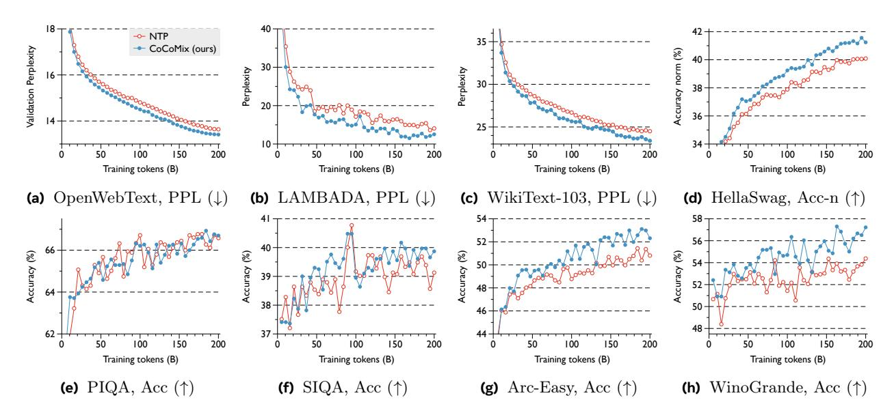

# **Appendix**

## A Experimental Details

Architecture details. Our method and baseline both utilize the GPT-2-based Transformer architecture and tokenizer (Radford et al., 2019), with a context length of 1024. We consider three model sizes, defined by the number of activated parameters: 69M, 386M, and 1.38B. For CoCoMix, the hidden state dimensions d are 512, 1024, and 2028, with 8, 24, and 24 layers, respectively. The number of attention heads is set to 8, 16, and 16 for the three configurations. Baseline models are configured to match the number of activated parameters by employing the same number of layers and attention heads, with hidden state dimensions of 624, 1072, and 2096, respectively. We leverage an open-source pretrained TopK Sparse Autoencoder (SAE) (Gao et al., 2024) for concept extraction, where  $K_{\text{concept}}$  is set to 32 and the concept activation size is 32,768. Consequently, our models introduce an additional  $(C + K_{\text{concept}}) \times d$  activated parameters on top of the base Transformer parameters. The GPT-2 model (a teacher model for KD and a concept extraction model for CoCoMix) has 12 layers, a hidden dimension size of 768, and 124M parameters. The concept extraction layer  $L_{\text{con}}$  is configured as the 6th middle layer of GPT-2 for all model sizes. For CoCoMix, the concept prediction is done at the 4th layer for the 69M model and the 6th layer for the larger 386M and 1.38B models.

Training details. We mainly followed the training details outlined in (Brown et al., 2020). For the main results presented in Section 2, models were trained on 200B tokens over approximately 382K training steps, while other experiments were conducted on 20B tokens. We used OpenWebText as the training dataset to match the same training corpus as GPT-2. The learning rate schedule included a warm-up phase over the first 1/300 of the total training steps, followed by a cosine decay to 10% of the maximum learning rate at the end of training. The maximum learning rates were set to 6e-4, 3e-4, and 2e-4 for the 69M, 386M, and 1.38B models, respectively. The batch sizes were configured to 0.5M, 0.5M, and 1M tokens for the three model sizes. A weight decay of 0.1 was applied across all configurations, and we utilized the AdamW optimizer (Loshchilov, 2017) with  $\beta_1 = 0.9$  and  $\beta_2 = 0.95$ . For training CoCoMix, the concept prediction loss Equation 4 was scaled by a hyperparameter  $\lambda = 0.1$ , and  $K_{\text{attri}}$  was set to 4. For the KD baseline, we employed the vanilla KD loss, where the output probabilities of the teacher model  $\mathcal{M}_{\text{con}}$  and the student model  $\mathcal{M}$  were matched using the Kullback-Leibler (KL) divergence. Specifically, given an input  $\mathbf{x}$ , the KD loss is defined as  $-\log \mathcal{M}(x_{t+1}|\mathbf{x}) + \lambda_{\text{KD}} \cdot \text{KL}(\mathcal{M}_{\text{con}}(\cdot|\mathbf{x})||\mathcal{M}(\cdot|\mathbf{x}))$ , where  $\lambda_{\text{KD}} = 0.1$  consistently demonstrated strong performance.

## **B** Additional Results

### **B.1** Detailed Performance During Training

In this section, we present the performance tracking during training on 200B tokens, including validation perplexity and the perplexity and accuracy of various downstream tasks, including LAMBADA, WikiText-103, HellaSwag, PIQA, SIQA, Arc-Easy, and WinoGrande datasets. As shown in Figure 7, Figure 8, and Figure 9, we compare CoCoMix with the next token prediction (NTP) across different active parameter sizes: 69M, 386M, and 1.38B. In most of the graphs, CoCoMix consistently demonstrates performance gains. Notably, our results show that CoCoMix achieves stable improvements in perplexity across all tasks. Furthermore, CoCoMix exhibits sample efficiency; for instance, in the 1.38B model, CoCoMix reaches the same OpenWebText validation perplexity as NTP while requiring approximately 43B fewer tokens (a 21.5% improvement in token efficiency).

#### B.2 Additional Steerability Results

To further analyze the steerability enabled by CoCoMix, we conducted experiments using both the same prompt as in the main figure and a new prompt (in Figure 10). For consistency, we first applied steering on additional concepts identified during our analysis—"\$ dollar" and "Phone"—using the same prompt as in Figure 5. These experiments confirmed that the model could effectively modulate its output based on these newly identified concepts, producing coherent and concept-aligned generations. Next, to verify whether the

> **[图片提取文字 (无描述)]:**
> -- NTP CoCoMix (ours) € 28.5 Validation Perplexity 100 Accuracy norm 28.0 27.5 Perplexity Perplexity 27.0 200 200 200 Training tokens (B) Training tokens (B) Training tokens (B) Training tokens (B) (b) LAMBADA, PPL  $(\downarrow)$ (a) OpenWebText, PPL (↓) (d) HellaSwag, Acc-n (↑) (c) WikiText-103, PPL (↓) Accuracy (%) Accuracy (%) Accuracy (%) Accuracy (%) 38 100 150 200 50 100 150 200 50 200 100 200 50 100 150 50 150 Training tokens (B) Training tokens (B) Training tokens (B) Training tokens (B) **(e)** PIQA, Acc (↑) **(f)** SIQA, Acc (↑) Arc-Easy, Acc  $(\uparrow)$ (h) WinoGrande, Acc (↑)

Figure 7 CoCoMix vs. NTP performance at different training checkpoints on 69M parameter model. Each model is trained on the 200B tokens sampled from the OpenWebText dataset. The plot shows the result of (a) OpenWebText, (b) LAMBADA, (c) WikiText-103, (d) HellaSwag, (e) PIQA, (f) SIQA, (g) Arc-Easy, and (h) WinoGrande datasets. We use the concepts extracted from a 124M-sized model for training CoCoMix.

identified concepts generalize to different contexts, we experimented with a new prompt: "Latent concept modeling is a" and steered the model using the previously identified concepts "month/year" and "Phone." The results showed that the model successfully reproduced outputs aligned with these concepts, further supporting the robustness of our method. Additionally, we explored whether new concepts could be identified and steered using the same prompt. In this case, we identified two new concepts: "politics/law" and "aggressive tone." Steering the model with these new concepts demonstrated that the outputs could be effectively controlled to exhibit characteristics aligned with the corresponding concepts. These findings further highlight the flexibility and interpretability of our approach.

> **[图片提取文字 (无描述)]:**
> -- NTP CoCoMix (ours) Validation Perplexity Accuracy norm (%) Perplexity Perplexity 20 25 200 200 200 Training tokens (B) Training tokens (B) Training tokens (B) Training tokens (B) (a) OpenWebText, PPL (↓) **(b)** LAMBADA, PPL  $(\downarrow)$ (c) WikiText-103, PPL  $(\downarrow)$ (d) HellaSwag, Acc-n (↑) 56 52 Accuracy (%) Accuracy (%) Accuracy (%) Accuracy (%) 100 150 200 100 150 200 200 50 50 50 100 150 200 Training tokens (B) Training tokens (B) Training tokens (B) Training tokens (B) **(e)** PIQA, Acc (↑) **(f)** SIQA, Acc (↑) Arc-Easy, Acc (↑) (h) WinoGrande, Acc (†)

Figure 8 CoCoMix vs. NTP performance at different training checkpoints on 368M parameter model. Each model is trained on the 200B tokens sampled from the OpenWebText dataset. The plot shows the result of (a) OpenWebText, (b) LAMBADA, (c) WikiText-103, (d) HellaSwag, (e) PIQA, (f) SIQA, (g) Arc-Easy, and (h) WinoGrande datasets. We use the concepts extracted from a 124M-sized model for training CoCoMix.

> **[图片提取文字 (无描述)]:**
> -- NTP CoCoMix (ours) Validation Perplexity norm (%) 24 Perplexity Perplexity 22 20 10 18 200 200 50 50 Training tokens (B) Training tokens (B) Training tokens (B) Training tokens (B) (a) OpenWebText, PPL (↓) **(b)** LAMBADA, PPL (↓) (c) WikiText-103, PPL  $(\downarrow)$ (d) HellaSwag, Acc-n (↑) Accuracy (%) Accuracy (%) Accuracy (%) Accuracy (%) 68 52 56 38 200 100 150 200 100 150 200 100 150 100 200 Training tokens (B) Training tokens (B) Training tokens (B) Training tokens (B) **(e)** PIQA, Acc (↑)  $SIQA, Acc (\uparrow)$ Arc-Easy, Acc (↑) (h) WinoGrande, Acc (↑)

Figure 9 CoCoMix vs. NTP performance at different training checkpoints on 1.38B parameter model. Each model is trained on the 200B tokens sampled from the OpenWebText dataset. The plot shows the result of (a) OpenWebText, (b) LAMBADA, (c) WikiText-103, (d) HellaSwag, (e) PIQA, (f) SIQA, (g) Arc-Easy, and (h) WinoGrande datasets. We use the concepts extracted from a 124M-sized model for training CoCoMix.

|                                   | Iʀʵ˲˝ Pʾʏɹʵ˝喐 The best platform for buying tickets is the                                                                                                     |                                                                                                                                                                                                                    |                                                                                                                                                                                            |  |  |  |  |  |
|-----------------------------------|---------------------------------------------------------------------------------------------------------------------------------------------------------------|--------------------------------------------------------------------------------------------------------------------------------------------------------------------------------------------------------------------|--------------------------------------------------------------------------------------------------------------------------------------------------------------------------------------------|--|--|--|--|--|
|                                   | Nʏ S˝dzdzʾ                                                                                                                                                    | S˝dzdzʾ ǗʏʀǗdzʵ˝ 呲味呸呹呴喐 妙 ǡʏɧɧƪʾ ʾdzɧƪ˝dzǡ                                                                                                                                                                         | S˝dzdzʾ ǗʏʀǗdzʵ˝ 呲呺呲呺呴喐 Pȵʏʀdz ʾdzɧƪ˝dzǡ                                                                                                                                                   |  |  |  |  |  |
| ʏ˲ʾˍ嘘 M ́ 嘗 Ʉ CʏCʏ | Gdzʀdzʾƪ˝Ʉʏʀ喐 vernacular ticketing system," said the official. "The ticket prices are fixed and the tickets are available at the same time."      | Gdzʀdzʾƪ˝Ʉʏʀ喐 vernacular website, which is a great resource for finding out about the event. The event is free to attend, but you will need to pay for your ticket. The cost is \$25 for               | Gdzʀdzʾƪ˝Ʉʏʀ喐 iphone.The iPhone is a great way to buy tickets to the game. It is easy to use, and it is very fast. You can buy a ticket to a game, pay for                     |  |  |  |  |  |
| SAE GPT味                       | Gdzʀdzʾƪ˝Ʉʏʀ喐 iphone app.                                                                                                                                     | Generation: \$10.00 price. The price is \$10 for a ticket. I bought a \$5.50 ticket for \$1. The price of a good ticket is a lot more than a                                                           | Gdzʀdzʾƪ˝Ʉʏʀ喐 iphone. The iPhone is a great way to get around the iPhone. It's a good way for people to buy a smartphone. The iPhone has a lot of features, but it's not       |  |  |  |  |  |
|                                   | (a) Main figure prompt, '\$ dollar' and 'Phone' concept                                                                                                       |                                                                                                                                                                                                                    |                                                                                                                                                                                            |  |  |  |  |  |
|                                   | Iʀʵ˲˝ Pʾʏɹʵ˝喐 Lƪ˝dzʀ˝ ǗʏʀǗdzʵ˝ ɹʏǡdzɧɄʀȣ Ʉˍ ƪ                                                                                                                 |                                                                                                                                                                                                                    |                                                                                                                                                                                            |  |  |  |  |  |
|                                   | Nʏ S˝dzdzʾ                                                                                                                                                    | S˝dzdzʾ ǗʏʀǗdzʵ˝ 呲呶呷呹呸喐 ̈́dzƪʾ喯ɹʏʀ˝ȵ ʾdzɧƪ˝dzǡ                                                                                                                                                                     | S˝dzdzʾ ǗʏʀǗdzʵ˝ 呲呺呲呺呴喐 Pȵʏʀdz ʾdzɧƪ˝dzǡ                                                                                                                                                   |  |  |  |  |  |
| ʏ˲ʾˍ嘘 M ́ 嘗 Ʉ CʏCʏ | Gdzʀdzʾƪ˝Ʉʏʀ喐 technique that allows you to model a complex system in a way that is easy to understand and easy for the user to manipulate.           | Gdzʀdzʾƪ˝Ʉʏʀ喐 way to help the community by the end of the year.                                                                                                                                                 | Gdzʀdzʾƪ˝Ʉʏʀ喐 powerful way to make the most of the data.The data is stored in a relational database, and the model is then used to create a model of a particular type of data |  |  |  |  |  |
| SAE GPT味                       | Gdzʀdzʾƪ˝Ʉʏʀ喐 very important part of the design process.The first step is to create a model that is easy to use and easy for the user to understand. | Generation: good idea. It's a way of doing a series of a month and then you can go to the next level and you don't have to worry about the other thing. You can do a two-year-old                      | Gdzʀdzʾƪ˝Ʉʏʀ喐 great way to get started with your Android device. The first thing you need to do is install the Android SDK. The SDK is located in your computer.               |  |  |  |  |  |
|                                   | (b) New prompt, 'year/month' and 'Phone' concept                                                                                                              |                                                                                                                                                                                                                    |                                                                                                                                                                                            |  |  |  |  |  |
|                                   | Iʀʵ˲˝ Pʾʏɹʵ˝喐 Lƪ˝dzʀ˝ ǗʏʀǗdzʵ˝ ɹʏǡdzɧɄʀȣ Ʉˍ ƪ                                                                                                                 |                                                                                                                                                                                                                    |                                                                                                                                                                                            |  |  |  |  |  |
|                                   | Nʏ S˝dzdzʾ                                                                                                                                                    | S˝dzdzʾ ǗʏʀǗdzʵ˝ 呷呸呹呲喐 ʵʏɧɄ˝ɄǗ喯ɧƪ̷ ʾdzɧƪ˝dzǡ                                                                                                                                                                       | S˝dzdzʾ ǗʏʀǗdzʵ˝ 呹呺呹呵喐 ƪȣȣʾdzˍˍɄ̲dz ˝ʏʀdz                                                                                                                                                  |  |  |  |  |  |
| ʏ˲ʾˍ嘘 M ́ 嘗 Ʉ CʏCʏ | Gdzʀdzʾƪ˝Ʉʏʀ喐 technique that allows you to model a complex system in a way that is easy to understand and easy for the user to manipulate.           | Gdzʀdzʾƪ˝Ʉʏʀ喐 high-level policy: The White House does not have a policy on <removed>'s plans. The White house said that <removed> and his team had not discussed the matter with</removed></removed> | Gdzʀdzʾƪ˝Ʉʏʀ喐 thing? I'm not sure what is going on here.                                                                                                                                |  |  |  |  |  |
| SAE GPT味                       | Gdzʀdzʾƪ˝Ʉʏʀ喐 very important part of the design process.The first step is to create a model that is easy to use and easy for the user to understand. | Generation: common practice in the world of computer science. The new law, which was introduced in 2010, requires that all data in public use be treated as such.                                      | Gdzʀdzʾƪ˝Ʉʏʀ喐 thing of the past. And that's what we're talking about here. A concept?                                                                                                |  |  |  |  |  |
|                                   |                                                                                                                                                               |                                                                                                                                                                                                                    |                                                                                                                                                                                            |  |  |  |  |  |

(c) New prompt, 'Politic/law' and 'aggressive tone' concept

Figure 10 More qualitative demonstration of the concept steering effect. CoCoMix and GPT2 models are 350M and 124M parameter transformers, respectively. For CoCoMix, we manipulate the predicted logit z, while for GPT2, we adjust the SAE concept space c by increasing the activation of a specific concept index