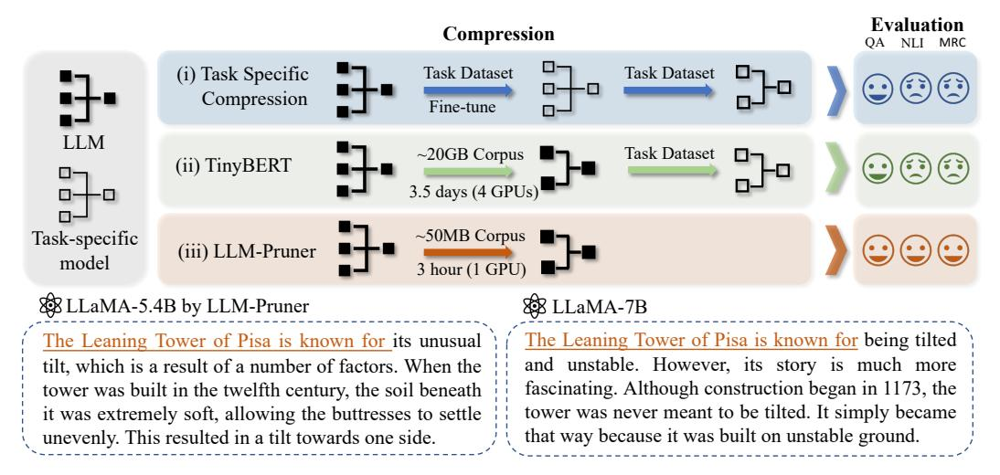

# 1 Introduction

Recently, Large Language Models (LLMs) [\[37,](#page-11-0) [49,](#page-12-0) [48,](#page-12-1) [42,](#page-12-2) [62,](#page-13-0) [4,](#page-10-0) [69\]](#page-13-1) have demonstrated remarkable proficiency in language understanding and generation. With the increase in model size, they are better equipped to handle complex tasks [\[3,](#page-10-1) [5,](#page-10-2) [56,](#page-13-2) [58\]](#page-13-3) and even exhibit emergent abilities [\[55\]](#page-12-3). However, notwithstanding their impressive performance, LLMs pose challenges in deployment and inference. Their extensive scale engenders substantial computational demands, and the multitude of parameters involved can induce long latencies and other related issues. Several techniques are proposed to solve these problems, like model pruning [\[54,](#page-12-4) [59,](#page-13-4) [67,](#page-13-5) [21\]](#page-11-1), knowledge distillation [\[44,](#page-12-5) [39,](#page-12-6) [45\]](#page-12-7),quantization [\[1,](#page-10-3) [13\]](#page-10-4) within the context of pre-trained language model (PLM).

While previous methods have effectively maintained model performance amidst parameter reduction, they primarily target compression within specialized domains or for designated tasks in the context of task-specific compression. For instance, a PLM is fine-tuned on a particular dataset, such as one of the classification tasks in the GLUE benchmark [\[51\]](#page-12-8), after which these models are distilled into a smaller classification model [\[44,](#page-12-5) [18\]](#page-11-2). Although this paradigm could potentially be employed for LLM compression, it compromises the LLM's capacity as a versatile task solver, rendering it suited to a single task exclusively.

∗Corresponding author

> **[图片提取文字 (无描述)]:**
> Evaluation Compression (i) Task Specific Task Dataset Task Dataset Compression Fine-tune ~20GB Corpus Task Dataset (ii) TinyBERT ~50MB Corpus Task-specific (iii) LLM-Pruner model 3 hour (1 GPU) XX LLaMA-5.4B by LLM-Pruner & LLaMA-7B The Leaning Tower of Pisa is known for its unusual The Leaning Tower of Pisa is known for being tilted and unstable. However, its story is much more tilt, which is a result of a number of factors. When the fascinating. Although construction began in 1173, the tower was built in the twelfth century, the soil beneath tower was never meant to be tilted. It simply became it was extremely soft, allowing the buttresses to settle that way because it was built on unstable ground. unevenly. This resulted in a tilt towards one side.

Figure 1: Illustration of LLM-Pruner. (i) Task-specific compression: the model is fine-tuned then compressed on a specific task. (ii) TinyBERT: First distill the model on unlabeled corpus and then fine-tune it on the specific task. (iii) LLM-Pruner: Task-agnostic compression within 3 hours.

Thus, we strive to compress the LLM in a new setting: to reduce the LLM's size while preserving its diverse capabilities as general-purpose task solvers, as depicted in Figure [1.](#page-1-0) This introduces the task-agnostic compression of LLMs, which presents two key challenges:

- The size of the training corpus of the LLM is enormous. Previous compression methods heavily depend on the training corpus. The LLM has escalated the corpus scale to 1 trillion tokens or more [\[17,](#page-10-5) [49\]](#page-12-0). The extensive storage needs and protracted transmission times make the dataset difficult to acquire. Furthermore, if the dataset is proprietary, acquisition of the training corpus verges on impossibility, a situation encountered in [\[69,](#page-13-1) [37\]](#page-11-0).
- The unacceptably long duration for the post-training of the pruned LLM. Existing methods require a substantial amount of time for post-training the smaller model [\[53,](#page-12-9) [28\]](#page-11-3). For instance, the general distillation in TinyBERT takes around 14 GPU days [\[20\]](#page-11-4). Even post-training a task-specific compressed model of BERT demands around 33 hours [\[59,](#page-13-4) [22\]](#page-11-5). As the size of both the model and corpus for LLMs increases rapidly, this step will invariably consume an even more extensive time.

To tackle the aforementioned challenges associated with the task-agnostic compression of LLMs, we introduce a novel approach called LLM-Pruner. Since our goal is to compress LLMs with reduced data dependency and expedited post-training, how to prune model with the minimal disruption to the origin is crucial. To accomplish this, we propose a dependency detection algorithm that identifies all the dependent structures within the model. Once the coupled structure is identified, we employ an efficient importance estimation strategy to select the optimal group for pruning under the task-agnostic setting, where the first-order information and an approximated hessian information is taken into account. Finally, a rapid recovery stage is executed to post-train the pruned model with limited data.

Contribution. In this paper, we propose a novel framework, LLM-Pruner, for the task-agnostic compression of the large language model. To the best of our knowledge, LLM-Pruner is the first framework designed for structured pruning of LLMs. We conclude the advantages of the LLM-Pruner as (i) Task-agnostic compression, where the compressed language model retains its ability to serve as a multi-task solver. (ii) Reduced demand for the original training corpus, where only 50k publicly available samples are needed for compression, significantly reducing the budget for acquiring the training data (iii) Quick compression, where the compression process ends up in three hours. (iv) An automatic structural pruning framework, where all the dependent structures are grouped without the need for any manual design. To evaluate the effectiveness of LLM-Pruner, we conduct extensive experiments on three large language models: LLaMA-7B, Vicuna-7B, and ChatGLM-6B. The compressed models are evaluated using nine datasets to assess both the generation quality and the zero-shot classification performance of the pruned models. The experimental results demonstrate that even with the removal of 20% of the parameters, the pruned model maintains 94.97% of the performance of the original model.

