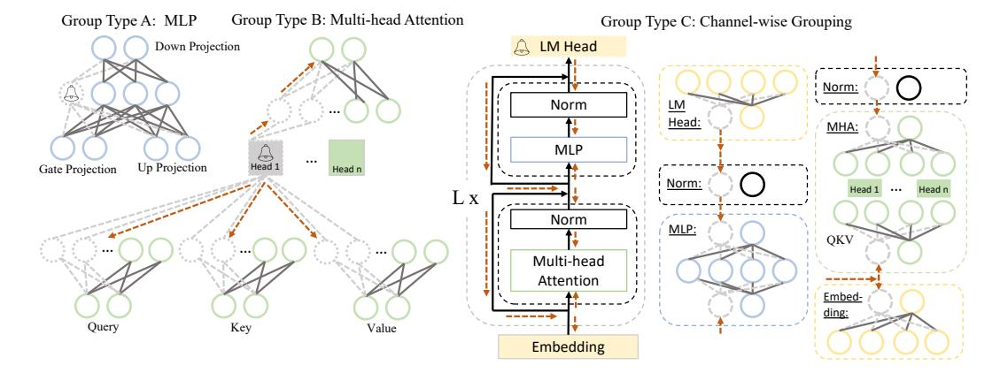
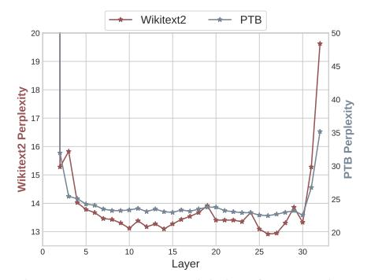
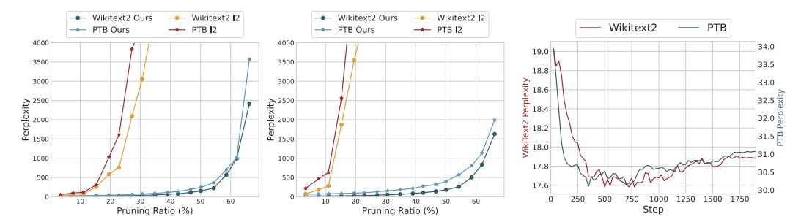

# 3 Methods

In this section, we provide a detailed explanation of LLM-Pruner. Following the conventional model compression pipeline[\[22\]](#page-11-5), LLM-Pruner consists of three steps: (1) Discovery Stage (Section [3.1\)](#page-2-0). This step focuses on identifying groups of interdependent structures within LLMs. (2) Estimation Stage (Section [3.2\)](#page-3-0). Once the coupled structures are grouped, the second step entails estimating the contribution of each group to the overall performance of the model and deciding which group to be pruned. (3) Recover Stage (Section [3.3\)](#page-4-0). This step involves fast post-training that alleviates potential performance degradation caused by the removal of structures.

### 3.1 Discover All Coupled Structure in LLMs

In light of the limited availability of data for post-training, it becomes imperative to prioritize the removal of structures with minimal damage when compressing the model. This underscores the dependency-based structural pruning, which ensures coupled structures are pruned in unison. We provide an experiment in Section [4.3](#page-7-0) to show the importance of dependency-based structural pruning when compressing the large language model.

Structure Dependency in LLMs. Similar to [\[11\]](#page-10-11), the pruning begins by building the dependency for LLMs. Assume Ni and Nj are two neurons in the model, In(Ni) and Out(Ni) represents all the neurons that point towards or point from Ni . The dependency between structures can be defined as:

$$N_j \in \operatorname{Out}(N_i) \wedge \operatorname{Deg}^-(N_j) = 1 \Rightarrow N_j \text{ is dependent on } N_i$$
 (1)

where Deg−(Nj ) represents the in-degree of neuron Nj . Noting that this dependency is directional, we can therefore correspondingly obtain another dependency:

$$N_i \in \operatorname{In}(N_j) \wedge \operatorname{Deg}^+(N_i) = 1 \Rightarrow N_i \text{ is dependent on } N_j$$
 (2)

where Deg+(Ni) represents the out-degree of neuron Ni . The principle of dependency here is, if a current neuron (e.g., Ni) depends solely on another neuron (e.g., Nj ), and the neuron Nj is subjected to pruning, it follows that the neuron Ni must also undergo pruning.

> **[图片提取文字 (无描述)]:**
> Group Type B: Multi-head Attention Group Type A: MLP Group Type C: Channel-wise Grouping Down Projection LM Head Norm: Norm LM Head: MHA: MLP ... Up Projection Gate Projection Head n Norm: Head 1 ... Head n Lx Norm MLP: QKV Multi-head Attention Embedding: Query Key Value Embedding

Figure 2: Illustration of the coupled structures in LLaMA. We simplify the neurons in each layer to make the dependent group clear. The trigger neuron, marked as a circle with a bell, cause weights with dependency pruned (dashed lines), which may propagate (red dashed lines) to coupled neurons (dashed circles). A group can be triggered by a variety of trigger neurons. Taking Group Type B as an example, the trigger for this group involves (i) the attention head, (ii) the output neuron in Query, Key or Value, and (iii) the input neuron in the final output projection.

**Trigger the Dependency Graph.** By having the definition of dependency, the coupled structures in the LLM can be analyzed automatically. Considering any neuron within the LLM as the initial trigger, it possesses the capability to activate neurons that depend on it. Subsequently, these newly triggered neurons can serve as the subsequent triggers to identify the dependency and activate their respective dependent neurons. This iterative process continues until no new neurons are detected. Those neurons then form a group for further pruning. Taking LLaMA as an example, by searching over all the neurons as the initial trigger, we can locate all the coupled structures, as shown in Figure 2.

Given the diversity in the structure of different LLMs, manual analysis and removal of coupled structures in each LLM could be extremely time-consuming. However, by employing LLM-Pruner, all coupled structures can be automatically identified and extracted.

### 3.2 Grouped Importance Estimation of Coupled Structure

Till now, all coupled structures within the model are grouped. Weights within the same group should be pruned simultaneously, as partial pruning not only increases parameter size but also introduces misaligned intermediate representations. Therefore, we estimate the importance of the group as a whole, as opposed to evaluating the importance of modules. Given the limited access to the training dataset, we explore the use of public datasets or manually created samples as alternative resources. Although the domains of these datasets may not perfectly align with the training set, they still provide valuable information for assessing the importance.

**Vector-wise Importance.** Suppose that given a dataset  $\mathcal{D} = \{x_i, y_i\}_{i=1}^N$ , where N is the number of samples. In our experiments, we set N equal to 10 and we use some public datasets as the source of  $\mathcal{D}$ . A group (as previously defined as a set of coupled structures) can be defined as  $\mathcal{G} = \{W_i\}_{i=1}^M$ , where M is the number of coupled structures in one group and  $W_i$  is the weight for each structure. While pruning, our goal is to remove the group that has the least impact on the model's prediction, which can be indicated by the deviation in the loss. Specially, to estimate the importance of  $W_i$ , the change in loss can be formulated as [24]:

$$I_{W_i} = |\Delta \mathcal{L}(\mathcal{D})| = |\mathcal{L}_{W_i}(\mathcal{D}) - \mathcal{L}_{W_i = 0}(\mathcal{D})| = |\underbrace{\frac{\partial \mathcal{L}^{\top}(\mathcal{D})}{\partial W_i} W_i}_{\neq 0} - \frac{1}{2} W_i^{\top} H W_i + \mathcal{O}\left(\|W_i\|^3\right)| \quad (3)$$

where H is the hessian matrix. Here,  $\mathcal{L}$  represents the next-token prediction loss. The first term is typically neglected in prior work [24, 52, 12], as the model has already converged on the training dataset, where  $\partial \mathcal{L}^{\top}/\partial W_i \approx 0$ . However, since  $\mathcal{D}$  here is not extracted from the original training data, which means that  $\partial \mathcal{L}^{\top}/\partial W_i \not\approx 0$ . This presents a desirable property for determining the importance

of  $W_i$  by the gradient term under LLMs, since computation of the second term, the Hessian matrix, on the LLM is impractical with  $\mathcal{O}(N^2)$  complexity.

**Element-wise Importance.** The above can be considered as an estimate for the weight  $W_i$ . We can derive another measure of importance at a finer granularity, where each parameter within  $W_i$  is assessed for its significance:

$$I_{W_{i}^{k}} = |\Delta \mathcal{L}(\mathcal{D})| = |\mathcal{L}_{W_{i}^{k}}(\mathcal{D}) - \mathcal{L}_{W_{i}^{k} = 0}(\mathcal{D})| = |\frac{\partial \mathcal{L}(\mathcal{D})}{\partial W_{i}^{k}} W_{i}^{k} - \frac{1}{2} W_{i}^{k} H_{kk} W_{i}^{k} + \mathcal{O}\left(\|W_{i}^{k}\|^{3}\right)|$$
(4)

Here, k represents the k-th parameter in  $W_i$ . The diagonal of the hessian  $H_{kk}$  can be approximated by the Fisher information matrix, and the importance can be defined as:

$$I_{W_i^k} = |\mathcal{L}_{W_i^k}(\mathcal{D}) - \mathcal{L}_{W_i^k = 0}(\mathcal{D})| \approx \left| \frac{\partial \mathcal{L}(\mathcal{D})}{\partial W_i^k} W_i^k - \frac{1}{2} \sum_{i=1}^N \left( \frac{\partial \mathcal{L}(\mathcal{D}_j)}{\partial W_i^k} W_i^k \right)^2 + \mathcal{O}\left( \|W_i^k\|^3 \right) \right| \quad (5)$$

**Group Importance.** By utilizing either  $I_{W_i^k}$  or  $I_{W_i}$ , we estimate the importance at the granularity of either a parameter or a weight. Remembering that our goal is to estimate the importance of  $\mathcal{G}$ , we aggregate the importance scores in four ways: (i) Summation:  $I_{\mathcal{G}} = \sum_{i=1}^M I_{W_i}$  or  $I_{\mathcal{G}} = \sum_{i=1}^M \sum_k I_{W_i^k}$ , (ii) Production:  $I_{\mathcal{G}} = \prod_{i=1}^M I_{W_i}$  or  $I_{\mathcal{G}} = \prod_{i=1}^M \sum_k I_{W_i^k}$ , (iii) Max:  $I_{\mathcal{G}} = \max_{i=1}^M I_{W_i}$  or  $I_{\mathcal{G}} = \max_{i=1}^M \sum_k I_{W_i^k}$ ; (iv) Last-Only: Since deleting the last executing structure in a dependency group is equivalent to erasing all the computed results within that group, we assign the importance of the last executing structure as the importance of the group:  $I_{\mathcal{G}} = I_{W_l}$  or  $I_{\mathcal{G}} = \sum_k I_{W_l^k}$ , where l is the last structure. After assessing the importance of each group, we rank the importance of each group and prune the groups with lower importance based on a predefined pruning ratio.

## 3.3 Fast Recovery with Low-rank Approximation

In order to expedite the model recovery process and improve its efficiency under limited data, it is crucial to minimize the number of parameters that need optimization during the recovery phase. To facilitate this, we employ the low-rank approximation, LoRA[19], to post-train the pruned model. Each learnable weight matrix in the model, denoted as W, encompassing both pruned and unpruned linear projection in the LLM, can be represented as W. The update value  $\Delta W$  for W can be decomposed as  $\Delta W = PQ \in \mathbb{R}^{d^- \times d^+}$ , where  $P \in \mathbb{R}^{d^- \times d}$  and  $Q \in \mathbb{R}^{d \times d^+}$ . The forward computation can now be expressed as:

$$f(x) = (W + \Delta W)X + b = (WX + b) + (PQ)X \tag{6}$$

where b is the bias in the dense layer. Only training P and Q reduces the overall training complexity, reducing the need for large-scale training data. Besides, the extra parameters P and Q can be reparameterized into  $\Delta W$ , which would not cause extra parameters in the final compressed model.

### 4 Experiments

### 4.1 Experimental Settings

**Foundation Large Language Model.** To showcase the effectiveness and versatility of LLM-Pruner, we test it over three open-source large language models with two kinds of structure: LLaMA-7B [49], Vicuna-7B [4] 2 and ChatGLM-6B [69].

**Evaluation and Datasets.** To assess the performance of the model in the task-agnostic setting, we follow LLaMa's evaluation to perform zero-shot task classification on common sense reasoning datasets: BoolQ [6], PIQA [2], HellaSwag [68], WinoGrande [41], ARC-easy [7], ARC-challenge [7] and OpenbookQA [36]. Follow [14], the model ranks the choices in the multiple choice tasks or generates the answer in the open-ended generation 3. Additionally, we complement our evaluation with a zero-shot perplexity (PPL) analysis on WikiText2 [35] and PTB [33].

&lt;sup>2https://huggingface.co/lmsys/vicuna-7b-delta-v0

&lt;sup>3https://github.com/EleutherAI/lm-evaluation-harness

Table 1: Zero-shot performance of the compressed LLaMA-7B. The average is calculated among seven classification datasets. 'Underline' indicates the best pruning-only performance, while 'bold' represents the overall best performance with the same pruning ratio, considering both pruning and post-training. The 'Channel' strategy only prunes the dependent group of Type C, while all other methods employ the 'Block' strategy to prune dependent groups in both Type A and Type B. Since [49] did not provide its prompt, the evaluation of the result with \* is performed under different prompts, which is lower than the official results.

| Pruning Ratio          | Method                                                 | WikiText2↓                     | PTB↓                           | BoolQ                          | PIQA                           | HellaSwag                      | WinoGrande                     | ARC-e                          | ARC-c                          | OBQA                           | Average                        |
|------------------------|--------------------------------------------------------|--------------------------------|--------------------------------|--------------------------------|--------------------------------|--------------------------------|--------------------------------|--------------------------------|--------------------------------|--------------------------------|--------------------------------|
| Ratio = 0%             | LLaMA-7B[49] LLaMA-7B*                              | 12.62                          | 22.14                          | 76.5 73.18                  | 79.8 78.35                  | 76.1 72.99                  | 70.1 67.01                  | 72.8 67.45                  | 47.6 41.38                  | 57.2 42.40                  | 68.59 63.25                 |
|                        | L2 Random                                           | 582.41 27.51                | 1022.17 43.19               | 59.66 61.83                 | 58.00 71.33                 | 37.04 56.26                 | 52.41 54.46                 | 33.12 57.07                 | 28.58 32.85                 | 29.80 35.00                 | 42.65 52.69                 |
| Ratio = 20%            | Channel                                                | 74.63                          | 153.75                         | 62.75                          | 62.73                          | 41.40                          | 51.07                          | 41.38                          | 27.90                          | 30.40                          | 45.38                          |
| w/o tune               | Vector                                                 | 22.28                          | 41.78                          | 61.44                          | 71.71                          | 57.27                          | 54.22                          | 55.77                          | 33.96                          | 38.40                          | 53.25                          |
|                        | Element 2                                   | 19.77                          | 36.66                          | 59.39                          | 75.57                          | 65.34                          | 61.33                          | 59.18                          | 37.12                          | 39.80                          | 56.82                          |
|                        | Element 1                                   | <u>19.09</u>                   | <u>34.21</u>                   | 57.06                          | 75.68                          | 66.80                          | 59.83                          | 60.94                          | 36.52                          | <u>40.00</u>                   | 56.69                          |
|                        | Channel                                                | 22.02                          | 38.67                          | 59.08                          | 73.39                          | 64.02                          | 60.54                          | 57.95                          | 35.58                          | 38.40                          | 55.57                          |
| Ratio = 20% w/ tune | Vector Element 2 Element 1 | 18.84 <b>17.37</b> 17.58 | 33.05 30.39 <b>30.11</b> | 65.75 <b>69.54</b> 64.62 | 74.70 76.44 <b>77.20</b> | 64.52 68.11 <b>68.80</b> | 59.35 <b>65.11</b> 63.14 | 60.65 63.43 <b>64.31</b> | 36.26 <b>37.88</b> 36.77 | 39.40 <b>40.00</b> 39.80 | 57.23 <b>60.07</b> 59.23 |

Table 2: Zero-shot performance of the compressed LLaMA-13B. Here we adopt Element1 as the importance estimation for 'Channel' and 'Block'.

| Pruning Ratio           | Method            | WikiText2↓     | PTB↓   Bool                   | Q PIQA       | HellaSwag      | WinoGrande     | ARC-e          | ARC-c          | OBQA           | Average        |
|-------------------------|-------------------|----------------|-------------------------------|--------------|----------------|----------------|----------------|----------------|----------------|----------------|
| Ratio = 0%              | LLaMA-13B*        | 11.58          | 20.24   68.4                  | 78.89        | 76.24          | 70.09          | 74.58          | 44.54          | 42.00          | 64.97          |
|                         | L2                | 61.15          | 91.43   61.5                  |              | 52.90          | 57.54          | 50.13          | 31.14          | 36.80          | 51.08          |
| Ratio = 20% w/o tune | Random Channel | 19.24 49.03 | 31.84   63.3 106.48   62.3 |              | 63.54 49.17 | 60.85 58.96 | 64.44 49.62 | 36.26 31.83 | 38.00 33.20 | 57.09 50.29 |
|                         | Block             | <u>16.01</u>   | <u>29.28</u> <u>67.6</u>      | <u>77.15</u> | <u>73.41</u>   | <u>65.11</u>   | <u>68.35</u>   | <u>38.40</u>   | <u>42.40</u>   | 61.79          |
|                         | L2                | 20.97          | 38.05   73.2                  |              | 71.86          | 64.64          | 67.59          | 39.93          | 40.80          | 62.12          |
| Ratio = 20% w/ tune  | Random Channel | 16.84 17.58 | 31.98   64.1 29.76   69.2  |              | 68.89 68.89 | 63.30 66.38 | 66.88 62.08 | 38.31 38.99 | 40.80 39.60 | 59.78 60.24 |
| w/ tune                 | Block             | 15.18          | 28.08 70.3                    |              | 75.16          | 67.88          | 71.09          | 42.41          | 43.40          | 64.02          |

**Implementation Details.** In the model pruning process, we use 10 randomly selected samples from Bookcorpus [70], each truncated to a sequence length of 128, as the calibration samples for establishing dependency and calculating the gradient for both LLaMA and Vicuna. For ChatGLM, we select 10 random samples from DailyDialog [27]. During the recovery phase, we utilize the cleaned version of Alpaca [47], which comprises approximately 50k samples. Remarkably, tuning these samples requires merely 3 hours on a single GPU with only 2 epochs. More hyper-parameters of pruning and training can be found in Appendix B.

Statistics of the Compressed Model. Table 3 presents the statistic of the 7B models that are used in our experiments: the parameter count, MACs, memory requirements and latency for running each model. The statistical evaluation is conducted using the infer-

Table 3: Statistics of the base model and the compressed model.

| Model                 | Strategy | Ratio | #Params | #MACs   | Memory     | Latency |
|-----------------------|----------|-------|---------|---------|------------|---------|
|                       | -        | -     | 6.74B   | 424.02G | 12884.5MiB | 69.32s  |
| LLaMA-7B Vicuna-7B | Channel  | 20%   | 5.39B   | 339.36G | 10363.6MiB | 61.50s  |
|                       | Block    | 20%   | 5.42B   | 339.60G | 10375.5MiB | 58.55s  |
|                       | Channel  | 50%   | 3.37B   | 212.58G | 6556.3MiB  | 40.11s  |
|                       | Block    | 50%   | 3.35B   | 206.59G | 6533.9MiB  | 37.54s  |

ence mode, where the model is fed a sentence consisting of 64 tokens. The latency is tested under the test set of WikiText2 on a single A5000. Here, the 'Block' strategy implies that the pruned unit in the model consists of Group Type A and Group Type B as illustrated in Figure 2, whereas 'Channel' indicates that the unit to be pruned is Group Type C. We delve into an analysis of these two choices in Section 4.2(Channel Strategy vs. Block Strategy). The pruning ratio stated here denotes the approximate ratio of parameters to be pruned since the number of parameters within each pruned structure does not perfectly match the total number of pruned parameters.

### 4.2 Zero-shot Performance

Table 1,2,4 and 5 shows the zero-shot performance of the pruned model. Based on the evaluation conducted on LLaMA, employing a 20% parameter reduction without post-training, the pruned

Table 4: Zero-shot performance of the compressed Vicuna-7B

| Pruned Model           | Method                                                 | WikiText2↓                     | PTB↓                     | BoolQ                          | PIQA                           | HellaSwag                      | WinoGrande                     | ARC-e                          | ARC-c                          | OBQA                           | Average                        |
|------------------------|--------------------------------------------------------|--------------------------------|--------------------------|--------------------------------|--------------------------------|--------------------------------|--------------------------------|--------------------------------|--------------------------------|--------------------------------|--------------------------------|
| Ratio = 0%             | Vicuna-7B                                              | 16.11                          | 61.37                    | 76.57                          | 77.75                          | 70.64                          | 67.40                          | 65.11                          | 41.21                          | 40.80                          | 62.78                          |
|                        | 12 random                                           | 3539.98 34.63               | 5882.21 112.44        | 55.90 61.47                 | 56.15 70.89                 | 32.37 54.67                 | 51.85 56.27                 | 30.01 55.60                 | 28.41 31.74                 | 28.20 34.60                 | 40.41 52.18                 |
| Ratio = 20%            | Channel                                                | 71.75                          | 198.88                   | 51.77                          | 63.93                          | 42.58                          | 55.17                          | 43.94                          | 29.27                          | 33.40                          | 45.72                          |
| w/o tune               | Vector Element 2 Element 1 | 27.03 <u>24.70</u> 25.74 | 92.51 94.34 92.88  | 62.17 62.87 61.70        | 71.44 <u>75.41</u> 75.30 | 55.80 <u>64.00</u> 63.75 | 53.43 <u>58.41</u> 56.20 | 55.77 60.98 <u>63.22</u> | 33.28 37.12 36.60        | 37.80 39.00 37.00        | 52.81 56.83 56.25        |
| Ratio = 20% w/ tune | Vector Element 2 Element 1 | 19.94 <b>18.97</b> 19.69 | <b>74.66</b> 76.78 78.25 | 63.15 60.40 <b>63.33</b> | 74.59 75.63 <b>76.17</b> | 61.95 <b>65.45</b> 65.13 | 60.30 <b>63.22</b> 60.22 | 60.48 <b>63.05</b> 62.84 | 36.60 <b>37.71</b> 37.12 | <b>39.40</b> 39.00 39.20 | 56.64 <b>57.78</b> 57.71 |

model manages to retain 89.8% of the performance exhibited by the unpruned model. Furthermore, through the efficient post-training, the classification accuracy further improves to 60.07%, achieving 94.97% of the accuracy attained by the original model. This demonstration proves the feasibility of using LLM-Pruner to effectively compress the model, even without relying on training data, and within a remarkably short period of time. Surprisingly, we discover that on most datasets, the pruned model with 5.4B LLaMA even outperformed chatGLM-6B. This highlights the superiority of the LLM-Pruner: if a smaller model with a customized size is required, LLM-Pruner is more cost-effective compared to retraining another model with a satisfying performance. However, with 50% parameters pruned, a large accuracy degradation is observed (see Appendix C.5). Compressing LLMs under high compression rates still remains a large challenge.

The compression results of Vicuna-7B align with those of LLaMA, as pruning 20% of parameters on Vicuna-7B maintains performance at 92.03% of the original model. We test a smaller pruning rate of 10% on chatGLM-7B, where the pruned model only experiences a marginal performance decrease of 0.89%, which can be recovered through post-training. Despite the pruned model outperforming the uncompressed model, we don't assert it is better than the original model. This is largely because chatGLM-6B, a bilingual model, has limited English pre-training exposure. Post-training, however, introduces it to more English corpus, albeit limited, improving its English comprehension.

**Ablation: Impact of Importance Estimation.** We conduct tests on all proposed importance estimation techniques mentioned in Section 3.2. The results can be found in Table 1 and 4. Here, *Element*n represents the importance evaluation utilizing the n-th order term in Eq.5. *Vector* represents the result corresponding to Eq.3. Based on the results obtained from LLaMA-7B and Vicuna-7B, pruning algorithms achieved the best average performance mostly by leveraging the second-order derivatives for each parameter. Nonetheless, given that first-order derivatives are considerably more efficient than second-order derivatives, though yielding slightly inferior results, we still vote for the first-order term as a competitive method. Besides, the results on chatGLM-7B differed significantly from these findings. The importance estimation on each parameter fails, performing even worse than 12, while the importance estimation on the weight matrix reaches the best performance.

Channel Strategy vs. Block Strategy. From the results presented in Table 2, it is evident that pruning 'Channel' significantly deteriorates performance compared to pruning 'Block'. This discrepancy arises because the layers within the stacked transformer do not evenly distribute their importance. As shown in Figure 3, the first and last layers have a profound impact on the model's performance, and pruning them results in more substantial performance degradation compared to other layers. However, due to the uniform treatment of the 'Channel' group across all layers, it becomes inevitable to prune the first and last layers, leading to a significant decline in performance.

> **[图片提取文字 (无描述)]:**
> Wikitext2 PTB Wikitext2 Perplexity Layer

Figure 3: Layer sensitivity for Pruning: Removing Groups in only one layer.

Table 5: Zero-shot Performance of the compressed ChatGLM-6B

| Pruned Model   | Method               | PIQA  | HellaSwag | WinoGrande | ARC-e | ARC-c | OBQA   Average       |
|----------------|----------------------|-------|-----------|------------|-------|-------|----------------------|
| Ratio = 0%     | ChatGLM-6B           | 67.95 | 46.37     | 52.33      | 48.36 | 29.95 | 37.40   47.05        |
|                | L2                   | 61.97 | 37.22     | 49.72      | 42.05 | 28.24 | 35.40   42.43        |
| Ratio = $10\%$ | Random               | 65.29 | 43.18     | 51.30      | 47.52 | 29.52 | 34.60 45.24          |
| w/o tune       | Vector               | 66.32 | 43.51     | 53.04      | 47.56 | 30.72 | <b>35.80</b> 46.16   |
|                | Element 1 | 54.35 | 28.07     | 50.59      | 27.82 | 24.66 | 33.20 36.45          |
| w/ tune        | Vector               | 67.74 | 46.35     | 53.99      | 51.01 | 29.95 | 35.00   <b>47.34</b> |

> **[图片提取文字 (无描述)]:**
> - Wikitext2 Ours → Wikitext2 I2 Wikitext2 Ours → Wikitext2 2 Wikitext2 PTB -- PTB Ours --- PTB |2 -- PTB Ours → PTB I2 4000 4000 34.0 19.0 3500 3500 33.5 18.8 3000 3000 Perplexity 18.4 33.0 32.5 Serplexity Perplexity 2000 1500 Perplexity 2000 1500 7 18.2 18.0 31.5 🖺 1000 1000 17.8 30.5 500 500 17.6 30.0 250 500 750 1000 1250 1500 1750 50 60 50 60 Step Pruning Ratio (%) Pruning Ratio (%)

Figure 4: The pruning results on LLaMA-7B (left) and Vicuna- Figure 5: Perplexity on zero-shot 7B (right) with different pruning rates.

