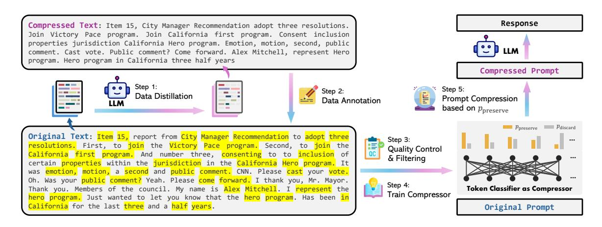
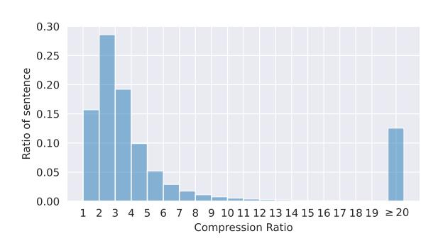
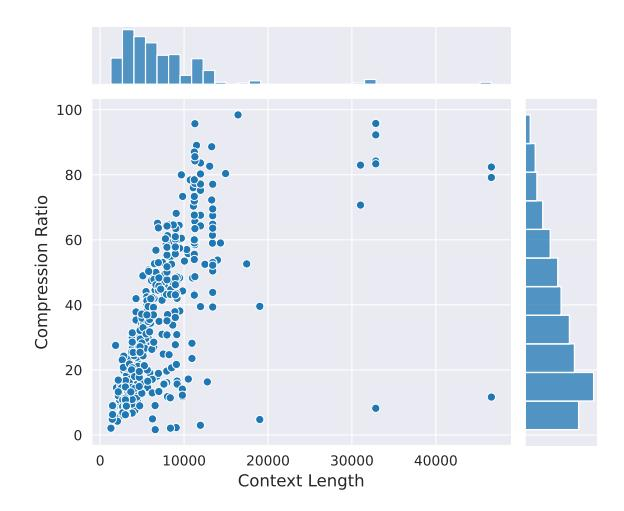

# LLMLingua-2: Data Distillation for Efficient and Faithful Task-Agnostic Prompt Compression

Zhuoshi Pan<sup>1</sup>†, Qianhui Wu<sup>2</sup>†, Huiqiang Jiang<sup>2</sup>, Menglin Xia<sup>2</sup>, Xufang Luo<sup>2</sup>, Jue Zhang<sup>2</sup>, Qingwei Lin<sup>2</sup>, Victor Rühle<sup>2</sup>, Yuqing Yang<sup>2</sup>, Chin-Yew Lin<sup>2</sup>, H. Vicky Zhao<sup>1</sup>, Lili Qiu<sup>2</sup>, Dongmei Zhang<sup>2</sup>

<sup>1</sup> Tsinghua University, <sup>2</sup> Microsoft Corporation {qianhuiwu, hjianq, xufanq.luo}@microsoft.com

## **Abstract**

This paper focuses on task-agnostic prompt compression for better generalizability and efficiency. Considering the redundancy in natural language, existing approaches compress prompts by removing tokens or lexical units according to their information entropy obtained from a causal language model such as LLaMa-7B. The challenge is that information entropy may be a suboptimal compression metric: (i) it only leverages unidirectional context and may fail to capture all essential information needed for prompt compression; (ii) it is not aligned with the prompt compression objective.

To address these issues, we propose a data distillation procedure to derive knowledge from an LLM to compress prompts without losing crucial information, and meantime, introduce an extractive text compression dataset. We formulate prompt compression as a token classification problem to guarantee the faithfulness of the compressed prompt to the original one, and use a Transformer encoder as the base architecture to capture all essential information for prompt compression from the full bidirectional context. Our approach leads to lower latency by explicitly learning the compression objective with smaller models such as XLM-RoBERTalarge and mBERT.

We evaluate our method on both in-domain and out-of-domain datasets, including Meeting-Bank, LongBench, ZeroScrolls, GSM8K, and BBH. Despite its small size, our model shows significant performance gains over strong baselines and demonstrates robust generalization ability across different LLMs. Additionally, our model is 3x-6x faster than existing prompt compression methods, while accelerating the end-to-end latency by 1.6x-2.9x with compression ratios of 2x-5x.<sup>1</sup>

## 1 Introduction

Recent years have witnessed the emergence of various prompting techniques for large language models (LLMs), such as Chain-of-Thought (COT) (Wei et al., 2022), In-context Learning (ICL) (Dong et al., 2023), and Retrieval Augmented Generation (RAG) (Lewis et al., 2020). These techniques empower LLMs to handle complex and varied tasks through rich and informative prompts that may exceed tens of thousands of tokens. However, the benefits of such lengthy prompts come at a cost of increased computational and financial overhead, as well as the degraded information perception ability of LLMs. Prompt compression is a straightforward solution to address these issues, which attempts to shorten the original prompts without losing essential information.

Several methods have been proposed to compress prompts in a *task-aware* manner (Jiang et al., 2023b; Xu et al., 2024; Jung and Kim, 2023; Huang et al., 2023). These techniques aim to generate compressed prompts tailored to the specific task or query, typically resulting in enhanced performance on downstream tasks, particularly in question answering. However, the dependency on task-specific features presents challenges in terms of efficiency and generalizability when deploying these methods. For example, in RAG-style applications, it may become necessary to compress the same documents multiple times depending on the associated queries with task-aware prompt compression. More details are discussed in Sec. 2.

Some works have explored *task-agnostic* prompt compression methods for better generalizability and efficiency (Jiang et al., 2023a; Li et al., 2023). The underlying assumption is that *natural language* contains redundancy (Shannon, 1951) that may be useful for human understanding but might not be necessary for LLMs. Therefore, they propose to compress prompts by removing tokens (Jiang et al.,

<sup>†</sup>Work during internship at Microsoft.

<sup>&</sup>lt;sup>‡</sup>Corresponding author.

<span id="page-0-0"></span><sup>&</sup>lt;sup>1</sup>Code: https://aka.ms/LLMLingua-2

[2023a\)](#page-9-5) or lexical units [\(Li et al.,](#page-9-6) [2023\)](#page-9-6) according to their information entropy obtained from a causal small language model (SLM), regardless of the downstream task or question information. However, these task-agnostic methods face two challenges: (i) Information entropy is an empirical metric for prompt compression. Relying on it for prompt trimming may be suboptimal, as it is not aligned with the prompt compression objective. (ii) Causal LMs only leverage unidirectional context, which may fail to capture all essential information needed for prompt compression within the context.

The challenges lead to the following research questions:

- Q1. How can we identify or build a suitable dataset to align the SLM towards effective prompt compression?
- Q2. How can we design a compression algorithm that effectively leverages the full bidirectional context for better performance?

For Q1, most text compression datasets are *abstractive* [\(Toutanova et al.,](#page-10-3) [2016;](#page-10-3) [Koupaee and](#page-9-7) [Wang,](#page-9-7) [2018;](#page-9-7) [Kim et al.,](#page-9-8) [2019\)](#page-9-8), meaning that they treat prompt compression as a generative task where the original prompts are rephrased into condensed ones. However, this autoregressive generation process is slow and it may produce hallucinated content [\(Zhao et al.,](#page-10-4) [2020\)](#page-10-4). On the other hand, *extractive* compression datasets such as Sent-Comp [\(Filippova and Altun,](#page-9-9) [2013\)](#page-9-9) and DebateSum [\(Roush and Balaji,](#page-10-5) [2020\)](#page-10-5) are usually created for the summarization task and often lack detailed information. In the case of prompt compression, this will hurt the performance of LLM inference in downstream applications such as QA (see Appendix [G](#page-12-0) for some examples). Therefore, it is necessary to construct an extractive text compression dataset that retains essential information.

Contributions. We present this paper to address the above challenges for task-agnostic prompt compression. We make the following contributions.

• We propose a data distillation procedure to derive knowledge from an LLM (GPT-4) to compress the prompts without losing crucial information. We introduce an extractive text compression dataset, containing pairs of original texts from MeetingBank [\(Hu et al.,](#page-9-10) [2023\)](#page-9-10) and their compressed versions. We publicly release the dataset.

- We approach prompt compression as a token classification task (*i.e.*, preserve or discard), and take the predicted probability of each token being labeled as preserve as the compression metric. The benefits are three folds: (1) It can capture all essential information needed for prompt compression from the full bidirectional context by using a Transformer encoder for feature extraction. (2) It can lead to lower latency, due to the use of smaller models to explicitly learn the compression objective. (3) It guarantees faithfulness of the compressed prompt to the original content.
- We conduct extensive experiments and analysis on both in-domain (*i.e.*, MeetingBank) and out-of-domain datasets (*i.e.*, LongBench, ZeroScrolls, GSM8K, and Big Bench Hard). Despite small in size, our model shows significant performance gains over strong baselines and demonstrates robust generalization ability from GPT-3.5-Turbo to Mistral-7B. Additionally, our model is 3x-6x faster than existing prompt compression methods, while accelerating the end-to-end latency by 1.6x-2.9x with compression ratios of 2x-5x.

## <span id="page-1-0"></span>2 Related Works

Depending on whether task information is used for compression, prompt compression methods can be categorized into task-aware and task-agnostic compression approaches.

Task-aware compression compresses the context based on the downstream task or the current query. For example, LongLLMLingua [\(Jiang et al.,](#page-9-2) [2023b\)](#page-9-2) applies a question-aware coarse-to-fine compression approach to estimate the information entropy of the tokens and adapts the estimation according to the question. Reinforcement Learning (RL) based methods [\(Jung and Kim,](#page-9-3) [2023;](#page-9-3) [Huang et al.,](#page-9-4) [2023\)](#page-9-4) usually train a model for prompt compression with reward signals from downstream tasks. Soft prompt tuning methods [\(Wingate et al.,](#page-10-6) [2022;](#page-10-6) [Mu et al.,](#page-10-7) [2023\)](#page-10-7) typically require fine-tuning for the specific task. [Xu et al.](#page-10-1) [\(2024\)](#page-10-1) trains a summarization model to compress the context depending on the question. Task-aware compression approaches are usually tailored for specific tasks and compression ratios, which may limit their generalizability in real-world applications.

Task-agnostic methods compress the prompt without considering the specific task, making it

> **[图片提取文字 (无描述)]:**
> Response Compressed Text: Item 15, City Manager Recommendation adopt three resolutions. Join Victory Pace program. Join California first program. Consent inclusion properties jurisdiction California Hero program. Emotion, motion, second, public comment. Cast vote. Public comment? Come forward. Alex Mitchell, represent Hero program. Hero program in California three half years Compressed Prompt Step 1: Step 5: Step 2: Data Distillation Prompt Compression Data Annotation based on  $p_{\text{preserve}}$ p<sub>preserve</sub> p<sub>discard</sub> Original Text: Item 15, report from City Manager Recommendation to adopt three Step 3: ac resolutions. First, to join the Victory Pace program. Second, to join the Quality Control California first program. And number three, consenting to to inclusion of & Filtering certain properties within the jurisdiction in the California Hero program. It was emotion, motion, a second and public comment. CNN. Please cast your vote. Oh. Was your public comment? Yeah. Please come forward. I thank you, Mr. Mayor. Step 4: **Token Classifier as Compressor** Thank you. Members of the council. My name is Alex Mitchell. I represent the Train Compressor hero program. Just wanted to let you know that the hero program. Has been in California for the last three and a half years. Original Prompt


Figure 1: Overview of LLMLingua-2.

more adaptable to a range of applications and blackbox LLMs. However, producing compressed text that can generalize well to different tasks is not trivial. Typical methods involve using information entropy-based metrics to remove redundant information in the prompt [\(Li et al.,](#page-9-6) [2023;](#page-9-6) [Jiang et al.,](#page-9-5) [2023a\)](#page-9-5). They employ a small language model to estimate token importance from the information metrics. Despite being training-free, these methods may not effectively capture the token importance distribution optimized for specific LLMs and often entail high computation overhead. Summarizationbased methods are also leveraged for task-agnostic compression [\(Chen et al.,](#page-9-11) [2023;](#page-9-11) [Packer et al.,](#page-10-8) [2023\)](#page-10-8). However, they often omit crucial details and do not generalize well. An alternative approach is to compress or trim the context hidden or KV caches [\(Chevalier et al.,](#page-9-12) [2023;](#page-9-12) [Ge et al.,](#page-9-13) [2024;](#page-9-13) [Zhang et al.,](#page-10-9) [2023;](#page-10-9) [Liu et al.,](#page-10-10) [2023;](#page-10-10) [Xiao et al.,](#page-10-11) [2024\)](#page-10-11). However, this is orthogonal to our work and cannot be easily applied to black-box LLMs.

## <span id="page-2-1"></span>3 Dataset Construction

In this section, we outline the process of dataset construction for prompt compression. We first introduce our data distillation procedure, which involves extracting knowledge from an LLM (GPT-4 ) to compress texts without losing crucial information or introducing hallucinated content (Sec. [3.1\)](#page-2-0). Leveraging the distilled knowledge from the LLM, we explain our data annotation algorithm, which assigns labels to each word in the original text to indicate whether it should be preserved after compression (Sec. [3.2\)](#page-3-0). To ensure the dataset's quality, we propose two quality control metrics for filtering low-quality samples (Sec. [3.3\)](#page-3-1).

## <span id="page-2-0"></span>3.1 Data Distillation

To extract knowledge from the LLM for effective prompt compression, our goal is to prompt GPT-4 to generate compressed texts from original texts that meet the following criteria: (i) *Token reduction*: Compressed prompts should be short in length to reduce cost and speed up inference. (ii) *Informativeness*: Essential information should be retained. (iii) *Faithfulness*: Compressed prompts should remain faithful and avoid introducing hallucinated content to ensure accuracy when prompting LLMs in downstream tasks.

However, distilling such data from GPT-4 is challenging, as it does not consistently follow the instructions. For instance, [Jiang et al.](#page-9-5) [\(2023a\)](#page-9-5) experimented with different prompts for compression and found that GPT-4 struggles to retain essential information from original texts. In our preliminary experiments, we have also observed that GPT-4 tends to modify expressions used in the original texts and sometimes generates hallucinated content. To address this challenge, we propose the following dataset distillation procedure.

Instruction Design A well-crafted instruction is the key to unveiling the compression capabilities of GPT-4. To ensure that the generated texts stay *faithful* to the original, we explicitly instruct GPT-4 to compress the text by discarding unimportant words in the original texts only and not adding any new words during generation.

To ensure *token reduction* and *informativeness*, previous studies [\(Jiang et al.,](#page-9-5) [2023a;](#page-9-5) [Huang et al.,](#page-9-4) [2023\)](#page-9-4) have specified either a compression ratio or a target number of compressed tokens in the instructions. However, GPT-4 often fails to adhere to these restrictions. Additionally, the information

### **Our Instruction for Compression:**

Compress the given text to short expressions, and such that you (GPT-4) can reconstruct it as close as possible to the original. Unlike the usual text compression, I need you to comply with the 5 conditions below:

- 1. You can ONLY remove unimportant words.
- 2. Do not reorder the original words.
- 3. Do not change the original words.
- 4. Do not use abbreviations or emojis.
- 5. Do not add new words or symbols.

Compress the origin aggressively by removing words only. Compress the origin as short as you can, while retaining as much information as possible. If you understand, please compress the following text: {text to compress} The compressed text is:

Figure 2: Our instruction used for data distillation.

<span id="page-3-2"></span>> **[图片提取文字 (无描述)]:**
> 0.30 0.25 Ratio of sentence 0.20 0.15 0.10 0.05 0.00 2 3 4 5  $8 9 10111213141516171819 \ge 20$ 6 Compression Ratio


Figure 3: Distribution of compression ratio after chunkwise compression on MeetingBank.

density of text can vary significantly depending on its genre, style, etc. For instance, news articles typically contain denser information compared to meeting transcripts. Furthermore, even within the domain of meeting transcripts, the information density from different speakers may vary. These factors suggest that a fixed compression ratio may not be optimal. Therefore, we remove the compression ratio restriction from our instructions and instead prompt GPT-4 to compress the origin text as short as possible while retaining as much information as possible. As shown in Fig. 3, GPT-4 assigns varying compression ratios to different sentences and discards some sentences entirely. For a comparison between our instruction and those of Jiang et al. (2023a), please refer to Table 7.

Chunk-Wise Compression Empirically, we have found that the length of the original text has a notable influence on the compression performance. As shown in Fig. 4, GPT-4 tends to apply a high compression ratio when processing very long context, which might be due to GPT-4's limited ability to handle long context. This aggressive compres-

<span id="page-3-3"></span>> **[图片提取文字 (无描述)]:**
> Compression Ratio Context Length


Figure 4: Illustration of compression ratio *w.r.t.* original context length on MeetingBank. We use GPT-4-32k with the output token limit setting to 4096.

sion leads to substantial information loss, significantly impacting the performance of downstream tasks. To mitigate this issue, we first segment each long context into multiple chunks, each containing no more than 512 tokens and ending with a period. We then instruct GPT-4 to compress each chunk individually.

## <span id="page-3-0"></span>3.2 Data Annotation

Having obtained pairs of original texts and their compressed versions from data distillation (Sec. 3.1), the goal of data annotation is to assign a *binary* label to each token in the original texts to determine if it should be preserved or discarded after compression. Fig. 5 describes the three primary obstacles encountered here, which arise from GPT-4's inability to precisely comply with the instruction in Fig. 9. Alg. 1 outlines the overall procedure of the proposed annotation algorithm designed to deal with these obstacles. For more detailed information, please refer to Appendix B.

## <span id="page-3-1"></span>3.3 **Quality Control**

We introduce two quality control metrics to assess the quality of the compressed texts generated by GPT-4 distillation, as well as the quality of the automatically annotated labels. We then filter the examples by their scores.

**Variation Rate** As GPT-4 may fail to follow the instructions, we introduce the metric *Variation Rate* (VR) to evaluate the quality of the compressed texts generated from data distillation. VR measures the proportion of words in the compressed text that are

### <span id="page-4-0"></span>**Original Texts**

Item 15, report from City Manager Recommendation to adopt three resolutions. First, to join the Victory Pace program. Second, to join the California first program. And number three, consenting to to inclusion of certain properties within the jurisdiction in the California Hero program.

#### **Compressed Texts**

City Manager Recommendation adopt three resolutions. Join California first program. Consent properties inclusion jurisdiction California Hero program.

Figure 5: Challenges in data annotation.

- (i) Ambiguity: a word in the compressed texts may appear multiple times in the original content.
- (ii) Variation: GPT-4 may modify the original words in tense, plural form, *etc*. during compression.
- (iii) Reordering: The order of words may be changed after compression.

## Algorithm 1: Data Annotation

<span id="page-4-1"></span> $\begin{array}{c} \textbf{Input} \quad \text{:} \text{original string } S_{ori}, \text{ compressed} \\ \text{string } S_{comp}, \text{ window size } s. \\ \text{Split original string } S_{ori} \text{ to word list } \mathbb{S}_{ori}. \\ \text{Split compressed } S_{comp} \text{ to word list } \mathbb{S}_{comp}. \\ \text{Initialize labels of original words to } False. \\ \text{Initialize previous match index } prev \text{ to } 0. \\ \end{array}$ 

```
\begin{array}{c|c} \textbf{for} \ w \in \mathbb{S}_{comp} \ \textbf{do} \\ \hline \ \textbf{for} \ i = 1, 2, ..., \frac{s}{2} \ \textbf{do} \\ \hline \ \ \ \ \ \ \ \ \ \ \ \ \ \ \ \ \ \
```

absent in the original text. Specifically, let  $\mathbb{S}_{comp}$  be the set of words in the compressed text and  $\mathbb{S}_{ori}$  be that of the original text. VR is defined as:

**Output:** labels of original words  $\mathbb{L}(\mathbb{S}_{ori})$ .

$$VR = \frac{1}{|\mathbb{S}_{comp}|} \sum_{w \in \mathbb{S}_{comp}} \mathbb{I}(w \notin \mathbb{S}_{ori}), \quad (1)$$

where  $|\cdot|$  is the cardinality of a set. A higher variation rate implies a higher likelihood of encountering hallucinated content. Therefore, we exclude the

examples with the top 5% highest variation rates.

**Alignment Gap** We propose *Alignment Gap* (AG) to evaluate the quality of the automatically annotated labels. Let  $l(\cdot)$  represent the annotation function, where  $l(w) = \mathit{True}$  signifies that word  $w \in \mathbb{S}_{ori}$  corresponds to a word in  $\mathbb{S}_{comp}$ . We firstly define the matching rate (MR) as:

$$MR = \frac{1}{|\mathbb{S}_{ori}|} \sum_{w \in \mathbb{S}_{ori}} \mathbb{I}(l(w) = True).$$
 (2)

Since there exists a many-to-one word mapping from  $\mathbb{S}_{ori}$  to  $\mathbb{S}_{comp}$  (*i.e.*, the "Ambiguity" challenge presented in Sec. 3.2), we further present a hitting rate (HR) as a regularization term to measure the proportion of words in  $\mathbb{S}_{comp}$  that are found in  $\mathbb{S}_{ori}$ . HR is defined as:

$$HR = \frac{1}{|\mathbb{S}_{ori}|} \sum_{w \in \mathbb{S}_{comp}} \mathbb{I}(w \in \mathbb{S}_{ori}).$$
 (3)

Finally, the Alignment Gap (AG) is defined as:

$$AG = HR - MR. (4)$$

The alignment gap of a perfect annotation should be 0. A large AG indicates a high hitting rate with a poor matching rate, implying low-quality annotation for this example. Therefore, we discard examples of the highest 10% alignment gap to ensure quality control of the dataset.

## 4 Compressor

We formulate prompt compression as a binary token classification problem (*i.e.*, preserve or discard) to guarantee the faithfulness of the compressed prompt to the original content, and meantime ensure the low latency of the compression model itself. For the token classification model, we employ a Transformer encoder as the feature extractor to leverage information from the bidirectional contexts of each token. We train the classification model on the dataset constructed in Sec. 3 from MeetingBank (Hu et al., 2023). During inference, we determine whether to preserve or discard each token in the original prompt based on its probability calculated by our classification model.

## 4.1 Token Classification Model

**Architecture** We utilize a Transformer encoder (Devlin et al., 2019) as the feature encoder  $f_{\theta}$  and add a linear classification layer on top. Given

<span id="page-5-2"></span>

| Methods           | QA    |              |        | Summa        | ary          |        | Length   |      |  |
|-------------------|-------|--------------|--------|--------------|--------------|--------|----------|------|--|
| TVICTIOUS         | EM    | BLEU         | Rouge1 | Rouge2       | BERTScore    | Tokens | $1/\tau$ |      |  |
| Selective-Context | 66.28 | 10.83        | 39.21  | 18.73        | 27.67        | 84.48  | 1,222    | 2.5x |  |
| LLMLingua         | 67.52 | 8.94         | 37.98  | 14.08        | 26.58        | 86.42  | 1,176    | 2.5x |  |
| LLMLingua-2-small | 85.82 | 17.41        | 48.33  | 23.07        | 34.36        | 88.77  | 984      | 3.0x |  |
| LLMLingua-2       | 86.92 | <u>17.37</u> | 48.64  | <u>22.96</u> | <u>34.24</u> | 88.27  | 970      | 3.1x |  |
| Original          | 87.75 | 22.34        | 47.28  | 26.66        | 35.15        | 88.96  | 3,003    | 1.0x |  |

Table 1: In-domain evaluation of different methods on MeetingBank.

an original prompt consisting of N words  $x = \{x_i\}_{i=1}^N$ , this can be formulated as:

$$h = f_{\theta}(x), \tag{5}$$

$$p(x_i, \Theta) = \operatorname{softmax}(Wh_i + b),$$
 (6)

where  $h = \{h_i\}_{i=1}^N$  denotes feature vectors for all words,  $p(x_i, \Theta) \in \mathbb{R}^2$  denotes the probability distribution of labels  $\{\texttt{preserve}, \texttt{discard}\}$  for the i-th word  $x_i$ , and  $\Theta = \{\theta, W, b\}$  represent all the trainable parameters.

**Training** Let  $y = \{y_i\}_{i=1}^N$  denote the corresponding labels for all words in x, then we employ cross entropy loss to train the model. The loss function  $\mathcal{L}$  w.r.t. x is:

$$\mathcal{L}(\Theta) = \frac{1}{N} \sum_{i=1}^{N} \text{CrossEntropy}(y_i, p(x_i, \Theta)).$$
 (7)

#### 4.2 Compression Strategy

Our approach to compressing the original prompt  $x = \{x_i\}_{i=1}^N$  with a target compression ratio  $1/\tau$  involves a three-step process, where  $\tau$  is defined as the quotient of the number of words in the compressed prompt and the number of words in the original prompt x. First, we derive the target number of tokens to be preserved in the compressed prompt  $\tilde{x}$ :  $\tilde{N} = \tau N$ . Next, we use the token classification model to predict the probability  $p_i$  of each word  $x_i$  being labeled as preserve<sup>2</sup>. Finally, we retain the top  $\tilde{N}$  words in the original prompt x with the highest  $p_i$  and maintain their original order to form the compressed prompt  $\tilde{x}$ .

It's worth noting that our approach can be readily integrated into the coarse-to-fine framework proposed in LLMLingua (Jiang et al., 2023a), allowing

for a higher compression ratio of  $\sim 15x$  for tasks involving multiple demonstrations or documents. Particularly, we can replace the perplexity-based iterative token compression module in LLMLingua with our token-classification-based compressor, while keeping the budget controller unchanged. Detailed information can be found in Appendix K.

## 5 Experiment

Implementation Details We construct our extractive text compression dataset using training examples from MeetingBank (Hu et al., 2023) with implementation details in Appendix A. Our approach is implemented using Huggingface's Transformers and PyTorch 2.0.1 with CUDA-11.7. We use xlm-roberta-large (Conneau et al., 2020) and multilingual-BERT (Devlin et al., 2019) for the feature encoder  $f_{\theta}$  in our compressor, which we refer to as LLMLingua-2 and LLMLingua-2-small, respectively. We finetune both models for 10 epochs, using the Adam optimizer (Kingma and Ba, 2015) with a learning rate of 1e-5 and a batch size of 10. Unless specified otherwise, all reported metrics use GPT-3.5-Turbo-0613<sup>3</sup> as the target LLM for downstream tasks, with greedy decoding at a temperature of 0 for enhanced stability across experiments.

**Datasets & Evaluation Metrics** We conduct five groups of experiments to evaluate the compressed prompts on two groups of datasets.

(i) In-Domain: As we train our compressor using the dataset built with training examples from MeetingBank (Hu et al., 2023), we use the **MeetingBank** test examples for in-domain evaluation. In addition to the *summarization* task, we further introduce a *QA* task by prompting GPT-4 to generate 3 question-answer pairs for each example distributed across the whole context (see Appendix F

<span id="page-5-0"></span><sup>&</sup>lt;sup>2</sup>To address tokenization-related challenges that arise when applying our approach across various LLMs and SLMs, we preserve the integrity of multi-token words and represent the probability of a word by averaging over the predicted probabilities of all subword tokens.

<span id="page-5-1"></span><sup>3</sup>https://platform.openai.com/

<span id="page-6-0"></span>

| Methods                          |                        |             |             | LongBen     | ch          |             |             |        |          | Zero        | SCROI  | LLS      |
|----------------------------------|------------------------|-------------|-------------|-------------|-------------|-------------|-------------|--------|----------|-------------|--------|----------|
|                                  | SingleDoc              | MultiDoc    | Summ.       | FewShot     | Synth.      | Code        | AVG         | Tokens | $1/\tau$ | AVG         | Tokens | $1/\tau$ |
|                                  | 2,000-token constraint |             |             |             |             |             |             |        |          |             |        |          |
| Task(Question)-Aware Compression |                        |             |             |             |             |             |             |        |          |             |        |          |
| $SBERT^{\dagger}$                | 33.8                   | 35.9        | 25.9        | 23.5        | 18.0        | 17.8        | 25.8        | 1,947  | 5x       | 20.5        | 1,773  | 6x       |
| OpenAI <sup>†</sup>              | 34.3                   | 36.3        | 24.7        | 32.4        | 26.3        | 24.8        | 29.8        | 1,991  | 5x       | 20.6        | 1,784  | 5x       |
| LongLLMLingua†                   | 39.0                   | 42.2        | 27.4        | 69.3        | 53.8        | 56.6        | 48.0        | 1,809  | 6x       | 32.5        | 1,753  | 6x       |
| Task(Question)-Agnos             | tic Compres.           | sion        |             |             |             |             |             |        |          |             |        |          |
| Selective-Context <sup>†</sup>   | 16.2                   | 34.8        | 24.4        | 15.7        | 8.4         | 49.2        | 24.8        | 1,925  | 5x       | 19.4        | 1,865  | 5x       |
| LLMLingua <sup>†</sup>           | 22.4                   | 32.1        | <u>24.5</u> | 61.2        | 10.4        | 56.8        | 34.6        | 1,950  | 5x       | 27.2        | 1,862  | 5x       |
| LLMLingua-2-small                | <u>29.5</u>            | 32.0        | <u>24.5</u> | <u>64.8</u> | 22.3        | 56.2        | <u>38.2</u> | 1,891  | 5x       | <u>33.3</u> | 1,862  | 5x       |
| LLMLingua-2                      | 29.8                   | <u>33.1</u> | 25.3        | 66.4        | <u>21.3</u> | 58.9        | 39.1        | 1,954  | 5x       | 33.4        | 1,898  | 5x       |
|                                  |                        |             | 3,000-      | tokens co   | nstraint    |             |             |        |          |             |        |          |
| Task(Question)-Aware             | Compressio             | n           |             |             |             |             |             |        |          |             |        |          |
| $SBERT^{\dagger}$                | 35.3                   | 37.4        | 26.7        | 63.4        | 51.0        | 34.5        | 41.4        | 3,399  | 3x       | 24.0        | 3,340  | 3x       |
| OpenAI <sup>†</sup>              | 34.5                   | 38.6        | 26.8        | 63.4        | 49.6        | 37.6        | 41.7        | 3,421  | 3x       | 22.4        | 3,362  | 3x       |
| LongLLMLingua†                   | 40.7                   | 46.2        | 27.2        | 70.6        | 53.0        | 55.2        | 48.8        | 3,283  | 3x       | 32.8        | 3,412  | 3x       |
| Task(Question)-Agnos             | tic Compres.           | sion        |             |             |             |             |             |        |          |             |        |          |
| Selective-Context <sup>†</sup>   | 23.3                   | 39.2        | 25.0        | 23.8        | 27.5        | 53.1        | 32.0        | 3,328  | 3x       | 20.7        | 3,460  | 3x       |
| LLMLingua <sup>†</sup>           | 31.8                   | 37.5        | <u>26.2</u> | 67.2        | 8.3         | 53.2        | 37.4        | 3,421  | 3x       | 30.7        | 3,366  | 3x       |
| LLMLingua-2-small                | 35.5                   | 38.1        | <u>26.2</u> | <u>67.5</u> | <u>23.9</u> | <u>60.0</u> | <u>41.9</u> | 3,278  | 3x       | 33.4        | 3,089  | 3x       |
| LLMLingua-2                      | 35.5                   | <u>38.7</u> | 26.3        | 69.6        | 21.4        | 62.8        | 42.4        | 3,392  | 3x       | 33.5        | 3,206  | 3x       |
| Original Prompt                  | 39.7                   | 38.7        | 26.5        | 67.0        | 37.8        | 54.2        | 44.0        | 10,295 | -        | 34.7        | 9,788  | -        |
| Zero-Shot                        | 15.6                   | 31.3        | 15.6        | 40.7        | 1.6         | 36.2        | 23.5        | 214    | 48x      | 10.8        | 32     | 306x     |

Table 2: Out-of-domain evaluation on general long-context scenarios. †: numbers reported in Jiang et al. (2023b).

<span id="page-6-1"></span>

|                                |              |            | GSM      | 18K    |                      |          |       |                   | BB       | Н     |                      |          |  |
|--------------------------------|--------------|------------|----------|--------|----------------------|----------|-------|-------------------|----------|-------|----------------------|----------|--|
| Methods                        | 1-sh         | ot constra | int      | half-s | half-shot constraint |          |       | 1-shot constraint |          |       | half-shot constraint |          |  |
|                                | EM           | Tokens     | $1/\tau$ | EM     | Tokens               | $1/\tau$ | EM    | Tokens            | $1/\tau$ | EM    | Tokens               | $1/\tau$ |  |
| Selective-Context <sup>†</sup> | 53.98        | 452        | 5x       | 52.99  | 218                  | 11x      | 54.27 | 276               | 3x       | 54.02 | 155                  | 5x       |  |
| LLMLingua <sup>†</sup>         | 79.08        | 446        | 5x       | 77.41  | 171                  | 14x      | 70.11 | 288               | 3x       | 61.60 | 171                  | 5x       |  |
| LLMLingua-2-small              | <u>78.92</u> | 437        | 5x       | 77.48  | 161                  | 14x      | 69.54 | 263               | 3x       | 60.35 | 172                  | 5x       |  |
| LLMLingua-2                    | 79.08        | 457        | 5x       | 77.79  | 178                  | 14x      | 70.02 | 269               | 3x       | 61.94 | 176                  | 5x       |  |
| Full-Shot                      | 78.85        | 2,366      | -        | 78.85  | 2,366                | -        | 70.07 | 774               | -        | 70.07 | 774                  | -        |  |
| Zero-Shot                      | 48.75        | 11         | 215x     | 48.75  | 11                   | 215x     | 32.32 | 16                | 48x      | 32.32 | 16                   | 48x      |  |

Table 3: Out-of-domain evaluation on reasoning and in-context learning. †: numbers reported in Jiang et al. (2023b).

for more details). For the summarization task, we use the same evaluation metric as in LLMLingua (Jiang et al., 2023a). For QA task, we utilize the Exact Match as the evaluation metric.

(ii) Out-of-Domain: For long-context scenarios, we use **LongBench** (Bai et al., 2023) and **Zero-SCROLLS** (Shaham et al., 2023), and we employ the same evaluation metric as in LongLLMLingua (Jiang et al., 2023b). For reasoning and in-context learning, we use **GSM8K** (Cobbe et al., 2021) and **Big Bench Hard** (**BBH**) (bench authors, 2023), with evaluation metrics consistent with LLMLin-

gua (Jiang et al., 2023a).

**Baselines** We take two state-of-the-art prompt compression methods as primary baselines for comparison: Selective-Context (Li et al., 2023) and LLMLingua (Jiang et al., 2023a), both are based on LLaMA-2-7B. Additionally, we compare our approach with some task-aware prompt compression methods, such as retrieval-based methods and LongLLMLingua (Jiang et al., 2023b).

**Results on In-Domain Benchmark** In Table 1, we first present the results of our proposed method

<span id="page-7-0"></span>

| Methods                 |       | MeetingBank |                  |      | LongBench-SingleDoc          |        |      |                              |        |      |  |  |
|-------------------------|-------|-------------|------------------|------|------------------------------|--------|------|------------------------------|--------|------|--|--|
|                         | QA    |             | Summ. Tokens 1/τ |      | 2,000-token cons. Tokens 1/τ |        |      | 3,000-token cons. Tokens 1/τ |        |      |  |  |
| Selective-Context       | 58.13 | 26.84       | 1,222            | 2.5x | 22.0                         | 2,038  | 7.1x | 26.0                         | 3,075  | 4.7x |  |  |
| LLMLingua               | 50.45 | 23.63       | 1,176            | 2.5x | 19.5                         | 2,054  | 7.1x | 20.8                         | 3,076  | 4.7x |  |  |
| LLMLingua-2-small 75.97 |       | 29.93       | 984              | 3.0x | 25.3                         | 1,949  | 7.4x | 27.9                         | 2,888  | 5.0x |  |  |
| LLMLingua-2             | 76.22 | 30.18       | 970              | 3.0x | 26.8                         | 1,967  | 7.4x | 27.3                         | 2,853  | 5.1x |  |  |
| Original Prompt         | 66.95 | 26.26       | 3,003            | -    | 24.5                         | 14,511 | -    | 24.5                         | 14,511 | -    |  |  |

Table 4: Evaluation with Mistral-7B as the Target LLM on MeetingBank and LongBench single doc QA task. We report Rouge1[\(Lin,](#page-9-19) [2004\)](#page-9-19) for summary.

compared to the strong baselines on MeetingBank. Despite the fact that our compressors are much smaller than the LLaMa-2-7B used in the baselines, our approach achieves significantly better performance on both the QA and Summary tasks, and comes close to matching the performance of the original prompt. This demonstrates the effectiveness of our constructed dataset, and highlights the importance and benefit of optimizing the compression model using prompt compression knowledge.

Results on Out-of-Domain Benchmarks As our model is trained on meeting transcripts data from MeetingBank, here we explore its generalization ability across various benchmarks of long-context scenarios, reasoning, and in-context learning. Table [2](#page-6-0) and [3](#page-6-1) show the results on LongBench, ZeroSCROLLS, GSM8K, and BBH: Our model has demonstrated superior performance compared to other task-agnostic baselines. Even our smaller model, which is of BERT-base size, has been able to achieve comparable, and in some cases, even slightly higher performance than the original prompt. While our approach has shown promising results, it falls short when compared to other taskaware compression methods like LongLLMlingua [\(Jiang et al.,](#page-9-5) [2023a\)](#page-9-5) on Longbench. We attribute this performance gap to the additional information that they leverage from the question. However, the task-agnostic characteristics of our model make it an efficient option with good generalizability when deployed across different scenarios.

Mistral-7B as the Target LLM Table [4](#page-7-0) presents the results of different methods using Mistral-7Bv0.1[4](#page-7-1) as the target LLM. Our method demonstrates significant performance gain over other baselines, showcasing its good generalization ability across target LLMs. Notably, LLMLingua-2 yields even better performance than the original prompt. We

speculate that Mistral-7B might be less adept at managing long contexts than GPT-3.5-Turbo. Our method, by offering shorter prompts with higher information density, effectively improves Mistral-7B's final inference performance.

Latency Evaluation Table [5](#page-7-2) shows the latency of different systems on a V100-32G GPU with different compression ratios. It shows that LLMLingua-2 has a much smaller computation overhead than other compression methods, and can achieve an end-to-end speedup ranging from 1.6x to 2.9x. Additionally, our method can reduce GPU memory costs by 8x, lowering the demand for hardware resources. For details, see the Appendix [I.](#page-13-2)

<span id="page-7-2"></span>

| 1/τ                                                                                  | 1x | 2x   | 3x   | 5x   |
|--------------------------------------------------------------------------------------|----|------|------|------|
| End2End w/o Compression<br>End2End w/ LLMLingua-2 - 9.4 (1.6x) 7.5 (2.1x) 5.2 (2.9x) |    |      | 14.9 |      |
| Selective-Context                                                                    | -  | 15.9 | 15.6 | 15.5 |
| LLMLingua                                                                            | -  | 2.9  | 2.1  | 1.5  |
| LLMLingua-2                                                                          | -  | 0.5  | 0.4  | 0.4  |

Table 5: Latency (s) comparison on MeetingBank.

Observation on Context Awareness We have observed that LLMLingua-2 can effectively maintain the most informative words with respect to the full context as the compression ratio increases. We owe this to the adoption of the bidirectional contextaware feature extractor, as well as the strategy of explicitly optimizing toward the prompt compression objective. See Figure [6](#page-11-1) for more details.

Prompt Reconstruction We have conducted experiments of prompting GPT-4 to reconstruct the original prompt from the LLMLingua-2 compressed prompt. The results show that GPT-4 can effectively reconstruct the original prompt, suggesting that there is no essential information loss during the compression process of LLMLingua-2. Figure [7](#page-12-1) and [8](#page-12-2) in Appendix [E](#page-11-2) present some examples.

<span id="page-7-1"></span><sup>4</sup> https://mistral.ai/

<span id="page-8-2"></span>

| Methods           |                                                                        |      |      | LongBench |      |      |      |        |     |      | ZeroSCROLLS |      |  |
|-------------------|------------------------------------------------------------------------|------|------|-----------|------|------|------|--------|-----|------|-------------|------|--|
|                   | SingleDoc MultiDoc Summ. FewShot Synth. Code AVG Tokens 1/τ AVG Tokens |      |      |           |      |      |      |        |     |      |             | 1/τ  |  |
| LLMLingua-2-small | 29.5                                                                   | 32.0 | 24.5 | 64.8      | 22.3 | 56.2 | 38.2 | 1,891  | 5x  | 33.3 | 1,862       | 5x   |  |
| LLMLingua-2       | 29.8                                                                   | 33.1 | 25.3 | 66.4      | 21.3 | 58.9 | 39.1 | 1,954  | 5x  | 33.4 | 1,898       | 5x   |  |
| LLMLingua-2‡      | 30.7                                                                   | 33.9 | 25.4 | 66.6      | 22.6 | 58.1 | 39.5 | 1,853  | 5x  | 33.4 | 1,897       | 5x   |  |
| Original Prompt   | 39.7                                                                   | 38.7 | 26.5 | 67.0      | 37.8 | 54.2 | 44.0 | 10,295 | -   | 34.7 | 9,788       | -    |  |
| Zero-Shot         | 15.6                                                                   | 31.3 | 15.6 | 40.7      | 1.6  | 36.2 | 23.5 | 214    | 48x | 10.8 | 32          | 306x |  |

Table 6: Out-of-domain evaluation on general long-context benchmarks with the 2,000-token constraint. LLMLingua-2‡ : We expand the constructed text compression dataset using 50k examples from TriviaQA-wiki. Then train an LLMLingua-2 compressor with the expanded dataset.

<span id="page-8-0"></span>

| Instruction           | 1/τ  | VR ↓ | QA F1 ↑ |
|-----------------------|------|------|---------|
| Instruction1          | 123x | 13.7 | 19.1    |
| Instruction2          | 27x  | 7.8  | 26.1    |
| Instruction3          | 78x  | 9.6  | 23.7    |
| Instruction4          | 49x  | 9.4  | 24.9    |
| LLMLingua-2 w/o Chunk | 21x  | 6.0  | 27.9    |
| LLMLingua-2           | 2.6x | 2.2  | 36.7    |

Table 7: Ablation Study on Chunk-Wise Compression and Instruction Design. We report the compression ratio, variation rate, and QA performance on LongBench Single Document QA. See Fig. [10](#page-13-3) in Appendix for more details of Instruction1 - Instruction4 here.

Ablation Study on Chunk-Wise Compression and Instruction Design Table [7](#page-8-0) shows that both the designed instruction and the chunk-wise compression strategy proposed in this paper significantly contribute to the success of LLMLingua-2.

