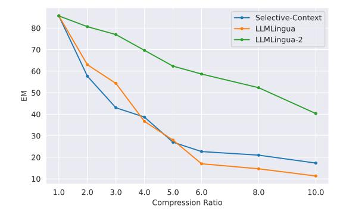
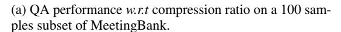
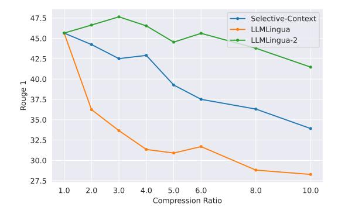
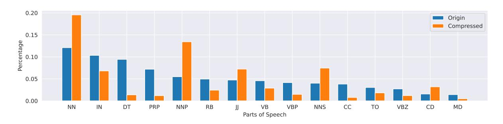

# P Performance of Mistral-7B on 8K Token Subset

As the Mistral 7B model is trained with an 8k context length [6](#page-15-2) , its performance may drop if the input context is too long. Therefore, we conduct additional experiments on subsets containing only examples with original prompts shorter than 8k tokens. The results, shown in Table [13,](#page-18-0) demonstrate that LLMLingua-2 continues to outperform strong baselines and even the original prompts in this subset.

in each GPT-4 compressed example, leading to superior performance.

6 https://huggingface.co/docs/transformers/main/en/model\_ doc/mistral

#### **Document:**

Chinese government is to open more museums, memorial halls and national patriotism education bases to the public for free amid efforts to upgrade cultural services. All national museums and provincial comprehensive museums will stop charging entry fees this year, says a government circular. Museums and memorial halls listed as national patriotism education bases will open for free, adds the circular, jointly issued by the Publicity Department of the Communist Party of China Central Committee, the ministries of finance and culture, and the State Administration of Cultural Heritage on Janyary 23. Free entry is also available to museums above county level in Zhejiang, Fujian, Hubei, Jiangxi, Anhui and Gansu provinces and Xinjiang Uygur Autonomous Region. Other provinces, autonomous regions and municipalities are encouraged cut or abolish entry fees according to their circumstances, the circular says. All museums, memorial halls and national patriotism education bases will be free to visit by 2009 except cultural relics and historical sites, which will have cheap rates for minors, the elderly, soldiers, the disabled and low-income families, says the circular. For special or guest exhibitions, museums and memorial halls can charge fees, the circular says, and museums are encouraged to have cheap tickets and flexible plans, such as regular free entry, and cheap tickets for groups and families.

#### **Ouestion:**

In which provinces will museums above country level be open for free?

Figure 13: An example from the *SentComp* dataset (Filippova and Altun, 2013). The compressed text is highlighted in blue. The provided compressed text fails to cover the question references which are highlighted in red.

#### **Document:**

The overall results regarding the long-term effects of exchange rate volatility are highly informative in relation to the exports and imports of an LDC. Mexico's exports of agricultural goods are clearly depressed by uncertainty: Table 3 shows that no unprocessed agricultural good responds positively, while various animal, vegetable, and wood products make up 6 of the 21 industries with negative effects. Imports are also affected. While the category of Oil-seeds, oil nuts, and oil kernels does seem to increase because of uncertainty, 6 of the 21 industries in which volatility reduces import flows are agricultural in nature. Mexican textile exports also show clear negative effects due to uncertainty, not only for the category of Clothing except fur clothing, but also for the inputs of Textile and leather machinery and Textile yarn and thread (in Table 4).

#### **Question:**

Which industries of textile suffer from negative effects due to the exchange rate uncertainty?

Figure 14: An example from the *DebateSum* dataset (Roush and Balaji, 2020). The compressed text is highlighted in blue. The provided compressed text fails to cover the question references which are highlighted in red.

| Methods           | LongBench-Zh |          |       |         |        |      |        |          |  |  |  |
|-------------------|--------------|----------|-------|---------|--------|------|--------|----------|--|--|--|
| 1,100110415       | SingleDoc    | MultiDoc | Summ. | FewShot | Synth. | AVG  | Tokens | $1/\tau$ |  |  |  |
| Task(Question)-Ag | gnostic Comp | ression  |       |         |        |      |        |          |  |  |  |
| LLMLingua         | 35.2         | 20.4     | 11.8  | 24.3    | 51.4   | 28.6 | 3,060  | 5x       |  |  |  |
| LLMLingua-2       | 46.7         | 23.0     | 15.3  | 32.8    | 72.6   | 38.1 | 3,023  | 5x       |  |  |  |
| Original Prompt   | 61.2         | 28.7     | 16.0  | 29.2    | 77.5   | 42.5 | 14,940 | -        |  |  |  |

Table 10: Out-of-domain evaluation on LongBench Chinese benchmarks.

> **[图片提取文字 (无描述)]:**
> Selective-Context 80 LLMLingua LLMLingua-2 70 60 50 40 30 20 10 1.0 2.0 3.0 4.0 6.0 5.0 8.0 10.0 Compression Ratio

> **[图片提取文字 (无描述)]:**
> (a) QA performance w.r.t compression ratio on a 100 samples subset of MeetingBank.

> **[图片提取文字 (无描述)]:**
> 47.5 Selective-Context LLMLingua 45.0 LLMLingua-2 42.5 40.0 Rouge 1 37.5 35.0 32.5 30.0 27.5 1.0 2.0 3.0 4.0 5.0 6.0 8.0 10.0 Compression Ratio

(b) Summary performance *w.r.t* compression ratio on a 100 samples subset of MeetingBank.

Figure 15: A plot of performance w.r.t compression ratio on a 100 samples subset of MeetingBank.

| Methods                       | 1st  | 5th  | 10th          | 15th | 20th | Reorder | Tokens | 1/τ  |
|-------------------------------|------|------|---------------|------|------|---------|--------|------|
|                               |      |      | 4x constraint |      |      |         |        |      |
| Question-Aware Compression    |      |      |               |      |      |         |        |      |
| BM25†                         | 36.3 | 798  | 3.7x          |      |      |         |        |      |
| Gzip†                         | 63.1 | 61.0 | 59.8          | 61.1 | 60.1 | 62.3    | 824    | 3.6x |
| SBERT†                        | 66.9 | 61.1 | 59.0          | 61.2 | 60.3 | 64.4    | 808    | 3.6x |
| OpenAI†                       | 63.8 | 64.6 | 65.4          | 64.1 | 63.7 | 63.7    | 804    | 3.7x |
| LLMLingua-2+                  | 74.0 | 70.4 | 67.0          | 66.9 | 65.3 | 71.9    | 739    | 3.9x |
| LongLLMLingua†                | 75.0 | 71.8 | 71.2          | 71.2 | 74.7 | 75.5    | 748    | 3.9x |
| Question-Agnostic Compression |      |      |               |      |      |         |        |      |
| Selective-Context†            | 31.4 | 19.5 | 24.7          | 24.1 | 43.8 | -       | 791    | 3.7x |
| LLMLingua†                    | 25.5 | 27.5 | 23.5          | 26.5 | 30.0 | 27.0    | 775    | 3.8x |
| LLMLingua-2                   | 48.6 | 44.5 | 43.6          | 40.9 | 39.9 | 46.2    | 748    | 3.9x |
| Original Prompt               | 75.7 | 57.3 | 54.1          | 55.4 | 63.1 | -       | 2,946  | -    |
| Zero-shot                     |      |      | 56.1          |      |      |         | 15     | 196x |

Table 11: Performance comparison on NaturalQuestions (20 documents) [\(Liu et al.,](#page-9-20) [2024\)](#page-9-20). *LLMLingua-2*+ denotes *LLMLingua-2* with *LongLLMLingua* [\(Jiang et al.,](#page-9-2) [2023b\)](#page-9-2) coarse level compression. † : numbers reported in [Jiang](#page-9-2) [et al.](#page-9-2) [\(2023b\)](#page-9-2).

| Methods                      |          |              |      | LongBench-SingleDoc |              |      |
|------------------------------|----------|--------------|------|---------------------|--------------|------|
|                              | QA Score | Tokens       | 1/τ  | QA Score            | Tokens       | 1/τ  |
| Target Token Constraint      |          | 2,000 Tokens |      |                     | 3,000 Tokens |      |
| LLMLingua-2                  | 29.8     | 1,954        | 7.4x | 35.5                | 3,392        | 4.3x |
| Compression Ratio Constraint |          | 7x           |      |                     | 5x           |      |
| LLMLingua-2 FR†              | 25.1     | 2,131        | 6.8x | 27.4                | 3,185        | 4.5x |
| LLMLingua-2 DCR‡             | 29.5     | 2,125        | 6.8x | 32.2                | 3,164        | 4.5x |
| Original Prompt              | 39.7     | 14,511       | 1x   | 39.7                | 14,511       | 1x   |

Table 12: Evaluation of LLMLingua-2 sample wise dynamic compression on LongBench single doc QA task. FR† assigns each example with the same fixed compression rate. DCR‡ assigns dynamic compression rate to different examples within the corpus level constraint.

> **[图片提取文字 (无描述)]:**
> 0.20 Origin Compressed 0.15 Percentage 01.0 0.05 0.00 NN IN DT PRP NNP RB VB VBP NNS CC TO VBZ CD MD Parts of Speech

Figure 16: Part of speech distribution of the original prompts and GPT-4 compressed prompts.

| Methods                 | MeetingBank |       |                  |      | LongBench-SingleDoc          |       |      |                              |       |      |
|-------------------------|-------------|-------|------------------|------|------------------------------|-------|------|------------------------------|-------|------|
|                         | QA          |       | Summ. Tokens 1/τ |      | 2,000-token cons. Tokens 1/τ |       |      | 3,000-token cons. Tokens 1/τ |       |      |
| Selective-Context 62.43 |             | 19.25 | 703              | 2.4x | 29.3                         | 1,829 | 2.5x | 34.6                         | 2,855 | 1.6x |
| LLMLingua               | 51.78       | 24.57 | 714              | 2.4x | 29.9                         | 1,862 | 2.5x | 30.7                         | 3,016 | 1.5x |
| LLMLingua-2             | 81.75       | 30.83 | 651              | 2.6x | 35.0                         | 1,889 | 2.4x | 36.3                         | 2,841 | 1.6x |
| Original Prompt         | 71.27       | 27.56 | 1,700            | -    | 31.4                         | 4,595 | -    | 31.4                         | 4,595 | -    |

Table 13: Evaluation with Mistral-7B as the Target LLM on MeetingBank and LongBench single doc QA task. We discarded samples where the input text has more than 8K tokens. We report Rouge1[\(Lin,](#page-9-19) [2004\)](#page-9-19) for summary.