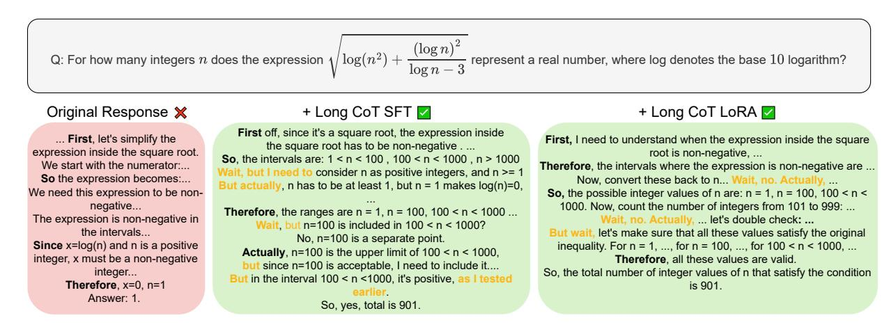
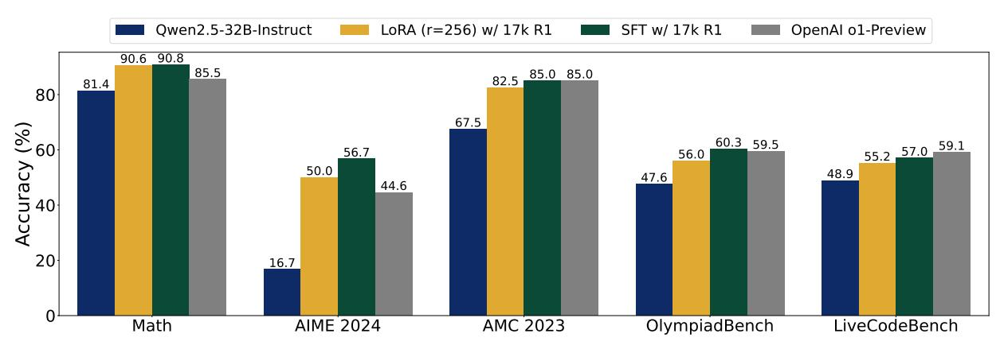

# 1. Introduction

Large reasoning models (LRMs) leverage long chain-ofthoughts (Long CoTs) with reflection, backtracking, and self-validation to tackle challenging reasoning tasks [\(Jaech](#page-8-0) [et al.,](#page-8-0) [2024;](#page-8-0) [Guo et al.,](#page-8-1) [2025;](#page-8-1) [Team,](#page-9-0) [2024\)](#page-9-0). However, the process of eliciting Long CoTs from available LLMs remains unclear, as existing methods are either closedsourced [\(Jaech et al.,](#page-8-0) [2024;](#page-8-0) [Team,](#page-9-0) [2024\)](#page-9-0) or expensive to replicate [\(Guo et al.,](#page-8-1) [2025\)](#page-8-1).

In this paper, we first show that, surprisingly, an LLM can be cheaply and easily taught to produce Long CoT responses, significantly improving its reasoning capabilities. In particular, we find that this learning process can be both dataefficient and parameter-efficient. By performing fully supervised fine-tuning (SFT) with only 17k samples generated by DeepSeek R1, the Qwen2.5-32B-Instruct model achieves performance competitive with OpenAI o1-preview across a wide range of math and coding tasks [\(Team,](#page-9-0) [2024;](#page-9-0) [Yang](#page-9-1) [et al.,](#page-9-1) [2024;](#page-9-1) [Jaech et al.,](#page-8-0) [2024\)](#page-8-0). In particular, it achieves 90. 8% in Math-500 (+6.0%), 56.7% in AIME 2024 (+40.0%), 85.0% in AMC 2023 (+17.5%), 60.3% in OlympiadBench (+12.7%) and 57.0% in LiveCodeBench (+8.1%) [\(Jain et al.,](#page-8-2) [2024\)](#page-8-2). Even further, the model can achieve o1-preview performance by updating fewer than 5% parameters with LoRA fine-tuning [\(Hu et al.,](#page-8-3) [2021\)](#page-8-3). We show that the model successfully learns to reflect and revise its intermediate thoughts (e.g., frequently using reasoning keywords such as "Alternatively" and "Wait, but") and adopts long, coherent CoTs to tackle challenging problems (Fig. [1\)](#page-1-0).

Moreover, we identify the Long CoT *structure* as the key characteristic of distilled data for eliciting strong reasoning performance rather than the *specific contents* of individual reasoning steps within the Long CoT. To test this, we conduct two sets of controlled studies by altering either the content of individual reasoning steps or the overall logical structure. To alter content, we perturb samples by replacing numbers with random digits or deleting reasoning keywords.

\*Equal contribution 1Department of Electrical Engineering and Computer Sciences, University of California, Berkeley 2Anyscale. Correspondence to: Ion Stoica <istoica@berkeley.edu>.

> **[图片提取文字 (无描述)]:**
> Q: For how many integers n does the expression  $\sqrt{\log(n^2) + \frac{(\log n)^2}{\log n - 3}}$  represent a real number, where log denotes the base 10 logarithm? + Long CoT LoRA Original Response X + Long CoT SFT First off, since it's a square root, the expression inside ... First, let's simplify the First, I need to understand when the expression inside the square the square root has to be non-negative . ... expression inside the square root. root is non-negative, ... **So**, the intervals are: 1 < n < 100, 100 < n < 1000, n > 1000 We start with the numerator:... Therefore, the intervals where the expression is non-negative are ... Wait, but I need to consider n as positive integers, and n >= 1 So the expression becomes:... Now, convert these back to n... Wait, no. Actually, ... But actually, n has to be at least 1, but n = 1 makes log(n)=0, We need this expression to be non-So, the possible integer values of n are: n = 1, n = 100, 100 < n < negative... 1000. Now, count the number of integers from 101 to 999: ... **Therefore**, the ranges are n = 1, n = 100, 100 < n < 1000 ... The expression is non-negative in Wait, no. Actually, ... let's double check: ... Wait, but n=100 is included in 100 < n < 1000? the intervals... But wait, let's make sure that all these values satisfy the original No, n=100 is a separate point. Since x=log(n) and n is a positive inequality. For n = 1, ..., for n = 100, ..., for 100 < n < 1000, ...Actually, n=100 is the upper limit of 100 < n < 1000, integer, x must be a non-negative Therefore, all these values are valid. since n=100 is acceptable, I need to include it.... integer... So, the total number of integer values of n that satisfy the condition But in the interval 100 < n <1000, it's positive, as I tested Therefore, x=0, n=1 is 901. Answer: 1. So, yes, total is 901.

(a) Responses of the base model, with Long CoT SFT, and with Long CoT LoRA.

> **[图片提取文字 (无描述)]:**
> Qwen2.5-32B-Instruct LoRA (r=256) w/ 17k R1 SFT w/ 17k R1 OpenAl o1-Preview 90.6 90.8 85.5 85.0 85.0 82.5 81.4 80 Accuracy (%) 67.5 60.3 59.5 55.2 57.0 59.1 56.7 56.0 50.0 48.9 47.6 44.6 20 16.7 Math OlympiadBench LiveCodeBench **AIME 2024** AMC 2023

(b) Performance of different models on five difference reasoning benchmarks.

Figure 1: **Learning to reason is data- and parameter-efficient.** When fine-tuned on a small amount (17k) of Long CoT samples distilled and reject-sampled from DeepSeek-R1 with either LoRA or full-parameter tuning, the model easily learns to perform reflection and backtracking by using keywords such as "However" and "Alternatively" (Top). Consequently, the fine-tuned models improve significantly across five popular math and coding benchmarks (Bottom). For fine-tuning, the base model is Qwen2.5-32B-Instruct.

Surprisingly, we find that these perturbations have little impact on the model performance: even when 50% of numbers in training samples are randomly changed, the model only observes 3.3% lower accuracy on the most challenging math benchmark, AIME 2024, as compared to training with correct samples. To alter the global reasoning structure, we separate responses into reasoning steps and randomly shuffle, insert, or delete these steps. We observe that the trained model is much more sensitive to structural perturbations that break logical coherency in the long CoT. For example, when 67% of the training samples' reasoning steps are shuffled, accuracy drops by 13.3% on AIME 2024 problems relative to training with correct samples.

In summary, our key contributions are:

1. We demonstrate that an LLM can learn Long CoT

reasoning in a data-efficient and parameter-efficient manner (i.e., LoRA). With fewer than 17k samples, we fine-tune the Qwen2.5-32B-Instruct model to be competitive with o1-preview.

- 2. We identify the structure of Long CoT as critical to the learning process rather than the content of individual reasoning steps. To validate this finding, we perform two groups of controlled experiments that modify either the structure or contents of samples.
- 3. We conduct comprehensive ablations across model sizes and architectures, dataset sizes, data generation models (DeepSeek R1 and QwQ-32B-Preview), and on five popular math and coding reasoning benchmarks.

