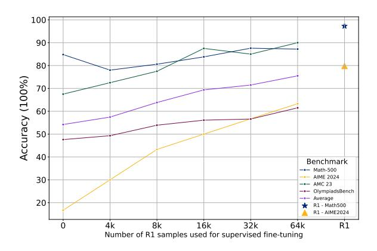
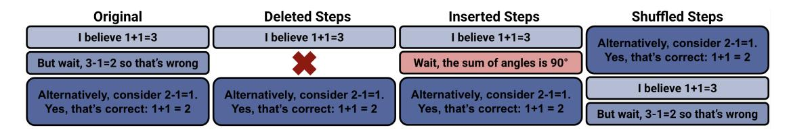
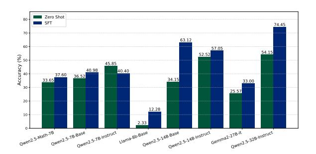
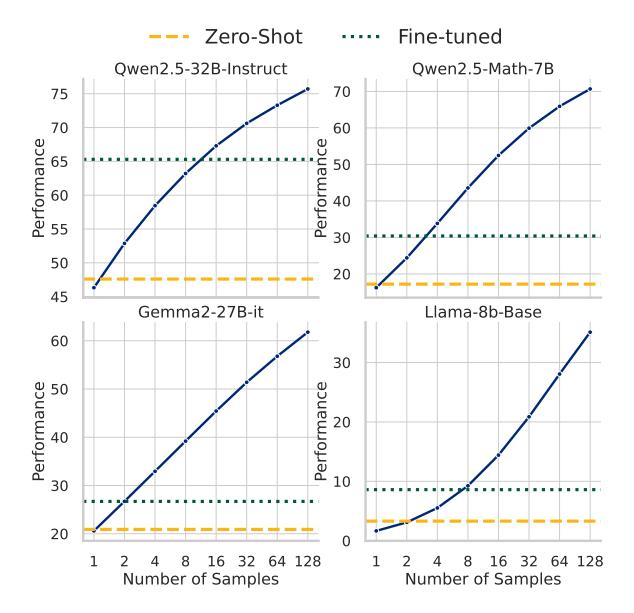

# 3. Simple distillation is effective

In this section, we present our distillation process and show that a small amount of *well-curated* data, along with a simple parameter-efficient fine-tuning method (e.g., LoRA), can effectively improve reasoning capabilities in a large language model.

### 3.1. Experiments Setup

Distillation data curation. We use DeepSeek-R1 [\(Guo](#page-8-1) [et al.,](#page-8-1) [2025\)](#page-8-1) and QwQ-32B-Preview [\(Team,](#page-9-0) [2024\)](#page-9-0), two open-source models with reasoning capabilities, to generate our distillation data. We select difficult prompts from the AMC/AIME [1](#page-2-0) , Math, and Olympiad subset from the Numina-Math dataset [\(LI et al.,](#page-9-6) [2024\)](#page-9-6), as [Min et al.](#page-9-8) [\(2024\)](#page-9-8) implies that hard problems can improve performance. We also incorporate coding problems from APPS [\(Hendrycks](#page-8-9) [et al.,](#page-8-9) [2021a\)](#page-8-9) and TACO [\(Li et al.,](#page-9-9) [2023\)](#page-9-9) datasets. Specifically, we use GPT-4o-mini to classify the difficulty of the prompts according to the AoPS standard [\(Achiam et al.,](#page-8-10) [2023\)](#page-8-10), and select math problems of difficulty higher than Leval 3, Olympiad higher than Level 8, and all AIME/AMC problems. We verify the correctness of the traces by checking against ground truth solutions using exact matching for math problems and code execution for coding problems. In total, we curated 12k math and 5k coding problems with correct responses from QwQ to serve as our training data. For R1 samples, we directly use the public R1-17k reasoning dataset[2](#page-2-1) that is curated following a similar procedure.

Training details. We perform training using Llama-Factory [\(Zheng et al.,](#page-9-10) [2024\)](#page-9-10). We train the Qwen2.5-32B-Instruct using a batch size of 96, learning rate 1e-5 with a warm-up ratio of 0.1 and linear learning rate decay [\(Yang](#page-9-1) [et al.,](#page-9-1) [2024\)](#page-9-1), following similar hyperparameters in [\(Min](#page-9-8) [et al.,](#page-9-8) [2024\)](#page-9-8). We use the next token prediction loss as the training objective [\(Radford,](#page-9-11) [2018\)](#page-9-11). We use the same hyperparameters except a 1e-4 learning rate for LoRA fine-tuning.

Evaluation setup. We evaluate our models on five popular reasoning benchmarks for math and coding, including Math-500, OlympiadBench, AIME-2024[3](#page-2-2) , AMC23[4](#page-2-3) [\(Hendrycks](#page-8-6) [et al.,](#page-8-6) [2021c;](#page-8-6) [He et al.,](#page-8-11) [2024\)](#page-8-11) and LiveCodeBench [\(Jain et al.,](#page-8-2) [2024\)](#page-8-2). For LiveCodeBench, we report a weighted average accuracy across its easy, medium, and hard difficulty levels.

### 3.2. Key Insights

Small amount of data is enough. In Fig. [1b,](#page-1-0) we present the performance of models fine-tuned with the 17k R1 trained

1 These prompts are from previous years of competition, which do not include AIME 2024 and AMC 2023 in our evaluation suite.

huggingface.co/datasets/bespokelabs/Bespoke-Stratos-17k.

3 huggingface.co/datasets/AI-MO/aimo-validation-aime.

4 huggingface.co/datasets/AI-MO/aimo-validation-amc.

samples. Both the supervised fine-tuned (SFT) and LoRA fine-tuned models learn to generate Long CoT responses and improve significantly on all benchmarks with just 17k training samples. We investigate the effect of distillation

> **[图片提取文字 (无描述)]:**
> 100 90 80 Accuracy (100%) 70 60 50 40 Benchmark --- Math-500 **AIME 2024** 30 -- AMC 23 OlympiadsBench Average 20 R1 - Math500 R1 - AIME2024 16k 32k 0 4k 8k 64k R1 Number of R1 samples used for supervised fine-tuning

Figure 2: Model accuracy with different data sizes, and comparison to DeepSeek R1. The teacher model is DeepSeek R1, and the student model is Qwen-32B-Instruct trained with full parameter fine-tuning. While the student model continues to benefits from more SFT data from DeepSeek R1, a small amount of data, e.g., 16k is sufficient to significantly boost the average performance by 15.2%. data size, ranging from 4k to 64k samples from R1, The results, presented in Fig. 2, shows that a small amount of data, e.g. 16k is enough to significantly improve the model performance (from average 54.2 to 69.4).

### LoRA fine-tuning without performance degradation.

We next investigate the extent to which distilling Long CoT reasoning is knowledge-intensive. In addition to the results using 17k R1 samples as demonstrated in Fig. 1b, we also report the results for both SFT and LoRA fine-tuning with 7k and 17k QwQ samples in Tab. 1.

Prior work (Ghosh et al., 2024; Biderman et al., 2024) suggests that LoRA fine-tuning substantially under-performs full fine-tuning for knowledge-intensive tasks, and is limited to learning response initiation and style tokens. However, our results in Fig. 1b and Tab. 1 show that LoRA fine-tuned models achieve similar or even superior reasoning performance compared to full-parameter SFT across math and coding benchmarks. Additionally, we find that a model fine-tuned with LoRA using just 7k QwQ samples performs comparably to one trained on 17k QwQ-distilled samples. This demonstrates that reasoning distillation can be achieved efficiently with both minimal parameter updates and minimal data. As shown in Fig. 1a, the LoRA fine-tuned model easily learns to generate Long CoT responses with reflection and self-verification. These observations suggest that Long CoT reasoning ability may not rely on deep knowledge acquisition but rather on learning structured reasoning patterns, which can be effectively distilled in a parameter-efficient

manner. This also aligns with prior findings that methods such as Chain-of-Thought prompting elicit Short CoT reasoning primarily by shaping response structure rather than instilling deep factual knowledge (Wei et al., 2022; Yao et al., 2023).

Table 1: Model accuracy with SFT and LoRA (rank=64). Fine-tuning performed on Qwen2.5-32B-Instruct with QwQ samples. "Olympiad." is short for "OlympiadBench", "LCB." is short for "LiveCodeBench". We find that the learning process of Long CoT can be parameter efficient.

|                   | MATH500 | AIME24 | AMC23 | Olympiad. | LCB. |
|-------------------|---------|--------|-------|-----------|------|
| Qwen2.5-32B-Inst. | 84.8    | 16.7   | 67.5  | 47.6      | 48.9 |
| QwQ               | 90.4    | 33.3   | 75.0  | 58.1      | 59.1 |
| o1-preview        | 85.5    | 44.6   | 87.5  | 59.2      | 59.1 |
| 7k QwQ Samples    |         |        |       |           |      |
| SFT               | 87.8    | 33.3   | 77.5  | 57.3      | 57.5 |
| LoRA (r=64)       | 86.6    | 40.0   | 77.5  | 57.2      | 56.6 |
| 17k QwQ Samples   |         |        |       |           |      |
| SFT               | 87.8    | 33.3   | 70.0  | 56.7      | 57.9 |
| LoRA (r=64)       | 86.6    | 33.3   | 90.0  | 56.0      | 56.2 |

### 4. Long CoT: Structure Is The Key

Motivated by the observation that fine-tuning with a small number of samples can significantly enhance model reasoning performance, we investigate the key factors driving this improvement. Specifically, we explore the contributions of two dimensions to the learning process:

- 1. The local content within a reasoning step, including the correctness of the final answer, numbers in math derivations, and the use of reasoning keywords.
- 2. **The global reasoning structure**, including reflection, self-validation, and backtracking across multiple reasoning steps to form a logically coherent long CoT.

To understand their impact, we conduct two studies: (1) we perturb the content within individual reasoning steps – such as the final answer, numerical digits, and reasoning keywords(§4.1), and (2) we modify the global reasoning structure by inserting, deleting, and shuffling reasoning steps(§4.2). We compare the performance of models trained on perturbed samples against both the base Qwen2.5-32B-Instruct model (i.e., Original) and model trained on correct, unperturbed samples (i.e., Correct), as shown in Tab. 2. Our findings show that the learning process is highly sensitive to modifications in the global reasoning structure, but remarkably tolerant to errors in the local contents.

**Experiment setup** In this section, we use QwQ-32B-Preview to produce the distillation data and select a subset of 4618 correct responses as the training set (out of the

12k math data in §3). All perturbations in this section are performed on this dataset unless otherwise stated. We train models on each separate variant of the dataset with the same hyperparameters as in §3 and report performance in Tab. 2.

#### 4.1. Wrong or Corrupted Local Content

To study the importance of local content within individual steps, we preserve the overall reasoning structure while systematically perturbing the local content in training samples with different approaches.

Wrong Answer Samples. During our training data curation process in §3, we only include samples that yield correct final answers. To assess whether correctness of the final answer is necessary for learning reasoning patterns, we instead train the model using an equivalent number of samples (4.6k) that lead to the *wrong* answer. Surprisingly, we find that training the base model without any samples that reach a correct final answer still achieves an average accuracy of 63.1% across benchmarks, only 3.2% lower than training with entirely correct samples.

**Digits Corrupted Samples.** Building on the previous experiment, we next examine the role of correctness in the intermediate reasoning steps. To evaluate this, we corrupt correct samples by replacing each digit with a random number between 0 and 9. Note that this is a severe corruption that can lead to nonsensical statements such as "1+1=3". Surprisingly, even when 70% of the digits are corrupted, the model still maintains an average performance of 62%, only 4.3% below the correct sample baseline, demonstrating robustness to incorrect content. However, when all digits are corrupted, the average performance plunges to 2.7%.

Reasoning Keyword Removal. Given the prevalence of reasoning keywords in responses from LRMs (e.g., 'wait', 'let me think again', 'but'), one theory is that these specific phrases may invoke the reflection and back-tracking necessary to elicit strong reasoning performance. To evaluate it, we use GPT-40-mini to identify sentences with occurrences of these reasoning keywords and randomly remove a fraction of them (e.g., 20%, 50%, 100%). Our results show that even after removing all (100%) such keywords, the model still achieves an average accuracy of 63%, which is within 3.3% of accuracy from the model trained with correct samples. This suggests that these particular keywords do not fundamentally impact the model reasoning performance.

**Conclusion.** We find that errors in local content – such as incorrect mathematical derivations or missing reasoning keywords – have minimal impact on overall performance.

Table 2: Effect of trace perturbations on reasoning performance §4. All models are trained with base Qwen2.5-32B-Instruct. "Olympiad." is short for "OlympiadBench". In particular, we study (1) traces with modified reasoning step contents: wrong answers, corrupted digits, and removed reasoning keywords, and (2) traces with modified structure: deleted, inserted, or shuffled steps. We find that structural perturbations are far more detrimental to model accuracy than content perturbations.

|                             | MATH500 | AIME24 | AMC23 | Olympiad. | Avg. |
|-----------------------------|---------|--------|-------|-----------|------|
| Baselines                   |         |        |       |           |      |
| Original                    | 84.8    | 16.7   | 67.5  | 47.6      | 56.7 |
| Correct                     | 89.2    | 40.0   | 77.5  | 58.5      | 66.3 |
| <b>Content Modification</b> | ns      |        |       |           |      |
| Wrong Answers               | 88.6    | 30.0   | 77.5  | 56.1      | 63.1 |
| Corrupted Digits            |         |        |       |           |      |
| 100%                        | 5.4     | 0.0    | 2.5   | 2.8       | 2.7  |
| 70%                         | 85.6    | 30.0   | 77.5  | 54.8      | 62.0 |
| 50%                         | 87.6    | 36.7   | 77.5  | 55.0      | 64.2 |
| 20%                         | 88.4    | 30.0   | 82.5  | 57.2      | 64.5 |
| Removed keywords            |         |        |       |           |      |
| 100%                        | 86.6    | 33.3   | 77.5  | 54.4      | 63.0 |
| 50%                         | 87.6    | 36.7   | 82.5  | 56.7      | 65.9 |
| 20%                         | 87.2    | 33.3   | 72.5  | 56.1      | 62.3 |
| Structure Modificat         | ions    |        |       |           |      |
| Shuffled Steps              |         |        |       |           |      |
| 100%                        | 81.8    | 23.3   | 70.0  | 49.1      | 56.1 |
| 67%                         | 82.0    | 26.7   | 72.5  | 47.6      | 57.2 |
| 33%                         | 85.6    | 33.3   | 75.0  | 55.3      | 62.3 |
| Deleted Steps               |         |        |       |           |      |
| 100%                        | 79.2    | 13.3   | 60.0  | 45.4      | 49.5 |
| 67%                         | 84.2    | 26.7   | 55.0  | 48.1      | 53.5 |
| 33%                         | 88.2    | 23.3   | 80.0  | 57.7      | 62.3 |
| Inserted Steps              |         |        |       |           |      |
| 100%                        | 77.0    | 10.0   | 50.0  | 41.1      | 44.5 |
| 67%                         | 81.8    | 20.0   | 60.0  | 46.0      | 52.0 |
| 33%                         | 86.6    | 33.3   | 77.5  | 57.2      | 63.7 |

### 4.2. Corrupted Global Reasoning Structure

Next, we examine the importance of reasoning *structure* by performing three modifications to the reasoning traces: deletion, insertion, and shuffle. We first note that our system prompt (Appendix C) instructs the model to generate responses with thoughts enclosed in the tags 'begin\_of\_thought' and 'end\_of\_thought' and the final solution and step-by-step explanation in 'begin\_of\_solution' and 'end\_of\_solution'. All modifications are performed on the *thoughts*, while the solution block is left unmodified.

We use Llama-3.3-70B-Instruct (Dubey et al., 2024) to separate each reasoning trace into distinct reasoning steps, with boundaries determined by occurrences of backtracking, self-validation, reflection, or other breaks from a linear sequence of thoughts. We then generated nine modified variants of the dataset by applying each modification (insertion, deletion, and shuffle – illustrated in Fig. 3) to 33%, 67%, or 100% of reasoning steps in the 4,618 correct traces. Each variant is used to train the base model, Qwen2.5-32B-Instruct, and

> **[图片提取文字 (无描述)]:**
> Original Deleted Steps Shuffled Steps Inserted Steps I believe 1+1=3 I believe 1+1=3 I believe 1+1=3 Alternatively, consider 2-1=1. Yes, that's correct: 1+1 = 2 But wait, 3-1=2 so that's wrong Wait, the sum of angles is 90° I believe 1+1=3 Alternatively, consider 2-1=1. Alternatively, consider 2-1=1. Alternatively, consider 2-1=1. Yes, that's correct: 1+1 = 2 Yes, that's correct: 1+1 = 2 Yes, that's correct: 1+1 = 2 But wait, 3-1=2 so that's wrong

Figure 3: Reasoning step modifications. To evaluate perturbations to global structure across reasoning steps, we perform three modifications: deletion, insertion, and shuffling. These modifications break logical consistency across steps and degrade model accuracy far more than changes to local content within reasoning steps.

we report the resulting performance in Tab. [2](#page-4-2) and response lengths and reasoning keyword counts in Appendix [D.](#page-16-1)

Deleted reasoning steps. As reasoning steps are increasingly deleted from the training data, model accuracy steadily declines and eventually regresses to the base model performance. Notably, retaining only the final solution and extensive step-by-step explanation (i.e., 100% deletion case) does not suffice to learn strong reasoning capabilities. This suggests that correct long CoT demonstrations alone are insufficient. Instead, examples of handling errors and dead ends with backtracking, reflection, and self-validation are important for eliciting robust reasoning.

At 67% deletion, the model imitates reasoning keywords (relative to the base model, keyword usage increases 45×, and output token increases 9×), but its accuracy does not improve accordingly. Consistent with [§4.1,](#page-4-0) this validates that merely adopting reasoning keywords and long responses is insufficient. We note, however, that as more steps are deleted, the response lengths also decrease significantly, which could contribute to reduced accuracy. We hypothesize that it is the breaking of logical consistency *between* steps that causes accuracy degradation and validate this further in the following analysis.

Inserted reasoning steps. To further validate the importance of logical structure, we replace a subset of each trace's reasoning steps with a random sample of reasoning steps from other samples in the training set that lead to correct results. Unlike deletion, this approach generally preserves the original length of the reasoning trace, ensuring that accuracy degradation is not due simply to producing fewer steps. Relative to model variants trained with deleted reasoning steps, variants trained on inserted steps generate longer responses with more reasoning keywords, yet accuracy nonetheless deteriorates to, and even below, the level of the base model.

Interestingly, each inserted step is itself coherent and originates from a correct reasoning trace in the training data. Yet these internally-coherent steps appear in sequences that lack logical consistency and often from a separate domain (e.g., a combinatorics step may be inserted into a geometry solution), leading to contradictions and disjointed reflections. For instance, the model trained with inserted reason-

ing steps frequently references earlier steps that do not exist (e.g., "Alternatively, consider a different approach" without specifying the prior approach) or enumerates edge cases in an inconsistent order (e.g., declaring a "Case 2" without "Case 1").

While the model readily produces coherent individual steps that reflect on a problem, the CoT fails to exhibit continuity *across* reasoning steps. This aligns with the observations in the deletion setting: a mere increase in reasoning steps or keywords is insufficient for robust reasoning—logical consistency across steps is a critical factor.

Shuffled reasoning steps. We next examine whether preserving the domain of each reasoning step, eliminating potential cross-domain confusion, but randomizing their order likewise impacts the model's ability to reason.

As the amount of shuffling increases, response length and reasoning keyword usage remain high, and in fact exceed the model trained on correctly ordered traces, yet accuracy declines sharply. Similar to the insertion experiments, the model imitates the syntax of per-step reasoning but loses logical consistency across steps. For instance, we find that over 92% of model responses begin with a backtracking or self-validation keyword (e.g., *"Alternatively," or "Wait"*), even though there is no preceding content to correct or reconsider. The model also references prior calculations or cases that were never actually introduced in any preceding step. Thus, while the shuffled traces still contain valid domain-specific reasoning steps, their rearrangement leads to incoherent overall solutions. In other words, domain alignment alone does not prevent logical breakdown.

Conclusion. Taken together, these findings show that providing error-free CoT demonstrations, increasing response lengths, imitating reasoning keywords and correct short CoT within individual steps, and preserving domain relevance for each step are *not* sufficient to produce effective reasoning Further, our experiments on incorrect traces [\(§4.1\)](#page-4-0) demonstrate that learning reasoning capability is largely robust to local inaccuracies or miscalculations. Instead, global structural consistency is essential to elicit coherent long CoTs with the reflection, revision, and validation behaviors that produce strong reasoning performance.

### 5. Ablation Study

In this section, we conduct a series of ablation studies to answer the following questions:

- 1. (§5.1) Does fine-tuning on Long CoT data lead to degraded performance on non-reasoning tasks?
- 2. (§5.2) How much does the Long CoT fine-tuning enhance the performance of different student models?
- 3. (§5.3) How does Long CoT model performance compare to the Best-of-N sampling performance of the base model?
- 4. (§5.4) How does Long CoT fine-tuning compare to Short CoT fine-tuning with the same dataset?

#### 5.1. Performance on Non-Reasoning Benchmarks

Table 3: **Distilled Model Performance on Non-Reasoning Tasks.** The teacher model is QwQ-32B-Preview, and the student model is Qwen2.5-32B-Instruct. Compared to QwQ, distilled models retain most of the base model's capabilities.

|                   | MMLU | ARC-C | IEval | MGSM |
|-------------------|------|-------|-------|------|
| Qwen2.5-32B-Inst. | 74.1 | 49.4  | 78.7  | 42.3 |
| QwQ               | 71.2 | 49.7  | 42.5  | 19.1 |
| 17k R1 Samples    |      |       |       |      |
| SFT               | 73.0 | 49.0  | 77.8  | 33.7 |
| LoRA (r=256)      | 75.5 | 47.3  | 78.4  | 38.7 |
| 17k QwQ Samples   |      |       |       |      |
| SFT               | 78.4 | 49.5  | 75.8  | 33.0 |
| LoRA (r=64)       | 78.5 | 46.7  | 74.1  | 30.6 |
| 7k QwQ Samples    |      |       |       |      |
| SFT               | 79.8 | 48.6  | 70.6  | 30.1 |
| LoRA (r=64)       | 79.1 | 47.4  | 75.4  | 31.1 |

While simple distillation enhances reasoning capabilities, it is essential to ensure that these improvements do not come at the cost of catastrophic forgetting or a decline in general language understanding and instruction-following abilities, which are crucial for broader task generalization.

To assess this, we evaluate the performance of our SFT and LoRA fine-tuned models mentioned in §3 on a diverse set of benchmarks: MMLU (multi-task language understanding), ARC-C (science exam question), IEval (instruction-following), and MGSM (multilingual grade-school math problems) (Hendrycks et al., 2021b; Clark et al., 2018; Mitchell et al., 2023; Cobbe et al., 2021).

As shown in Tab. 3, the base instruction model (Qwen2.5-32B-Instruct) performs well in all these tasks. The QwQ model, despite its strong reasoning capabilities, suffers significant degradation in instruction-following (i.e., 42.5% on IEval) and multilingual tasks (i.e., 19.1% on MGSM). In

contrast, fine-tuning (through both SFT and LoRA) only on a small amount of Long CoT reasoning data from R1 or QwQ allows the distilled models to retain most of the base instruction model's capabilities, avoiding the drastic performance drop seen in QwQ.

#### 5.2. Effect on Different Student Models

> **[图片提取文字 (无描述)]:**
> Zero Shot 80 SFT 74.45 70 63.12 60 57.05 54.15 Accuracy (%) 52.52 45.85 40.98 40.40 37.60 36.52 34.15 33.65 33.00 30 25.57 20 12.28 10 2.33 Gemma2-27B-lt Owen2.5-Math.7B
> Owen2.5-TB-Base
> Owen2.5-TB-Instruct Uama-8b-Base Qwen2-5-14B-Base Qwen2-5-14B-Instruct

Figure 4: **Generalization to other models.** Accuracy for models of different sizes and architectures without SFT (green) and with SFT (blue). Most models show significant improvements when fine-tuned with 17k samples from R1-Preview, showing that the Long CoT fine-tuning is beneficial across models.

In this section, we examine whether Long CoT reasoning capabilities can be elicited with different student models via fine-tuning (as described in §3). Specifically, we train with the 17k samples on Qwen2.5-7B-Math, Qwen2.5-7-Base, Qwen2.5-7B-Instruct, Llama-3.1-8B, Qwen2.5-14B-Base, Qwen2.5-14B-Instruct, Gemma2-27B-it and Qwen2.5-32B-Instruct (Yang et al., 2024; Dubey et al., 2024; Team et al., 2024). We find that seven out of eight models improve noticeably across multiple benchmarks, showing the effect of Long CoT as a general improvement across models. However, not all models have showed the same degree of improvements as for Qwen2.5-32B-Instruct. These findings suggest promising future directions for understanding the performance upper bound and data efficiency with various teacher and student models in the space of reasoning.

#### 5.3. Comparison to Best-of-N

As discussed in §5.2, not all student models achieve significant performance improvements through Long CoT finetuning. We hypothesize that this variation is influenced by several factors, such as the extent to which the training data distribution differs from that of the student models and the inherent capabilities of the student models in these tasks. In this section, we compare the test-time scaling (Ahn et al., 2024; Snell et al., 2024) performance of the base model with its performance after Long CoT fine-tuning to understand the relationship between a model's ability to benefit from Long CoT fine-tuning and its intrinsic capabilities.

> **[图片提取文字 (无描述)]:**
> Zero-Shot Fine-tuned Qwen2.5-32B-Instruct Qwen2.5-Math-7B 70 75 70 60 Performance Performance 05 06 07 30 50 20 45 Gemma2-27B-it Llama-8b-Base 60 30 Performance Performance 50 20 40 10 30 20 0 64 128 1 16 32 64 128 1 16 32 Number of Samples Number of Samples

Figure 5: **SFT with Long CoT vs Best-of-N.** Accuracy of Qwen2.5-32B-Instruct before SFT (Zero-Shot), after SFT on 17k R1 samples (Fine-tuned), and Best-of-N samples on OlympiadBench. We find that fine-tuning on Long CoT achieves performance similar to Best of 2 to 16 samples.

Specifically, we compare the performance of Long CoT finetuning against a Best-of-N sampling approach, where we generate 128 samples per prompt using an oracle verifier to select the best response. To introduce diversity, we employ a temperature of 0.5 and top-p sampling with a threshold of 0.8. The results, presented in Fig. 5, show that the Long CoT fine-tuned model performs comparably to Best-of-N sampling with 2 to 16 instances across all student models. Notably, the test-time scaling trends closely align with the improvements observed from Long CoT fine-tuning. For example, with eight parallel samples, Llama-3.1-8B achieves less than 10% accuracy on OlympiadBench, and similarly, fine-tuning with correct Long CoT traces results in only marginal improvement. A comparable trend is observed in Gemma2-27B-it and Qwen2.5-Math-7B, reinforcing the relationship between test-time sampling efficiency and the benefits of Long CoT fine-tuning.

The performance of Best-of-N sampling continues to improve beyond 128 samples, suggesting that further gains are possible. This highlights the potential for enhancing Long CoT models through context scaling or by leveraging a broader range of reasoning paths inherent to the original model, potentially unlocking even higher performance.

### 5.4. Comparison to Short CoT Fine-tuning

In this section, we provide a direct comparison to training with short CoT. In particular, we compare results

Table 4: Comparison of number of output tokens reasoning keywords, and the performance between training with Short or Long CoT. The original model is Qwen2.5-32B-Instruct. Benchmarks are ordered from easy to hard, where the model trained with Long CoT learns to produce longer CoTs and uses more keywords for harder problems.

| Dataset            | Original | Short CoT    | Long CoT            |
|--------------------|----------|--------------|---------------------|
| Avg. output tokens | 5        |              |                     |
| MATH500            | 684      | 515          | 3972                |
| AMC23              | 728      | 605          | 5037                |
| OlympiadBench      | 1275     | 948          | 8616                |
| AIME24             | 825      | 687          | 15902               |
| Avg. keywords per  | response |              |                     |
| MATH500            | 0.00     | 0.00         | 41.75               |
| AMC23              | 0.00     | 0.00         | 39.20               |
| OlympiadBench      | 0.01     | 0.01         | 97.20               |
| AIME24             | 0.00     | 0.07         | 260.90              |
| Performance        |          |              |                     |
| MATH500            | 84.8     | 70.4 (-14.4) | <b>89.2</b> (+4.4)  |
| AMC23              | 67.5     | 55.0 (-12.5) | <b>77.5</b> (+10.0) |
| OlympiadBench      | 47.6     | 36.4 (-11.2) | <b>58.5</b> (+10.9) |
| AIME24             | 16.7     | 13.3 (-3.4)  | <b>40.0</b> (+23.3) |

training on the 4.6k samples of Long CoT generated by QwQ-32B-Preview (§4), and the short CoT denoted in the NuminaMath-CoT dataset (LI et al., 2024). Tab. 4 summaries the statistics. Training with Long CoT enables the model to use more reasoning keywords (full list in Appendix B), produces longer responses to harder problems, and is the key to improved performance.

#### 6. Conclusion

Large reasoning models unlock new capabilities by using a longer chain of thoughts that involves reflection and backtracking to answer challenging problems. In this paper, we show that such capability can be easily fine-tuned using a few thousand examples and with low-rank adapters. We further show that the key to the learning process is the logical structure of the samples rather than the content of individual reasoning steps. Finally, we discuss several ablations with various teacher-student models and compare them to the best-of-N approach. Together, our work deepens the understanding of what is needed to instill large language models with strong reasoning capabilities and identify potential future directions.

#### **Impact Statement**

This paper aims to contribute to the advancement of Machine Learning. While our work may have various societal implications, we do not find any that require specific emphasis currently.

