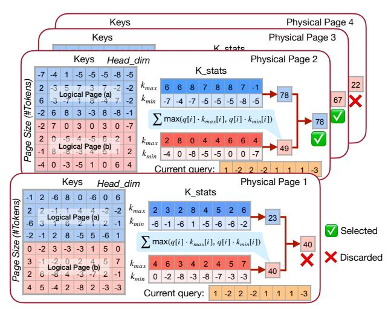
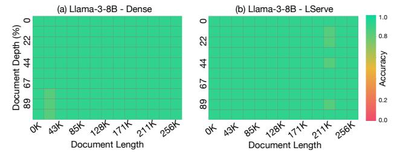
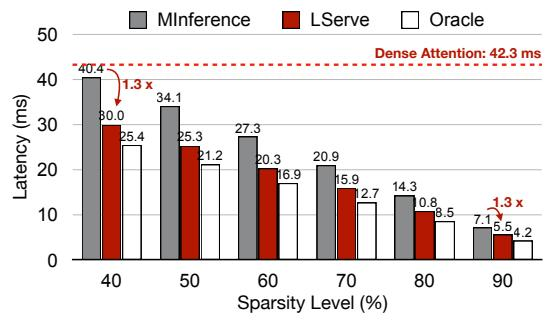
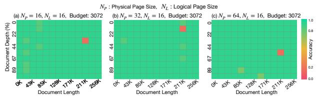
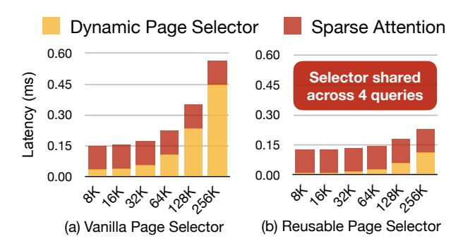
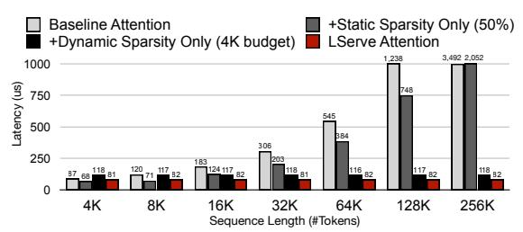

# 3.5.2 Hierarchical Paging: Mitigating the accuracy-efficiency tradeoff

We observe that the failure of query-aware KV cache selection paradigm (Figure 6) is not due to the coarser granularity of sparse attention (i.e., larger page size). Rather, the underlying cause lies in that page-wise statistical indicators become homogenized and less representative especially when there are excessive tokens within a single page. To address this issue, we design a simple-yet-effective hierarchical paging system that introduces an abstract layer of virtual *logical page* for estimating token criticality, while preserving the original memory layout of KV cache in (*physical pages*). As illustrated in Figure 7, our hierarchical paging groups  $N_L$  tokens into a logical page and  $N_P$  tokens into a physical page ( $N_P = g \cdot N_L, g \in \mathbb{Z}$ ), that is, a physical page contains g logical pages. Tokens within the same logical

Table 1: Page size significantly impacts the LLM serving system's efficiency: Larger page size is more hardware-friendly as it improves contiguity of memory layout and the GPU bandwidth utilization during attention computation. For example, simply shrinking the page size in QServe (Lin et al., 2024b) leads to prominent slow-down of the end-to-end system. We evaluate the per-step decoding latency (ms / step) of QServe on a single A100 GPU for demonstration. We use Llama3-8B model architecture, with the batch size of 32.

| Seq_len      | Page Size |         |         |         |  |  |
|--------------|-----------|---------|---------|---------|--|--|
| Seq_ieii     | 16        | 32      | 64      | 128     |  |  |
| 512          | 11.0 ms   | 10.7 ms | 10.5 ms | 10.5 ms |  |  |
| 1024         | 13.8 ms   | 13.0 ms | 12.7 ms | 12.7 ms |  |  |
| 2048         | 22.1 ms   | 20.1 ms | 18.3 ms | 18.2 ms |  |  |
| 4096         | 35.7 ms   | 31.6 ms | 28.1 ms | 28.1 ms |  |  |
| 8192         | 77.1 ms   | 63.0 ms | 51.0 ms | 50.6 ms |  |  |
| Max Slowdown | 1.52×     | 1.25×   | 1.01×   | 1.00×   |  |  |

page will collectively contribute to the same criticality estimator. In LServe, we utilize the channel-wise minimum and maximum values of keys in the same logical page as its representative vectors, which has been proven to be an effective metric (Tang et al., 2024) for page importance estimation with a moderate page size ( $\leq 16$ ). The current query will attend to representative vectors of each logical page to calculate the corresponding importance score as follows:

$$S^{j} = \sum_{i}^{D} \max \left( q[i] * k_{max}^{j}[i], \ q[i] * k_{min}^{j}[i] \right)$$
 (2)

where S is the importance score of logical page,  $j \in \{a, b, \ldots\}$  is the index of logical page, i is the channel index, and D refers to the head dimension.

The importance of each physical page is determined by the max-reduction over the importance scores of its corresponding logical pages. Finally, LServe selects the top-K physical pages (based on the predefined token budget) with highest importance scores as the input of sparse attention kernel.

#### 3.5.3 Reducing sparse attention overheads with locality

One remaining question is: as physical page size increases, will the hierarchical paging require a higher token budget for sparse attention to retain accuracy?

Given a generation step, assume the most important history tokens are distributed in a logical page set  $\mathcal{P} = \{P(i,j)\}$ , where  $i \in \{1,2,...\}, j \in \{a,b,,...\}$  are the physical and logical index of a page accordingly. If these important tokens are randomly and sparsely distributed in the context, chances are that all logical pages in  $\mathcal{P}$  are scattered in different physical pages, that is, for any  $P_1, P_2 \in \mathcal{P}, i_1 \neq i_2$ . In this case, all  $|\mathcal{P}|$  physical pages ( $|\mathcal{P}| \cdot N_P$  tokens) are selected to avoid losing important information. However, the naïve paging only needs to keep  $|\mathcal{P}| \cdot N_L$  tokens since it directly shrinks page sizes to a smaller granularity (e.g.,  $N_L$ ). Consequently, our hierarchical paging may suffer from a

> **[图片提取文字 (无描述)]:**
> Physical Page 4 Keys Keys Physical Page 3 K state Physical Page 2 Keys Head dim K stats -7 -5 -5 -5 -8 -5 Page Size (#Tokens) 22  $k_{max}$ -2 Logical Page (a)  $k_{min}$ -2 67 -7 -4 -7 -5 -5 -5 -8 -5 -2 6 8 -8 -1  $\sum \max(q[i] \cdot k_{max}[i], q[i] \cdot k_{min}[i])$ 78 -2 3 0 3 7 0 -7 2  $k_{max}$ Logical Page (b)  $k_{min}$ 0 -3 -5 6 Current query: Physical Page 1 Keys Head\_dim K stats 2 -6 8 0 -6 0 6 Size (#Tokens)  $k_{max}$ -2 2 2 Logical Page (a) 23 -6  $k_{min}$ -1 -6 -5 -6 -6 Selected -2 -6  $\sum \max(q[i] \cdot k_{max}[i], q[i] \cdot k_{min}[i])$ 0 -2 -3 -3 5 3 0 X Discarded 3 Page Logical Page (b)  $k_{max}$ -3  $k_{min}$ 5 2 -8 2 -3 -3 Current query: -2 2

Figure 7: Hierarchical Paging in LServe system. We assume the each physical page contains  $N_p=8$  tokens and each logical page has  $N_l=4$  tokens. The  $k_{max}$  and  $k_{min}$  vectors are concatenated to the end of each physical page, and are pre-computed during the context stage and previous decoding steps. The importance of each physical page is decided by the max of the importance scores of the logical pages it contains. We omitted KV quantization in this figure for the sake of simplicity.

decrease in attention sparsity by  $N_P/N_L$ .

Fortunately, the semantic continuity of natural language endows the attention operation with intrinsic locality, allowing LServe to maintain a consistent sparse attention token budget for larger physical page sizes. During the decoding stage, the coherence of contextual tokens makes the current query token incline to attend to consecutive pages in the KV cache. As a result, logical pages with highest importance scores tend to cluster within similar physical pages. This kind of *spatial locality* effectively alleviates the need for a increased token budget, thereby reducing the overhead caused by the contradiction between quantization and sparse attention. Experimental results in Figure 13 further affirm that our hierarchical paging well preserves the model accuracy even with the same token budget as the vanilla page selector with smaller page sizes.

Moreover, the attention mechanism in decoding stage also exhibits the *temporal locality*: adjacent query tokens also heavily attend to similar historical pages. And there is no need for queries at consecutive decoding steps to select salient pages independently. Instead, the page selection decision can be shared across queries, aligning with the block-sparse attention formulation illustrated in Figure 4(d).

To this end, we present *Reusable Page Selection* in LServe. As in Figure 8, we activate the page selector only at the very beginning of pre-defined chunks. For the consecutive tokens within the same chunk, we reuse the page selection results from the first token of the chunk. Utilizing the temporal sparsity of attention, reusable page selection substantially improves the long-context generation speed by a great

> **[图片提取文字 (无描述)]:**
> Dynamic Page Dynamic Page Dynamic Page Dynamic Page Selector Selector Selector Selector  $T_0 + 1$  $T_0 + 2$  $T_0 + 3$  $T_0$ Sparse Sparse Sparse Sparse Attention Attention Attention Attention (a) Vanilla pipeline of dynamic sparse attention. Dynamic Page Reuse Dynamic Page Reuse **Previous Page Previous Page** Selection Selector Selection Selector  $T_0$  $T_0 + 2$  $T_0 + 1$  $T_0 + 3$ Sparse Sparse Sparse Sparse Attention Attention Attention Attention (b) Sparse attention with reusable page selector.

Figure 8: We introduce Reusable Page Selector in LServe, which utilize the similarity of queries of consecutive tokens to cut down the selector overhead. The chunk size of reusable selector is set to 2 in this figure for the demonstration purpose.

margin without sacrificing accuracy. As demonstrated in Figure 14, even though dynamic sparse attention effectively restrict the complexity of decoding attention, the latency of page selector increases linearly with regard to the sequence length. When the number of history tokens surpasses 64K, the naïve page selector becomes the bottleneck to system efficiency, whereas our reusable page selector significantly alleviates this problem.

#### 3.6 Decoding Stage: Kernel Implementation

During the decoding stage, attention heads are processed in parallel on GPU, enabling different sparsity patterns to be applied independently on each head. This flexibility enables some heads to operate with page-level sparsity while others follow the streaming computation pattern.

To leverage this, we employ a two-level indexing hierarchy to unify the operations for streaming heads and dense heads with dynamic sparsity. Specifically, the low-level (physical) index corresponds to the iteration step of current GPU thread, which executes in a consecutive manner as in dense attention, while logical index denotes the actual position of the target token within the entire KV cache. For each dense head, the page selector provides an index table to map physical index to logical index. Streaming heads are treated as dynamic sparse heads with index table only containing the sink and local pages.

#### 4 EVALUATION

#### 4.1 Evaluation Setup

**Implementation**. We implement LServe in CUDA and PTX assembly on the basis of QServe (Lin et al., 2024b) and TensorRT-LLM (NVIDIA, 2023) system. The specialized CUDA kernels are compiled into PyTorch extensions for better flexibility and compatibility with the purely PyTorch-based serving interface.

Table 2: Accuracy evaluation on LongBench [\(Bai et al.,](#page-11-9) [2023\)](#page-11-9). We compare our method with vanilla dense attention on 2 models and 10 different benchmarks.

| Model     | Llama-3-8B |        |      | Llama-2-7B |
|-----------|------------|--------|------|------------|
| Benchmark | Dense      | LServe |      | LServe     |
| 2WikiMQA  | 30.3       | 31.6   | 35.4 | 35.1       |
| DuReader  | 30.3       | 30.8   | 25.4 | 24.7       |
| HotpotQA  | 41.7       | 42.7   | 47.4 | 49.6       |
| MultiNews | 27.7       | 27.7   | 26.6 | 26.6       |
| Qasper    | 31.7       | 29.3   | 32.6 | 29.5       |
| QMSum     | 23.8       | 24.0   | 21.0 | 21.3       |
| SamSum    | 41.2       | 39.3   | 41.8 | 41.5       |
| TriviaQA  | 84.9       | 83.7   | 86.2 | 86.5       |
| Average   | 38.9       | 38.6   | 39.5 | 39.4       |

> **[图片提取文字 (无描述)]:**
> (a) Llama-3-8B - Dense (b) Llama-3-8B - LServe 1.0 0 Document Depth (%) 89 67 44 22 0.8 22 Accuracy 4 0.2 89 0.0 85x 128x 171x 211x 256x 1284 1714 2114 2564 Document Length Document Length

Figure 9: Accuracy evaluation on Needle-in-a-Haystack.

Testbed. Our primary experiments are conducted on a server equipped with 8 NVIDIA A100 80GB GPUs, 2 AMD EPYC 7763 CPUs (128 cores), and 2TB of memory. Unless explicitly stated, all experiments utilize the A100 GPUs. Additionally, we perform some evaluations on a cloud instance with a single NVIDIA L40S 48GB GPU to assess system performance across different GPU architectures. All evaluations use PyTorch 2.5.0 with CUDA 12.4 and cuDNN 9.2.0.

Models. To comprehensively assess system performance across various LLM architectures, we utilize the widely adopted GQA-based model Llama-3-8B [\(Dubey et al.,](#page-11-4) [2024\)](#page-11-4), the MHA-based model Llama-2-7B [\(Touvron et al.,](#page-13-7) [2023\)](#page-13-7), and the smaller-scale model Minitron-4B [\(Muralid](#page-12-17)[haran et al.,](#page-12-17) [2024\)](#page-12-17). Additionally, to support long-context inference, we employ the context-extended Llama-3-8B version Gradient [\(Pekelis et al.,](#page-12-18) [2024\)](#page-12-18).

Metrics. Our primary focus is on serving throughput. For the prefilling stage, we use *time-to-first-token* (TTFT) as a key metric, while for the decoding stage, we emphasize minimizing the *per-token generation latency*.

Baselines. We consider the following systems as baselines, using their latest versions[1](#page-7-1) to ensure a fair comparison. We activated W8A8 precision for baselines if available.

- *vLLM* [\(Kwon et al.,](#page-12-12) [2023b\)](#page-12-12), one of the most popular LLM serving systems featuring PagedAttention.
- *QServe* [\(Lin et al.,](#page-12-8) [2024b\)](#page-12-8), efficient LLM serving system

Table 3: Accuracy evaluation on RULER [\(Hsieh et al.,](#page-11-10) [2024\)](#page-11-10). We evaluate the accuracy of Llama-3-8B on RULER benchmarks, including challenging tasks such as multi-hop tracing and aggregation to test behaviors beyond searching from context. LServe-N denotes that the token budget for dynamic sparsity is N. Note that for long-context inputs, latency is not dominated by attention alone in LServe, with page selector and GEMM also contributing to it. Experiments reveal that LServe-8192 is only up to 6% slower than LServe-4096 when the sequence length exceeds 128K.

| Llama-3-8B  | 32K  | 64K  | 128K | 160K | 192K | 256K |
|-------------|------|------|------|------|------|------|
| Dense       | 90.5 | 86.8 | 83.8 | 79.3 | 79.6 | 79.4 |
| LServe-4096 | 91.0 | 85.6 | 81.0 | 79.0 | 76.1 | 75.7 |
| LServe-8192 | 91.8 | 86.1 | 81.7 | 81.2 | 79.7 | 79.1 |

Table 4: Accuracy evaluation on AIME [\(MAA,](#page-12-19) [2024\)](#page-12-19) and MATH500 [\(Hendrycks et al.,](#page-11-11) [2021\)](#page-11-11) DS-R1-Llama-8B refers to DeepSeek-R1-Distill-Llama-8B. [\(DeepSeek-AI et al.,](#page-11-3) [2025\)](#page-11-3)

| Model     | DS-R1-Llama-8B |        |  |
|-----------|----------------|--------|--|
| Benchmark | Dense          | LServe |  |
| AIME@2024 | 43.3           | 43.3   |  |
| MATH500   | 84.2           | 85.4   |  |
| Average   | 63.8           | 64.4   |  |

featuring W4A8KV4 quantization.

- *MInference* [\(Jiang et al.,](#page-12-11) [2024b\)](#page-12-11), the state-of-the-art longcontext prefilling stage acceleration system.
- *DuoAttention* [\(Xiao et al.,](#page-13-5) [2024\)](#page-13-5), a strong long-sequence LLM inference framework with static sparse attention.

Additionally, we compare our approach with the state-of-theart long-context decoding stage acceleration system, *Quest* [\(Tang et al.,](#page-13-6) [2024\)](#page-13-6). Since Quest only supports MHA models, we conduct and discuss this comparison in Table [5.](#page-8-0)

#### 4.2 End-to-end Accuracy

We evaluate the accuracy of our hybrid block-sparse mechanism with LongBench [\(Bai et al.,](#page-11-9) [2023\)](#page-11-9) tasks, the Needlein-a-Haystack (NIAH) [\(Kamradt,](#page-12-16) [2024\)](#page-12-16) pressure tests, as well as the challenging RULER [\(Hsieh et al.,](#page-11-10) [2024\)](#page-11-10) benchmarks. Table [2](#page-7-2) compares the LongBench accuracy between LServe and dense baseline. Results show that LServe well preserves the performance of two models across different test sets. Figure [9](#page-7-3) showcases the NIAH evaluation results of our system, where LServe also achieves the same level of accuracy compared to the dense baseline. In Table [3,](#page-7-4) we test LServe with RULER benchmarks. Unless otherwise specified, we convert half of the attention heads into streaming heads and keep token budget for dynamic sparsity to 4096 for the benchmarks.

Additionally, we also evaluate LServe on complex reasoning tasks such as AIME2024 [\(MAA,](#page-12-19) [2024\)](#page-12-19) and MATH500 [\(Hendrycks et al.,](#page-11-11) [2021\)](#page-11-11). As shown in Table [4,](#page-7-0) LServe maintains accuracy comparable to its dense counterparts on these complex reasoning tasks.

1 vLLM 0.6.3

> **[图片提取文字 (无描述)]:**
> ■ MInference DuoAttention QServe vLLM LServe (Ours) 1.00 1.08 1.00 1.00 1.00 1.10 1.00 1.00 1.00 1.00 0.98 0.83 A100 Llama-3-8B 0.78 0.63 D.56 0.61 0.63 0.60 0.55 0:52 0.50 D.47 0.51 0.51 0.50 0.49 0.48 0.26 0.16 0.15 0.15 0.13 0.12 0.11 0.09 64K 1.09 96K 160K 192K 320K 128K 224K 256K Geomean 1.00 1.00 1.00 1.00 1.00 1.00 0.95 0.89 A100 Minitron-4B 0.81 0.78 0.69 0.67 0.53 0.58 0.63 0.52 0.57 0.61 0.53 0.49 0.52 0.53 0.53 0.53 0.51 0.49 0.47 0.13 0.09 0.07 0.06 0.06 0.05 0.04 0.04 0.03 64K 96K 128K 160K 192K 224K 256K 512K Geomean 1.00 1.00 1.00 1.00 1.00 1.00 1.00 1.00 1.00 0.83 A100 Llama-2-7B 0.65 0.64 0.53 0.45 0.47 0.47 0.48 0.47 0.47 0.47 0.48 0.46 0.43 0.43 0.37 0.37 0.23 W O O MOO MOO MOO MOO MOO MOO MOO 0.12 0.07 0.05 0.04 0.03 16K 32K 64K 96K 128K 160K 192K 224K Geomean 1.00 1.00 1.00 1.00 1.00 0.83 0.88 L40S Llama-3-8B 0.79 0.77 0.75 0.72 0.68 0.68 0.65 0.66 0.60 0.62 0.59 0:53 0.44 0.42 0.41 0.39 0.37 0.39 WO 0.33 0.40 W 00 MOC 0.12 0.13 0.10 0.09 32K 64K 96K 128K 160K 192K 224K 256K Geomean

Figure 10: **Decoding Speed Evaluation**. The y-axis indicates the relative throughput of each system, normalized by the speed of LServe. Note that MInference exhibits limited decoding performance due to its unoptimized decoding stage with **dense attention**, but when integrated into vLLM, it can achieve throughput comparable to that of vLLM.

> **[图片提取文字 (无描述)]:**
> **QServe VLLM** DuoAttention Minference LServe (Ours) 1.001.00 1.00 1.031.00 1.00 0.90 3.86 0.830.82 0.84 0.83 A100 Llama-3-8B 0.78 5:73 0.68 0.65 0.51 0.60 0.58 0.53 64K 96K 128K 192K 256K 320K Geomean 0.92 1.00 1.00 1.00 1.00 1.00 1.00 0.97 0.90 A100 Llama-2-7B 0.85 0.81 0.79 0.81 0.79 0.79 0.75 0.72 0.69 0.36 MOC MOO 16K 32K 64K 96K 128K 160K Geomean

Figure 11: **Prefilling Speed Evaluation**. Performance comparison of long-sequence prefilling across different serving frameworks, normalized to LServe's speed.

#### 4.3 End-to-end Efficiency

**Decoding Efficiency**. Figure 10 presents the efficiency benchmarking results for the decoding stage. We use the same sparsity configurations as in Section 4.2. Compared with the state-of-the-art serving systems, LServe demonstrates significant and consistent efficiency improvements across different GPU platforms and model architectures. On Llama-3-8B and Minitron-4B, LServe achieves  $1.5\times$  average speedup over vLLM. For MHA-based model Llama-2-7B, LServe runs more than  $2.0\times$  faster than baselines on average. Additionally, we demonstrate that LServe also functions well on other GPU devices such as L40S with Ada Lovelace Architecture. LServe achieves up to  $1.7\times$  speedup over vLLM.

**Prefilling Efficiency**. In Figure 11, we compare the prefilling speed of LServe against 4 baselines on Llama-3-8B and Llama-2-7B. LServe maintains superior prefilling through-

Table 5: LServe achieves lower latency over Quest (Tang et al., 2024) system in both prefilling stage and decoding stage. We benchmark the two systems on Llama-2-7B model, since Quest does not support GQA (Ainslie et al., 2023) architecture.

| C4                        | C       | Sequence Length |       |       |       |       |
|---------------------------|---------|-----------------|-------|-------|-------|-------|
| Stage                     | System  | 4K              | 8K    | 16K   | 32K   | 64K   |
|                           | Quest   | 0.51            | 0.82  | 1.62  | 3.61  | OOM   |
| Prefilling Latency (s) | LServe  | 0.24            | 0.49  | 1.08  | 2.32  | 5.27  |
|                           | Speedup | 2.1 ×           | 1.7×  | 1.5×  | 1.6×  | /     |
|                           | Quest   | 13.13           | 13.58 | 14.08 | 14.86 | OOM   |
| Decoding Latency (ms)  | LServe  | 10.02           | 10.29 | 10.22 | 10.24 | 11.54 |
|                           | Speedup | 1.3×            | 1.3×  | 1.4×  | 1.5×  | /     |

put across different sequence lengths. For instance, on Llama-2-7B, LServe achieves an average of  $1.8\times$  higher prefilling throughput over vLLM. LServe is also compatible with the prefilling dynamic sparsity in MInference, which we activated after 128K sequence length.

#### 4.4 End-to-End Comparison with Quest

We also compares our system against Quest (Tang et al., 2024) in Table 5. Across different sequence lengths, LServe consistently outperforms Quest in both prefilling  $(1.6-2.1 \times \text{speedup})$  and decoding stages  $(1.3-1.5 \times \text{speedup})$ .

#### 5 ANALYSIS

In this section, we present in-depth analysis on our design choices in the LServe system from both the accuracy and

> **[图片提取文字 (无描述)]:**
> MInference LServe Oracle 50 Dense Attention: 42.3 ms 40.4 -40 1.3 x Latency (ms) 34.1 80.0 27.3 25.4 25.3 21.2 20.9 20.3 16.9 15.9 14.3 2.7 40.8 8.5 10 0 40 50 60 70 80 90 Sparsity Level (%)

Figure 12: Prefilling Stage Attention Kernel Evaluation.

> **[图片提取文字 (无描述)]:**
> $N_P$ : Physical Page Size,  $N_I$ : Logical Page Size (a)  $N_p = 16$ ,  $N_r = 16$ , Budget: 3072 (b)  $N_p = 32$ ,  $N_r = 16$ , Budget: 3072 (c)  $N_p = 64$ ,  $N_r = 16$ , Budget: 3072 %° 0 0.8 22 87 67 0.2 89 134 884 1284 1714 5714 5ESA of 134 854 1284 1744 2144 268 464 40 1284 1714 5114 5284 Document Length Document Length Document Length

Figure 13: **Hierarchical paging** enables LServe to preserve the long-context retrieval capabilities of the original model without increasing the key-value (KV) token budget. We use Llama-3-8B for the ablation.

the efficiency perspective. We also scrutinize the sources of performance gains in Section 4.

#### 5.1 Prefilling Stage Sparse Attention Kernel

We benchmark the performance of our block sparse attention kernel for the prefilling stage in Figure 12. Compared with the implementation by MInference (Jiang et al., 2024b), our kernel consistently achieves  $1.3\times$  speedup at the same sparsity level. Oracle stands for the theoretical upper-bound speedup ratio: Latency oracle = Latency dense \* (1-sparsity).

#### 5.2 Effectiveness of Hierarchical Paging

We use the Needle-in-a-Haystack (Kamradt, 2024) test to demonstrate that the hierarchical paging design effectively maintains the model's long-context capability on larger page blocks without increasing the token budget. In contrast to the performance drop observed with increased page granularity in Figure 6, LServe leverages a hierarchical page structure to decouple the pruning algorithm's page granularity from the physical memory layout of the KV cache. This approach enables our sparse attention mechanism to remain both accurate and hardware-efficient. Figure 13 highlights this improvement: with a page size of 64 and the same token budget, LServe achieves accuracy comparable to the baseline algorithm (Tang et al., 2024), which prunes history tokens at a granularity of 16.

#### 5.3 Mitigating Page Selection Overhead

**Reusable Page Selection.** During decoding, although the attention kernel maintains constant complexity due to a capped number of historical KV tokens, the complexity of the page selector still scales linearly with sequence length.

> **[图片提取文字 (无描述)]:**
> Dynamic Page Selector Sparse Attention 0.60 0.60 Selector shared atency (ms) 0.45 0.45 across 4 queries 0.30 0.30 0.15 0.15 0.00 0.00 (a) Vanilla Page Selector (b) Reusable Page Selector

Figure 14: **Effect of Reusable Page Selection**. The overhead of the dynamic page selector is significant, as its complexity increases linearly with input sequence length. Our *Reusable Page Selection* effectively mitigates this issue. The latency breakdown is evaluated on Llama-3-8B.

Table 6: The reusable page selector in LServe preserves the model's long-context accuracy while significantly reducing selection overhead by  $4\times$  with a reuse interval of 4. We evaluate Llama-3-8B on RULER (Hsieh et al., 2024) at a sequence length of 64K. LServe-N denotes that the token budget for dynamic sparsity is N.

| Reuse Interval | Dense | 1    | 2    | 4    | 8    | 16   |
|----------------|-------|------|------|------|------|------|
| LServe-4096    | 86.8  | 86.2 | 85.6 | 85.6 | 84.8 | 83.2 |
| LServe-8192    | 86.8  | 86.1 | 85.8 | 85.5 | 85.6 | 84.8 |

As illustrated in Figure 14, for a sequence length of 128K and a 4K token budget for sparse attention, the page selector (0.24 ms) is already twice as slow as the sparse attention kernel (0.12 ms). With our reusable page selector, however, LServe significantly reduces page selection overhead by a factor of C, where C is the reuse interval. We further show that LServe is resilient to different reuse interval choices. Table 6 demonstrates no significant performance degradation until the reuse interval exceeds 8, so we set it to 4 by default in LServe.

**Context Pooling Overhead.** To enable page selection during decoding, we must calculate representative features using min-max pooling in the prefilling stage. It is important to note that a single pooling kernel executes under **1 ms**, while the entire prefilling stage completes in approximately 17 seconds with 128K context length. Consequently, the context pooling overhead is negligible.

#### 5.4 Sparse Attention Kernel for Decoding Stage

We analyze the effectiveness of different sparsity patterns in decoding attention. In Figure 15, we apply *static* sparsity by converting 50% of attention heads to streaming heads, achieving a  $1.3-1.7\times$  speedup across various input sequence lengths. Additionally, we introduce dynamic sparsity with a fixed KV budget of 4096 tokens, which bounds the computational complexity of decoding attention to a **constant**, delivering a  $30\times$  speedup over the dense baseline for an in-

> **[图片提取文字 (无描述)]:**
> Baseline Attention +Static Sparsity Only (50%) +Dynamic Sparsity Only (4K budget) LServe Attention 3,492 2,052 1,238 1000 atency (us) 748 750 545 500 306 250 183 4116 82 8K 16K 32K 64K 128K 256K Sequence Length (#Tokens)

Figure 15: Efficiency gains from static and dynamic sparsity in LServe. These sparsity patterns contribute to a compound speedup effect, with static sparsity being more effective at shorter contexts, and dynamic sparsity offering greater benefits at longer contexts. We report the latency of a single attention layer in Llama-2-7B.

> **[图片提取文字 (无描述)]:**
> Dense Attention +50% Streaming Heads +Dynamic Sparsity (4K budget) 1.001.00 1.001.00 1.00 1.00 1.00 1.00 1.00 1.0 0.97 0.89 0.8 0.68 0.6 NVIDIA, 0.2 8K 16K 64K 128K 256K 32K Input Length (#Tokens)

Figure 16: **End-to-end speedup breakdown in LServe**: Consistent with findings from attention layer analysis, static sparsity (50% streaming heads) yields greater benefits at shorter context lengths. In contrast, dynamic sparsity achieves up to **4.5**× end-to-end speedup for longer sequences. Results are based on measurements using Llama-3-8B with unit batch size.

put length of 256K. Although sparsity selection introduces minor overhead for shorter sequences, this is mitigated by reusable page selection. Additionally, we also perform the end-to-end ablation study in Section 5.5.

#### 5.5 End-to-End Speedup Breakdown

In Figure 16, we highlight the sources of performance improvement in LServe. By leveraging static sparsity, LServe achieves end-to-end speedups of up to 1.7× over the dense baseline. Additionally, dynamic sparsity, aided by a reusable page selector, significantly reduces generation latency, yielding a 7.7× speedup for sequence lengths of 256K. Lastly, LServe configures sparse patterns through offline profiling, effectively avoiding slowdowns from dynamic sparsity at shorter context lengths.

#### 6 RELATED WORK

LLM Serving Systems. Various systems have been developed to enhance LLM deployment efficiency. Orca (Yu et al., 2022) uses iteration-level scheduling and selective batching for distributed systems. vLLM (Kwon et al., 2023b) introduces PagedAttention, inspired by virtual memory, to optimize KV cache management. TensorRT-LLM (NVIDIA, 2023) is the industry's leading solution also featuring inflight batching and PagedAttention inspired by vLLM. LightLLM (Contributors, 2023a) further reduces memory waste in PagedAttention by introducing TokenAttention. SGLang (Zheng et al., 2023) advances LLM programming with a domain-specific language and RadixAttention. LMDeploy (Contributors, 2023b) improves deployment with persistent batching and blocked KV cache.

Nanoflow (Zhu et al., 2024) features intra-device scheduling and asynchronous CPU scheduling, while QServe (Lin et al., 2024b) improves LLM serving throughput through W4A8KV4 quantization and system codesign. MLC-LLM (team, 2023) accelerates deployment on edge devices via compiler-based optimizations. Inspired by contextual sparsity (Liu et al., 2023), PowerInfer (Song et al., 2023; Xue et al., 2024b) deploys LLMs on memory-constrained devices via offloading.

Sparse Attention. BigBird (Zaheer et al., 2020) reduces attention complexity by blending local, global, and random attention masks. Subsequent methods like StreamingLLM (Xiao et al., 2023), H2O (Zhang et al., 2024c), and TOVA (Oren et al., 2024) simplify attention patterns by discarding KV caches mid-way through the context. However, these approaches struggle to retain the original models' long-context capabilities due to limited global context modeling. Recent works like DuoAttention (Xiao et al., 2024) and Retrieval Attention (Liu et al., 2024a) address this issue by introducing retrieval heads (Wu et al., 2024) or combining full attention with local attention heads. Seer-Attention (Gao et al., 2024) introduces a learnable gate to identify block-level attention sparsity. Quest (Tang et al., 2024) applies dynamic, query-aware sparsity for accelerated decoding, while MInference (Jiang et al., 2024b) extends similar ideas to the prefilling stage. FastGen (Ge et al., 2023) optimizes decoding by profiling attention heads to discard tokens. PQCache (Zhang et al., 2024a) and ShadowKV (Sun et al., 2024) further advance the selective attention methods with product quantization and low-rank decomposition. Additionally, LongLoRA (Chen et al., 2023) finetunes shortcontext LLMs to long-context ones after converting global attention to shifted sparse attention.

#### 7 CONCLUSION

We introduce LServe, an efficient serving system for long-sequence LLMs that leverages hybrid sparse attention. By incorporating *unified block sparse attention*, we achieve significant acceleration of the attention mechanism for both prefilling and decoding stages in long-sequence models. We further show that head-level static sparsity and query-aware dynamic sparsity are orthogonal and can be effectively combined with minimal impact on accuracy. LServe surpasses state-of-the-art systems, delivering an average of  $1.3 \times -2.1 \times$  speedup in the decoding stage and up to  $2.9 \times$  speedup in the prefilling stage, preserving the models' capabilities to effectively handle long-context documents and perform complex reasoning tasks.

#### ACKNOWLEDGEMENTS

We thank MIT-IBM Watson AI Lab, MIT AI Hardware Program, MIT Amazon Science Hub, and National Science Foundation for supporting this research. We also thank June Yang, Bo Li, and Kaiyu Xie for their helpful discussions.

