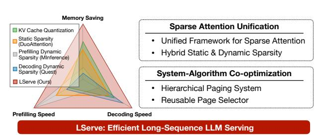

# LSERVE: EFFICIENT LONG-SEQUENCE LLM SERVING WITH UNIFIED SPARSE ATTENTION

Shang Yang  $^{*1}$  Junxian Guo  $^{*12}$  Haotian Tang  $^1$  Qinghao Hu  $^1$  Guangxuan Xiao  $^1$  Jiaming Tang  $^1$  Yujun Lin  $^1$  Zhijian Liu  $^3$  Yao Lu  $^3$  Song Han  $^{13}$ 

https://hanlab.mit.edu/projects/lserve

#### **ABSTRACT**

Large language models (LLMs) have shown remarkable potential in processing long sequences and complex reasoning tasks, yet efficiently serving these models remains challenging due to the quadratic computational complexity of attention in the prefilling stage and the large memory footprint of the KV cache in the decoding stage. To address these issues, we introduce LServe, an efficient system that accelerates long-sequence LLM serving via hybrid sparse attention. This method unifies different hardware-friendly, structured sparsity patterns for both prefilling and decoding attention into a single framework, where computations on less important tokens are skipped block-wise. LServe demonstrates the compatibility of static and dynamic sparsity in long-context LLM attention. This design enables multiplicative speedups by combining these optimizations. Specifically, we convert half of the attention heads to nearly free streaming heads in both the prefilling and decoding stages. Additionally, we find that only a constant number of KV pages is required to preserve long-context and reasoning capabilities, irrespective of context length. We then design a hierarchical KV page selection policy that dynamically prunes KV pages based on query-centric similarity. On average, LServe accelerates LLM prefilling by up to 2.9× and decoding by 1.3-2.1× over vLLM, maintaining long-context accuracy. Code is released at https://github.com/mit-han-lab/omniserve.

## 1 Introduction

Large Language Models (LLMs) have dramatically transformed the field of artificial intelligence. With expanding context window lengths and test-time computing (OpenAI, 2024; Snell et al., 2024), LLMs now demonstrate remarkable performance across diverse long-sequence applications (Gemini Team, Google, 2024), including multi-turn conversations, long document analysis (Zhang et al., 2024b; Goyal & Durrett, 2020; Huang et al., 2021), multi-modal understanding (Xue et al., 2024a; Liu et al., 2024b; Lin et al., 2024a), code completion (Li et al., 2023; Lozhkov et al., 2024), and complex reasoning tasks (DeepSeek-AI et al., 2025). Many of these applications require processing hundreds of thousands of context tokens in real-world settings, presenting unique challenges. In particular, the demand for fast prefilling, or minimizing the time to the first token, and the burden on the decoding phase due to the large KV (key-value) caches necessary for such contexts,

Proceedings of the 8th MLSys Conference, Santa Clara, CA, USA, 2025. Copyright 2025 by the author(s).

> **[图片提取文字 (无描述)]:**
> Memory Saving Sparse Attention Unification KV Cache Quantization Static Sparsity Unified Framework for Sparse Attention (DuoAttention) Hybrid Static & Dynamic Sparsity Prefilling Dynamic Sparsity (MInference) Decoding Dynamic Sparsity (Quest) System-Algorithm Co-optimization LServe (Ours) Hierarchical Paging System Reusable Page Selector **Prefilling Speed** Decoding Speed LServe: Efficient Long-Sequence LLM Serving

Figure 1: LServe is an efficient system for serving long-sequence LLMs that leverages hybrid sparse attention. With the unification of different sparse patterns as well as KV cache quantization, LServe achieves significant speedups in both prefilling stage and decoding stage while also reducing the memory consumption.

represent significant hurdles.

Long-sequence LLMs are about more than just an extended context. The recently announced OpenAI of (OpenAI, 2024) demonstrates exceptional capabilities in complex reasoning tasks, such as deciphering, mathematics, and coding. These advancements are achieved through inference-time scaling and the generation of extensive chains of thought (Wei et al., 2022). According to Qin et al. (2024), of 1's internal reasoning process can extend to 20k tokens for mathematical problems, making it the first known *long-generation* LLM. Contrary to the conventional belief that the prefilling stage dominates runtime in long-sequence

\*indicates equal contribution. Part of the work was done when Shang Yang and Haotian Tang were interning at NVIDIA. 1MIT 2SJTU 3NVIDIA. Correspondence to: Song Han <songhan@mit.edu>.

LLMs, when Llama-3-8B [\(Dubey et al.,](#page-11-4) [2024\)](#page-11-4) is run using TensorRT-LLM [\(NVIDIA,](#page-12-7) [2023\)](#page-12-7) with 256k input tokens and 20k output tokens (comparable to o1's reasoning trace length), the prefilling time is 116 seconds, while decoding takes 540 seconds — almost 5× longer.

To enhance the efficiency of long-sequence LLMs, it is essential to optimize both the prefilling and decoding stages rather than focusing on just one. Beyond model architectural modifications in the pre-training stage [\(Ainslie et al.,](#page-11-5) [2023;](#page-11-5) [Brandon et al.,](#page-11-6) [2024\)](#page-11-6), existing acceleration solutions for long-sequence LLMs primarily address efficiency from two angles. The first approach centers on KV cache quantization, where methods such as QServe [\(Lin et al.,](#page-12-8) [2024b\)](#page-12-8), KIVI [\(Liu et al.,](#page-12-9) [2024c\)](#page-12-9), and KVQuant [\(Hooper et al.,](#page-11-7) [2024\)](#page-11-7) employ low-bit quantization to reduce memory usage and I/O traffic, potentially increasing generation throughput. However, these quantization techniques do not lower the number of computations performed in the attention loop, resulting in suboptimal generation speeds as sequence lengths grow. The second approach utilizes approximate sparse attention to improve long-sequence LLM performance. For example, StreamingLLM [\(Xiao et al.,](#page-13-3) [2023\)](#page-13-3), H2O [\(Zhang](#page-13-4) [et al.,](#page-13-4) [2024c\)](#page-13-4), and TOVA [\(Oren et al.,](#page-12-10) [2024\)](#page-12-10) apply static masking mechanisms to reduce attention complexity, though at the expense of accuracy in long-context tasks and irregular KV cache memory layouts. DuoAttention [\(Xiao et al.,](#page-13-5) [2024\)](#page-13-5) advances this strategy by pruning attention computations at a coarser granularity using an optimization-based approach. Other methods, such as MInference [\(Jiang et al.,](#page-12-11) [2024b\)](#page-12-11) and Quest [\(Tang et al.,](#page-13-6) [2024\)](#page-13-6), implement dynamic sparse attention to accelerate either the prefilling *or* decoding stage. However, these approaches do not reduce KV cache memory consumption and lack a unified framework to address efficiency challenges in *both* stages simultaneously.

To this end, we introduce LServe, an efficient system for serving long-sequence LLMs that leverages hybrid sparse attention. Recognizing that not all tokens hold equal importance, LServe integrates multiple hardware-friendly, structured sparsity patterns into a unified block sparse attention framework (see Figure [4\)](#page-3-0). Block-level sparsity accelerates attention computation by processing the KV history in discrete blocks. By skipping blocks, we directly reduce the number of sequential iterations, resulting in measured speedups during both the prefilling and decoding stages.

Building on the unified block sparse attention framework, LServe further illustrates acceleration opportunities from *static* and *dynamic* sparsity.

For *static* sparsity, inspired by DuoAttention [\(Xiao et al.,](#page-13-5) [2024\)](#page-13-5), we modify the attention masks in the original model by converting half of the attention heads into Λ-shaped masks, transforming these attention heads into *streaming heads*. Additionally, we fuse the computation of streaming

and standard attention heads into unified GPU kernels for both the prefilling and decoding stages, translating theoretical computation and memory savings that translate to up to 1.7× measured speedup.

For *dynamic* sparsity, we observe that query-centric sparsity [\(Tang et al.,](#page-13-6) [2024\)](#page-13-6) allows for nearly lossless KV compression: the required number of KV tokens to maintain long-context capabilities remains constant (e.g., 4096), regardless of context length. To optimize efficiency, we design a hierarchical page selector to identify important KV pages for each query token, reusing the selection results across tokens to reduce page selection overhead by 4×.

Our key observation is that static and dynamic sparsity patterns are orthogonal in long-sequence LLMs. By unifying static and dynamic sparsity with KV cache quantization into a single GPU kernel, LServe achieves compounded efficiency benefits from each individual optimization for decoding stage attention.

We benchmark LServe across three long-sequence LLMs—Llama-3-8B, Minitron-4B, and Llama-2-7B—at context lengths up to 512k tokens. Compared to stateof-the-art frameworks like vLLM [\(Kwon et al.,](#page-12-12) [2023b\)](#page-12-12), QServe [\(Lin et al.,](#page-12-8) [2024b\)](#page-12-8), MInference [\(Jiang et al.,](#page-12-11) [2024b\)](#page-12-11), and DuoAttention [\(Xiao et al.,](#page-13-5) [2024\)](#page-13-5), LServe accelerates prefilling stage by up to 2.9× and achieves an average of 1.3×-2.1× speedup in the decoding stage, without sacrificing the long-context capabilities of the original dense, floating-point models. Furthermore, LServe also demonstrates compatibility with the latest reasoning-centric models. Table [4](#page-7-0) indicates that LServe achieves comparable accuracy to dense baselines on DeepSeek-R1-Distill-Llama-8B [\(DeepSeek-AI et al.,](#page-11-3) [2025\)](#page-11-3).

