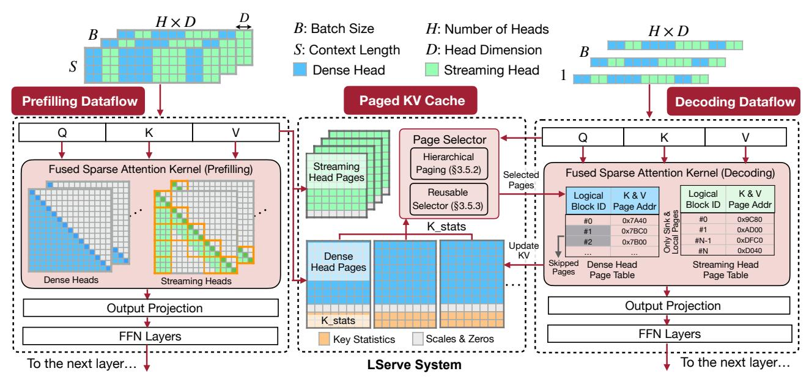
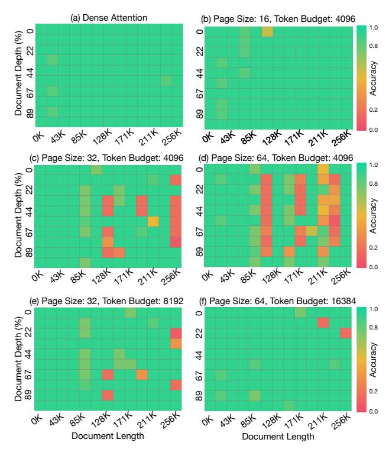

# 3 LSERVE: LONG-SEQUENCE SERVING WITH UNIFIED SPARSE ATTENTION

We introduce LServe, an efficient long-sequence LLM serving system featuring sparse attention. In LServe, diverse sparse attention patterns are unified within a block-sparse formulation (Figure [4\)](#page-3-0), and are flexibly supported through fused CUDA kernels. LServe also supports weight, activation and KV quantization, which significantly improves generation throughput at shorter context lengths.

#### 3.1 Unified Block Sparse Attention

As shown in Figure [3,](#page-2-1) skipping computations in the attention kernel by blockwise processing accelerates execution by shortening the sequential loop. Building on this, we introduce a *unified block sparse attention* pattern for both the prefilling and decoding stages: each thread block computes a TQ × TK tile (and TK × TV ) in parallel. Here, TQ > 1 in the prefilling stage and TQ = 1 in the decoding stage, with TK (or TV ) corresponding to the page size in PagedAttention [\(Kwon et al.,](#page-12-14) [2023a\)](#page-12-14).

We define *block sparsity* in LServe as follows: for each TQ × TK tile in the attention calculation, it is either fully skipped (Figure [4\(](#page-3-0)b), light gray blocks) or retained as in standard causal attention (Figure [4\(](#page-3-0)b), blue blocks). Given that each GPU streaming multiprocessor can execute only a limited number of thread blocks simultaneously, the attention kernel execution time can be approximated by the total count of TQ × TK (and TK × TV ) blocks. With a block sparsity of r, where rN of the N total blocks are empty, the theoretical speedup from block sparse attention is 1/(1−r). For example in Figure [4\(](#page-3-0)b), 10 out of N=21 blocks are non-empty. Thus, the theoretical speedup ratio is 2.1×.

Figure [4\(](#page-3-0)c)(d) shows two sparsity patterns used in LServe. The first is streaming attention (Figure [4\(](#page-3-0)c)), a specialized form of block-sparse attention where each token only attends to its immediate neighbors and initial tokens, known as attention sinks [\(Xiao et al.,](#page-13-3) [2023\)](#page-13-3). Unlike dense attention, where computation for each row scales with the token index, streaming attention keeps the computation for each token *constant*—in this case, only two local blocks and one sink block, as shown in Figure [4\(](#page-3-0)c). This pattern is nearly costfree in applications with extremely long contexts. Because streaming attention follows a fixed pattern, we designate which heads use it in *offline*, and make it *static* for different input sequences in both prefilling and decoding.

The second type of sparsity, illustrated in Figure [4\(](#page-3-0)d), is page sparsity, which is specifically designed for the decoding stage where TQ = 1 applies to both skipped and selected pages. Unlike streaming attention, page sparsity in LServe is *dynamic*, allowing different query tokens to attend to different KV pages. As noted in Deja Vu [\(Liu et al.,](#page-12-15) [2023\)](#page-12-15), dynamic sparsity results in higher compression ratios than static sparsity. Our observations indicate that static sparsity offers up to a 2× efficiency gain, whereas dynamic sparsity bounds the decoding complexity to a *constant*, with each query attending only to a fixed number of KV tokens.

### 3.2 LServe System Overview

We present an overview of LServe in Figure [5.](#page-4-0) Built on QServe, which natively supports quantized LLMs, LServe enhances the baseline system by introducing sparsity into both prefilling and decoding dataflows. The *two-way paged KV cache* serves as the bridge between these two stages.

As discussed in Section [3.1,](#page-3-2) we statically partition the attention heads of a pretrained LLM into two groups: dense heads and streaming heads. Unlike conventional LLM serving systems, which maintain a single KV cache, we utilize *separate* KV caches for the dense and streaming heads. The KV cache for the streaming heads is organized similarly to the pages in QServe, with scaling factors and zero points stored immediately after the token features. Additionally, the KV cache for the dense heads includes *key statistics* that facilitate critical page selection during the decoding stage.

In the prefilling stage, the key differences between LServe and conventional dense-attention LLM serving systems are twofold: (1) we replace the dense attention kernel with our unified block sparse attention kernel, and (2) we write back quantized KV features using two distinct kernels.

In the decoding stage, our system incorporates dynamic attention sparsity. Rather than developing an entirely new dynamic sparse attention kernel, we decompose the problem into two components: (1) dynamic *page selection* and (2) a *dense* attention kernel with *shorter page tables*, where

> **[图片提取文字 (无描述)]:**
> $H \times D$ B: Batch Size H: Number of Heads  $H \times D$ BS: Context Length D: Head Dimension B Dense Head Streaming Head Paged KV Cache **Prefilling Dataflow Decoding Dataflow** Q K Page Selector Hierarchical Streaming Fused Sparse Attention Kernel (Prefilling) Paging (§3.5.2) Fused Sparse Attention Kernel (Decoding) Selected Head Pages Pages Reusable Logical K&V K&V Logical Page Addr Selector (§3.5.3) Block ID Block ID Page Addr Sink & Pages #0 0x9C80 0x7A40 #0 K stats #1 0xAD00 0x7BC0 #1 Only ! 0xDFC0 0x7B00 #N-1 #2 Update 0xD040 ΚV Dense Skipped Dense Head Streaming Head **Head Pages** Pages Page Table Page Table Dense Heads Streaming Heads **Output Projection Output Projection** K stats FFN Layers FFN Layers Scales & Zeros **Key Statistics** To the next layer... To the next layer... LServe System

Figure 5: LServe system overview. In prefilling stage, LServe processes both dense heads and streaming heads within a fused sparse attention kernel. Past Keys and Values are stored in two separate paging systems: one for streaming heads and the other for dense heads. In decoding stage, LServe applies dynamic sparsity on dense heads with a page selection procedure. Only selected KV Pages will be loaded for the decoding stage attention. We omit normalization layers and residual connections in this figure for the sake of simplicity.

the shorter page tables are provided by the page selector. Notably, our page selector employs hierarchical paging and reusable page selection, enhancing both long-context accuracy and page selection efficiency.

#### 3.3 Prefilling Stage: Sparsity Determination

We adopt the approach from DuoAttention (Xiao et al., 2024) to classify each attention head as either a retrieval head or a streaming head. Using DuoAttention's optimization-based identification method, we obtain a gating value  $\alpha \in [0,1]$  for each head, where values closer to 1 signify a retrieval head, and values closer to 0 indicate a streaming head. To classify a head as a retrieval head, we compare  $\alpha$  to a threshold  $\tau$ , determined by a sparsity quantile. For instance, with a target sparsity of 50% across attention heads,  $\tau$  equals the median of all gate values, thereby designating half of the heads as retrieval heads.

#### 3.4 Prefilling Stage: Kernel Implementation

To effectively translate sparsity into performance gains, it is essential to avoid iterating over a complete sequential loop and relying on conditional statements to determine data loading and computation requirements. This method is inefficient for GPU computation patterns, which thrive on minimizing branching within loops. Instead, we should focus on iterating only over the necessary blocks by accurately calculating offsets to load data and assess whether a block should be processed.

To facilitate this, we introduce an iterator-based abstraction that standardizes indexing operations. This allows us to loop exclusively over the blocks requiring computation, with data offsets easily computed using offset = iter(i+1) - iter(i). This abstraction efficiently skips unnecessary blocks with minimal overhead and necessitates few changes to the kernel function, thus enhancing maintainability. Take the streaming heads as an example, the iterators are determined outside the attention kernel since streaming heads are configured offline and the attention pattern is fixed. Once the attention on sink tokens is complete, the iterator automatically updates the memory pointer to the first local token in the KV cache with minimal overhead. Additionally, our iterator-based formulation unifies the more general block sparse pattern (see Figure 4).

#### 3.5 Decoding Stage: Sparsity Determination

To further enhance the long-context LLM decoding throughput, we introduce dynamic sparsity upon the input-agnostic static sparsity in Sec. 3.1.

#### 3.5.1 Challenge: the Page Size Dilemma

In the decoding stage, the attention operation is memorybound, so state-of-the-art systems typically implement KV cache quantization to reduce device memory usage and enhance throughput. However, this quantization introduces challenges for further optimization. Specifically, reducing the bit-width of KV tokens necessitates larger page sizes

> **[图片提取文字 (无描述)]:**
> (a) Dense Attention (b) Page Size: 16, Token Budget: 4096 1.0 0 0 Document Depth (%) 0.8 23 Accuracy 44 67 0.2 8 0.0 or 234 854 1284 1714 5114 5884 OK 134 854 1284 1714 2114 2584 (c) Page Size: 32, Token Budget: 4096 (d) Page Size: 64, Token Budget: 4096 1.0 0 0 Document Depth (%) 0.8 8 Accuracy 44 67 67 0.2 8 0.0 OK 134 854 1284 174 2174 2584 OK 434 854 1284 1714 2174 2564 (e) Page Size: 32, Token Budget: 8192 (f) Page Size: 64, Token Budget: 16384 1.0 0 0 Document Depth (%) 0.8 22 Accuracy 4 67 0.2 89 0.0 OK 434 854 1284 1714 2114 171 484 128 YEA Document Length Document Length

Figure 6: We evaluate the Llama-3-8B model with the Needle-in-a-Haystack (NIAH) (Kamradt, 2024) benchmarks. The effectiveness of query-aware page selection algorithms (e.g., Quest (Tang et al., 2024)) gets impaired when the KV page granularity grows (b,c,d). Naively scaling up the page sizes will lead to significant performance loss even if we linearly increase the number of selected pages (token budget) (e,f).

to maintain GPU memory bandwidth utilization. Failure to do so can lead to significant throughput loss (Table 1). Yet, larger KV page sizes complicate the sparsification process; for example, Quest (Tang et al., 2024), which estimates token criticality using page-wise statistics, fails when page sizes increase (Figure 6). This observation poses challenges to balance between accuracy and efficiency.

