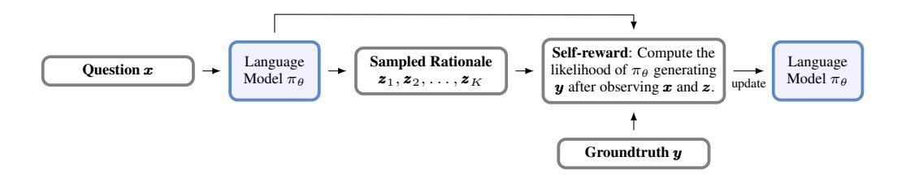

# 1 INTRODUCTION

The development of large language models (LLMs) with enhanced reasoning capabilities has emerged as a crucial area of research. Despite their impressive advances, the inherent next-token prediction mechanism of LLMs makes it challenging for these models to solve complex problems requiring multiple reasoning steps [\(Wang et al.,](#page-13-0) [2022;](#page-13-0) [Huang et al.,](#page-11-0) [2023\)](#page-11-0). For instance, LLMs often struggle to directly provide accurate solutions to mathematical problems or even simple puzzles like counting specific letters in a word. Consequently, researchers have explored various prompting strategies that guide LLMs to generate reasoning trajectories or rationales—sequences of tokens that build a step-by-step progression toward an answer. Techniques such as Chain-of-Thought (CoT) [\(Wei et al.,](#page-13-1) [2022\)](#page-13-1), Tree-of-Thought (ToT) [\(Yao et al.,](#page-13-2) [2024\)](#page-13-2), and Program-of-Thought (PoT) [\(Chen et al.,](#page-10-0) [2023\)](#page-10-0) prompting methods exemplify this approach.

Recent progress has also focused on inference-time techniques to enhance the reasoning abilities of LLMs [\(Wu et al.,](#page-13-3) [2024;](#page-13-3) [Brown et al.,](#page-10-1) [2024\)](#page-10-1), as observed in the OpenAI o1 model [\(OpenAI,](#page-12-0) [2024\)](#page-12-0). These methods have demonstrated remarkable performance in diverse reasoning tasks, including mathematics [\(Cobbe et al.,](#page-10-2) [2021b;](#page-10-2) [Trinh et al.,](#page-13-4) [2024;](#page-13-4) [Luo et al.,](#page-12-1) [2024\)](#page-12-1), coding [\(Jimenez et al.,](#page-11-1) [2023;](#page-11-1) [Guo et al.,](#page-11-2) [2024;](#page-11-2) [Zhang et al.,](#page-14-0) [2024\)](#page-14-0), and scientific problem-solving [\(Rein et al.,](#page-12-2) [2023\)](#page-12-2). Notable inference-time methods, such as CoT with Self-Consistency (CoT-SC) [\(Wang et al.,](#page-13-5) [2023\)](#page-13-5) and CoT-Decoding [\(Wang & Zhou,](#page-13-6) [2024\)](#page-13-6), extend the CoT approach by generating multiple reasoning paths and selecting the most consistent one. Additionally, techniques like ReAct [\(Yao et al.,](#page-13-7) [2023a\)](#page-13-7) and Reflexion [\(Shinn et al.,](#page-12-3) [2023\)](#page-12-3) integrate reasoning into LLM agent loops, further enhancing their problem-solving capabilities.

Despite the promising results at inference time, improving the reasoning abilities of LLMs during their training phase remains a challenging problem. Several obstacles impede progress in this area. Firstly,

∗Corresponding author, huan.wang@salesforce.com.

> **[图片提取文字 (无描述)]:**
> **Self-reward**: Compute the Sampled Rationale Language Language likelihood of  $\pi_{\theta}$  generating Question x  $\boldsymbol{z}_1, \boldsymbol{z}_2, \dots, \boldsymbol{z}_K$ Model  $\pi_{\theta}$ Model  $\pi_{\theta}$ update  $\boldsymbol{y}$  after observing  $\boldsymbol{x}$  and  $\boldsymbol{z}$ . Groundtruth y

Question: A robe takes 2 bolts of blue fiber and half that much white fiber. How many bolts does it take? Groundtruth: The answer is 3.

Sampled Rationale 1 (correct , higher likelihood): It takes 2/2 = 1 bolt of white fiber. 2 + 1 = 3. So, it takes a total of 3 bolts of fiber.

Sampled Rationale 2 (incorrect , lower likelihood): We need 2 bolts of blue and 2 bolts of white fiber. In total, it is 2 + 2 = 4.

Figure 1: Overview of LaTRO with an example question from GSM8K [\(Cobbe et al.,](#page-10-2) [2021b\)](#page-10-2). LaTRO treats reasoning trajectories as latent variables and optimizes the underlying distribution through self-rewarding. Given a question, the language model generates multiple reasoning rationales, evaluates their likelihood of producing the correct answer, and updates its parameters to favor high-quality rationales. This iterative process allows the model to improve both its ability to generate good reasoning paths and to evaluate the quality of those paths.

there is a scarcity of high-quality reasoning data for complex problems, limiting the applicability of traditional supervised fine-tuning (SFT) approaches [\(Zelikman et al.,](#page-14-1) [2022\)](#page-14-1). Moreover, when such data is available, SFT on deterministic reasoning paths may result in a lack of diversity in problem-solving strategies, potentially causing over-confidence issues and performance degradation [\(Cobbe et al.,](#page-10-2) [2021b\)](#page-10-2), especially in domains needing multiple valid approaches, such as mathematical proofs and coding. Alternatively, improving reasoning through reinforcement learning from human feedback (RLHF) presents its own challenges [\(Havrilla et al.,](#page-11-3) [2024;](#page-11-3) [Luo et al.,](#page-12-1) [2024\)](#page-12-1). Developing a reward model that accurately evaluates the quality and validity of reasoning paths is a formidable task, susceptible to distribution shifts and biased evaluations.

Self-improvement approaches like STaR (Self-Taught Reasoner) [\(Zelikman et al.,](#page-14-1) [2022\)](#page-14-1) and Quiet-STaR [\(Zelikman et al.,](#page-14-2) [2024\)](#page-14-2) have shown promise in enhancing language models' reasoning capabilities without external feedback. However, STaR relies on task-specific few-shot examples to bootstrap its reasoning process, which can limit its generalizability across diverse tasks. While Quiet-STaR attempts to overcome this by inferring implicit rationales across arbitrary text, it does not directly optimize the reasoning process itself. Through these findings, we observe that *pretrained LLMs already possess innate reasoning capabilities but just have not been fully activated or utilized*, inspiring us to propose our approach.

Our proposed method, LaTent Reasoning Optimization (LaTRO), addresses the limitations of previous approaches by formulating reasoning as sampling from a latent distribution and optimizing it through a principled variational framework. As illustrated in Fig. [1,](#page-1-0) LaTRO enables language models to concurrently improve both their reasoning process and ability to evaluate reasoning quality, without requiring task-specific few-shot examples or external reward models. Key contributions of LaTRO include:

- 1. A theoretical formulation connecting LLM reasoning optimization to latent variable models;
- 2. A self-rewarding mechanism leveraging the model's own probability estimates;
- 3. Significant performance gains across multiple model architectures and reasoning tasks, demonstrating LaTRO's effectiveness in unlocking latent reasoning capabilities of language models.

Our findings suggest that pre-trained LLMs are not only capable reasoners but also possess the potential to act as explicit reward models for evaluating reasoning paths. We term this approach of utilizing explicit reward functions induced by LLMs themselves as "self-rewarding." Empirically, LaTRO outperforms both baseline models and supervised fine-tuning approaches on reasoning tasks like GSM8K, while also demonstrating the capacity to compress reasoning processes and shift computational burdens from inference to training time.

