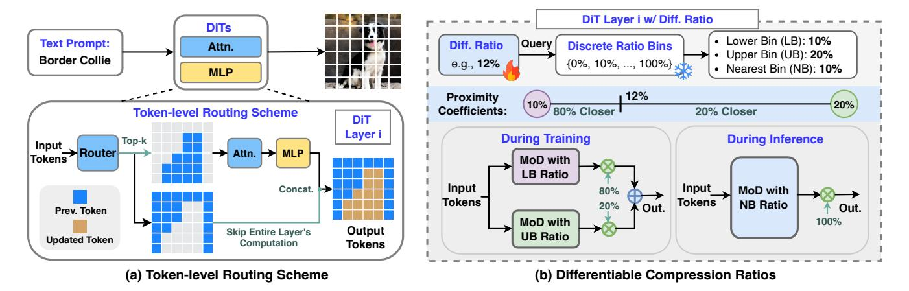
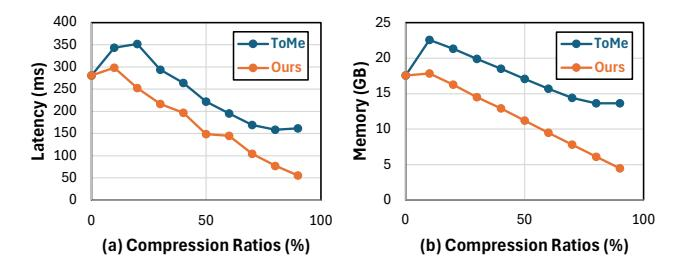
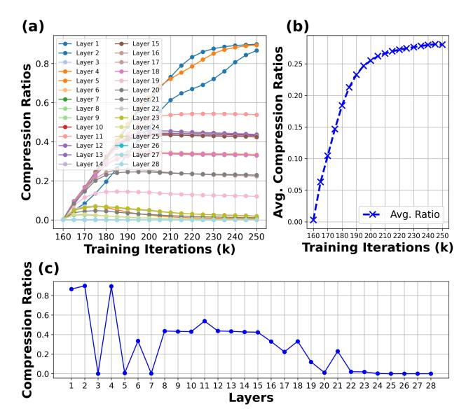

# 2. Related Work

#### 2.1. Diffusion Models

Diffusion models [\[13,](#page-8-0) [40\]](#page-9-11) have demonstrated superior performance over prior SOTA generative adversarial networks (GANs) in image synthesis tasks [\[7\]](#page-8-8). Early diffusion models primarily utilized U-Net architectures. Subsequent work introduced several improvements, such as advanced sampling [\[16,](#page-8-9) [23,](#page-8-7) [41\]](#page-9-2) and classifier-free guidance [\[12\]](#page-8-10). Although effective, these models suffered from high generation latency due to processing directly in pixel space, thus limiting their practical applications. The introduction of Latent Diffusion Models (LDMs) [\[34\]](#page-9-1) marked a significant advancement by encoding pixel space into a more compact latent space through training a Variational Auto-Encoder (VAE). This reduced the computational cost of the diffusion process, paving the way for widely used models like Stable Diffusion Models (SDMs) [\[30\]](#page-9-0). More recently, researchers have explored Transformer [\[43\]](#page-9-12) architectures for diffusion, leading to the development of DiTs [\[1,](#page-8-1) [29\]](#page-9-3), which employ a pure Transformer backbone and exhibit improved scalability. Our DiffCR proposes a novel dynamic DiT inference framework with differentiable compression ratios and is compatible with all recent DiT models.

### 2.2. Efficient Diffusion and DiT Models

DiTs [\[29\]](#page-9-3) are resource-intensive due to the transformer architecture, with the attention module exhibiting quadratic complexity relative to the number of tokens. Previous work has mainly focused on optimizing DiTs' deployment efficiency along three dimensions: token, layer, and timestep. For tokens, researchers have introduced techniques like token merging [\[2\]](#page-8-4) to merge similar tokens, token pruning [\[45\]](#page-9-6) or image resolution downsampling [\[39\]](#page-9-7) to remove redundant tokens, and LazyDiffusion [\[28\]](#page-9-4), which is specialized for the inpainting task and bypasses generating background tokens. For layers, methods such as layer [\[17\]](#page-8-5) and channel [\[9\]](#page-8-6) pruning, as well as intermediate feature caching [\[22,](#page-8-11) [25,](#page-9-13) [54\]](#page-10-2), have been proposed to skip redundant computations. For timesteps, strategies include distillation to reduce the required number of timesteps, which has been explored for UNets [\[15,](#page-8-12) [23,](#page-8-7) [35,](#page-9-8) [36,](#page-9-14) [55,](#page-10-3) [56\]](#page-10-1) although there is no reason to believe these techniques cannot apply to Transformers, and asymmetric sampling, which has been applied to Transformer architectures and allocates more samples to undersampled stages and fewer to stages that have already converged [\[31,](#page-9-15) [46\]](#page-9-9). Additionally, to accelerate diffusion T2I models, more specialized techniques have been introduced [\[3,](#page-8-2) [4\]](#page-8-3). In contrast, our proposed DiffCR is a learnable and unified dynamic DiT inference framework with differentiable compression ratios across layers and timesteps, exploring the compounded effects of compression across all three axes. However, we do not explore few step distillation (e.g. [\[55\]](#page-10-3)) in this paper, since it is an orthogonal acceleration method that is complementary to ours.

#### 2.3. Dynamic Inference

Model compression [\[6\]](#page-8-13) offers a static approach to improving inference efficiency, while dynamic inference [\[33,](#page-9-10) [48,](#page-9-16) [49,](#page-9-17) [52,](#page-10-4) [58\]](#page-10-5) enables adaptive compression based on the input, layer, or other conditions. For example, early exiting methods [\[14,](#page-8-14) [24,](#page-8-15) [42\]](#page-9-18) predict the optimal point for early termination within intermediate layers, allowing the model to exit before completing all computations. Dynamic layerskipping methods [\[48,](#page-9-16) [49,](#page-9-17) [52\]](#page-10-4) selectively execute subsets of layers for each input, often utilizing a gating network to make decisions on the fly. At a finer granularity, researchers have also explored channel skipping [\[9,](#page-8-6) [26\]](#page-9-19) and mixture-ofdepths (MoD) approaches [\[33\]](#page-9-10), which select specific subsets of layers for individual tokens rather than processing the entire input uniformly. In contrast, our DiffCR is the first to introduce a unified dynamic DiT inference framework that optimizes across three axes: token, layer, and

> **[图片提取文字 (无描述)]:**
> DiT Layer i w/ Diff. Ratio DiTs Lower Bin (LB): 10% **Text Prompt:** Diff. Ratio Query Discrete Ratio Bins Attn. Upper Bin (UB): 20% **Border Collie** e.g., 12% {0%, 10%, ..., 100%} Nearest Bin (NB): 10% MLP 12% Proximity 10% 20% 80% Closer Coefficients: 20% Closer **Token-level Routing Scheme** DIT Layer i **During Training During Inference** Top-k Input → Router → Attn. → MLP -MoD with Tokens LB Ratio Input Input Concat. MoD with 80% Tokens Tokens **NB** Ratio 20% Out. Out. Prev. Token MoD with 100% Output Skip Entire Layer's **UB Ratio Updated Token** Computation Tokens (a) Token-level Routing Scheme (b) Differentiable Compression Ratios

Figure 1. Overview of the proposed DiffCR framework: (a) token-level routing scheme and (b) differentiable compression ratios.

timestep. It also enables differentiable compression ratios that are fine-tuned jointly with the network, enhancing adaptability and efficiency.

#### 3. The Proposed DiffCR Framework

In this section, we present the proposed DiffCR framework. First, we provide an overview of the method. Then, we detail the three enablers: (1) the token-level routing scheme for DiTs in Sec. 3.2; (2) the layer-wise differentiable compression ratio scheme in Sec. 3.3; and (3) the timestep-wise differentiable compression ratio scheme in Sec. 3.4.

#### 3.1. Overview of DiffCR

Motivated by the need for unified and dynamic compression during DiT inference, DiffCR introduces a token-level routing scheme to dynamically learn the importance of each token on the fly. As illustrated in Fig. 1 (a), similar to previous mixture-of-depths (MoD) work [33] for NLP tasks, each DiT layer incorporates a lightweight router using a single linear layer to predict the importance of each token based on the input image/noise and text embedding. This allows us to bypass computations for less important tokens in each layer and to directly forward their activations to the layer's outputs. Consequently, each token is processed by only a selective subset of layers. Visualization of these routers' predictions reveals that different layers or timesteps favor varying compression ratios—for instance, some layers prioritize generating objects, while others focus on backgrounds—highlighting the need for adaptive compression across layers and timesteps. To achieve such dynamic compression, DiffCR incorporates a differentiable compression ratio scheme, as shown in Fig. 1 (b). This scheme includes a learnable scalar parameter that represents a continuous compression ratio, and predefined discrete ratio bins as proxy ratios. The scalar queries the bins to identify lower and upper bin ratios, creating two separate paths with distinct compression ratios. The final output

is a linear combination of these two paths, weighted by the proximity of the learned ratio to each bin. We apply a mean-squared error (MSE) loss to ensure that the average learned ratio across layers or timesteps converges to the target ratio. By doing so, DiffCR learns the adaptive compression ratios in a differentiable manner, resulting in efficient and dynamic mixture-of-depths DiTs.

#### 3.2. Enabler 1: Token-level Routing Scheme

**Motivation.** We are motivated by the varying computational demands across tokens, as many of them require fewer layers for efficient processing. We start from the same token-level routing scheme as MoD [33]. We remove from MoD two features that were specialized for the acausal NLP task: specifically, we remove the auxiliary loss and auxiliary MLP predictor from Section 3.5 of their paper. To the best of our knowledge, our paper is the first application of MoD to the vision domain, so we next review the routing mechanism, perform some visualizations, and report insights for vision tasks.

Token-level Routing. DiTs process noise and conditional text embeddings as inputs, aiming to denoise and generate images in an end-to-end manner. To predict token importance, we employ a simple yet effective token-level routing scheme from MoD [33]. As illustrated in Fig. 1 (a), each DiT layer incorporates a lightweight router composed of a single linear layer with a sigmoid activation function, predicting each token's importance on a scale from 0 to 1. After passing through the routers, we select the top-k most important tokens for this layer's processing, while the activations of other tokens are cached and concatenated with the layer outputs, bypassing the entire layer computation, including both attention and MLPs. To enable gradient flow to the router's weights during joint fine-tuning with pretrained DiT models, the same as MoD [33], we rescale the top-k token output activations by multiplying them with the router's predictions. This rescaling ensures that gradients are propa-

> **[图片提取文字 (无描述)]:**
> "a pínk rose wíth water droplets" (a) Inpainting (b) Input: "an apple" Input: Text-to-Image Timestep: Timestep: **Router's Prediction Router's Prediction** 40 60 80 100 0 19 21 Layer: 13 17 26 Layer: 10 12 17 3 4

Figure 2. Visualization of the router's predictions: (a) For inpainting tasks, where inputs are masked images with text prompts, we follow the previous SOTA method Lazy-Diffusion [28] to generate only the masked area rather than the entire image; (b) For text-to-image (T2I) tasks, where inputs are noise and text prompts, we follow PixArt- $\Sigma$  [4] for generation. Each visualization includes the router's prediction map with values ranging from 0 to 1. The generated image at each corresponding timestep is shown on the left, while the router's prediction maps across various layers and timesteps are displayed on the right. More visualizations are provided in the supplementary materials.

> **[图片提取文字 (无描述)]:**
> ToMe -ToMe Memory (GB) 15 10 € 300 250 Latency (a) Compression Ratios (%) (b) Compression Ratios (%)

Figure 3. Comparison of latency and memory savings between our DiffCR router and the previous token merging method (ToMe) [2] when applied to ViT-XL/2 [8, 28] on an A100 GPU.

gated effectively to the router during backpropagation. The value of k is determined based on compression ratios; we empirically find that 20% or 30% compression offers an optimal trade-off between latency/memory efficiency and minimal degradation in generation quality. Unlike previous token merging techniques [2], where computational savings are not directly proportional to the merge ratios due to the extra overhead, as shown in Fig. 3, the MoD in our approach yields more reductions in actual latency and memory usage due to negligible overhead.

Router Visualization and Insights. To test the router's effectiveness, we visualize its predictions in Fig. 2. Our observations reveal that: (1) The router effectively captures semantic information, clearly delineating object shapes and achieving an attention-like effect with significantly reduced computational costs; (2) The predicted token importance varies across layers and timesteps. For instance, some layers prioritize object generation, while others emphasize background areas. Additionally, as timesteps progress, the

router increasingly captures the semantic contours of objects, underscoring the need for dynamic token importance estimation; (3) *The optimal compression ratio differs across layers and timesteps*. For example, certain layers designate all tokens as high-importance, showing minimal redundancy, whereas other layers selectively prune object or background tokens with distinct shapes, requiring varying compression ratios. Similar variance is observed across timesteps. In the current MoD, a fixed global compression rate is applied equally to each layer and timestep, rather than adapting to its individual significance. Uniform pruning risks over-pruning critical layers or timesteps while leaving redundant ones less compressed. This motivates us to apply adaptive and dynamic compression ratios across both layers and timesteps.

#### 3.3. Enabler 2: Layer-wise Differentiable Ratio

**Motivation.** Recognizing that different layers prioritize different objects or background elements and thus benefit from distinct compression ratios, we propose a novel layer-wise differentiable compression ratio mechanism. This approach automatically learns each layer's compression ratio from a zero initialization in a differentiable manner, adapting to the varying redundancy levels across layers.

**Design Choice.** Before designing DiffCR, we address a key choice: a discrete proxy or a continuous ratio representation. Previous work [5] uses a discrete proxy with multiple compression ratio candidates and learnable probabilities, but this approach poses three challenges for MoD: (1) it lacks effective initialization, as the final ratio relies on the product of candidates and probabilities, making it

> **[图片提取文字 (无描述)]:**
> (a) (b) Layer 1 Layer 15 **Compression Ratios** Layer 16 Layer 2 Compression Ratios Layer 17 0.25 Layer 18 Layer 19 Layer 20 0.20 Layer 21 Layer 22 Laver 8 Layer 23 Layer 9 0.15 Layer 24 Laver 25 Layer 11 Layer 12 Layer 26 Layer 13 Layer 27 0.10 - Layer 14 Layer 28 Avg. . Avg. Ratio 0.0 0.00 160 170 180 190 200 210 220 230 240 250 170 180 190 200 210 220 230 240 250 Training Iterations (k) Training Iterations (k) (c) **Compression Ratios** 0.8 0.6 0.4 0.2 0.0 2 3 5 6 8 9 10 11 12 13 14 15 16 17 18 19 20 21 22 23 24 25 26 27 28 Layers

Figure 4. Visualization of the compression ratio trajectory during fine-tuning: (a) Trajectories for each of the 28 layers in DiT models; (b) Average ratio trajectory across all layers; and (c) The final learned ratio distribution across 28 layers.

difficult to initialize all ratios at zero; (2) MoD requires a differentiable and learnable router, incompatible with discrete proxies that need multiple sets of top-k tokens; and (3) it introduces numerous learnable parameters, complicating training and interpretability, and leading to hard-to-interpret ratio distributions. In contrast, we represent each layer's compression ratio with a single continuous scalar parameter, reducing the number of parameters to 28 for DiT's 28 layers [\[3\]](#page-8-2) and directly representing the compression ratio.

Layer-wise DiffCR. As illustrated in Fig. [1](#page-2-1) (b), we assign each layer a single learnable parameter and introduce discrete MoD compression ratio bins at 10% intervals, ranging from 0% to 100%. During training, the learnable MoD ratio queries the nearest two discrete bins to retrieve the lower and upper bin ratios. For example, a 22% learnable ratio would correspond to 20% as the lower bin and 30% as the upper bin. We then apply a forward pass through the DiT layer (with MoD routers) with each of these bin ratios, producing two output branches. The final output is a weighted linear combination of these branches, where the weights are determined by the proximity of the learnable ratio to each bin—e.g., for 12%, the output would be 80% weighted towards the 10% branch and 20% towards the 20% branch. Although this approach doubles the cost of a forward pass during training, we simply select the nearest bin as the final compression ratio during inference, eliminating any overhead. To ensure that the ratio converges to our target value, we incorporate an additional MSE loss between the current learned average ratios across all layers in the batch and the target ratio, which is a hyperparameter.

Ratio Trajectory Analysis. We visualize the training

> **[图片提取文字 (无描述)]:**
> (a) Inpainting Task (b) T2I Task 0.5 0.40 25 25 0.35 0.4 0.30 21 21 0.25 Layers 13 0.3 17-0.20 13 0.2 0.15 9 9 0.10 0.1 5 0.05 0.0 0.00 10 9 **Timestep Regions** Timestep Regions

Figure 5. Visualization of the learned ratio patterns across both timesteps and layers for the (a) inpainting task and (b) T2I task.

trajectory of compression ratios for all layers during finetuning of a LazyDiffusion model on an inpainting task in Fig. [4](#page-4-1) (a-c). The visualization reveals that: (1) Each layer learns its unique compression ratio, with redundant layers achieving higher compression and critical layers remaining less or entirely uncompressed; (2) The average ratio across layers gradually converges to the target ratio. In this example, with a target of 30%, the final achieved average ratio is approximately 29%, indicating a minor gap. Notably, a trade-off exists between convergence speed and generation quality: a higher MSE loss coefficient for the ratio accelerates convergence but may degrade quality due to overly rapid compression, while a smaller coefficient promotes gradual convergence and maintains quality, albeit with slower training. In practice, we set the coefficient to 0.3 to balance speed and quality effectively; (3) The middle layers exhibit greater redundancy, while the later layers generally have less redundancy and often cannot be compressed. The early layers show variable redundancy levels.

### 3.4. Enabler 3: Timestep-wise Differentiable Ratio

Motivation. In addition to layer-wise ratio variances, we also observe that the model exhibits varying levels of redundancy across timesteps. This motivates us to explore an approach for timestep-wise compression ratios as well.

Timestep-wise Differentiable Ratio. On top of the layer-wise DiffCR, we introduce learnable parameters specific to different timestep regions. For the image inpainting task, following the previous SOTA LazyDiffusion [\[28\]](#page-9-4), we use 1,000 training timesteps and 100 sampling timesteps, which we evenly divide into 10 regions. We assign 10 learnable ratios per layer accordingly, resulting in a total of 280 learnable parameters. Similarly, for T2I tasks, following PixArt-Σ [\[4\]](#page-8-3) with 20 timesteps, we divide them into 4 regions, assigning 4 learnable ratios per layer, yielding 112 learnable parameters. The same as before, we apply an MSE loss between the averaged learned ratios within the batch and the target ratio to ensure convergence.

Ratio Pattern Analysis. We visualize the learned compression ratio patterns across both timesteps and layers in Fig. [5.](#page-4-2) For both image inpainting and T2I tasks, we consistently observe that noisy timesteps (corresponding to earlier sampling timesteps or later training timesteps) exhibit higher redundancy and allow for higher compression, whereas timesteps where images become clearer (corresponding to later sampling timesteps or earlier training timesteps) show less redundancy. This learned pattern aligns with previous empirical findings [\[46\]](#page-9-9), which suggest that high-noise timesteps are associated with convergence regions containing easier samples, allowing for fewer sampling timesteps, while low-noise timesteps involve harder samples and require more frequent sampling.

