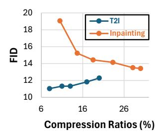
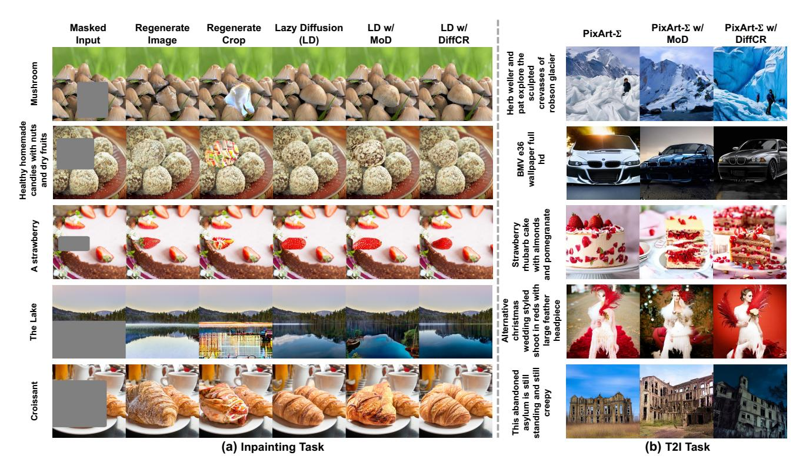

# 4. Experiments

#### 4.1. Experiment Settings

Tasks, Datasets, and Models. *Tasks & Datasets.* We evaluate our DiffCR on two representative image generation tasks using corresponding benchmark datasets: (1) an image inpainting task on an internal dataset of 220 million high-quality images, covering diverse objects and scenes. Masks and text prompts are generated following [\[28,](#page-9-4) [53\]](#page-10-6); and (2) a T2I task on the LAION-5B dataset [\[38\]](#page-9-20), restricted to image samples with high aesthetic scores, English text, and a minimum text similarity score of 0.24. *Models.* We integrate our proposed DiffCR approach with SOTA models. For the inpainting task, we use Lazy Diffusion (an adapted PixArt-α model with an additional ViT encoder) to generate images at 1024×1024 resolution. For the T2I task, we use PixArt-Σ to generate images at 512×512 resolution.

Training and Sampling Setting. For the inpainting task, we fine-tune the model parameters until convergence using the AdamW optimizer [\[20\]](#page-8-18) with a learning rate of 10−4 and weight decay of 3 × 10−2 . For sampling, images are generated using IDDPM [\[27\]](#page-9-21) with 100 timesteps and a CFG factor of 4.5. For the T2I task, we fine-tune the model using a LoRA adapter with a rank of 32 until both training and validation losses converge, and the MSE loss between the current and target compression ratios drops to approximately zero for DiffCR models. During training, we calculate the diffusion loss with IDDPM [\[27\]](#page-9-21) over 1K timesteps. For sampling, we generate images using DPMsolver [\[21\]](#page-8-19) with 20 timesteps and a CFG factor of 4.5. All training is conducted on a cluster of 8×A100-80GB GPUs.

Baselines and Evaluation Metrics. *Baselines.* For both the T2I and inpainting tasks, we compare the proposed DiffCR against SOTA baselines, including ToMe [\[2\]](#page-8-4), AT-EDM [\[45\]](#page-9-6), and our adapted MoD with uniform MoD compression ratio. For the inpainting task, we also compare against *RegenerateCrop*, which generates a tight square crop around the masked region, similar to popular software frameworks [\[44,](#page-9-22) [50\]](#page-10-7), and *RegenerateImage*, which generates the entire image, as commonly done in the literature [\[30,](#page-9-0) [34,](#page-9-1) [47,](#page-9-23) [53\]](#page-10-6). *Evaluation Metrics.* We assess the generated image quality using FID scores [\[11\]](#page-8-20), text-image alignment using CLIP scores [\[10\]](#page-8-21), and efficiency through inference FLOPs, latency, and memory usage, all measured on an A100 GPU. For inpainting and T2I models, we evaluate on 10K images from LAION-400M [\[37\]](#page-9-24) or LAION-5B [\[38\]](#page-9-20), excluding training samples, respectively.

### 4.2. DiffCR over SOTA Baselines

Text-to-Image. To assess the effectiveness of our proposed DiffCR, we apply our proposed DiffCR to the general textto-image task and compare it with previous token merging [\[2\]](#page-8-4) and pruning [\[45\]](#page-9-6) baselines. Specifically, we apply these compression methods on PixArt-Σ, a SOTA publicly accessible T2I model known for its high-resolution image generation quality and efficiency tradeoffs. As shown in Tab. [1,](#page-6-0) PixArt-Σ with DiffCR significantly improves generation quality, achieving 57.83 and 241.11 FID reductions over ToMe [\[2\]](#page-8-4) and AT-EDM [\[45\]](#page-9-6), respectively, with comparable or even lower latency (↓8.59%∼20.15%) and memory usage (↓-2.71%∼0.72%). Also, under similar latency compared to ToMe [\[2\]](#page-8-4) with 20% compression ratio, DiffCR achieves 335.23 FID reductions. Moreover, PixArt-Σ with DiffCR also achieves comparable image generation quality to uncompressed PixArt-Σ, while delivering 20.68% and 8.33% latency and memory savings. Note that we compare with fine-tuned PixArt-Σ on the LAION datasets for a fair comparison. This set of experiments demonstrates the effectiveness of DiffCR for general T2I tasks.

Image Inpainting. We further extend DiffCR to the inpainting task. Specifically, we apply it on top of the SOTA Lazy Diffusion (LD) [\[28\]](#page-9-4), which uses a DiT decoder to generate only the masked areas rather than the entire image, leveraging a separate ViT encoder to capture the global context of the input masked images. We compare our DiffCR approach against two types of baselines: (1) RegenerateImage and RegenerateCrop, and (2) LD with previous token merging [\[2\]](#page-8-4) or pruning [\[45\]](#page-9-6) techniques. As shown in Tab. [2,](#page-6-1) our DiffCR consistently outperforms all baselines in terms of accuracy-efficiency tradeoffs. For example, LD with DiffCR achieves FID reductions of 47.35 and 189.93 compared to LD with ToME [\[2\]](#page-8-4) or AT-EDM [\[45\]](#page-9-6), while achieving similar or up to 23.61% and 13.63% higher latency and memory savings. Also, under similar memory usage compared to ToMe [\[2\]](#page-8-4) with 30% compression ratio, LD with DiffCR achieve 265.94 FID reduction while delivering up to 21.54% latency savings. Moreover, compared to RegenerateImage, our method achieves 73.51%/60.26% FLOPs and latency savings when inpainting 2562 mask sizes within 10242 images. Notably, like Lazy Diffusion, our method's complexity scales with mask size, while RegenerateImage generates based on full image resolution, making it less efficient for smaller mask sizes. In comparison to Regenerate-Crop, our method achieves significantly higher image generation quality (+41.01 FID) while also delivering 22.96%

Table 1. Quantitative comparison of DiffCR with other baselines on the T2I task. All experiments are fine-tuned from the pre-trained PixArt- $\Sigma$  [4] on the LAION-5B [38] dataset. C.R. denotes compression ratios. We report FID ( $\downarrow$ ) and CLIP Score ( $\uparrow$ ) on 10K images (excluding training samples) as quality metrics and measure FLOPs ( $\downarrow$ ), latency ( $\downarrow$ ), and memory ( $\downarrow$ ) on an A100 GPU as efficiency metrics under batch sizes of 16 and 128. Memory is averaged across all layers. "-L" and "-LT" indicate layer-wise or layer/timestep-wise DiffCR. "TF" denotes training-free methods.

|                                      | DiT C.R. | Quality |                   | <b>DiT Efficiency (5122; BS = 16)</b> |          |           | <b>DiT Efficiency (5122; BS = 128)</b> |          |           |
|--------------------------------------|----------|---------|-------------------|--------------------------------------------------|----------|-----------|---------------------------------------------------|----------|-----------|
| Methods                              |          | FID     | <b>CLIP Score</b> | FLOPs (G)                                        | Lat. (s) | Mem. (GB) | FLOPs (G)                                         | Lat. (s) | Mem. (GB) |
| PixArt- $\Sigma$ [4]                 | 0%       | 151.0   | 0.173             | 17361.7                                          | 225.38   | 1.798     | 138893.9                                          | 1784.64  | 13.107    |
| PixArt- $\Sigma$ (Fine-tuned)        | 0%       | 11.93   | 0.242             | 17361.7                                          | 225.38   | 1.798     | 138893.9                                          | 1784.64  | 13.107    |
| PixArt- $\Sigma$ w/ ToMe (TF) [2]    | 10%      | 68.51   | 0.211             | 16391.4                                          | 224.04   | 1.674     | 131131.6                                          | 1772.84  | 12.087    |
| PixArt- $\Sigma$ w/ ToMe (TF) [2]    | 20%      | 345.91  | 0.122             | 15421.2                                          | 213.79   | 1.546     | 123369.2                                          | 1681.83  | 11.078    |
| PixArt- $\Sigma$ w/ AT-EDM (TF) [45] | 20%      | 251.79  | 0.129             | 15132.7                                          | 196.88   | 1.617     | 121061.2                                          | 1548.80  | 11.870    |
| PixArt- $\Sigma$ w/ <b>MoD</b>       | 20%      | 22.78   | 0.207             | 13949.3                                          | 178.89   | 1.659     | 111594.2                                          | 1402.96  | 11.987    |
| PixArt- $\Sigma$ w/ <b>DiffCR-L</b>  | 20%      | 12.28   | 0.232             | 13967.1                                          | 180.84   | 1.662     | 111737.0                                          | 1425.30  | 12.015    |
| PixArt- $\Sigma$ w/ <b>DiffCR-LT</b> | 20%      | 10.68   | 0.238             | 13957.2                                          | 179.71   | 1.664     | 111657.3                                          | 1415.63  | 12.021    |

Table 2. Quantitative comparison of DiffCR with other baselines on the inpainting task. Scores for SDXL [30] are provided for reference only and are not directly comparable. C.R. denotes compression ratios. We report FID  $(\downarrow)$  [11] and CLIP Score  $(\uparrow)$  [10] on 10K images from LAION-400M [37] as quality metrics, and measure FLOPs  $(\downarrow)$ , latency  $(\downarrow)$ , and memory usage  $(\downarrow)$  on an A100 GPU as efficiency metrics for two inpainting mask sizes  $(512^2$  and  $256^2$  within  $1024^2$  images). "-L" and "-LT" indicate layer-wise or layer/timestep-wise DiffCR. "TF" denotes training-free methods.

| Methods                  | ViT En. | DiT De. | Quality |            | DiT Efficiency (512 $^2$ within 1024 $^2$ ) |          |           | DiT Efficiency (256 2 within 1024 2 ) |          |           |
|--------------------------|---------|---------|---------|------------|---------------------------------------------|----------|-----------|-------------------------------------------------------------|----------|-----------|
| THUMOUS                  | C.R.    | C.R.    | FID     | CLIP Score | FLOPs (G)                                   | Lat. (s) | Mem. (GB) | FLOPs (G)                                                   | Lat. (s) | Mem. (GB) |
| SDXL [30]                | N/A     | 0%      | 6.37    | 0.2112     | 5979.5                                      | 66.09    | OOM       | 5979.5                                                      | 66.09    | OOM       |
| RegenerateImage          | N/A     | 0%      | 9.53    | 0.1942     | 809.8                                       | 13.11    | OOM       | 809.8                                                       | 13.11    | OOM       |
| RegenerateCrop           | N/A     | 0%      | 54.43   | 0.1737     | 267.3                                       | 4.30     | 45.00     | 199.2                                                       | 4.19     | 13.66     |
| Lazy Diffusion (LD) [28] | 0%      | 0%      | 10.90   | 0.1882     | 1085.1                                      | 17.13    | 45.00     | 285.8                                                       | 5.68     | 13.66     |
| LD w/ Model Pruning      | 50%     | 30%     | 27.36   | 0.1796     | 775.5                                       | 15.33    | 45.00     | 204.5                                                       | 5.37     | 13.66     |
| LD w/ ToMe (TF) [2]      | 50%     | 10%     | 60.77   | 0.1756     | 979.0                                       | 16.87    | 40.14     | 259.7                                                       | 6.82     | 13.01     |
| LD w/ ToMe (TF) [2]      | 50%     | 30%     | 279.36  | 0.1496     | 765.7                                       | 16.82    | 32.61     | 206.7                                                       | 6.64     | 11.14     |
| LD w/ AT-EDM (TF) [45]   | 50%     | 30%     | 203.35  | 0.1459     | 751.4                                       | 15.49    | 32.94     | 202.8                                                       | 6.11     | 11.91     |
| LD w/ MoD                | 50%     | 30%     | 18.34   | 0.1850     | 764.6                                       | 13.02    | 32.58     | 205.1                                                       | 4.83     | 11.11     |
| LD w/ <b>DiffCR-L</b>    | 50%     | 30%     | 13.53   | 0.1839     | 822.9                                       | 13.71    | 34.67     | 220.4                                                       | 5.30     | 11.30     |
| LD w/ DiffCR-LT          | 50%     | 30%     | 13.42   | 0.1845     | 804.9                                       | 13.89    | 34.88     | 214.5                                                       | 5.21     | 11.52     |

memory savings. Note that all memory measurements are taken with a batch size of 128. This set of experiments validates the effectiveness of our DiffCR when applied to image inpainting tasks.

#### 4.3. Ablation Studies of DiffCR

We conduct ablation studies on DiffCR, analyzing the contributions of the three enablers described in Sec. 3. As shown in Tabs. 1 and 2, we report the performance of LD or PixArt-Σ with MoD routers (Sec. 3.2), DiffCR-L (Sec. 3.3), DiffCR-LT (Sec. 3.4) for T2I and inpainting tasks, respectively. The results consistently show that all components of our DiffCR contribute to the final performance. Specifically, MoD alone achieves average FID reductions of 323.13 and 229.01 compared to ToMe [2] and AT-EDM [45] for the T2I task, with comparable or even lower latency and memory usage. DiffCR-L and DiffCR-

LT further enhance the generation quality, achieving additional FID reductions of 4.81/4.92 for the inpainting task and 10.5/12.1 for the T2I task.

Also, a key benefit of our DiffCR is that during fine-tuning, the average compression ratios across all layers gradually converge to the target ratio, producing a series of "byproduct" models with a range of compression ra-

> **[图片提取文字 (无描述)]:**
> Inpainting 딢 Compression Ratios (%)

Figure 7. Model trajectories.

tios. As shown in Fig. 7, we visualize the model trajectory with corresponding FID scores and compression ratios for both inpainting and T2I tasks. The observations indicate that, for T2I, the FID gradually increases with compression ratio, achieving the desired results. In contrast, for inpaint-

> **[图片提取文字 (无描述)]:**
> **Lazy Diffusion** Masked Regenerate Regenerate LD w/ LD w/ PixArt-Σ w/ PixArt-Σ w/ PixArt-Σ MoD DiffCR Image Crop (LD) MoD DiffCR Input Mushroom Healthy homemade candies with nuts and dry fruits BMV e36 wallpaper full hd A strawberry vedding styled loot in reds with arge feather neadpiece The Lake asylum is still standing and still creepy Croissant (a) Inpainting Task (b) T2I Task

Figure 6. Visual comparisons of our DiffCR with previous uncompressed models and SOTA compression methods: (a) Inpainting tasks, where DiffCR is applied to the LD models [28], and (b) T2I tasks, where DiffCR is applied to PixArt- $\Sigma$  [4].

ing, the FID gradually decreases. This difference arises because, compared to T2I, inpainting tasks and LD models are more sensitive to pruning and require longer finetuning to boost the generation quality. This is also reflected in Tabs. 2 and 1, where FID increases post-pruning for inpainting, while it even decreases for T2I.

#### 4.4. Qualitative Visual Examples

**Visual Examples.** We select challenging input prompts to evaluate the qualitative results of our proposed DiffCR. As shown in Fig. 6, the examples demonstrate that DiffCR achieves comparable or even superior generation quality compared to the RegenerateCrop baseline and even uncompressed LD or PixArt- $\Sigma$  for inpainting and T2I tasks, respectively. Note that ToMe and AT-EDM are omitted here due to their poor generation quality when applied to DiTs, even at a mere 10% compression ratio.

Human Preference Scores. We use a computer vision model to estimate likely human preferences and assess the models' ability to generate high-quality, contextually relevant images. Specifically, we generated 2K samples for the T2I task and used HPSv2 [51] to evaluate human preferences for images generated by different methods. As shown in Tab. 5, for T2I, we apply all compression methods to PixArt- $\Sigma$  [4]. DiffCR achieves a higher human preference score of 4.685/0.847 compared to previous compression methods, ToMe [2] and vanilla MoD [33], respectively.

Table 3. Human preference score (HPS) (†) comparison of the proposed DiffCR with other baselines on the T2I task.

| Methods                       | DiT C.R. | HPS Score |
|-------------------------------|----------|-----------|
| PixArt- $\Sigma$ (Fine-tuned) | 0%       | 22.582    |
| PixArt- $\Sigma$ w/ ToMe      | 20%      | 16.742    |
| PixArt- $\Sigma$ w/ MoD       | 20%      | 20.580    |
| PixArt- $\Sigma$ w/ DiffCR    | 20%      | 21.427    |

#### 5. Conclusion

In this work, we present DiffCR, a dynamic DiT inference framework with differentiable compression ratios that adaptively routes computation across tokens, layers, and timesteps, resulting in efficient DiT models. Specifically, DiffCR incorporates a token-level routing scheme based on MoD that dynamically learns the importance scores for each token, alongside a novel module that makes MoD differentiable with respect to compression ratios, enabling the model to learn adaptive compression ratios for each layer and timestep. Redundant layers and timesteps learn higher compression ratios, while critical layers and timesteps remain minimally compressed or uncompressed. Extensive experiments on both image inpainting and text-toimage (T2I) tasks consistently demonstrate DiffCR's superior trade-off between image generation quality and efficiency compared to other compression works.

