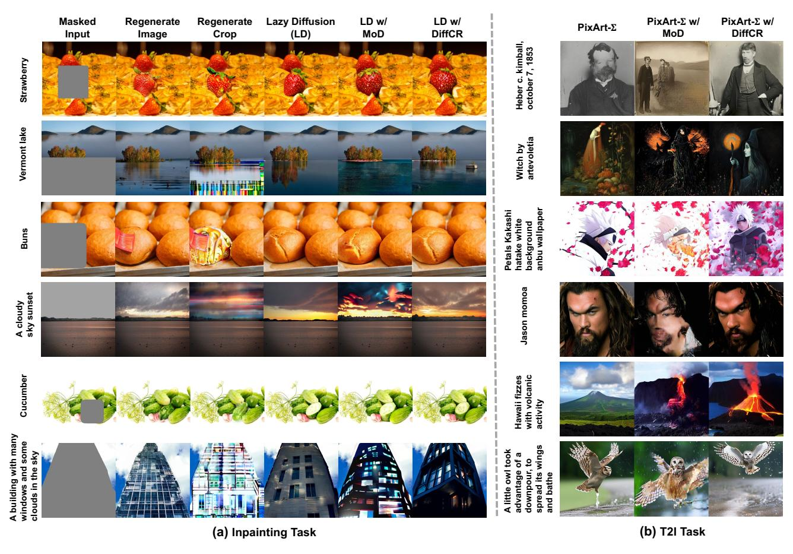

# E. Overall Comparison Figure

In Sec. 4.2, we presented a comprehensive comparison of our DiffCR method against baseline approaches for both inpainting and T2I tasks. Here, we provide the overall comparison figures to better illustrate the achieved im-

> **[图片提取文字 (无描述)]:**
> **Lazy Diffusion** LD w/ Masked Regenerate Regenerate LD w/ PixArt-Σ w/ PixArt-Σ w/ PixArt-Σ DiffCR MoD DiffCR MoD Input Image Crop (LD) Heber c. kimball, october 7, 1853 Strawberry Vermont lake Witch by artevoletia Petals Kakashi hatake white background anbu wallpaper Buns Jason momoa A cloudy sky sunset Hawaii fizzes with volcanic activity Cucumber A building with many windows and some clouds in the sky A little owl took advantage of a downpour, to spread its wings and bathe (b) T2I Task (a) Inpainting Task

Figure 12. Additional visual comparisons of our DiffCR with previous uncompressed models and SOTA compression methods: (a) Inpainting tasks, where DiffCR is applied to LD models [28], and (b) T2I tasks, where DiffCR is applied to PixArt- $\Sigma$  [4].

provements in FID and latency reductions. As shown in Fig. 11, our DiffCR consistently delivers superior trade-offs between FID and latency, achieving FID reductions of 12.10 and 4.92 for T2I and inpainting tasks, respectively, at comparable GPU latency when compared to the most competitive baseline.

#### F. Model Trajectories of DiffCR

In Sec. 4.2, we visualized the model trajectories during the training of DiffCR-L for both T2I and inpainting tasks. This revealed a key benefit: during fine-tuning, the averaged compression ratios across all layers gradually converge to the target ratio, producing a series of "by-product" models with varying compression ratios. Here, we also supply the model trajectories of DiffCR-LT ("-LT" denotes layer-and timestep-wise DiffCR). As shown in Fig. 13, we visualize the FID scores and corresponding compression ratios during the fine-tuning of DiffCR-LT. The observations consistently validate the benefits of this approach, showing that it enables the generation of a series of models with diverse compression ratios. Also, we observe that inpainting tasks

> **[图片提取文字 (无描述)]:**
> (a) DiffCR-L (b) DiffCR-LT Compression Ratios (%) Compression Ratios (%)

Figure 13. Model trajectories of DiffCR.

and Latent Diffusion (LD) models [28] are more sensitive to pruning and require longer fine-tuning to improve generation quality effectively, compared to T2I tasks. Moreover, for T2I tasks, DiffCR-LT demonstrates slightly greater stability in model trajectory compared to DiffCR-L.

#### **G.** More Visualization of Visual Examples

In Sec. 4.4, we selected challenging input prompts to evaluate the qualitative performance of our proposed DiffCR.

Table 4. Characteristics of our method and caching-based baselines.

| Method         | Model | Skip / Cache | Granulariy | Learnable | Token Pruning | Timestep-wise Feature Cache |  |
|----------------|-------|--------------|------------|-----------|------------------|--------------------------------|--|
| DeepCache [54] | U-Net | Block        | Block      | Х         | Х                | ✓                              |  |
| CMYC [25]      | U-Net | Block        | Block      | X         | X                | ✓                              |  |
| L2C [22]       | DiT   | Attn. & MLP  | Layer      | ✓         | X                | ✓                              |  |
| TGATE [19]     | DiT   | Attn.        | Layer      | X         | X                | ✓                              |  |
| DiffCR (Ours)  | DiT   | Attn. & MLP  | Token      | ✓         | ✓                | X but compatible               |  |

Here, we provide additional visual examples, as shown in Fig. 12. The examples consistently demonstrate that DiffCR achieves comparable or even superior generation quality compared to the RegenerateCrop baseline and even uncompressed LD or PixArt-Σ for inpainting and T2I tasks, respectively. Note that ToMe [2] and AT-EDM [45] are omitted here due to their poor generation quality when applied to DiTs, even at a modest compression ratio of 10%.

### H. Comparison with Caching-based Baselines

We summarize the characteristics of our method and caching-based baselines in Tab. 4. DeepCache [54] and CMYC [25] are designed for U-Net-based models, making direct comparison challenging, while L2C [22] and TGATE [19] target DiTs by caching layer features to reduce recomputation in future timesteps. Unlike these approaches, our method focuses on token pruning with learnable layer- and timestep-dependent compression ratios, and while it does not employ temporal caching, it remains compatible with such techniques. To directly compare, we evaluate all methods using PixArt-Σ on the MS-COCO-30K dataset (T2I task) under approximately 25% latency savings, where L2C achieves an FID of 28.6 (with our trained routers reproducing a similar caching pattern as reported), TGATE yields 43.6 FID, and our DiffCR achieves 28.6 FID. These results show that our method performs comparably to or better than caching-based baselines, and it can be further combined with them to achieve an additional 15  $\sim$  30% latency reduction.

### I. Human Preference Score for Inpainting

In Sec. 4.4, we utilized a computer vision model to estimate likely human preferences and evaluate the ability of models to generate high-quality, contextually relevant images for the T2I task. Here, we also provide the evaluation for inpainting tasks. Specifically, we generated 2K samples for the inpainting task and used HPSv2 [51] to assess human preferences for images produced by different methods. As shown in Tab. 5, for inpainting tasks, we applied all compression methods to Lazy Diffusion (LD) [28]. DiffCR achieves a higher human preference score of 2.181/0.263 compared to previous compression methods, ToMe [2] and

Table 5. Human Preference Score (HPS) (†) comparison of the proposed DiffCR with baselines for the inpainting task.

| Methods             | DiT C.R. | HPS Score |
|---------------------|----------|-----------|
| RegenerateImage     | 0%       | 21.056    |
| RegenerateCrop      | 0%       | 19.466    |
| Lazy Diffusion (LD) | 0%       | 20.464    |
| LD w/ ToMe          | 30%      | 18.187    |
| LD w/ MoD           | 30%      | 20.105    |
| LD w/ DiffCR        | 30%      | 20.368    |

Table 6. Ablation study on the impact of different compression ratios with a batch size of 16.

| <b>Metrics\Ratios</b>                              |       |       |       |       |       |       |
|----------------------------------------------------|-------|-------|-------|-------|-------|-------|
| FID Score (↓)                                      | 27.80 | 27.53 | 28.64 | 28.57 | 28.44 | 29.21 |
| CLIP Score (↑)                                     | 16.23 | 16.28 | 16.44 | 16.37 | 16.37 | 16.37 |
| FID Score (↓) CLIP Score (↑) T2I Latency (s) | 11.90 | 11.16 | 10.31 | 9.23  | 8.19  | 7.12  |

vanilla MoD [33], respectively.

