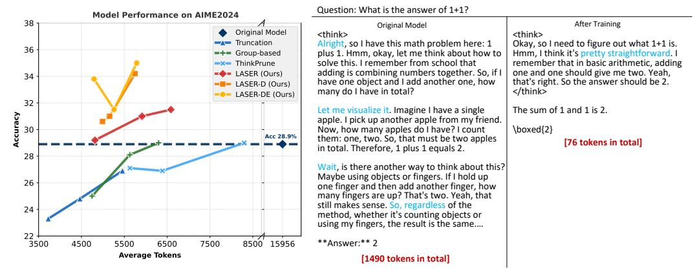

# 1 Introduction

Recent advancements leveraging reinforcement learning (RL) [\[4,](#page-10-0) [11,](#page-11-0) [15,](#page-11-1) [28\]](#page-12-0) demonstrate that LLMs can evolve into powerful Large Reasoning Models (LRMs), capable of producing extended chains of thought (CoT) to enhance their reasoning abilities. However, these longer reasoning trajectories come at the cost of increased token usage and potentially incorporate more compounding errors. Many of the generated tokens tend to be unnecessarily verbose. For example, LRMs may output thousands of tokens to solve elementary math problems that could otherwise be addressed within just a few hundred tokens, as shown in Figure [1](#page-1-0) (right). This phenomenon is commonly referred to as the *over-thinking* issue [\[3\]](#page-10-1).

∗Correspondence to Wei Liu (wliucn@cse.ust.hk) and Junxian He (junxianh@cse.ust.hk)

> **[图片提取文字 (无描述)]:**
> Question: What is the answer of 1+1? Model Performance on AIME2024 38 After Training Original Model Original Model <think> <think> Truncation Alright, so I have this math problem here: 1 Okay, so I need to figure out what 1+1 is. 36 plus 1. Hmm, okay, let me think about how to Hmm, I think it's pretty straightforward. I =+= Group-based solve this. I remember from school that remember that in basic arithmetic, adding ThinkPrune adding is combining numbers together. So, if I one and one should give me two. Yeah, LASER (Ours) 34 have one object and I add another one, how that's right. So the answer should be 2. LASER-D (Ours) many do I have in total? </think> LASER-DE (Ours) 32 Let me visualize it. Imagine I have a single The sum of 1 and 1 is 2. Accuracy apple. I pick up another apple from my friend. Now, how many apples do I have? I count \boxed{2} 30 Acc 28.9% them: one, two. So, that must be two apples [76 tokens in total] in total. Therefore, 1 plus 1 equals 2. 28 Wait, is there another way to think about this? Maybe using objects or fingers. If I hold up 26 one finger and then add another finger, how many fingers are up? That's two. Yeah, that still makes sense. So, regardless of the 24 method, whether it's counting objects or using my fingers, the result is the same.... 22 \*\*Answer:\*\* 2 3500 4500 5500 7500 15956 6500 8500 Average Tokens [1490 tokens in total]

Figure 1: **Left**: Accuracy and response length on AIME2024. For the figure of more benchmarks, please refer to Appendix A. Each point represents a single training run with different hyper-parameters. Given the high computational cost of obtaining this figure, the base model used is DeepSeek-R1-Distill-Qwen-1.5B. Results on 7B and 32B models are in §6.3. Our methods, LASER, LASER-D, and LASER-DE achieve a Pareto-optimal trade-off compared to all other methods. Notably, they yield a +6.1 improvement in accuracy while reducing tokens usage by 63% compared to the original model. **Right**: Example of a reasoning process after LASER-D training. While the original model produces meaningless "self-reflection" repeatedly for trivial questions like "1+1=?", LRMs after LASER-D training efficiently recognize such questions during thinking and provide the answer directly.

Previous work [16, 22] has explored various approaches to improving reasoning efficiency in LRMs, including continuous chain-of-thought (CoT) reasoning [6, 18], supervised fine-tuning (SFT) [24, 14], and reinforcement learning [11, 2, 1, 10]. Typically, substantial reductions in token usage are accompanied by significant decreases in reasoning accuracy, suggesting a trade-off between efficiency and reasoning performance. Recently, RL-based approaches have demonstrated the most favorable balance between token efficiency and accuracy [11, 2, 1, 10].

In this paper, we study RL-based CoT compression, beginning with a simple baseline that yields surprisingly effective results (§3). Specifically, we further train long CoT reasoning models using RL with a rule-based correctness reward, while restricting the context window size to a smaller value than the model's typical generated length, so that long responses will be truncated. This approach can substantially improve token efficiency with only a modest reduction in accuracy. To better understand the effectiveness of this truncation method and to connect it with other RL approaches that incorporate length-based rewards [11, 2, 1], we introduce a unified length-based reward shaping perspective that encompasses various RL strategies for mitigating overthinking (§4). Building on this reward shaping formulation, we extend the truncation approach as a novel reward shaping method (§4.3) that employs a step function as the reward guided by a desired target length. We refer to this approach as LASER (Length-bAsed StEp Reward). LASER achieves the best trade-off between reasoning performance and efficiency among all evaluated baselines.

Next, we identify two key points that are lacking in LASER: (1) the desired reasoning length should evolve during training as the model's reasoning behaviors dynamically change, and (2) rather than uniformly encouraging short or long CoT, length-based reward shaping should be *difficulty-aware* – allowing harder questions a higher token limit while constraining easier questions to fewer tokens. To this end, we propose a **D**ynamic and **D**ifficulty-aware **L**ength-b**A**sed **StEp Reward** for RL (LASER-D), which adaptively applies different length reward shaping based on problem difficulty. Notably, our algorithm is fully automated with an integrated automatic adapting module, eliminating the need for manual procedural tuning. We also introduce a variant of LASER-D, called LASER-DE, which explicitly encourages additional exploration on incorrect responses, enabling models to discover potentially correct reasoning patterns through extended deliberation.

We conduct comprehensive experiments on three reasoning models ranging from 1.5B to 32B parameters, across four challenging benchmarks: MATH500, AIME2024, AMC2023, and OlympiadBench. Our extensive evaluations demonstrate that our proposed LASER series outperform existing works, while LASER-D and its variant LASER-DE achieve the best Pareto-optimal balance between accuracy and token efficiency. Unlike methods that improve token efficiency at the expense of accuracy, our proposed approaches deliver substantial gains in both dimensions—even on the challenging AIME2024

Table 1: Results of baseline truncation method with different context window.  $T_k$  denotes the models after RL training with context window k. Accuracy (%) with average token usage for each dataset. "Original" denotes the original DeepSeek-R1-Distill-Qwen-1.5B.

|            |             | Ac   | ccuracy | (%)               |      | Generation Length (tokens) |       |      |                   |       |  |  |
|------------|-------------|------|---------|-------------------|------|----------------------------|-------|------|-------------------|-------|--|--|
|            | MATH 500 | AIME | AMC     | Olympiad Bench | Avg. | MATH 500                | AIME  | AMC  | Olympiad Bench | Avg.  |  |  |
| Original   | 83.9        | 28.9 | 71.6    | 43.3              | 56.9 | 5042                       | 15956 | 8202 | 11510             | 10177 |  |  |
| $T_{8192}$ | 81.8        | 24.8 | 70.9    | 43.9              | 55.3 | 1795                       | 4465  | 2560 | 2841              | 2915  |  |  |
| $T_{6144}$ | 80.9        | 20.2 | 66.2    | 42.1              | 52.3 | 1351                       | 2821  | 1917 | 1947              | 2009  |  |  |
| $T_{4096}$ | 77.7        | 19.2 | 62.2    | 38.5              | 49.4 | 1054                       | 2481  | 1484 | 1564              | 1646  |  |  |

benchmark. For example, applying LASER-D/LASER-DE to DeepSeek-R1-Distill-Qwen-1.5B improves accuracy by +6.1 percentage points while reducing token usage by 63% on AIME24. Our further analysis reveals that after these RL-based CoT compressions, the reasoning behaviors of LRMs become more concise and demonstrate improved quality with fewer redundant and unhelpful "self-reflection".

