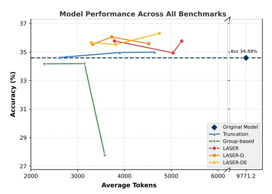

# 6 Experiments

#### 6.1 Experimental Setup

Setup We experiment with three capable and representative LRMs across three different sizes known for their overthinking tendencies: DeepSeek-R1-Distill-Qwen-1.5B, DeepSeek-R1-Distill-Qwen-7B and DeepSeek-R1-Distill-Qwen-32B . We adhere to the original prompt from DeepSeek-R1 [\[4\]](#page-10-0), with the full prompt available in Appendix [E.1.](#page-16-0) We train these models using the DeepScaleR-Preview-Dataset [\[12\]](#page-11-5), a high-quality mathematics dataset containing 40K competition-level question-answer pairs. We evaluate the models on four benchmarks of varying difficulty: MATH500 [\[9\]](#page-11-7), OlympiadBench [\[7\]](#page-10-5), AIME 2024, and AMC 2023. We set α = 0.5 for our methods in all experiments to balance the trade-off between correctness rewards and solution length penalties. LT is a hyper-parameter for our approaches because the automatic adapting mechanism will enumerate the target length from LT to the context window size to select the adaptive target lengths LA, as described in [§5.2.](#page-5-1) Parameter settings for baseline methods are provided in Appendix [E.3,](#page-16-1) and full details of our training procedure and evaluation methodology can be found in Appendix [E.2.](#page-16-2)

Baselines According to Table [2,](#page-4-1) we train models using different types of length rewards design and compare our LASER, LASER-D, LASER-DE to previous works. Considering the high computational cost of RL training, we select Efficient Reason [\[2\]](#page-10-3) and L1-Max [\[1\]](#page-10-4) as the representatives, since they perform better accuracy compared to other methods inside same group and are more close to our settings. For ThinkPrune [\[10\]](#page-11-4), we re-evaluate their open-sourced models.

Table 3: Accuracy (%) with average token usage for each dataset and different methods. Most important results in this table are visualized in Figure 1 and Figure 5 in Appendix A. The base model is DeepSeek-R1-Distill-Qwen-1.5B. "Original" denotes the original model.  $T_k$  is the truncation method with context window k. "Group" denotes the Efficient Reasoning [2] with different  $\alpha$ . Due to the space limit, we only show three most representative results here. For the full results, please refer to Tabel 6 in Appendix H.

|                                           |             | (%)  |      | Generation Length (tokens) |      |             |       |      |                   |       |
|-------------------------------------------|-------------|------|------|----------------------------|------|-------------|-------|------|-------------------|-------|
|                                           | MATH 500 | AIME | AMC  | Olympiad Bench          | Avg. | MATH 500 | AIME  | AMC  | Olympiad Bench | Avg.  |
| Original                                  | 83.9        | 28.9 | 71.6 | 43.3                       | 56.9 | 5042        | 15956 | 8202 | 11510             | 10177 |
| $T_{8192}$                                | 81.8        | 24.8 | 70.9 | 43.9                       | 55.3 | 1795        | 4465  | 2560 | 2841              | 2915  |
| $T_{6144}$                                | 80.9        | 20.2 | 66.2 | 42.1                       | 52.3 | 1351        | 2821  | 1917 | 1947              | 2009  |
| $T_{4096}$                                | 77.7        | 19.2 | 62.2 | 38.5                       | 49.4 | 1054        | 2481  | 1484 | 1564              | 1646  |
| $Group_{\alpha=0.4}$                      | 74.6        | 25.0 | 69.2 | 43.1                       | 53.0 | 1069        | 4747  | 2162 | 2536              | 2629  |
| $Group_{\alpha=0.2}$                      | 78.1        | 28.1 | 68.0 | 44.4                       | 54.7 | 1135        | 5628  | 2635 | 2944              | 3085  |
| $Group_{\alpha=0,1}$                      | 77.0        | 29.0 | 69.5 | 44.9                       | 55.1 | 1228        | 6301  | 2808 | 3271              | 3402  |
| $Group_{\alpha=0.05}$                     | 74.4        | 30.2 | 65.5 | 43.1                       | 53.3 | 1193        | 4839  | 2457 | 2703              | 2798  |
| L1-Max-1024                               | 76.4        | 15.0 | 59.4 | 39.1                       | 47.5 | 661         | 1303  | 933  | 938               | 959   |
| L1-Max-4096                               | 79.7        | 20.0 | 65.0 | 41.0                       | 51.4 | 875         | 1718  | 1159 | 1229              | 1245  |
| $LASER_{L_T=2048}$                        | 83.6        | 29.2 | 71.6 | 44.1                       | 57.1 | 1913        | 4815  | 2493 | 2767              | 2895  |
| $LASER_{L_T=4096}$                        | 83.9        | 31.0 | 74.1 | 45.7                       | 58.7 | 1914        | 5915  | 3136 | 3579              | 3636  |
| $LASER_{L_T=8192}$                        | 85.6        | 31.5 | 75.9 | 47.7                       | 60.2 | 2736        | 6589  | 4162 | 4547              | 4509  |
| Laser-D L<math>x=1024</math>   | 83.0        | 30.6 | 72.8 | 43.7                       | 57.5 | 1362        | 4991  | 256  | 2837              | 2862  |
| Laser-D $_{L_T=2048}$                     | 82.2        | 31.0 | 73.3 | 46.2                       | 58.2 | 1623        | 5158  | 2572 | 2960              | 3059  |
| Laser-D <math>L_T</math>=4096  | 84.2        | 34.2 | 75.3 | 47.3                       | 60.3 | 1872        | 5750  | 2981 | 3474              | 3520  |
| LASER-DE <math>L_T=1024</math> | 82.1        | 33.8 | 72.2 | 43.7                       | 58.0 | 1350        | 4794  | 2254 | 2654              | 2763  |
| Laser-DE <math>L_T=2048</math> | 83.9        | 31.5 | 75.3 | 46.4                       | 59.3 | 1456        | 5263  | 2679 | 2971              | 3092  |
| LASER-DE $_{L_T=4096}$                    | 83.5        | 35.0 | 73.3 | 46.0                       | 59.5 | 1949        | 5789  | 3080 | 3488              | 3577  |

### 6.2 Efficacy-Efficiency Trade-off

Since there is a trade-off between accuracy and response length, one of the best ways to evaluate different methods is to compare their Pareto-optimal frontiers. We start with the DeepSeek-R1-Distill-Qwen-1.5B model as its small size allows us to run multiple experiments to investigate the trade-off of different approaches. To fully evaluate the potential of each method, we adjust key parameters ( $\alpha$  for group-based reward,  $L_T$  for other methods) to explore different tradeoffs along the accuracy-length trade-off curve. The full details of different hyper-parameters for different methods can be found in Table 5. As a result, each point in Figure 1 and Figure 5 represents a separate experiment with a fully trained model using a distinct hyperparameter configuration. We also list the results in different benchmarks in Table 3. Due to the space limit, we leave some results of truncation methods in Table 6.

As shown in Figure 1, both LASER-D and LASER-DE achieve better Pareto-optimal frontiers compared to all other methods. On the AIME2024 benchmark, LASER-DE attains the highest accuracy of 35% using just over 5,500 tokens—a substantial reduction by 63%. Meanwhile, LASER-D still achieves 34% accuracy with only 4,600+ tokens, underscoring its strong trade-off. Across all benchmarks (Figure 5), LASER-DE achieves the most optimal trade-off when the average token usage is below 3,500, while LASER-D performs the best in higher token regimes. Specifically, LASER-D achieves 60.3% accuracy with only 3,520 tokens on average, representing a substantial reduction from the 10,177 tokens used by the original model. Compared to the LASER method, both LASER-D and LASER-DE achieve significant improvements, demonstrating that incorporating a **dynamic** and **difficulty-aware** mechanism greatly enhances the efficacy-efficiency trade-off. Compared to other baseline methods, LASERstill exhibits a more favorable trade-off.

#### **6.3** Experiments on Larger Models

To better evaluate the effectiveness of our proposed methods, Laser, Laser-D, and Laser-DE. We conduct experiments on DeepSeek-R1-Distill-Qwen-7B , as shown in Table 4. Given the computational cost of larger models, we set key hyperparameters for each method to achieve an appropriate trade-off. Specifically, we set  $\alpha=0.2$  for the group-based reward,  $L_T=8192$  for the truncation method in Laser,  $L_T=4096$  for Laser-D and Laser-DE. Notably, we do not tune  $\alpha$  with fixed value 0.5 in all experiments of our methods. As shown in Table 4, Laser-D achieves the best

| Table 4: Accuracy (%) with average token usage to      | for each dataset and different methods using 7B and 32B |
|--------------------------------------------------------|---------------------------------------------------------|
| models. "Original" denotes the original model. $T_k$ i | s the truncation method with context window $k$ .       |

|                              |             | A    | ccuracy | (%)               | Generation Length (tokens) |             |       |      |                   |      |
|------------------------------|-------------|------|---------|-------------------|----------------------------|-------------|-------|------|-------------------|------|
|                              | MATH 500 | AIME | AMC     | Olympiad Bench | Avg.                       | MATH 500 | AIME  | AMC  | Olympiad Bench | Avg. |
|                              |             |      | D       | eepSeek-R1-       | Distill-Q                  | wen-7B      |       |      |                   |      |
| Original                     | 92.6        | 53.1 | 88.4    | 58.9              | 73.3                       | 4017        | 13414 | 6433 | 8987              | 8213 |
| $T_{8192}$                   | 92.0        | 51.9 | 88.3    | 56.4              | 72.2                       | 1972        | 5655  | 3159 | 3606              | 3598 |
| Group                        | 89.4        | 48.1 | 82.8    | 53.7              | 68.5                       | 780         | 4271  | 1693 | 2348              | 2273 |
| LASER                        | 92.2        | 54.4 | 89.7    | 58.1              | 73.6                       | 2317        | 6320  | 3733 | 4262              | 4158 |
| LASER-D                      | 92.2        | 58.3 | 90.0    | 61.0              | 75.4                       | 1836        | 5379  | 2694 | 3350              | 3315 |
| LASER-DE                     | 92.0        | 55.8 | 89.1    | 58.9              | 74.0                       | 1658        | 4969  | 2612 | 3157              | 3099 |
| DeepSeek-R1-Distill-Qwen-32B |             |      |         |                   |                            |             |       |      |                   |      |
| Original                     | 94.4        | 71.7 | 93.1    | 64.6              | 80.95                      | 3553        | 10335 | 6177 | 7697              | 6941 |
| LASER-DE                     | 93.2        | 70.8 | 93.1    | 62.2              | 79.83                      | 2314        | 6785  | 3545 | 4608              | 4313 |

> **[图片提取文字 (无描述)]:**
> Model Performance on GPQA 36 Accuracy (%) 35 34 Acc 33.62% Original Model Truncation 33 Group-based LASER LASER-D LASER-DE 2000 3000 4000 5000 6000 7000 11200.8 Average Tokens

> **[图片提取文字 (无描述)]:**
> Model Performance Across All Benchmarks 37 -Acc 34.59% 35 Accuracy (%) 33 31 Original Model Truncation 29 Group-based LASER LASER-D LASER-DE 27 2000 3000 4000 5000 9771.2 6000 Average Tokens

Figure 2: Performance on out-of-domain benchmarks: GPQA and average performance across all three benchmarks (GPQA, MMLU, LSAT).

trade-off with better accuracy and significantly fewer tokens. On the AIME dataset, it achieves an accuracy of 58.3%, representing a gain of +5.2 points, while using only 5,379 tokens—substantially fewer than the 13,414 tokens used by the original model. Compared to other methods, LASER, LASER-D, and LASER-DE also attain better trade-offs on most benchmarks, particularly on the more challenging ones.

For the 32B model, due to computational constraints, we compare the LASER-DE-trained model with the original baseline under this larger setting and set  $L_T=8192$ . LASER-DE achieves competitive accuracy with only a minor drop (1%), while still significantly reducing output length. Notably, the accuracy of DeepSeek-R1-Distill-Qwen-32B on our training dataset is already very high—over 76%, leaving little room for further improvement. We speculate that with more challenging and diverse training data, LASER-DE could yield further accuracy gains.

#### 6.4 Experiments on Out-of-Domain Benchmarks

We evaluate whether LASER, LASER-D and LASER-DE can generalize to domains outside the RL training distribution. We select three out-of-domain benchmarks: GPQA [17], LSAT [23], and MMLU [8], following the evaluation settings established by L1 [1]. Figure 2 illustrates the efficacy-efficiency trade-off on GPQA and the average performance across all benchmarks. Compared to the original model, LASER, LASER-D and LASER-DE consistently achieve significant improvements in both accuracy and token usage, demonstrating robust generalization capabilities. And LASER-D and LASER-DE maintain the best trade-off even when compared to LASER.

