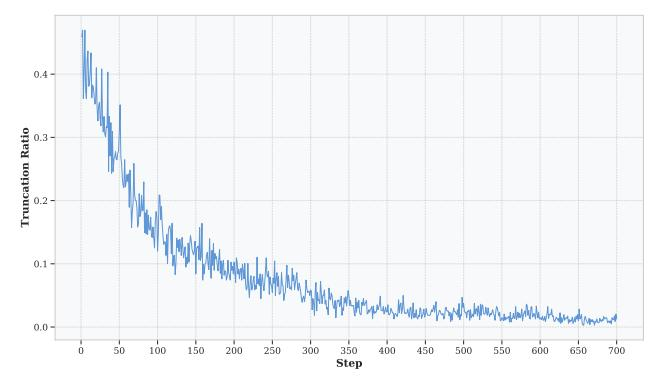

# A Pareto-Optimality

We illustrate the efficacy-efficiency trade-off in Figure 5. Our proposed methods, LASER, LASER-D, and LASER-DE, demonstrate significant improvements in both accuracy and token usage across all benchmarks, particularly in the most challenging ones. Notably, LASER-D and LASER-DE achieve a Pareto-optimal trade-off compared to all other methods.

> **[图片提取文字 (无描述)]:**
> Model Performance Across All Benchmarks Model Performance on AIME2024 62 38 Original Model -A- Truncation 36 =+= Group-based -x- ThinkPrune 60 LASER (Ours) 34 LASER-D (Ours) LASER-DE (Ours) 32 58 Accuracy Accuracy Acc 56.92% 30 Acc 28.9% 56 28 Original Model Truncation 26 =+= Group-based 54 ThinkPrune LASER (Ours) 24 LASER-D (Ours) LASER-DE (Ours) 22 <del>↓</del> 3500 52 8500 15956 3000 4500 2000 4000 5000 10177 5500 6500 7500 **Average Tokens Average Tokens** (b) (a)

Figure 5: Pareto-optimal trade-off between accuracy and response length across various methods. Each point represents a single training run with different hyper-parameters. Our methods, LASER-DE, LASER-D, and LASER, achieve a Pareto-optimal trade-off compared to all other methods. (a) Accuracy and response length on all benchmarks (MATH500, AIME2024, AMC2023, Olympiad Bench) (b) Accuracy and response length on AIME2024

### **B** Ratio of Truncated Responses During Training with Truncation

We analyze the ratio of truncated responses when applying an 8192 token limit during training. Our findings show that the proportion of truncated responses is initially very high—exceeding 45%, and remains substantial (above 10%) even after 200 rollout steps. This high truncation rate highlights the context window constraints in training is sub-optimal.

> **[图片提取文字 (无描述)]:**
> 0.4 -Truncation Ratio 0.1 -0.0 -Step

Figure 6: The ratio of truncated responses in training data with 8192 tokens limit.

