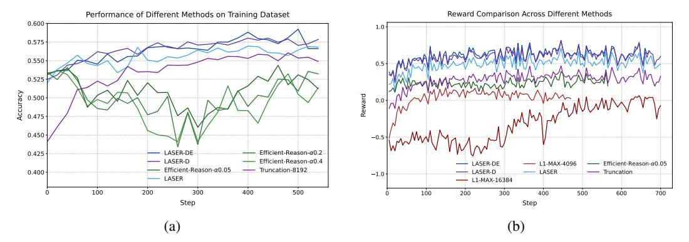

# C Dynamics of Accuracy and Rewards Throughout Training

We present the accuracy and rewards for various methods across training iterations in Figure 7a and Figure 7b. As discussed in §4, group-based rewards tend to exploit the length rewards S(y)

> **[图片提取文字 (无描述)]:**
> Reward Comparison Across Different Methods Performance of Different Methods on Training Dataset 0.600 -0.575 0.550 0.525 Accuracy 0.500 Reward 0.450 LASER-DE Efficient-Reason-α0.2 0.425 LASER-D Efficient-Reason-α0.4 Efficient-Reason-α0.05 LASER-DE L1-MAX-4096 Efficient-Reason-α0.05 - Truncation-8192 - LASER-D - LASER - Truncation 0.400 --1.0LASER L1-MAX-16384 100 200 300 400 500 100 200 300 400 500 600 700 Step Step (b) (a)

Figure 7: (a) Accuracy on training dataset across training iterations for different methods (b) Rewards across training iterations for different methods

while causing a significant drop in accuracy. Budget-based rewards such as L1-Max-16384 [1] suffer from unstable training when the context window is large. In contrast, other methods like truncation methods, LASER, LASER-D, and LASER-DE demonstrate a simultaneous increase in both rewards and accuracy throughout the training process.

