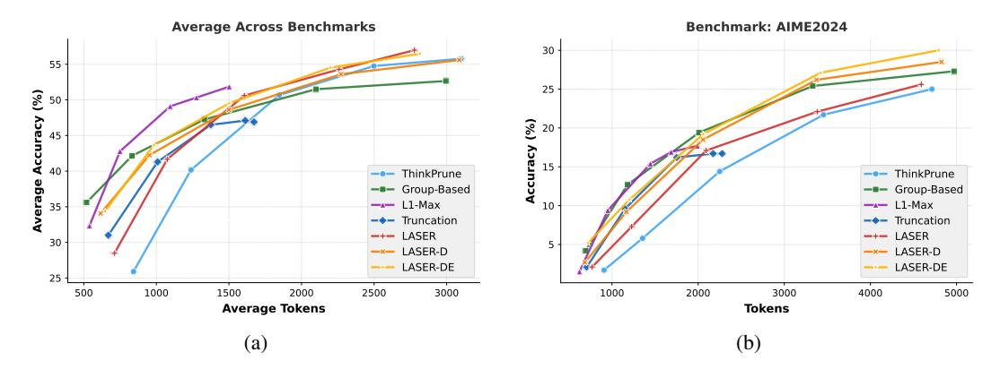

# F Budget-Forcing Inference

To further analyze the impact of different length rewards, we conduct experiments using the budgetforcing setup introduced in S1 [\[13\]](#page-11-6), which restricts the model to stop reasoning after a fixed number of tokens B. We adopt their experimental setting and evaluate across B = [500, 1000, 2000, 4000, 8000] We follow the budget-forcing implementations of Muennighoff et al. [\[13\]](#page-11-6), Hou et al. [\[10\]](#page-11-4). Specifically, we follow their implementations and modify the codebase of Qwen-Math-Eval. We stop the thinking process of LRMs by appending "</think>\n\n\*\*Final Answer.\*\*". Since empirically, DeepSeek-R1-Distill-Qwen-1.5B typically summarize its final answer starting with "\n\n\*\*Final

Answer.\*\*". We use the same settings as our evaluations where we sample responses for multiple times with temperature = 0.6.. As shown in Figures 9a and 9b, despite not being explicitly trained with any budget-forcing mechanisms, LASER-D and LASER-DE consistently achieve strong trade-offs between accuracy and token efficiency, particularly on harder questions or when inference budgets are moderately constrained.

While LASER performs competitively on average benchmarks, it lags behind LASER-D/LASER-DE under strict token budgets or on more challenging examples. L1-Max, specifically trained to meet varying budget constraints during training, performs best under extremely tight budgets, demonstrating the strength of budget-specific optimization. However, its performance plateaus when more budget is available, limiting its ability to improve on harder tasks and resulting in a suboptimal trade-off, as shown in Figure 9b. Group-based methods are also effective in low-budget scenarios due to their reward structure favoring shorter outputs, though this often leads to overly brief responses. ThinkPrune shows comparable performance to LASER under looser budgets but inherits the limitations of truncation-based approaches, struggling on difficult problems even when more tokens are available.

> **[图片提取文字 (无描述)]:**
> Average Across Benchmarks Benchmark: AIME2024 30 55 25 Average Accuracy (%) % 20 45 Accuracy 15 40 --- ThinkPrune --- ThinkPrune -- Group-Based -- Group-Based --- L1-Max 10 -- L1-Max --- Truncation --- Truncation -+- LASER -+- LASER 30 -LASER-D LASER-D LASER-DE LASER-DE 25 -3000 500 1000 1500 2000 2500 1000 2000 3000 4000 5000 **Tokens** Average Tokens (b) (a)

Figure 9: Budget-forcing inference with different methods. (a) Average accuracy with different output budget on all benchmarks (b) The accuracy of different methods on AIME2024 with different output budget.

#### **G** Dynamics of Adaptive Target Lengths

In this section, we analyze the dynamics of adaptive target lengths during the training process of LASER-D and LASER-DE. Figure 10 shows how the adaptive target length  $L_A$  changes over training iterations for both methods.

As demonstrated in Figure 10, our method dynamically selects appropriate target lengths based on problem difficulty. For easy problems (left figure), the model quickly identifies that shorter target lengths are sufficient. For medium-difficulty problems (middle figure), the model begins with longer target lengths (10,000+) and gradually reduces them to 3000-4000 as training continues. For difficult problems (right figure), the model consistently maintains target lengths near the maximum context window size, with some fluctuations attributable to computational precision issues. This adaptive behavior highlights the effectiveness of our approach in efficiently allocating computational resources based on problem complexity.

### H Full Main Results

We list the full results of different methods in Table 6.

