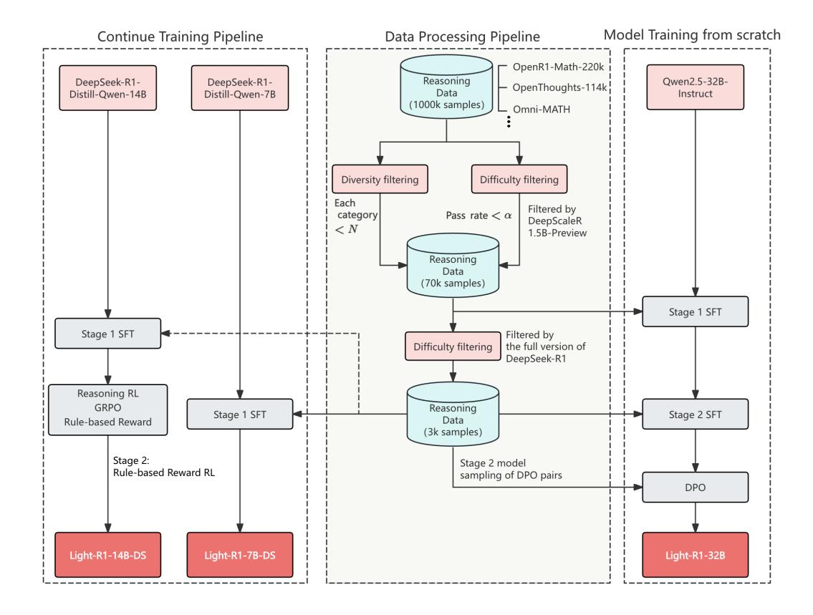
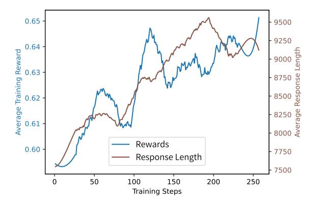

# 2 The Origin of Everything: Stable and Trustworthy Evaluation of Long-COT Models

Following [DeepSeek-AI](#page-6-0) [\(2025\)](#page-6-0), long-COT models are commonly deployed with sampling temperature 0.6. While long-COT models generally perform better with sampling than with greedy decoding, it brings more burden for model evaluation as multiple samples for each question may be required, contrary to previous viable approaches of greedy decoding for evaluation [\(Song et al.,](#page-7-15) [2024\)](#page-7-15).

[DeepSeek-AI](#page-6-0) [\(2025\)](#page-6-0) generates 64 responses per query to estimate pass@1. We have verified this choice, witnessing large deviation of over 3 points using 16 responses or fewer across different runs of the same model. Such randomness is unacceptable to compare model performances.

For stable and trustworthy evaluation, we adapted [\(Luo et al.,](#page-6-6) [2025b\)](#page-6-6)'s evaluation code for all our evaluation runs. Our evaluation code and logs are all released.

We can reproduce all DeepSeek-R1-Distill models' and QwQ's scores as reported in [DeepSeek-AI](#page-6-0) [\(2025\)](#page-6-0); [Qwen](#page-7-1) [\(2025\)](#page-7-1) as shown in Tab. [1](#page-1-0) with 64 samples per query, with deviation around 1 point.

## 3 Light-R1-32B: Long-COT from Scratch with Curriculum SFT & DPO

While numerous studies [\(Ye et al.,](#page-7-2) [2025;](#page-7-2) [Muen](#page-6-4)[nighoff et al.,](#page-6-4) [2025;](#page-6-4) [OpenThoughts,](#page-6-14) [2025;](#page-6-14) [OpenR1,](#page-6-15) [2025\)](#page-6-15) have open-sourced efforts to replicate DeepSeek-R1 using models of various sizes, ranging from 1.5B to 32B, none has reached similar performance on the challenging mathematics competitions AIME24 & 25, where DeepSeek-R1-Distill-Qwen-32B scored at 72.6 & 54.9.

We present our data processing and Post-Training pipeline in this section as illustrated by Fig. [2.](#page-3-0)

## 3.1 Data Preparation

The whole data preparation process spans data collection, data decontamination and data generation, detailed as follows.

### 3.1.1 Data Collection

We began by collecting various sources of math questions with groundtruth answers. Iterating over all possible sources by the time, we collected around 1000k math questions as the seed set. See Appendix [B](#page-8-0) for more details about the data sources.

All data are aggregated together to form around 1000k math questions as the seed set. Within this 1000k data, we kept only math questions with groundtruth answers. Questions without groundtruth answers could be used as synthetic data by letting multiple strong LLMs vote for groundtruths but we left it for future work.

The data is then filtered for diversity, where we tagged each question with an in-house tagging system and downsample categories with excessive data.

#### 3.1.2 Data Decontamination

We evaluated data contamination in several opensourced datasets. Our analysis revealed that MATH-500 [\(Hendrycks et al.,](#page-6-16) [2021a\)](#page-6-16) contains tens of compromised questions that are either identical or differ only in numerical values. AIME 24 and 25 remain uncontaminated, though caution is needed when incorporating AIME data through 2023. Further details are provided in Appendix [C.](#page-8-1)

Light-R1 underwent comprehensive decontamination using exact matching (excluding digits to filter questions with only numerical changes) and N-gram (N=32) matching against AIME24&25, MATH-500, and GPQA [\(Rein et al.,](#page-7-16) [2023\)](#page-7-16).

#### 3.1.3 Data Generation

With a diverse and clean dataset, we generate comprehensive chain-of-thought (COT) responses for supervised fine-tuning (SFT). However, not all data points are equally valuable for training, and distilling DeepSeek-R1 can be resource-intensive whether through API queries or local deployment. We therefore implemented difficulty-based filtering on the dataset to retain only sufficiently challenging questions, inspired by recent advances in training long reasoning models [\(Luo et al.,](#page-6-6) [2025b;](#page-6-6) [Ye et al.,](#page-7-2) [2025;](#page-7-2) [Muennighoff et al.,](#page-6-4) [2025\)](#page-6-4).

We initially employ [Luo et al.](#page-6-6) [\(2025b\)](#page-6-6)'s DeepScaleR-1.5B-Preview model to generate responses for each question, as this model offers a good balance of efficiency and capability. Only questions with a pass rate < α were selected for DeepSeek-R1 queries, resulting in approximately 76k data points. After obtaining DeepSeek-R1 responses, we retained only questions with correct long-COT answers. For questions with multiple correct responses, we randomly selected one long-COT answer for SFT. Through this process, we constructed an SFT dataset exceeding 70k examples, featuring prompts filtered for both diversity and difficulty, with long-COT responses generated by DeepSeek-R1 and validated against ground truth.

However, direct training on this dataset alone did not yield satisfactory results regardless of the number of training epochs. Upon analyzing the trained model's performance across different question types, we discovered the need for additional training on more challenging problems. Consequently, we implemented a second stage of difficulty filtering using the full version of DeepSeek-R1 instead of DeepScaleR-1.5B-Preview. This stage retained only questions with pass rate < α

> **[图片提取文字 (无描述)]:**
> Model Training from scratch Continue Training Pipeline **Data Processing Pipeline** OpenR1-Math-220k DeepSeek-R1-Reasoning Qwen2.5-32B-DeepSeek-R1-- OpenThoughts-114k Data Distill-Qwen-14B Distill-Qwen-7B Instruct (1000k samples) Omni-MATH Diversity filtering Difficulty filtering Each Filtered by category Pass rate  $< \alpha$ DeepScaleR < N1.5B-Preview Reasoning Data (70k samples) Stage 1 SFT Stage 1 SFT Filtered by Difficulty filtering the full version of DeepSeek-R1 Reasoning RL GRPO Reasoning Stage 2 SFT Stage 1 SFT Data Rule-based Reward (3k samples) Stage 2: Stage 2 model Rule-based Reward RL sampling of DPO pairs DPO Light-R1-14B-DS Light-R1-7B-DS Light-R1-32B

Figure 2: Overview of training pipeline of Light-R1 series.

and questions where DeepSeek-R1's sampled responses were neither uniformly correct nor uniformly incorrect, resulting in a Stage 2 SFT dataset of approximately 3k examples. Notably, this refined dataset demonstrated such high quality that training exclusively on it produced performance improvements across all DeepSeek-R1-Distill models, as we will discuss in Section [3.4.](#page-4-0)

#### 3.2 Curriculum Post-Training

Our approach consists of three stages, detailed hyperparameters can be found in Appendix [D.](#page-9-0):

- 1. SFT Stage 1: Training on 76k filtered mathematical problems
- 2. SFT Stage 2: Fine-tuning on 3k most challenging problems
- 3. DPO Optimization: Preference-based optimization using verified response pairs

SFT stages are trained with the curriculum data strategy as discussed in Sec. [3.1.3.](#page-2-0) For DPO, we implemented a semi-on-policy approach using the NCA loss [\(Chen et al.,](#page-6-17) [2024\)](#page-6-17). Rejected responses were sampled from our SFT-stage-2 model with verified incorrect answers. Since some rejected responses reached lengths of 32k tokens or more, we utilized the DPO implementation with sequence parallelism from 360-LLaMA-Factory [\(Zou et al.,](#page-7-17) [2024\)](#page-7-17). For chosen responses, we used verified correct answers from DeepSeek-R1. While we had previously employed fully on-policy DPO extensively, we discovered that for challenging mathematical problems, using chosen responses from significantly stronger models yielded better results.

#### 3.3 Results

We observe consistent improvements across our curriculum SFT & DPO post-training stages (Tab. [2\)](#page-4-1). Following DPO, we use the TIES-merging [\(Ya](#page-7-18)[dav et al.,](#page-7-18) [2023\)](#page-7-18) method from the [Goddard et al.](#page-6-18) [\(2024\)](#page-6-18) toolkit to merged models from SFT-stage2, DPO, and another DPO variant (AIME24 score: 74.7) that had special tokens inadvertently removed from rejected responses, the resulting merged model demonstrates additional performance gains. Although our mathematics-focused training led to some forgetting on untrained GPQA scientific questions, Light-R1-32B still demonstrates strong generalization capabilities.

| Stage           | AIME24 | AIME25 | GPQA | LCB  |
|-----------------|--------|--------|------|------|
| Instruct (base) | 16.6   | 13.6   | 48.8 | 24.6 |
| +SFT-stage1     | 69.0   | 57.4   | 64.3 | 42.9 |
| +SFT-stage2     | 73.0   | 64.3   | 60.6 | 42.0 |
| +DPO            | 75.8   | 63.4   | 61.8 | N/A  |
| +Model Merging  | 76.6   | 64.6   | 61.8 | 44.7 |
| Light-R1-32B    | 76.6   | 64.6   | 61.8 | 44.7 |

Table 2: Stage-wise performance improvement of our Light-R1-32B. We observe a decrease in GPQA (Science QA) scores beginning from STF-stage2, indicating a partial degradation of the model's generalization capabilities during extensive math-focused training. However, Light-R1-32B still demonstrates strong generalization compared to the base model.

### 3.4 High-Quality Data is All You Need

Considering DeepSeek-R1-Distill-Qwen models as a stronger version of our SFT stage 1, we performed SFT stage 2 with the 3k stage 2 data on top of DeepSeek-R1-Distill-Qwen models.

Surprisingly as Tab. [3,](#page-4-1) we could achieve universal improvement on DeepSeek-R1-Distill-Qwen models with this 3k data alone, demonstrating the high quality of the stage 2 data. It may also be because this 3k data is to some extent orthogonal to DeepSeek-R1-Distill-Qwen models' 800k SFT data, hence such easy improvement.

GPQA performance is unexpectedly high for Light-R1-32B-DS, despite the absence of domainspecific training in science and code domains, suggesting that stronger base models may benefit from stronger generalization capacities. In contrast, Light-R1-7B-DS, while trained on identical data curriculum, exhibits improvements confined solely to in-domain tasks.

## 4 Light-R1-14B-DS: Reinforcement Learning from Long-COT Models

We conduct our reinforcement learning experiments on DeepSeek-R1-Distill-Qwen-14B. To the best of our knowledge, this is the first publicly documented work demonstrating significant improvement in performance through RL on already long-COT 14B models.

Previous studies by [DeepSeek-AI](#page-6-0) [\(2025\)](#page-6-0), [Yuan](#page-7-19) [et al.](#page-7-19) [\(2025b\)](#page-7-19), and [Zhang et al.](#page-7-20) [\(2025\)](#page-7-20) have shown that smaller models (with 32 billion parameters or fewer) can reach high performance levels through distillation from larger reasoning models. However, further improvement via RL (Reinforcement Learning) on already long-COT finetuned models is not

| Model            | AIME24 | AIME25 | GPQA | LCB  |
|------------------|--------|--------|------|------|
| DS-distill-7B    | 55.5   | 39.2   | 49.1 | 34.6 |
| Light-R1-7B-DS   | 59.1   | 44.3   | 49.4 | 38.4 |
| DS-distill-14B   | 69.7   | 50.2   | 59.1 | 52.9 |
| Light-R1-14B-DS' | 72.3   | 58.9   | 60.3 | 55.9 |
| DS-distill-32B   | 72.6   | 54.9   | 62.1 | 58.8 |
| Light-R1-32B-DS  | 78.1   | 65.9   | 68.0 | 66.1 |

Table 3: Effectiveness of the 3k data from SFT stage2. Fine-tuning on stronger base models, which presumably utilize datasets orthogonal to ours, consistently enhances performance across all model sizes. The notation Light-R1-14B-DS' refers to the SFT-only version of our final Light-R1-14B-DS model, which subsequently undergoes an additional stage of GRPO RL training.

yet widely reached by the community and is not as easily reachable as *zero* RL (Sec. [1\)](#page-0-0). While [Luo](#page-6-6) [et al.](#page-6-6) [\(2025b\)](#page-6-6) successfully demonstrated promising RL training on a smaller model DeepSeek-R1- Distill-Qwen-1.5B, we encountered challenges in replicating similar results with the larger DeepSeek-R1-Distill-Qwen-14B model using the same recipe.

After weeks of investigation, we arrived at our final RL solution consisting of a two-pass process, drawing inspiration from our effective curriculum SFT attempt and [Cui et al.](#page-6-19) [\(2025\)](#page-6-19). The process is as follows:

- 1. Offline Data Selection: Use Light-R1-7B-DS to sample results of RL training prompts. Keep only the prompts whose pass rate is between 0.25 and 0.625.
- 2. Online Reinforcement Learning: Apply GRPO on the filtered dataset.

In our observation, offline data selection plays a critical role. It filters out prompts that are too easy or too hard and ensures that the training data aligns with our rule-based answer verifier. When manually checking data with a pass rate of 0, we found that over half of the prompt answers are either unverifiable (due to containing text or complex conditional expressions) or incorrect. We utilize Light-R1-7B-DS as the difficulty estimation model because it is more efficient and demonstrates similar performance to larger models in terms of pass@64. Additionally, we use a model verifier to re-check data with a pass rate of 0. By filtering out the mis-verified data, we can successfully identify difficult prompts for future curriculum reinforcement learning.

> **[图片提取文字 (无描述)]:**
> 0.65 9500 9250 0.64 Average Training Reward 9000 0.63 8750 8500 8 8000 8 8000 8 0.62 0.61 Rewards 0.60 7750 Response Length 7500 50 100 150 200 250 0 Training Steps

Figure 3: RL Learning curves of response length and train-reward, smoothed with Savitzky-Golay filter.

We choose GRPO (Shao et al., 2024) as the optimization algorithm and implement it based on verl (Sheng et al., 2024). We also employ two techniques to stabilize the RL training process: modified version of length reward (Yeo et al., 2025) with weaker preference for short correct answers and importance sampling weight clipping (Mini-Max, 2025).

For length control, we adopt a modified version of the approach proposed by (Yeo et al., 2025). Specifically, we clip the shortening reward when answers are correct to prevent initial length collapse. This technique helps maintain a reasonable answer length during training, ensuring that the model does not overly shorten its responses at the beginning of the learning process.

Regarding importance sampling weight clipping, we implement a broader two-sided clipping mechanism. Our observations have shown that occasional large positive policy ratios combined with negative advantages can lead to loss spikes, disrupting policy optimization. This two-sided clipping technique was also implemented in our previous experiments, in parallel with the findings reported by MiniMax (2025). By clipping the importance sampling weights, we can limit the influence of extreme values and make the training process more stable.

We use a rule-based reward and the deduplicated version of the Big-Math dataset (Albalak et al. (2025)). The experiments are conducted on a cluster of 16 \* 8 A100 GPUs. The offline data selection process takes 4 hours, while the online reinforcement learning takes 26 hours to complete 140 steps and 42 hours to complete 220 steps.

As can be seen from Fig. 3, our RL training demonstrates expected behavior: simultaneous in-

| Model           | AIME24 | AIME25 | GPQA | LCB  |
|-----------------|--------|--------|------|------|
| DS-distill-14B  | 69.7   | 50.2   | 59.1 | 52.9 |
| + SFT           | 72.3   | 58.9   | 60.3 | 55.9 |
| + GRPO epoch1   | 72.3   | 57.8   | N/A  | 56.6 |
| + GRPO epoch2   | 73.4   | 60.5   | N/A  | 56.5 |
| Light-R1-14B-DS | 74.0   | 60.2   | 61.7 | 56.0 |
| (GRPO epoch3)   |        |        |      |      |
| GRPO dataset-v2 | 75.0   | 65.0   | 62.6 | 57.9 |

Table 4: RL performance improvement of Light-R1-14B-DS. Notably, we observe out-of-domain improvement in GPQA, indicating that reinforcement learning on mathematics-focused datasets potentially facilitates generalization across diverse domains.

crease in response length and reward score. No interesting length dropping in the beginning. We evaluated RL epochs 1 and 2 after we finished training 3 epochs. As shown in Tab. 4, although first two epochs seem to bring not much improvement, the healthy RL training curves offer us confidence to continue training. Light-R1-14B-DS is finally RL trained for around 3 epochs, or 220 steps.

#### 5 Conclusion

Our Light-R1 series addresses the challenge of training long reasoning models under resource constraints. We successfully train a long-COT model from scratch through our curriculum training strategy. Our carefully curated 3K dataset demonstrates remarkable transferability across various model sizes, significantly enhancing DeepSeek-R1-Distill models and establishing new performance benchmarks for models with 7B, 14B, and 32B parameters. Additionally, we investigate the efficacy of reinforcement learning when applied to a strong multi-stage finetuned base model, achieving superior performance while maintaining stable response length growth throughout the training process.

These advancements not only democratize access to R1-level reasoning capabilities but also provide valuable insights into curriculum design, data efficiency, and RL scalability for long reasoning models. Our open-source models, datasets, and code aim to accelerate research in developing compact yet powerful reasoning systems, particularly for resource-constrained applications. Future work will explore the integration of enhanced generalization capabilities for long reasoning models and further optimization of RL training efficiency.

