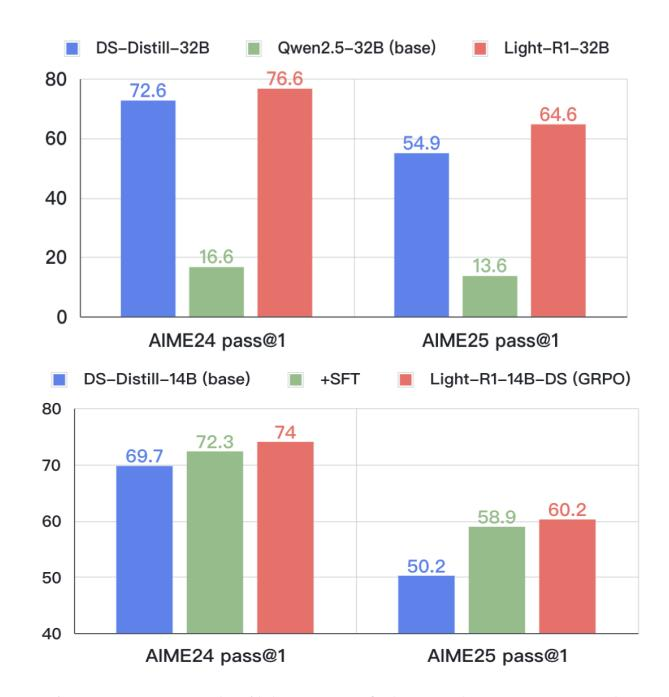

# 1 Introduction

Since the release of DeepSeek-R1 [\(DeepSeek-AI,](#page-6-0) [2025\)](#page-6-0), long chain-of-thought [\(OpenAI,](#page-6-1) [2024;](#page-6-1) [Wei](#page-7-0) [et al.,](#page-7-0) [2022;](#page-7-0) [Kimi,](#page-6-2) [2025;](#page-6-2) [Lightman et al.,](#page-6-3) [2023\)](#page-6-3) reasoning has gained widespread popularity in

> **[图片提取文字 (无描述)]:**
> Qwen2.5-32B (base) DS-Distill-32B Light-R1-32B 80 76.6 72.6 64.6 60 54.9 40 20 16.6 13.6 0 AIME24 pass@1 AIME25 pass@1 DS-Distill-14B (base) Light-R1-14B-DS (GRPO) +SFT 80 74 72.3 69.7 70 60.2 58.9 60 50.2 50 40 AIME24 pass@1 AIME25 pass@1

Figure 1: Reproducible state-of-the-art long COT models (top) developed from scratch (=short-COT base), (bottom) derived from DeepSeek-R1-Distill models (=long-COT base), via curriculum learning strategy.

both foundational AI models and various industrial AI applications. However, deploying fullcapacity R1-level models (typically 70B+ parameters, DeepSeek-R1 with 671B parameters) incurs prohibitive computational costs [\(DeepSeek-AI,](#page-6-0) [2025;](#page-6-0) [Qwen,](#page-7-1) [2025\)](#page-7-1). The resource barrier of training and deploying the giant models makes them impractical for edge devices and real-time applications. This limitation has sparked growing interest in developing compact yet capable models under a few 10B parameters that can perform extended long COT - a critical requirement for mathematical problem solving, algorithmic planning, and scientific analysis. To address this challenge, we present our work on the Light-R1 series.

As a foundation for our research, we first established robust and reproducible evaluation protocols

that rigorously reproduce the evaluation results reported in [DeepSeek-AI](#page-6-0) [\(2025\)](#page-6-0). Building upon this reliable framework, our research systematically addresses three fundamental challenges through innovative algorithmic and engineering advancements.

The first challenge involves curating an efficient dataset for Post-Training, a critical factor for long-COT optimization [\(Ye et al.,](#page-7-2) [2025;](#page-7-2) [Muennighoff](#page-6-4) [et al.,](#page-6-4) [2025;](#page-6-4) [Li et al.,](#page-6-5) [2025\)](#page-6-5). We collected diverse open-source reasoning data covering mathematical reasoning, logical deduction, and algorithmic problem-solving. After preprocessing to remove duplicates and standardize formatting, we implemented a two-stage difficulty filtering methodology using DeepScaleR-1.5B-Preview [\(Luo et al.,](#page-6-6) [2025b\)](#page-6-6) and DeepSeek-R1-Distill-Qwen-32B models to quantify difficulty based on pass rates.

The second challenge then emerges as how to optimize the utilization of this dataset. While conventional approaches typically employ a single SFT stage [\(DeepSeek-AI,](#page-6-0) [2025;](#page-6-0) [Xu et al.,](#page-7-3) [2025;](#page-7-3) [Labs,](#page-6-7) [2025;](#page-6-7) [Yu et al.,](#page-7-4) [2024\)](#page-7-4), our preliminary experiments with our 32B model revealed significant limitations—approximately 20% of training data still exhibited pass rates below 50% across 10 runs, indicating insufficient knowledge assimilation from heterogeneous difficulty datasets. To address this, we implemented a multi-staged curriculum training strategy comprising two consecutive SFT stages with progressively increasing difficulty, followed by a DPO stage [\(Rafailov et al.,](#page-7-5) [2023\)](#page-7-5). Although recent work has explored different curriculum strategies for long-COT training [\(Luo et al.,](#page-6-8) [2025a;](#page-6-8) [Min](#page-6-9) [et al.,](#page-6-9) [2024;](#page-6-9) [Xi et al.,](#page-7-6) [2024;](#page-7-6) [Yuan et al.,](#page-7-7) [2025a\)](#page-7-7), our approach demonstrates superior performance: our Light-R1-32B model, trained from Qwen2.5-32B-Instruct [\(Qwen,](#page-7-8) [2024\)](#page-7-8), outperforms DeepSeek-R1- Distill-Qwen-32B in mathematical reasoning.

The third challenge arises from implementing the final component of Post-Training — Reinforcement Learning [\(Shao et al.,](#page-7-9) [2024;](#page-7-9) [Wang et al.,](#page-7-10) [2024;](#page-7-10) [Ouyang et al.,](#page-7-11) [2022;](#page-7-11) [Schulman et al.,](#page-7-12) [2017,](#page-7-12) [2015\)](#page-7-13) — to further enhance model performance. We are excited to report our successful reinforcement learning training of Light-R1-14B-DS. While recent research has shown success in training base models [\(Zeng et al.,](#page-7-14) [2025;](#page-7-14) [Hu et al.,](#page-6-10) [2025;](#page-6-10) [Liu et al.,](#page-6-11) [2025\)](#page-6-11), smaller models [\(Zeng et al.,](#page-7-14) [2025;](#page-7-14) [Luo et al.,](#page-6-6) [2025b\)](#page-6-6), or larger models with intensive computational resources [\(Qwen,](#page-7-1) [2025\)](#page-7-1), our long-COT RL Post-Training represents the first demonstration of simultaneous increases in both response length and

Table 1: Reproduction of [DeepSeek-AI](#page-6-0) [\(2025\)](#page-6-0) and [Qwen](#page-7-1) [\(2025\)](#page-7-1) evaluation results on AIME24 [\(MAA,](#page-6-12) [2024\)](#page-6-12) pass@1 averaged over 64 runs.

| Model          | Paper | Ours |
|----------------|-------|------|
| DS-distill-32B | 72.6  | 72.3 |
| DS-distill-14B | 69.7  | 69.3 |
| DS-distill-7B  | 55.5  | 54.0 |
| QWQ-32B        | 79.5  | 78.5 |

reward scores on long-COT 14B models without the initial length reduction typically observed. This breakthrough demonstrates that carefully designed curriculum strategies can overcome the previously documented scalability limitations of RL in smaller models [\(Gao et al.,](#page-6-13) [2023\)](#page-6-13).

The key contributions of this work include:

- A detailed, fully open-source Curriculum Post-Training approach to train long-COT models from scratch. The multi-stage curriculum training incrementally builds reasoning capacity through difficulty-progressive data exposure, requiring only \$1000 training cost (6 hours on 12×H800 GPUs). This approach is validated on Qwen2.5-32B-Instruct and could be easily migrated to 7B and 14B models.
- A well established SFT stage 2 dataset of 3k mostly math questions that could significantly improve not only SFT stage 1 but also all DeepSeek-R1-Distill models, resulting in our SOTA 7B model Light-R1-7B-DS.
- First demonstration of RL effectiveness on 14B models for mathematical reasoning, achieving around 2% absolute improvement compared with before-RL, resulting in our SOTA 14B model Light-R1-14B-DS.

